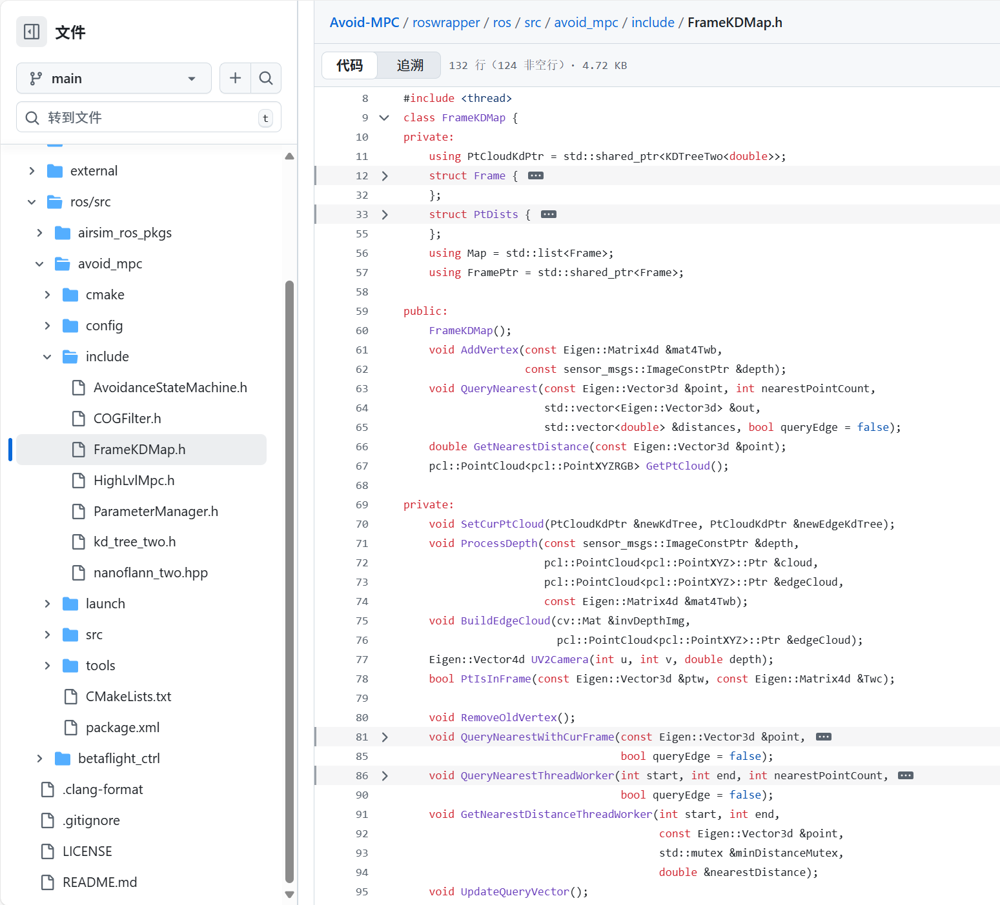

# 第4章：框架KD地图（双KD树）

在[上一章](03_highlvlmpc__model_predictive_control__.md)中，我们了解了无人机的"策略中枢"`HighLvlMpc`如何规划未来运动以抵达目标并避开障碍

但要让`HighLvlMpc`发挥作用，它需要关键信息：**障碍物在哪里？**无人机如何"看见"周围环境并快速构建可用的危险地图？

这就是**框架KD地图（`FrameKDMap`，双KD树）**的用武之地

可以将其视为无人机的**超高速3D扫描仪与空间记忆系统**。其主要职责是==处理原始深度图像，将其转化为有意义的障碍物数据==，并以允许无人机*即时*发现周边威胁的方式存储这些数据。

就像拥有一个专门负责3D空间障碍物感知与记忆的大脑区域。

## 框架KD地图解决了什么问题？

假设我们的无人机正在茂密森林中飞行。

其深度相机持续传回显示物体距离的图像流。这些原始图像数据仅是像素，无法直接用于路径规划。无人机需要快速回答以下问题：

* "我前方有物体吗？"
* "左机翼最近障碍物是什么？"
* "是否存在可穿越的间隙？"
* "定义安全通道的物体边缘在哪里？"

`FrameKDMap`通过以下方式解决这些问题：

1. ==**将原始深度图像**转换为有组织的3D点（"点云"）==。
2. **高效存储这些点**到称为KD树的专用数据结构中。
3. **记忆环境近期快照**，为无人机提供短期空间记忆。
4. **闪电般快速响应**关于附近障碍物的查询。

这种"无地图"方法意味着无人机无需预建整个环境地图，而是在飞行时实时构建和更新局部障碍物感知。

## 核心概念

`FrameKDMap`运用了几个重要概念：

### 1. 点云
设想拍摄房间照片时，每个像素不仅记录颜色还包含与相机的精确距离。

将这些像素转化为空间中的真实3D点（X/Y/Z坐标），就得到"点云"—— literally 代表场景物体表面的点集合。

### 2. KD树
KD树（K维树缩写）是组织大量3D点的巧妙方法，可类比为高效的文件归档系统：
* **问题**：若需从百万点中查找离某位置最近的5个点，逐点扫描极慢。
* **解决方案**：KD树通过递归分割空间来组织点，搜索时仅需检查相关区域，极大提升速度。

如同查字典：无需逐页阅读，而是跳转到正确字母区，再定位具体区域。

`Avoid-MPC`使用==专为高速KD树构建与查询优化==的`nanoflann` C++库。

[jlblancoc/nanoflann: nanoflann: a C++11 header-only library for Nearest Neighbor (NN) search with KD-trees](https://github.com/jlblancoc/nanoflann)

### 3. 双KD树
"双"KD树意味着`FrameKDMap`不仅从点云构建一个KD树，而是为每个快照创建**两个专用KD树**：

| KD树类型         | 描述                                                   | 用途                                                   |
| :--------------- | :----------------------------------------------------- | :----------------------------------------------------- |
| **通用障碍KD树** | 包含深度相机检测的所有3D点，提供物体表面的完整图像。   | 用于==通用避障==，确保无人机不碰撞物体任何部分。       |
| **边缘特征KD树** | 仅包含代表物体"边缘"或边界的3D点，这些对导航尤为关键。 | 用于==寻找精确安全路径==、穿越狭窄间隙或识别特定物体。 |

双KD树结构允许`HighLvlMpc`根据当前需求查询不同类型的障碍信息。

### 4. 帧（空间记忆）
`FrameKDMap`不仅存储当前点云，还保留近期"帧"的历史记录。

一`Frame`本质上是特定时刻深度相机的快照，转换为双KD树，并与该时刻无人机精确位姿共同存储。

通过在列表(`mKeyFrameMap`)中存储多个`Frame`对象，无人机建立起短期**空间记忆**。

即使相机短暂丢失某障碍物视野，无人机仍能通过历史帧"记住"它，使环境感知更鲁棒。

## 框架KD地图如何实现环境感知与记忆

让我们追踪`FrameKDMap`持续更新无人机环境认知的过程：
1. **接收深度图像**：`AvoidanceStateMachine`（来自[第1章](01_avoidancestatemachine_.md)）从相机获取新深度图像。
2. **深度转点云**：`FrameKDMap`结合当前位姿（位置与朝向）将深度图像像素转为无人机坐标系下的3D点。
3. **识别边缘**：同时处理深度图像以定位物体的关键"边缘"。
4. **构建双KD树**：从这些3D点创建两个独立KD树：一个包含所有点（通用障碍），另一个仅含边缘点。
5. **存储为新帧**：这组双KD树与无人机位姿打包为`Frame`对象，加入`FrameKDMap`的记忆帧列表(`mKeyFrameMap`)。
6. **障碍物查询**：当`HighLvlMpc`等组件需要周边障碍信息时，向`FrameKDMap`发起查询。后者搜索所有记忆KD树（当前帧与历史帧），寻找给定点的最近障碍物，可选择查询通用点或边缘点。
7. **返回最近点**：`FrameKDMap`快速返回最近障碍点及其距离列表。

示意如下：


## 代码

让我们看看这些概念如何在`Avoid-MPC`代码中实现



### 1. `FrameKDMap`类结构 (`FrameKDMap.h`)

`FrameKDMap`类整合了所有组件。

```cpp
// 来源：roswrapper/ros/src/avoid_mpc/include/FrameKDMap.h
#include "kd_tree_two.h" // 包含KD树封装
#include <list> // 用于mKeyFrameMap

class FrameKDMap {
private:
    using PtCloudKdPtr = std::shared_ptr<KDTreeTwo<double>>; // KD树智能指针
    struct Frame { // 表示单时刻快照
        PtCloudKdPtr pointCloud; // 本帧通用障碍KD树
        PtCloudKdPtr edgeCloud;  // 本帧边缘特征KD树
        Eigen::Matrix4d Twc;     // 无人机位姿(世界到相机的变换矩阵)
        // ... 构造函数和拷贝操作符 ...
    };
    using Map = std::list<Frame>; // 空间记忆：帧列表

public:
    FrameKDMap(); // 构造函数
    void AddVertex(const Eigen::Matrix4d &mat4Twb, // 添加新深度图像和位姿
                   const sensor_msgs::ImageConstPtr &depth);
    void QueryNearest(const Eigen::Vector3d &point, int nearestPointCount, // 查询最近障碍
                      std::vector<Eigen::Vector3d> &out,
                      std::vector<double> &distances, bool queryEdge = false);
    double GetNearestDistance(const Eigen::Vector3d &point); // 获取单最近距离
    // ... 其他辅助方法 ...
private:
    Map mKeyFrameMap; // 记忆帧列表
    Frame mCurFrame;  // 当前处理帧
    // ... 相机参数、阈值、线程安全互斥锁 ...
};
```
核心结构：`Frame`包含双KD树和单时刻无人机位姿。`mKeyFrameMap`作为`std::list`存储这些`Frame`，形成空间记忆。`AddVertex`是处理新传感器数据的主入口，`QueryNearest`供其他模块查询障碍信息。

### 2. `KDTreeTwo`类 (`kd_tree_two.h`)


这是对`nanoflann`的封装，提供更简洁的KD树接口。

```cpp
// 来源：roswrapper/ros/src/avoid_mpc/include/kd_tree_two.h
#include "nanoflann_two.hpp" // 高速KD树库

template <typename T> struct PointCloudTwo { // 存储点的辅助结构
    std::vector<pcl::PointXYZ> pts;
    // ... nanoflann所需的点访问和距离计算方法 ...
};

template <typename num_t> class KDTreeTwo {
public:
    typedef nanoflann::KDTreeSingleIndexAdaptor< // nanoflann的KD树类型
        nanoflann::L2_Simple_Adaptor<num_t, PointCloudTwo<num_t>>,
        PointCloudTwo<num_t>, 3 /* 维度 */
        > my_kd_tree_t;

    KDTreeTwo(); // 构造函数
    void InitializeNew(pcl::PointCloud<pcl::PointXYZ>::Ptr const &xyz_cloud_new); // 构建新树
    void SearchForNearest(num_t x, num_t y, num_t z, int n); // 搜索最近N点
    PointCloudTwo<num_t> const &GetPointCloud(); // 获取底层点云
private:
    PointCloudTwo<num_t> cloud; // 点存储
    my_kd_tree_t index;         // nanoflann的KD树索引
};
```
`KDTreeTwo`类封装`nanoflann`库，使用`pcl::PointXYZ`存储3D点，并通过`nanoflann::KDTreeSingleIndexAdaptor`实现`SearchForNearest`等快速操作。

### 3. 添加新数据 (`AddVertex`与`ProcessDepth` in `FrameKDMap.cpp`)

当无人机获取新深度图像时，调用`AddVertex`。后者通过`ProcessDepth`将图像转为3D点与边缘。

```cpp
// 来源：roswrapper/ros/src/avoid_mpc/src/FrameKDMap.cpp (简化版)
void FrameKDMap::AddVertex(const Eigen::Matrix4d &mat4Twb,
                           const sensor_msgs::ImageConstPtr &depth) {
    pcl::PointCloud<pcl::PointXYZ>::Ptr cloud(new pcl::PointCloud<pcl::PointXYZ>); // 通用点云
    pcl::PointCloud<pcl::PointXYZ>::Ptr edgeCloud(new pcl::PointCloud<pcl::PointXYZ>); // 边缘点云

    ProcessDepth(depth, cloud, edgeCloud, mat4Twb); // 图像转点云和边缘

    if (cloud->empty()) return; // 无点则跳过

    PtCloudKdPtr kdtree = std::make_shared<KDTreeTwo<double>>(); // 创建通用KD树
    kdtree->InitializeNew(cloud); // 用全部3D点初始化

    PtCloudKdPtr edgeKdtree = std::make_shared<KDTreeTwo<double>>(); // 创建边缘KD树
    edgeKdtree->InitializeNew(edgeCloud); // 用边缘点初始化

    std::lock_guard<std::mutex> lock(mMtxKdTree); // 保护共享数据
    SetCurPtCloud(kdtree, edgeKdtree); // 存储为当前帧
    mCurFrame.Twc = mat4Twb * mParamTbc; // 存储世界到相机的变换
    mbNeedProcessPtCloud = true; // 触发内存管理线程更新
}

// 辅助函数：2D像素转3D相机坐标
Eigen::Vector4d FrameKDMap::UV2Camera(int u, int v, double depth) {
    Eigen::Vector4d point;
    point[0] = (u - mParamCx) * depth / mParamFx; // 计算X
    point[1] = (v - mParamCy) * depth / mParamFy; // 计算Y
    point[2] = depth; // Z即深度值
    point[3] = 1;     // 齐次坐标
    return point;
}

void FrameKDMap::ProcessDepth(const sensor_msgs::ImageConstPtr &depth,
                              pcl::PointCloud<pcl::PointXYZ>::Ptr &cloud,
                              pcl::PointCloud<pcl::PointXYZ>::Ptr &edgeCloud,
                              const Eigen::Matrix4d &mat4Twb) {
    // ... ROS深度图像转OpenCV Mat ...
    // ... 调整图像尺寸 ...

    // 遍历深度图像每个像素
    for (int row = 0; row < invDepthImg.rows; row++) {
        for (int col = 0; col < invDepthImg.cols; col++) {
            double invDepth = invDepthImg.at<float>(row, col);
            if (invDepth < 1e-2) continue; // 跳过无效深度
            double depth_val = 1 / invDepth;
            // 过滤过近或过远深度
            if (depth_val > mParamDepthMin && depth_val < mParamDepthMax) {
                Eigen::Vector4d pointCam = UV2Camera(col, row, depth_val); // 像素转相机坐标系3D点
                Eigen::Vector3d point = (mat4Twb * mParamTbc * pointCam).topRows(3); // 转为世界坐标
                cloud->emplace_back(point.x(), point.y(), point.z()); // 加入通用点云
            }
        }
    }
    BuildEdgeCloud(invDepthImg, edgeCloud); // 构建边缘点云
}
```
`AddVertex`是主入口，协调创建两个点云及其KD树。`UV2Camera`将2D像素坐标(u,v)及深度转为相机坐标系3D点，`(mat4Twb * mParamTbc * pointCam).topRows(3)`将其转换到世界坐标系，考虑无人机位姿。

### 4. 构建边缘点云 (`BuildEdgeCloud` in `FrameKDMap.cpp`)

为获取"边缘特征"，`FrameKDMap`采用标准图像处理技术。

```cpp
// 来源：roswrapper/ros/src/avoid_mpc/src/FrameKDMap.cpp (简化版)
void FrameKDMap::BuildEdgeCloud(
    cv::Mat &invDepthImg, pcl::PointCloud<pcl::PointXYZ>::Ptr &edgeCloud) {
    // 步骤1：膨胀深度图像（填补小间隙并突出边界）
    cv::Mat kernel = cv::Mat::ones(3, 3, CV_8UC1); // 3x3滤波核
    cv::Mat inflatedDepthImg = cv::Mat::zeros(invDepthImg.size(), CV_8UC1);
    // ... 反深度转灰度图(0-255) ...
    cv::erode(inflatedDepthImg, inflatedDepthImg, kernel); // 腐蚀（反深度即膨胀）

    // 步骤2：Canny边缘检测定位强边缘
    cv::Mat cannyImage;
    cv::Canny(inflatedDepthImg, cannyImage, 0.1, 0.3); // 基于梯度检测边缘

    // 步骤3：将边缘像素转回3D点
    for (int row = 0; row < cannyImage.rows; row++) {
        for (int col = 0; col < cannyImage.cols; col++) {
            if (cannyImage.at<uchar>(row, col) > 0) { // 边缘像素
                double depth = float(inflatedDepthImg.at<uchar>(row, col));
                depth = depth * (mParamDepthMax - mParamDepthMin) / 200.0; // 转实际深度
                // ... 深度过滤 ...
                Eigen::Vector4d pointCam = UV2Camera(col, row, depth); // 像素转相机3D点
                Eigen::Vector3d point = (mCurFrame.Twc * mParamTbc * pointCam).topRows(3); // 转世界坐标
                edgeCloud->emplace_back(point.x(), point.y(), point.z()); // 加入边缘点云
            }
        }
    }
}
```
该函数使用OpenCV先对深度图像进行==膨胀处理==(`cv::erode`)，再应用`cv::Canny`==边缘检测==

> 被标记为边缘的像素随后转为3D点，方式与通用点云类似。

### 5. 查询最近障碍物 (`QueryNearest` in `FrameKDMap.cpp`)

此函数供无人机其他模块向`FrameKDMap`查询附近障碍物。其智能之处在于跨多帧并行查询，甚至利用多核CPU加速。

```cpp
// 来源：roswrapper/ros/src/avoid_mpc/src/FrameKDMap.cpp (简化版)
void FrameKDMap::QueryNearest(const Eigen::Vector3d &point,
                              int nearestPointCount,
                              std::vector<Eigen::Vector3d> &nearestPoints,
                              std::vector<double> &distances, bool queryEdge) {
    std::vector<PtDists> pointsDist; // 存储所有找到的点及距离
    std::mutex pointsDistMutex; // 线程安全锁

    mMtxKdTree.lock(); // 锁定帧地图访问

    // 可选：检查当前帧是否包含足够视野内点以快速查询
    // ...

    // 多线程并行查询所有相关记忆帧的KD树
    int numThreads = std::thread::hardware_concurrency();
    int numVertices = mVecQueryVector.size(); // 待查询帧总数
    numThreads = std::min(numThreads, numVertices);
    int chunkSize = (numVertices + numThreads) / numThreads;
    std::vector<std::thread> threads;
    for (int i = 0; i < numThreads; ++i) {
        int start = i * chunkSize;
        int end = std::min(start + chunkSize, numVertices);
        if (start < end) {
            threads.emplace_back(&FrameKDMap::QueryNearestThreadWorker, this,
                                 start, end, nearestPointCount, point,
                                 std::ref(pointsDistMutex),
                                 std::ref(pointsDist), queryEdge);
        }
    }
    for (auto &t : threads) { // 等待所有线程完成
        t.join();
    }
    mMtxKdTree.unlock(); // 释放锁

    nearestPoints.clear();
    distances.clear();
    if (pointsDist.empty()) return;

    std::sort(pointsDist.begin(), pointsDist.end()); // 按距离排序
    // 仅返回前'nearestPointCount'个最近点
    for (int i = 0; i < nearestPointCount && i < pointsDist.size(); ++i) {
        nearestPoints.push_back(pointsDist[i].pt);
        distances.push_back(std::sqrt(pointsDist[i].dist)); // 平方距离转实际距离
    }
}
```
`QueryNearest`接收查询点`point`、需返回的最近点数`nearestPointCount`及是否查询边缘`queryEdge`

将搜索任务分配给多个线程(`QueryNearestThreadWorker`)并行处理。最终汇总结果，按距离排序后返回绝对最近点。

## 总结

`FrameKDMap`是`Avoid-MPC`系统的关键拼图。它将原始深度传感器数据转化为高度组织化、可快速查询的3D障碍物地图。

通过"双KD树"设计，同时提供通用障碍信息和特定"边缘"特征，实现精细避障。其记忆近期帧的能力使无人机感知系统更鲁棒自适应，确保`HighLvlMpc`始终掌握最新障碍信息以规划安全路径。

现在无人机已能"==看见=="环境并==规划==高层运动，接下来让我们了解这些计划如何==转化为实际==控制电机转动的指令，实现真正飞行。

[下一章：几何控制器](05_geometriccontroller_.md)

