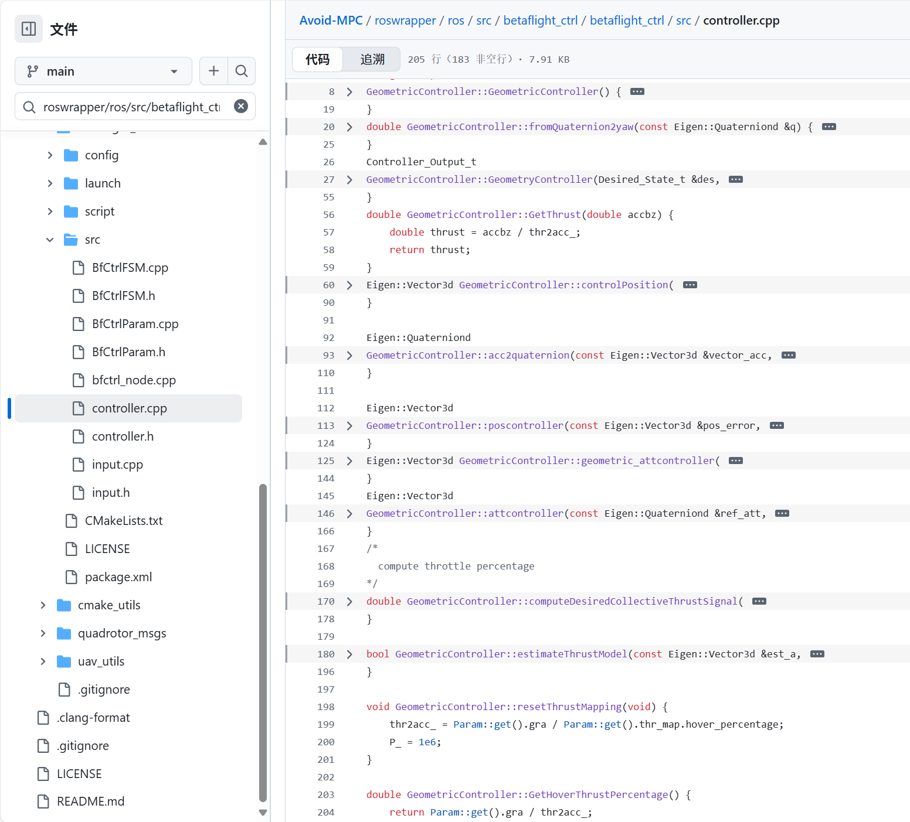

# 第5章：几何控制器

在[前一章](04_framekdmap__dual_kd_tree__.md)中，我们探讨了`FrameKDMap`如何帮助无人机“看到”周围环境，以及`HighLvlMpc`如何规划其智能避障路径。

`HighLvlMpc`决定了无人机*应该*做什么，比如“以1 m/s²的加速度向前加速并稍微向左转”。

但无人机实际上是如何*执行*这些指令的呢？这些高级计划如何转化为具体的命令，使无人机的电机旋转、机身倾斜？这就是**`GeometricController`**发挥作用的地方

可以==将`GeometricController`视为无人机的**精细电机控制单元**或“手脚”。它接收来自“大脑”（`HighLvlMpc`）的抽象==指令，并将其转化为精确的物理动作（如改变电机速度或倾斜无人机机身），以实现平稳且安全的飞行计划。

## GeometricController解决了什么问题？

假设我们的无人机处于`TASK`状态（来自[第1章：避障状态机](01_avoidancestatemachine_.md)），正在复杂环境中飞行

`HighLvlMpc`刚刚计算出，为了避开即将到来的障碍物并保持航线，无人机需要：

*   “实现特定的加速度（例如，向前0.5 m/s²，向上0.2 m/s²）。”
*   “保持特定的方向（偏航角）。”

无人机的实际电机并不理解“以0.5 m/s²加速”。它们理解的是“以70%的功率旋转”或“向前倾斜5度”。

`GeometricController`通过以下方式解决这一问题：

1.  **翻译高级需求：** 将期望的加速度和目标位置==转化==为必要的无人机姿态（倾斜角度）和总推力（向上的力）。
2.  **生成电机命令：** 根据期望的姿态和推力，==计算==具体的角速度（无人机旋转的速度）和电机所需的总功率。
3.  **确保平滑性：** 确保这些转换结果是==稳定==且可控的飞行，而非抖动或不稳定的动作。
4.  **推力模型：** 它甚至学习每个电机命令产生的实际物理力，以适应无人机的特定配置。

它是连接智能规划和物理执行的关键桥梁

## 概念

`GeometricController`结合了几个关键的控制概念，使无人机能够精确飞行：

### 1. 位置控制（到达正确位置）

如果`HighLvlMpc`说“前往(X, Y, Z)位置”，`GeometricController`会计算无人机需要多少加速度才能到达目标。它会考虑：
*   **位置误差：** 无人机距离目标有多远。
*   **速度误差：** 无人机当前速度与期望速度的差异。
然后输出一个期望的加速度，使无人机更接近目标。

### 2. 姿态生成（指向正确方向）

一旦`GeometricController`知道期望的加速度（例如，“我需要向上和向前加速”），它会计算出无人机需要达到的**姿态**（俯仰、横滚、偏航）。

为了向前加速，无人机必须向前倾斜；为了向上加速，它必须将旋翼直接指向天空。这一概念生成了*目标*姿态。

### 3. 姿态控制（达到正确姿态）

无人机需要快速且准确地*达到*期望的姿态。

控制器的这一部分将*期望*姿态与无人机的*实际*姿态（来自`Odom_Data_t`）进行比较，并计算无人机需要以多快的速度旋转（围绕其X、Y和Z轴的**角速度**）以纠正任何差异。

### 4. 推力模型（将信号转化为力）

无人机并不直接施加力；它们对电机施加功率。`推力模型`理解电机命令（例如“推力百分比”值）与实际产生的向上力（推力）之间的关系。

不断学习和优化这一映射关系。这对于确保无人机施加恰好足够的力以提升自身或克服重力至关重要。

## GeometricController如何执行计划

让我们看看`GeometricController`如何将高级计划转化为具体动作：

1.  **期望状态输入：** `AvoidanceStateMachine`（接收来自`HighLvlMpc`的计划）向`GeometricController`发送一个`Desired_State_t`消息。该消息包含无人机的==目标位置、速度和期望加速度==（来自MPC）或直接姿态命令。
2.  **当前状态输入：** `GeometricController`还接收无人机的==当前==实际状态（`Odom_Data_t`），包括其当前位置、速度和姿态。
3.  **计算期望加速度：**
    *   如果输入是直接期望的加速度，则直接使用。
    *   如果输入是期望的*位置*，则使用其**位置控制器**（概念1）计算到达该位置所需的*期望加速度*。
4.  **生成期望姿态（方向）：** 使用期望加速度和目标偏航角，计算无人机需要达到的理想**姿态**（`u.q`）（概念2）。
5.  **计算推力：** 根据期望加速度确定必要的向上力（推力）。然后使用**推力模型**（概念4）将这一物理力转化为电机命令（`u.thrust`）。
6.  **计算机体速率（角速度）：** 将无人机的*实际*姿态与*期望*姿态（`u.q`）进行比较，并计算无人机快速旋转以匹配期望姿态所需的**角速度**（`u.bodyrates`）（概念3）。
7.  **输出电机命令：** `GeometricController`将`u.q`（期望姿态）、`u.bodyrates`（期望旋转速度）和`u.thrust`（电机功率）打包成一个`Controller_Output_t`消息。
8.  **发布到无人机：** `AvoidanceStateMachine`然后将这一`Controller_Output_t`消息发布到无人机的最低级飞行控制器，后者直接向电机发送信号。

以下是这一过程的简化视图：

````artifact
id: flow-chat-example
name: 几何控制器执行流程
type: mermaid
content: |-
  sequenceDiagram
      participant ASM as Avoidance State Machine
      participant GeomCtrl as GeometricController
      participant OdomData as Current Drone State
      participant DesiredState as MPC's Plan (Desired)
      participant Output as Motor Commands

      ASM->>GeomCtrl: GeometryController(DesiredState, OdomData, ControlMode)
      Note over GeomCtrl: 1. Calculate desired acceleration (a_des)
      GeomCtrl->>GeomCtrl: 2. Generate desired orientation (u.q) from a_des & yaw
      GeomCtrl->>GeomCtrl: 3. Calculate total motor thrust (u.thrust)
      GeomCtrl->>GeomCtrl: 4. Calculate angular rates (u.bodyrates) to match u.q
      GeomCtrl-->>ASM: Return Controller_Output (u)
      ASM->>Output: Publish to Drone's Flight Controller
````

## 代码



让我们看看`GeometricController`在`Avoid-MPC`代码中是如何实现的

主要逻辑位于`controller.h`和`controller.cpp`中

`BfCtrlFSM.cpp`文件（即`AvoidanceStateMachine`）使用了`GeometricController`。

### 1. `Desired_State_t`和`Controller_Output_t`结构（`controller.h`）

这些结构定义了`GeometricController`的输入和输出。

```cpp
// From: roswrapper/ros/src/betaflight_ctrl/betaflight_ctrl/src/controller.h
struct Desired_State_t {
    Eigen::Vector3d p; // 期望位置
    Eigen::Vector3d v; // 期望速度
    Eigen::Vector3d a; // 期望加速度
    // ... 其他期望值（偏航角、推力等）
};

struct Controller_Output_t {
    Eigen::Quaterniond q;       // 期望姿态（旋转）
    Eigen::Vector3d bodyrates;  // 期望角速度（旋转速度）
    double thrust;              // 期望总电机推力（0.0到1.0）
};
```
`Desired_State_t`来自规划阶段（如`HighLvlMpc`），告诉控制器无人机*应该*做什么

`Controller_Output_t`是`GeometricController`计算并发送给无人机飞行硬件的输出。

### 2. 主控制函数（`GeometryController`在`controller.cpp`中）

这是`AvoidanceStateMachine`（`BfCtrlFSM`）在每个控制循环中调用的核心函数。

```cpp
// From: roswrapper/ros/src/betaflight_ctrl/betaflight_ctrl/src/controller.cpp
Controller_Output_t
GeometricController::GeometryController(Desired_State_t &des,
                                        const Odom_Data_t &odom, uint8_t mode) {
    Controller_Output_t u;
    Eigen::Vector3d desired_acc = Eigen::Vector3d::Zero();

    // 1. 根据控制模式计算desired_acc
    if (mode == quadrotor_msgs::Command::ACCELERATION_MODE) {
        desired_acc = des.a; // 直接使用MPC的加速度
    } else if (mode == quadrotor_msgs::Command::POSITION_MODE) {
        // 使用位置控制器计算期望加速度
        desired_acc = controlPosition(des.p, des.v, des.a, des.yaw, odom);
    }

    // 2. 如果不是角速度控制模式：
    if (mode != quadrotor_msgs::Command::ANGULAR_MODE) {
        // 生成期望姿态（u.q）和推力（u.thrust）
        u.q = acc2quaternion(desired_acc, des.yaw); // 将加速度转化为姿态
        const Eigen::Matrix3d rotmat = odom.q.toRotationMatrix();
        const Eigen::Vector3d zboby = rotmat.col(2); // 无人机当前的“向上”方向
        u.thrust = GetThrust(desired_acc.dot(zboby)); // 将期望加速度转化为推力百分比

        if (Param::get().use_bodyrate_ctrl) {
            // 计算达到u.q所需的机体速率
            u.bodyrates = geometric_attcontroller(u.q, odom.q);
        }
    } else { // 如果是直接角速度模式
        u.bodyrates = des.w; // 直接使用期望角速度
        u.thrust = GetThrust(des.thrust); // 直接使用期望推力
    }
    return u;
}
```
此函数是`GeometricController`的核心。它接收期望状态（`des`）、当前状态（`odom`）和控制模式（`mode`）。
*   首先计算`desired_acc`（无人机应尝试实现的加速度）。这可能直接来自`HighLvlMpc`（`ACCELERATION_MODE`），或者如果MPC提供了目标`POSITION_MODE`，则由内部的`controlPosition`函数计算。
*   然后，`acc2quaternion`将这一期望加速度和期望的`yaw`转化为目标姿态`u.q`。
*   `GetThrust`将必要的垂直力转化为电机命令`u.thrust`。
*   最后，如果启用了机体速率控制，`geometric_attcontroller`将目标姿态（`u.q`）与无人机的实际姿态（`odom.q`）进行比较，并计算`u.bodyrates`（无人机需要以多快的速度旋转）。

### 3. 位置控制器（`controlPosition`在`controller.cpp`中）

如果`GeometricController`被赋予一个目标位置，此函数负责计算`desired_acc`。

```cpp
// From: roswrapper/ros/src/betaflight_ctrl/betaflight_ctrl/src/controller.cpp
Eigen::Vector3d GeometricController::controlPosition(
    const Eigen::Vector3d &target_pos, const Eigen::Vector3d &target_vel,
    const Eigen::Vector3d &target_acc, double &target_yaw,
    const Odom_Data_t &odom) {
    // 计算误差
    const Eigen::Vector3d pos_error = target_pos - odom.p;
    const Eigen::Vector3d vel_error = target_vel - odom.v;

    // 位置和速度误差的比例-微分（PD）控制
    // Kpos_和Kvel_是调谐增益（类似刚度和阻尼）
    Eigen::Vector3d a_fb =
        Kpos_.asDiagonal() * pos_error + Kvel_.asDiagonal() * vel_error;

    // 如果加速度过大，应用限制
    if (a_fb.norm() > Param::get().geometry_controller.max_fb_acc_)
        a_fb = (Param::get().geometry_controller.max_fb_acc_ / a_fb.norm()) * a_fb;

    // 将反馈加速度与MPC的期望加速度和重力结合
    const Eigen::Vector3d a_des = a_fb + target_acc + Eigen::Vector3d(0, 0, Param::get().gra);

    return a_des;
}
```
在这里，`controlPosition`根据无人机距离`target_pos`和`target_vel`的远近计算`a_fb`（反馈加速度）。`Kpos_`和`Kvel_`是调谐参数（类似于纠正位置和速度误差的强度）。然后将`a_fb`与`target_acc`（来自`HighLvlMpc`的加速度）和重力（`Param::get().gra`）结合，得到最终的`a_des`（期望加速度）。

### 4. 推力模型（`estimateThrustModel`和`GetThrust`在`controller.cpp`中）

这一部分帮助无人机理解其电机的行为。

```cpp
// From: roswrapper/ros/src/betaflight_ctrl/betaflight_ctrl/src/controller.cpp
bool GeometricController::estimateThrustModel(const Eigen::Vector3d &est_a,
                                              double thr) {
    // 此函数持续学习实际垂直加速度（est_a(2)）与当前电机推力命令（thr）之间的关系。
    // 它使用“递归最小二乘法”算法自适应地估计`thr2acc_`。
    // `thr2acc_`是将推力命令转化为实际加速度的因子。
    double gamma = 1 / (rho2_ + thr * P_ * thr);
    double K = gamma * P_ * thr;
    thr2acc_ = thr2acc_ + K * (est_a(2) - thr * thr2acc_);
    // ... 更新P_ ...
    return false;
}

double GeometricController::GetThrust(double accbz) {
    // 给定沿无人机机体Z轴的期望加速度（accbz），计算所需的推力命令（0.0到1.0）。
    double thrust = accbz / thr2acc_; // 使用学习到的`thr2acc_`因子
    return thrust;
}
```
`estimateThrustModel`函数非常重要，因为它允许无人机*学习*并*适应*其`thr2acc_`值。

意味着它可以针对其特定电机和重量，计算出需要多少电机功率才能产生一定的加速度。

`GetThrust`然后使用这一学习值将期望加速度转化为实际的`thrust`命令（通常是一个介于0和1之间的值，表示电机功率）。

## 结论

`GeometricController`是将抽象计划与物理现实连接起来的关键工具。

它接收无人机的期望运动、位置和加速度（通常来自[HighLvlMpc（模型预测控制）](03_highlvlmpc__model_predictive_control__.md)），并精确地将其转化为必要的姿态调整、角速度和电机推力命令。

通过这种方式，它确保无人机能够平稳、稳定且准确地执行其任务，有效地将“大脑”的决策转化为物理世界的行动。

既然无人机已经能够规划、感知并==执行==其运动，接下来我们将探讨它如何==与外部世界及其仿真环境进行通信==。

[下一章：AirsimROSWrapper](06_airsimroswrapper_.md)

