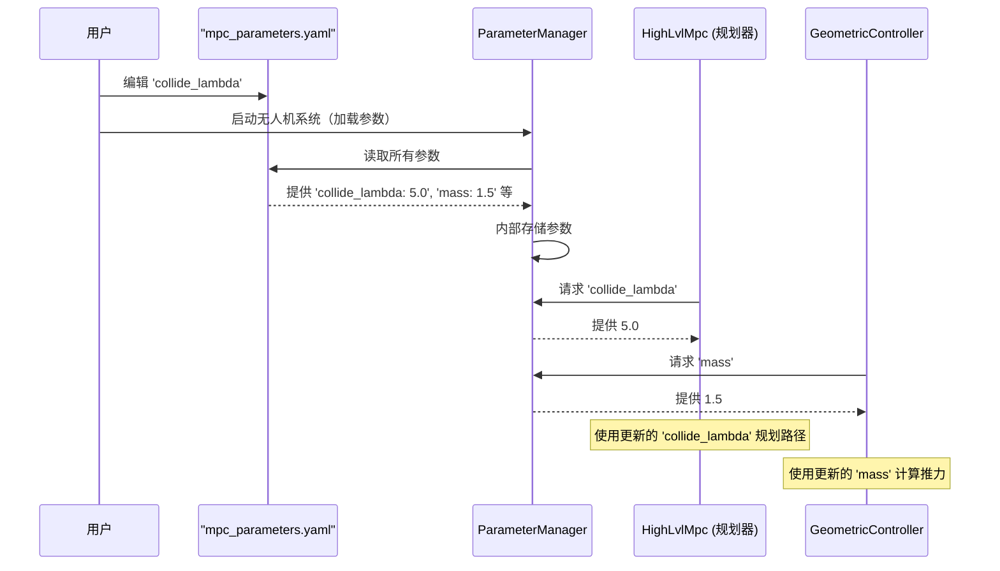

# 第7章：参数管理

在[前一章](06_airsimroswrapper_.md)中，我们探讨了`AirsimROSWrapper`如何作为关键桥梁，将无人机的软件大脑与AirSim的模拟世界连接起来。

现在，想象一下我们无人机的大脑，其中充满了复杂的模块，如`AvoidanceStateMachine`（第1章）、`HighLvlMpc`（第3章）和`FrameKDMap`（第4章）。每个模块都需要特定的指令、数字和设置才能正确工作。

例如：
- 无人机的`mass`重量是多少？（对`GeometricController`很重要！）
- `HighLvlMpc`应该预测多远的未来？（`mpc_T`）
- 用于碰撞检查的`drone_radius`有效范围是多少？
- `depth_max`摄像头能看多远？（对`FrameKDMap`很重要！）
- 无人机在到达`goal_p_x`和避免`collide_lambda`之间应该如何权衡？（这些是`HighLvlMpc`的“权重”！）

如果我们将所有这些数字直接硬编码到程序中，每次想要调整某些内容（例如让无人机飞得更快或对障碍物反应更强烈）时，我们都必须修改代码、重新编译并重启整个系统。这将非常麻烦！

## 参数管理器解决了什么问题？

这正是**`ParameterManager`**的用武之地！可以将其视为无人机的**中央设置菜单**或**智能配置中心**。它的主要任务是：

1. **加载所有可配置参数**：从易于阅读的文件（如YAML文件）中加载参数，系统启动时完成。
2. **管理和存储这些参数**：以有组织的方式存储这些参数。
3. **提供统一的访问点**：为无人机软件的其他部分提供获取设置的单一入口。

通过集中管理这些设置，`ParameterManager`使我们能够轻松调整无人机的行为（例如使其更谨慎或更激进，更改其物理属性或传感器设置），**而无需修改或重新编译核心代码**。这就像为无人机的个性和能力配备了一个通用遥控器。

## 核心概念

`ParameterManager`依赖几个核心思想来高效完成任务：

### 1. YAML文件（易于阅读的设置）

无人机的设置存储在**YAML**文件中，而不是晦涩的代码中。YAML代表“YAML Ain't Markup Language”（一个递归缩写）。它是一种人类友好的数据序列化标准，非常适合配置文件。

- **人类可读**：使用简单的缩进和键值对，便于阅读和编辑。
- **结构化**：可以将相关设置组织在一起（例如所有“MPC参数”放在一个部分，所有“摄像头参数”放在另一个部分）。
- **与代码分离**：设置保存在单独的文件中，不会与程序逻辑混淆。

对于`Avoid-MPC`，我们会找到像`bfctrl_config.yaml`和`mpc_parameters.yaml`这样的YAML文件，它们保存了无人机的所有可配置值。

### 2. 集中式配置中心

`ParameterManager`充当一站式服务，而不是每个组件从不同地方读取自己的设置。它在启动时加载所有内容，然后为任何需要的模块提供请求的参数。

这确保了数据的一致性，并避免了系统中不同部分意外使用相同参数的不同值导致的错误。

### 3. “单例”设计模式

`ParameterManager`使用“单例”设计模式实现。这个术语简单来说意味着：

- 整个程序中**只有一个实例**（一个副本）的`ParameterManager`。
- 所有其他代码部分都通过访问这个**单一实例**来获取参数。

这强化了中央枢纽的概念，避免了因多个“设置管理器”而导致的潜在冲突或混淆。

## 参数管理器的工作原理：调整无人机行为

假设我们想让无人机对障碍物更加谨慎。`HighLvlMpc`（第3章）使用一个名为`collide_lambda`的参数来控制其在路径规划中对碰撞的惩罚强度。

以下是`ParameterManager`如何帮助我们修改这一参数：

1. **识别参数**：我们知道`mpc_parameters.yaml`中的`collide_lambda`控制障碍物避免的激进程度。
2. **编辑YAML文件**：打开`mpc_parameters.yaml`，将`collide_lambda`从`1.2`改为`5.0`（更高的值表示更强的避免）。
    ```yaml
    # roswrapper/ros/src/avoid_mpc/config/mpc_parameters.yaml
    mpc_T: 1.0
    # ... 其他参数 ...
    collide_lambda: 5.0 # 修改了这个值！
    # ... 更多参数 ...
    ```
3. **启动无人机系统**：当我们启动`Avoid-MPC`系统（例如使用`roslaunch`）时，`ParameterManager`首先从`mpc_parameters.yaml`（和其他配置文件）中读取所有设置。
4. **模块请求参数**：当`HighLvlMpc`初始化或需要`collide_lambda`时，它会向`ParameterManager`的**单一实例**请求该值。
5. **参数管理器提供参数**：`ParameterManager`返回`5.0`。
6. **无人机以新行为飞行**：`HighLvlMpc`现在使用`5.0`作为其`collide_lambda`，使无人机规划的路径远离障碍物。

我们无需编写一行C++代码就改变了无人机的行为！

以下是参数加载过程的简化视图：



## 深入代码（简化版）

让我们看看`ParameterManager`在`Avoid-MPC`代码中的结构和用法。

### 1. `ParameterManager`类结构（`ParameterManager.h`）

该文件定义了`ParameterManager`类。注意`static ParameterManager &GetInstance()`函数和`delete`关键字用于构造函数和操作符，这是“单例”模式的关键部分。

它还定义了`struct`来组织不同类型的参数：

```cpp
// 来自：roswrapper/ros/src/avoid_mpc/include/ParameterManager.h
#ifndef PARAMETERMANAGER_H
#define PARAMETERMANAGER_H
#include <Eigen/Core>
#include <ros/ros.h>

class ParameterManager {
public:
    // 这是获取唯一实例的特殊函数
    static ParameterManager &GetInstance() {
        static ParameterManager instance; // 单一实例在此创建
        return instance;
    }

    struct PerceptionParam { // 与传感器和障碍物感知相关的参数
        bool visualize;
        double fx, fy, cx, cy; // 摄像头校准值
        double depthMax, depthMin; // 深度摄像头范围
        Eigen::Matrix4d Tbc; // 从无人机机体到摄像头的变换矩阵
        // ... 更多感知相关参数 ...
    };

    struct ConParam { // 与控制器和MPC规划器相关的参数
        double dt, T; // MPC时间步长和预测范围
        int maxIter; // MPC求解器的最大迭代次数
        std::vector<double> weights; // MPC成本权重（例如目标和障碍物）
        double droneRadius; // 用于碰撞避免的无人机尺寸
        double safetyDistance; // 额外的安全缓冲
        // ... 更多控制相关参数 ...
    };

    struct TaskParam { // 与整体任务相关的参数
        std::string task; // 例如 "follow_path"
        double speed; // 期望飞行速度
        double height; // 期望飞行高度
        // ... 更多任务相关参数 ...
    };

    // 主初始化函数，在启动时调用一次
    void init(ros::NodeHandle &nodeHandle);

    // 静态函数，方便获取存储的参数结构体引用
    static const PerceptionParam &GetperceptionParam();
    static const ConParam &GetConParam();
    static const TaskParam &GetTaskParam();

private:
    bool isInit;
    PerceptionParam perception;
    ConParam con;
    TaskParam task;

private:
    // 私有构造函数和删除的复制操作强制执行单例模式
    ParameterManager();
    ParameterManager(const ParameterManager &) = delete;
    ParameterManager &operator=(const ParameterManager &) = delete;

    // 辅助函数，用于将参数加载到每个结构体中
    void SetupPerceptionParam(ros::NodeHandle &nodeHandle);
    void SetupConParam(ros::NodeHandle &nodeHandle);
    void SetupTaskParam(ros::NodeHandle &nodeHandle);
};
using Param = ParameterManager; // ParameterManager的便捷别名（短名称）
#endif
```

`ParameterManager`类嵌套了`struct`（`PerceptionParam`、`ConParam`、`TaskParam`）来组织参数。例如，`PerceptionParam`保存了摄像头细节（如`fx`和`fy`焦距）和`Tbc`矩阵（从无人机机体到摄像头的变换）。`ConParam`包括MPC设置（如`T`预测范围和`weights`成本函数权重）。`GetInstance()`方法是访问这个单一对象的方式。

### 2. 加载参数：YAML文件

`ParameterManager`从YAML文件中读取值。以下是这些文件中参数的示例：

**`mpc_parameters.yaml`（节选）**：该文件主要包含`HighLvlMpc`和`FrameKDMap`的设置。

```yaml
# 来自：roswrapper/ros/src/avoid_mpc/config/mpc_parameters.yaml
mpc_T: 1.0 # MPC预测范围时间（秒）
mpc_dt: 0.033 # MPC时间步长（秒）
nearest_point_num: 3 # 查询的最近障碍点数量
# MPC成本权重（每个因素的重要性）
goal_p_x: 50.0
goal_p_y: 50.0
goal_p_z: 100.0
# ... 更多目标和路径权重 ...
collide_lambda: 1.2 # 避免碰撞的强度（值越高越谨慎）
drone_radius: 0.5 # 用于碰撞检查的无人机尺寸
# 感知参数
fx: 320 # 摄像头焦距X
fy: 320 # 摄像头焦距Y
# ... 更多摄像头参数 ...
depth_max: 100 # 深度摄像头最大范围（米）
depth_min: 0.1 # 深度摄像头最小范围（米）
T_b_c: # 从无人机机体到摄像头的变换矩阵（4x4矩阵）
  - [0,   0.00,  1.00,   0.05]
  - [-1.00,  0.00 , 0,     0.0]
  - [ 0.00,  -1.00, 0.00,  0.01]
  - [ 0.0,   0.0,  0.0,    1.00]
# ... 更多参数 ...
```

这里可以看到直接影响`HighLvlMpc`的参数（如`mpc_T`和`collide_lambda`）。摄像头参数（如`fx`、`fy`、`depth_max`、`depth_min`和`T_b_c`矩阵）由`FrameKDMap`使用。

**`bfctrl_config.yaml`（节选）**：该文件通常包含更通用的无人机参数和`GeometricController`的设置。

```yaml
# 来自：roswrapper/ros/src/avoid_mpc/config/bfctrl_config.yaml
mass: 1.5 # 无人机质量（千克）
gra: 9.81 # 重力加速度
use_bodyrate_ctrl: false # 是否使用机体速率控制
# ... 其他通用参数 ...
auto_takeoff_land:
    enable: true
    takeoff_height: 0.1 # 期望起飞高度
# ... 更多起飞/降落设置 ...
geo_controller: # GeometricController的特定参数
    Kpos_x_: 5.5 # X位置控制的比例增益
    Kpos_y_: 5.5 # Y位置控制的比例增益
    Kpos_z_: 8.5 # Z位置控制的比例增益
    Kvel_x_: 3.5 # X速度增益
    # ... 更多增益 ...
    max_fb_acc_: 20.0 # 最大反馈加速度
# ... 更多参数 ...
```

该文件包括`mass`（由`GeometricController`使用）、`takeoff_height`（由`AvoidanceStateMachine`使用）和许多`geo_controller`参数（如`Kpos_x_`和`Kvel_x_`，用于调整`GeometricController`的增益）。

### 3. 初始化参数管理器（`ParameterManager.cpp`）

`init()`函数由主`Avoid-MPC`节点（通常是`avoid_mpc_node.cpp`）在启动时调用一次。它从加载的ROS参数服务器中读取所有值。

```cpp
// 来自：roswrapper/ros/src/avoid_mpc/src/ParameterManager.cpp
#include "ParameterManager.h"
#include <XmlRpcValue.h> // 用于解析复杂参数（如矩阵）

ParameterManager::ParameterManager() : isInit(false) {
    // 构造函数：isInit设置为false，直到参数完全加载
}

void ParameterManager::init(ros::NodeHandle &nodeHandle) {
    // 调用辅助函数加载不同类别的参数
    SetupPerceptionParam(nodeHandle);
    SetupConParam(nodeHandle);
    SetupTaskParam(nodeHandle);
    isInit = true; // 所有参数加载完成后标记为已初始化
}

void ParameterManager::SetupPerceptionParam(ros::NodeHandle &nodeHandle) {
    // 读取单个参数：
    nodeHandle.getParam("visualize", perception.visualize);
    nodeHandle.getParam("fx", perception.fx);
    nodeHandle.getParam("fy", perception.fy);
    nodeHandle.getParam("cx", perception.cx);
    nodeHandle.getParam("cy", perception.cy);
    nodeHandle.getParam("depth_max", perception.depthMax);
    // ... 更多简单参数 ...

    // 读取复杂参数（如4x4矩阵T_b_c）
    XmlRpc::XmlRpcValue matTbc;
    if (!nodeHandle.getParam("T_b_c", matTbc)) {
        ROS_ERROR("[MPC] Tbc不是数组。使用默认值。");
        return;
    }
    // 将matTbc解析为perception.Tbc的代码
    // ...（此处简化了循环和类型检查）...
}

void ParameterManager::SetupConParam(ros::NodeHandle &nodeHandle) {
    nodeHandle.getParam("mpc_dt", con.dt); // 获取MPC时间步长
    nodeHandle.getParam("mpc_T", con.T);   // 获取MPC预测范围
    nodeHandle.getParam("nearest_point_num", con.nearestPointSum); // 障碍点数量
    nodeHandle.getParam("drone_radius", con.droneRadius); // 无人机尺寸

    // 读取MPC权重列表的特殊逻辑：
    const std::vector<std::string> weightsName = {
        "goal_p_x", "goal_p_y", "goal_p_z", "goal_yaw", "goal_v_x", // ... 等等
        "path_p_x", "path_p_y", "path_p_z", "path_yaw", "path_v_x", // ... 等等
        "u_a_x",    "u_a_y",    "u_a_z",    "u_yaw_dot", "collide_lambda" // ... 等等
    };
    for (const std::string &name : weightsName) {
        double weight;
        nodeHandle.getParam(name, weight); // 按名称读取每个权重
        con.weights.push_back(weight);     // 存储到向量中
    }
    // ... 类似的逻辑用于读取'taus'和'gains' ...
}

void ParameterManager::SetupTaskParam(ros::NodeHandle &nodeHandle) {
    nodeHandle.getParam("task", task.task);
    nodeHandle.getParam("speed", task.speed);
    nodeHandle.getParam("height", task.height);
    nodeHandle.getParam("goal_x", task.farestPoint);
}
```

`init()`函数通过调用`SetupPerceptionParam`、`SetupConParam`和`SetupTaskParam`来协调加载过程。每个`Setup...Param`函数使用`nodeHandle.getParam()`从ROS参数服务器（从YAML文件中获取）检索值。对于简单值（如`depth_max`），直接读取；对于复杂结构（如`T_b_c`矩阵或`weights`列表），使用特殊处理（如`XmlRpc::XmlRpcValue`和循环）来正确解析。

### 4. 从其他模块访问参数

一旦`ParameterManager`初始化完成，`Avoid-MPC`系统的任何部分都可以轻松获取所需的参数。它们使用`Param::Get...Param()`静态方法，这些方法利用了`GetInstance()`单例。

例如，在`HighLvlMpc`（第3章）中设置成本函数时，可能会访问`collide_lambda`和其他`weights`：

```cpp
// 来自HighLvlMpc.cpp的假设代码片段
// （这是一个简化示例，实际代码可能略有不同）
#include "ParameterManager.h" // 包含头文件

ObstacleAvoidanceMPC::ObstacleAvoidanceMPC(double T, double dt, std::string soPath) {
    // ... 其他初始化 ...

    // 从ParameterManager获取MPC特定参数
    const auto& conParams = Param::GetConParam(); // 获取ConParam结构体
    mT = conParams.T; // 设置预测范围
    mDt = conParams.dt; // 设置时间步长
    mDroneRadius = conParams.droneRadius; // 获取无人机尺寸

    mWeights = conParams.weights; // 获取MPC成本权重向量

    // 如果'collide_lambda'是ConParam的直接成员：
    // mAvoidanceLambda = conParams.collide_lambda;

    // ... 继续使用这些参数设置求解器 ...
}
```

类似地，`FrameKDMap`（第4章）会访问`PerceptionParam`以获取摄像头内参和深度限制，而`GeometricController`（第5章）会使用`bfctrl_config.yaml`中的`mass`来正确计算推力：

```cpp
// 来自GeometricController.cpp的假设代码片段
// （这是一个简化示例，实际代码可能略有不同）
#include "ParameterManager.h" // 包含头文件

GeometricController::GeometricController() {
    // ... 构造函数设置 ...
    // 获取通用无人机参数（如质量）
    // （注意：在实际代码中，质量和重力通过另一个Param模块传递）
    const auto& taskParams = Param::GetTaskParam();
    // mDroneMass = taskParams.mass; // 如果mass在TaskParam中

    const auto& conParams = Param::GetConParam(); // 或从ConParam获取
    // mMaxFeedbackAcc = conParams.aMaxXy; // 示例：使用最大加速度参数

    // ... 继续设置控制器增益等 ...
}
```

这个示例展示了模块如何向`ParameterManager`请求特定参数组（如`ConParam`或`PerceptionParam`），然后从返回的结构中访问单个值。这保持了代码的清晰和灵活性，因为值本身是在外部定义的。

## 结论

`ParameterManager`是`Avoid-MPC`项目中的无名英雄。它作为无人机所有设置的中央控制面板，从人类可读的YAML文件中加载它们。通过提供一种统一的方式来配置从MPC权重和无人机尺寸到摄像头设置的所有内容，它使开发人员和研究人员能够轻松实验、微调和适应无人机的行为，而无需修改核心代码。这种灵活性对于在多样化环境中开发和部署复杂自主系统至关重要。

现在我们已经了解了无人机的设置是如何管理的，接下来让我们看看无人机与其飞行控制器通信的另一种重要方式：MavLink。

[下一章：MavLinkConnection (MavLinkCom)](08_mavlinkconnection__mavlinkcom__.md)

