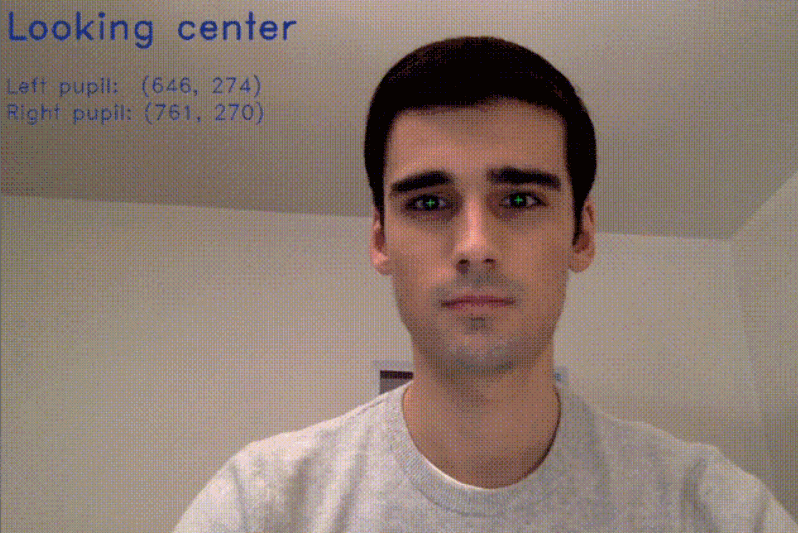
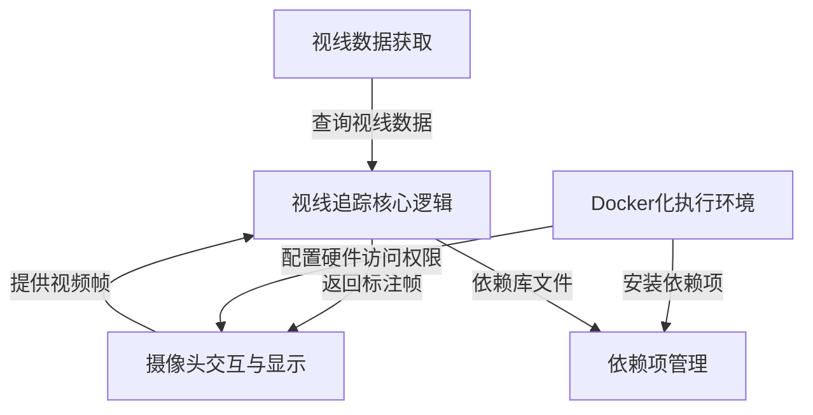
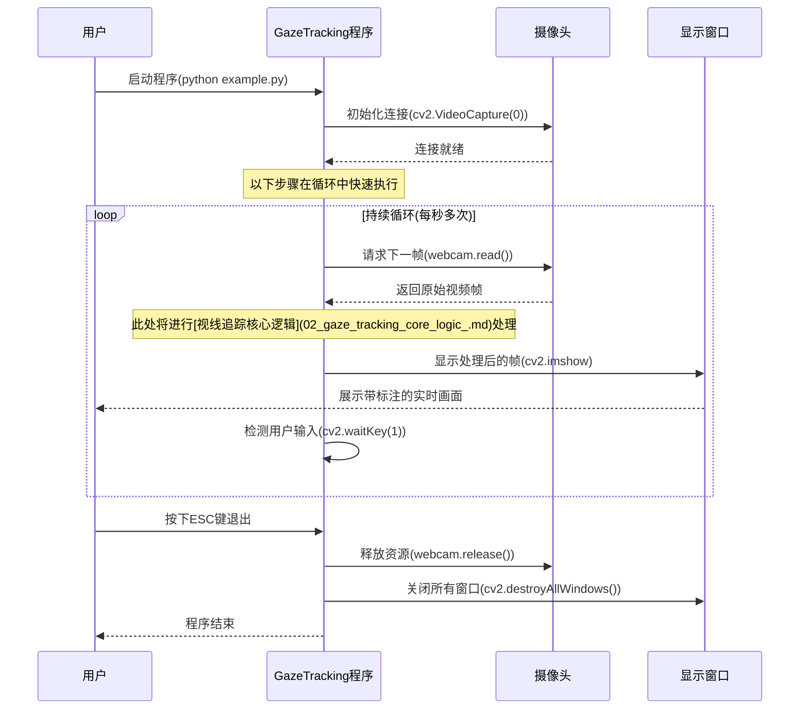

链接：[antoinelame/GazeTracking: 👀 Eye Tracking library easily implementable to your projects](https://github.com/antoinelame/GazeTracking)



# docs：视线追踪

`GazeTracking`项目提供了一个**==基于摄像头的视线追踪系统==**，能够实时*检测用户的视线方向*和瞳孔位置。

该系统通过持续从*摄像头*==捕获==实时视频，处理==每一帧==来分析眼睛状态，随后*显示视觉反馈*（例如"向右看"或"眨眼"）来指示用户的注视方向。

## 可视化概览



## 章节

1. [摄像头交互与显示](01_webcam_interaction___display_.md)
2. [视线追踪核心逻辑](02_gaze_tracking_core_logic_.md)
3. [视线数据获取](03_gaze_data_retrieval_.md)
4. [依赖项管理](04_dependency_management_.md)
5. [Docker化执行环境](05_dockerized_execution_environment_.md)

---

# 第1章：摄像头交互与显示

欢迎来到视线追踪的世界~

想象你正在建造一个需要观察世界并告诉你所见之物的机器人。本章将教会你的项目如何拥有"眼睛"（摄像头）来捕捉画面，以及"声音"（电脑屏幕）来展示结果。

`GazeTracking`的核心功能是通过摄像头追踪你的视线方向。但在==理解你的视线之前，它首先需要"看见"你==。这就是"摄像头交互与显示"模块的作用——通过持续获取摄像头视频流并将处理后的画面实时显示在屏幕上，为实时视线追踪奠定基础。

## 核心概念：持续循环

将视频想象成一本快速翻动的画册。每一页都是一幅微小画面（称为**帧**），快速翻动时就形成了连续动作。

摄像头正是这样工作的：每秒拍摄多张照片。我们的项目需要：

1. ==**获取帧**==：从摄像头捕获一张画面
2. **分析帧**：确定眼睛注视方向（将在[视线追踪核心逻辑](02_gaze_tracking_core_logic_.md)中详述）
3. **显示帧**：在屏幕上展示画面，通常会添加分析得出的高亮或文字标注
4. **重复**！`每秒循环数百次`

这个持续循环使系统具有`交互性`和`实时性`。

## 使用OpenCV实现摄像头交互

本项目使用强大的**OpenCV**（开源计算机视觉库）来处理所有摄像头和显示功能。让我们通过简化后的`example.py`代码了解基本步骤。

首先需要导入OpenCV库：
```python
import cv2
```

### 步骤1：开启摄像头

创建`VideoCapture`对象来启动摄像头。参数`0`表示默认摄像头，若有多个摄像头可使用`1`、`2`等。

```python
import cv2

# '0'表示使用默认摄像头
webcam = cv2.VideoCapture(0)
```

这行代码相当于告诉计算机："我要连接0号摄像头"。连接成功后，`webcam`对象就代表与摄像头的连接。

### 步骤2：获取帧画面

摄像头开启后，需要在循环中持续获取画面：

```python
while True:
    # `_`表示是否成功获取帧（True/False）
    # `frame`存储实际的图像数据（NumPy数组）
    _, frame = webcam.read()
```

`webcam.read()`返回两个值：获取是否成功（存储在`_`），以及图像数据（存储在`frame`）。

### 步骤3：显示画面

使用`cv2.imshow()`显示画面，需要指定窗口名称和图像变量：

```python
    # 在"Demo"窗口中显示帧
    cv2.imshow("Demo", frame)
```

这将弹窗显示实时视频流。

### 步骤4：保持运行（及优雅退出）

通过`while True`循环保持视频流，同时使用`cv2.waitKey()`检测按键：

```python
    # 等待1毫秒，检测是否按下ESC键（ASCII码27）
    if cv2.waitKey(1) == 27:
        break  # 按下ESC退出循环
```

### 步骤5：释放资源

退出循环后释放摄像头资源并关闭所有窗口：

```python
# 释放摄像头
webcam.release()
# 关闭所有OpenCV窗口
cv2.destroyAllWindows()
```

## 完整示例代码

整合上述步骤的基础演示代码：

```python
import cv2

# 1. 启动默认摄像头
webcam = cv2.VideoCapture(0)

while True:
    # 2. 读取帧
    _, frame = webcam.read()

    # (可选：添加文字标注)
    cv2.putText(frame, "实时摄像头画面", (50, 50),
                cv2.FONT_HERSHEY_SIMPLEX, 1, (0, 255, 0), 2)

    # 3. 显示帧
    cv2.imshow("我的摄像头画面", frame)

    # 4. 检测ESC键
    if cv2.waitKey(1) == 27:
        break

# 5. 释放资源
webcam.release()
cv2.destroyAllWindows()
```

运行后将显示带文字标注的实时画面，按ESC键退出。

## 底层原理：逐步解析

通过序列图展示"摄像头交互与显示"的工作流程：



## 总结

本章介绍了"摄像头交互与显示"的基础概念。你已了解`GazeTracking`如何通过`cv2.VideoCapture`和`webcam.read()`获取"眼睛"，以及如何使用`cv2.imshow()`形成"声音"。这个==捕获-处理-显示的循环==是实时计算机视觉应用的核心。

现在我们已经理解系统如何=="看见"世界(opencv)==，下一章将探索**[视线追踪核心逻辑](02_gaze_tracking_core_logic_.md)**，揭示系统==如何分析视频帧来检测视线方向==。

