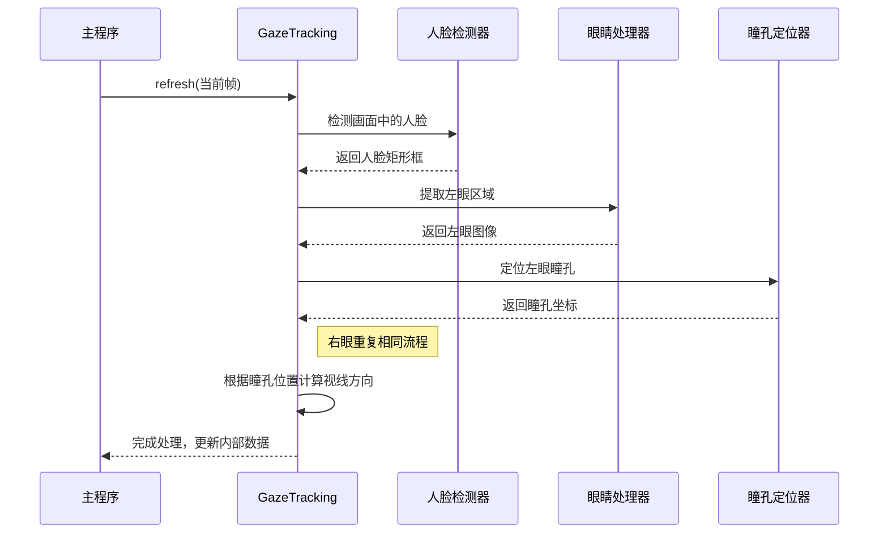

# 第2章：视线追踪核心逻辑

欢迎回来

在[第1章：摄像头交互与显示](01_webcam_interaction___display_.md)中，我们学习了`GazeTracking`项目如何获取"眼睛"（摄像头）和"声音"（在屏幕上显示画面）。现在我们已经==有了持续的视频帧输入==，但如果不能==理解==看到的内容，这些画面又有什么意义呢？

本章将为项目赋予"大脑"。我们将探索`GazeTracking`系统的核心，它==负责处理原始视频帧，定位人脸和眼睛==，最终确定视线方向。

## 核心大脑：`GazeTracking`类

想象你是一名侦探，正在查看一张人物照片。你不会只看到一堆像素，而是会==立即识别出==人脸、眼睛，然后推测他们的视线方向。

项目中的`GazeTracking`类正是这样一个专业侦探。它是所有视线追踪功能的中枢，``接收原始视频帧（"照片"）作为输入，经过智能处理后告诉我们瞳孔位置和视线方向`。

**它解决的核心问题**：如何==将简单的图像流转化为有关人眼视线的有意义信息==？`GazeTracking`类提供了实现这一目标的所有工具。

## 如何使用`GazeTracking`侦探

让我们看看使用这个"侦探"的主要步骤，类似于`example.py`中的实现方式

### 步骤1：聘请侦探（创建实例）

首先需要导入`GazeTracking`并创建实例：

```python
from gaze_tracking import GazeTracking

gaze = GazeTracking()
```

这里的==`gaze`就是我们的视线追踪对象==，准备分析视频帧。

### 步骤2：给侦探新照片（用帧刷新）

侦探最重要的任务是分析新照片（帧）。通过`refresh()`方法实现，需要对每个摄像头获取的帧调用此方法：

```python
# 假设'frame'是从摄像头获取的新图像
gaze.refresh(frame)
```

**内部过程**：调用`gaze.refresh(frame)`时，`GazeTracking`对象开始工作。它获取`frame`，找到人脸、眼睛、瞳孔，并计算视线方向。所有这些信息都存储在内部，随时可供查询。

### 步骤3：向侦探提问（获取视线信息）

`refresh()`处理完帧后，可以向`gaze`对象询问各种发现。

#### 视线方向判断

```python
if gaze.is_right():
    print("向右看")
elif gaze.is_left():
    print("向左看")
elif gaze.is_center():
    print("直视前方")
else:
    print("未检测到视线")
```

#### 瞳孔坐标获取

```python
left_pupil = gaze.pupil_left_coords()
right_pupil = gaze.pupil_right_coords()

print(f"左瞳孔坐标: {left_pupil}")
print(f"右瞳孔坐标: {right_pupil}")
```

返回类似`(x,y)`的像素坐标，如未检测到则返回`None`。

#### 可视化标注帧

```python
annotated_frame = gaze.annotated_frame()
cv2.imshow("视线演示", annotated_frame)
```

`annotated_frame()`返回添加了标注的图像，可直观显示眼睛和视线方向。

## 完整实现：视线感知循环

结合第1章知识，实现完整功能：

```python
import cv2
from gaze_tracking import GazeTracking

gaze = GazeTracking()
webcam = cv2.VideoCapture(0)

while True:
    _, frame = webcam.read()
    gaze.refresh(frame)
    
    annotated_frame = gaze.annotated_frame()
    text = "未检测到视线"
    
    if gaze.is_right(): text = "向右看"
    elif gaze.is_left(): text = "向左看"
    elif gaze.is_center(): text = "直视前方"

    cv2.putText(annotated_frame, text, (60, 60), 
                cv2.FONT_HERSHEY_DUPLEX, 2, (255, 0, 0), 2)
    cv2.imshow("演示", annotated_frame)

    if cv2.waitKey(1) == 27:
        break

webcam.release()
cv2.destroyAllWindows()
```

运行后将显示实时画面，随着眼球移动会出现瞳孔标记和视线方向指示线，左上角文字会实时显示"向左看"、"向右看"或"直视前方"。

## 底层原理：侦探的工作机制

`gaze.refresh(frame)`内部发生了什么？这就像是为每帧图像建立的微型流水线。

### 内部处理步骤



1. **接收帧**：获取原始视频帧
2. **人脸检测**：使用Dlib库快速扫描并定位人脸
3. **眼睛检测**：精确定位人脸中的左右眼位置
4. **眼睛隔离**：从主帧中裁剪出眼部区域
5. **瞳孔定位**：通过图像处理技术（灰度转换、模糊处理、寻找最暗点）定位瞳孔中心
6. **视线计算**：根据瞳孔在眼区中的相对位置判断视线方向
7. **存储结果**：将瞳孔坐标、视线方向等信息存储在对象内部

### 代码窥探

#### 人脸和眼睛检测

项目主要==依赖**Dlib**库==进行人脸特征检测：

```python
import dlib

class GazeTracking:
    def __init__(self):
        self._face_detector = dlib.get_frontal_face_detector()
        self._landmark_predictor = dlib.shape_predictor("landmarks.dat")

    def _find_face_and_eyes(self, frame):
        gray_frame = cv2.cvtColor(frame, cv2.COLOR_BGR2GRAY)
        faces = self._face_detector(gray_frame)
        if faces:
            landmarks = self._landmark_predictor(gray_frame, faces[0])
            self._face = faces[0]
            self._landmarks = landmarks
            return True
        return False
```

#### 瞳孔定位

```python
import numpy as np

class Eye:
    def __init__(self, frame, landmarks, eye_points):
        self._eye_frame = self._cut_eyebrows(frame, eye_points)
        self._find_pupil(self._eye_frame)

    def _find_pupil(self, eye_frame):
        gray_eye = cv2.cvtColor(eye_frame, cv2.COLOR_BGR2GRAY)
        blurred_eye = cv2.GaussianBlur(gray_eye, (5, 5), 0)
        _, _, min_loc, _ = cv2.minMaxLoc(blurred_eye)
        self.pupil_coords = min_loc
```

#### 视线方向计算

根据瞳孔在眼区中的相对位置判断视线方向：

| 瞳孔位置 | 视线方向 |
| :------- | :------- |
| 眼区左侧 | 向右看   |
| 眼区中央 | 直视前方 |
| 眼区右侧 | 向左看   |
| 眼区上方 | 向下看   |
| 眼区下方 | 向上看   |

`horizontal_ratio()`和`vertical_ratio()`方法提供0.0到1.0的数值量化这些方向。

## 总结

本章我们为`GazeTracking`项目赋予了"大脑"——`GazeTracking`类。你学会了：

* 创建`GazeTracking`实例
* 使用`gaze.refresh(frame)`处理视频帧
* 通过`is_left()`等方法查询视线方向
* 使用`annotated_frame()`可视化分析结果

我们也简单了解了其底层机制：使用==Dlib进行人脸和眼睛检测==，通过图像处理定位瞳孔，最终分析每帧画面提供有意义的视线信息。

现在我们知道如何==获取视线信息==，下一步是==了解`GazeTracking`能提供的各类数据及其应用方式==。请继续学习[第3章：视线数据获取](03_gaze_data_retrieval_.md)

