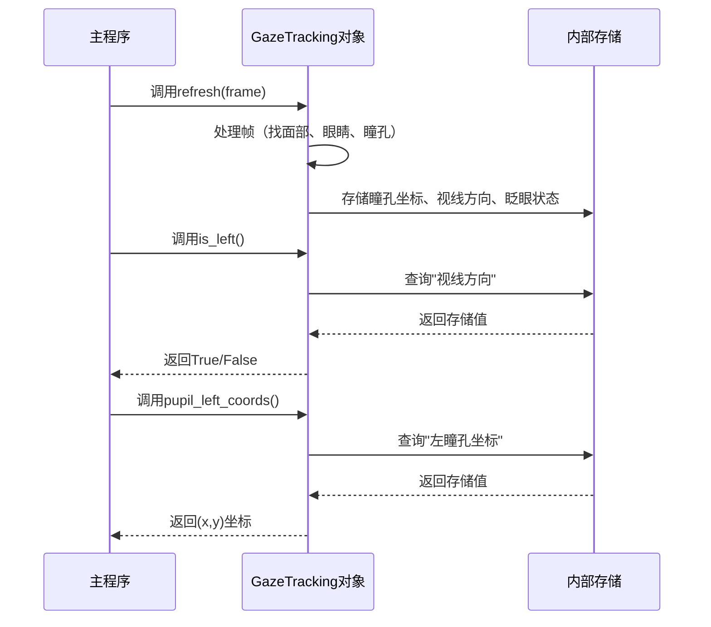

# 第3章：视线数据获取

欢迎回来

在[第1章：摄像头交互与显示](01_webcam_interaction___display_.md)中，我们学会了如何让项目通过==摄像头"看见"世界opencv==。

接着在[第2章：视线追踪核心逻辑](02_gaze_tracking_core_logic_.md)，我们通过引入`GazeTracking`对象为项目赋予了"大脑"，它能用`gaze.refresh(frame)`==分析每一帧画面dlib==。

现在，想象你的`GazeTracking`对象是一位超级聪明的侦探，刚完成对某人面部照片的检查。这位侦探已经找出了眼睛位置、瞳孔坐标，甚至判断出视线方向。但如果不能==向侦探"询问"这些发现==，这些信息又有什么价值呢？

本章将重点介绍**视线数据获取**。在这部分，你可以向`GazeTracking`侦探提出具体问题，并获得清晰易懂的"调查报告"。当侦探（`gaze.refresh()`）完成对一帧画面的复杂分析后，这些==抽象方法能轻松获取==视线和瞳孔==信息==。

## 核心概念：分析后的数据查询

"视线数据获取"解决的主要问题是将复杂的眼动追踪数据简化获取。无需自己处理原始图像数据或进行计算，`GazeTracking`对象已准备好现成的答案。

可以这样理解：

1. **==给侦探一帧画面==**：`gaze.refresh(frame)`（进行分析）
2. **==提出具体问题==**：`gaze.is_left()`、`gaze.pupil_left_coords()`等方法（获取数据）
3. **==获得简明答案==**：`True`/`False`、`(x,y)`坐标或数值比例

让我们看看可以提出哪些关键问题以及如何获取答案。

## 侦探报告：核心数据获取方法

调用`gaze.refresh(frame)`后，可以立即使用这些方法获取信息。

### 用户在看左、右还是中间？

这些是最常用的查询方法，返回`True`或`False`。

```python
if gaze.is_left():
    print("用户正在向左看")
elif gaze.is_right():
    print("用户正在向右看")
elif gaze.is_center():
    print("用户正在直视前方")
else:
    print("无法确定视线方向或未检测到眼睛")
```

**内部机制**：`GazeTracking`对象检查`refresh()`期间的计算结果并返回布尔值。

### 是否在眨眼？

另一个实用的布尔值检查。

```python
if gaze.is_blinking():
    print("用户正在眨眼")
else:
    print("用户眼睛睁开")
```

**内部机制**：`refresh()`期间会判断眼睛是否闭合，`is_blinking()`只是返回这个结果。

### 精确瞳孔坐标是多少？

有时需要比方向更精确的数据。这些方法返回帧中每个瞳孔的`(x,y)`像素坐标。

```python
left_pupil = gaze.pupil_left_coords()
right_pupil = gaze.pupil_right_coords()

if left_pupil:
    print(f"左瞳孔坐标: {left_pupil}")
if right_pupil:
    print(f"右瞳孔坐标: {right_pupil}")

# 示例输出：
# 左瞳孔坐标: (320, 240)
# 右瞳孔坐标: (480, 250)
```

**内部机制**：这些方法返回`refresh()`期间计算并存储的瞳孔坐标，若未检测到则返回`None`。

### 视线方向的数值比例？

为获得更精细的控制，`GazeTracking`提供水平和垂直视线方向的数值比例（0.0到1.0之间）：

* `horizontal_ratio()`：
  * `0.0`表示最右侧
  * `0.5`表示正中
  * `1.0`表示最左侧
* `vertical_ratio()`：
  * `0.0`表示最上方（向上看）
  * `0.5`表示正中
  * `1.0`表示最下方（向下看）

```python
horizontal = gaze.horizontal_ratio()
vertical = gaze.vertical_ratio()

if horizontal is not None:
    print(f"水平视线比例: {horizontal:.2f}")
if vertical is not None:
    print(f"垂直视线比例: {vertical:.2f}")

# 示例输出：
# 水平视线比例: 0.25（用户略微向右看）
# 垂直视线比例: 0.60（用户略微向下看）
```

**内部机制**：这些方法返回预先计算的数值比例，比简单的`is_left()`或`is_right()`提供更详细的信息。

视线比例值总结表：

| 比例值 | 水平视线 | 垂直视线 |
| :----- | :------- | :------- |
| `0.0`  | 最右侧   | 最上方   |
| `0.5`  | 正中     | 正中     |
| `1.0`  | 最左侧   | 最下方   |

### 在屏幕上显示侦探发现

`annotated_frame()`方法能提供可视化报告，返回添加了眼部轮廓、瞳孔标记和视线指示线的原始帧。

```python
annotated_frame = gaze.annotated_frame()
# 可用OpenCV显示（如第1章所示）
# cv2.imshow("视线演示", annotated_frame)
```

**内部机制**：该方法利用`refresh()`计算的面部、眼睛、瞳孔位置和视线方向数据，使用OpenCV将这些发现绘制在原始帧的副本上。

## 完整程序实现

虽然[第2章：视线追踪核心逻辑](02_gaze_tracking_core_logic_.md)已有所展示，但以下是结合多种数据获取方法的主循环示例：

```python
import cv2
from gaze_tracking import GazeTracking

gaze = GazeTracking()
webcam = cv2.VideoCapture(0)

while True:
    # 1. 获取新帧（第1章）
    _, frame = webcam.read()

    # 2. 让GazeTracking侦探分析帧（第2章）
    gaze.refresh(frame)

    # 3. 获取标注帧用于显示
    display_frame = gaze.annotated_frame()

    # 4. 准备包含视线数据的文本（数据获取！）
    gaze_text = "未检测到视线"
    if gaze.is_blinking():
        gaze_text = "正在眨眼"
    elif gaze.is_right():
        gaze_text = "向右看"
    elif gaze.is_left():
        gaze_text = "向左看"
    elif gaze.is_center():
        gaze_text = "直视前方"

    left_pupil = gaze.pupil_left_coords()
    right_pupil = gaze.pupil_right_coords()

    # 5. 将获取的数据添加到显示帧
    cv2.putText(display_frame, gaze_text, (90, 60), cv2.FONT_HERSHEY_DUPLEX, 1.2, (0, 255, 0), 2)
    cv2.putText(display_frame, f"左瞳孔: {left_pupil}", (90, 100), cv2.FONT_HERSHEY_DUPLEX, 0.7, (0, 0, 255), 1)
    cv2.putText(display_frame, f"右瞳孔: {right_pupil}", (90, 130), cv2.FONT_HERSHEY_DUPLEX, 0.7, (0, 0, 255), 1)

    # 6. 显示帧（第1章）
    cv2.imshow("视线数据演示", display_frame)

    # 7. 检查退出键（第1章）
    if cv2.waitKey(1) == 27:
        break

# 8. 清理资源（第1章）
webcam.release()
cv2.destroyAllWindows()
```

运行这个增强版示例，将看到实时摄像头画面，附带眼部高亮标记、瞳孔坐标和视线方向文本提示

## 底层原理：数据获取机制

"视线数据获取"的美妙之处在于从你的角度看极其简单。只需调用方法就能获得答案。但`GazeTracking`对象内部发生了什么？

### 简化的内部流程

调用`gaze.refresh(frame)`时，`GazeTracking`对象不仅处理帧，还会将所有发现存储在内部，就像侦探在案件档案中做笔记。当你调用`gaze.is_left()`等方法时，它只是查阅内部记录并返回答案。



### 代码

在`gaze_tracking/gaze_tracking.py`文件中，`GazeTracking`类将分析结果存储为成员变量。数据获取方法只是返回这些变量的值。

```python
class GazeTracking:
    def __init__(self):
        # 存储结果的内部变量
        self._left_pupil = None
        self._right_pupil = None
        self._is_blinking_status = False
        self._gaze_direction_horizontal = None # 如"left"、"right"、"center"
        self._horizontal_ratio_val = None
        self._vertical_ratio_val = None
        # ... 其他眼睛、面部等内部变量

    def refresh(self, frame):
        # ...（第2章的复杂处理过程）...
        # 处理后更新这些内部变量：
        self._left_pupil = (found_left_x, found_left_y)
        self._right_pupil = (found_right_x, found_right_y)
        self._is_blinking_status = calculate_blink_status(frame)
        self._gaze_direction_horizontal = calculate_gaze_direction()
        self._horizontal_ratio_val = calculate_horizontal_ratio()
        self._vertical_ratio_val = calculate_vertical_ratio()
        # ... 以此类推 ...

    # 数据获取方法示例：
    def pupil_left_coords(self):
        """返回左瞳孔坐标(x,y)"""
        return self._left_pupil

    def is_blinking(self):
        """如果用户闭眼则返回True"""
        return self._is_blinking_status

    def is_left(self):
        """如果用户向左看则返回True"""
        return self._gaze_direction_horizontal == "left"

    def horizontal_ratio(self):
        """返回0.0到1.0之间的水平视线比例"""
        return self._horizontal_ratio_val

    # ... 其他数据获取方法遵循相同模式 ...
```

用于数据获取的方法（`pupil_left_coords()`、`is_blinking()`等）非常简单。它们==只是访问由更复杂的`refresh()`方法填充的内部变量==（`_left_pupil`、`_is_blinking_status`等）。这种设计保持了使用过程的简洁性。

## 总结

本章==掌握"视线数据获取"的技巧==。

学会了如何有效查询`GazeTracking`对象，获取关于眼睛和瞳孔位置的重要信息。现在可以判断用户是在向左、向右还是直视前方，是否在眨眼，甚至获取精确的瞳孔坐标和视线比例。这些方法将复杂的眼动追踪数据转化为有意义的人机交互信息。

既然已经知道如何获取这些神奇的数据，你可能会想知道如何确保项目拥有运行所需的所有工具和库。下一章我们将探索**[依赖项管理](04_dependency_management_.md)**，确保`GazeTracking`项目拥有正常运行所需的一切。

