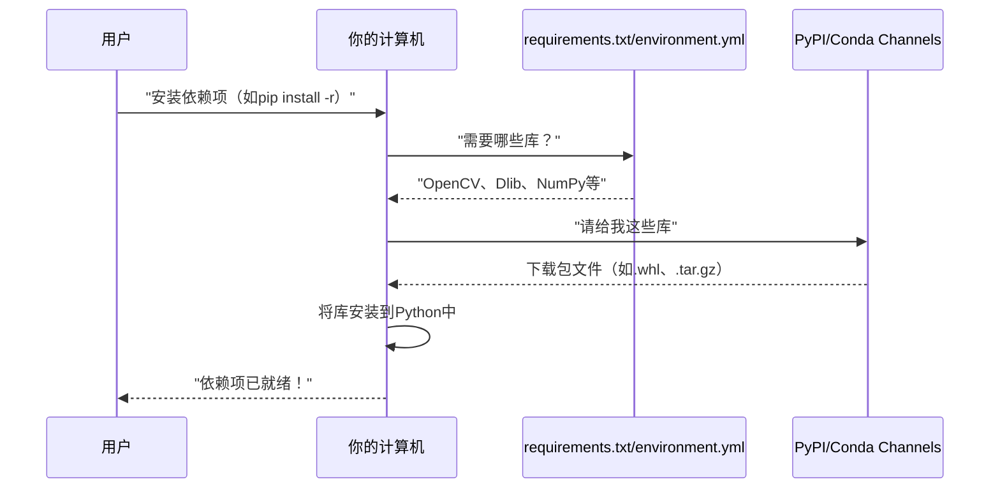
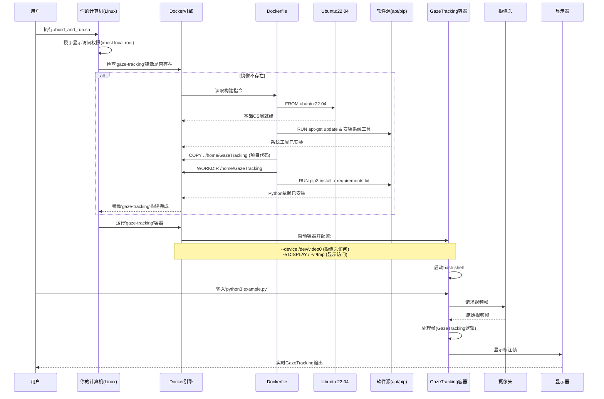

# 第4章：依赖项管理

欢迎回来

在[第3章：视线数据获取](03_gaze_data_retrieval_.md)中，我们学会了如何从`GazeTracking`侦探那里获取有价值的信息，比如用户是在向左看还是向右看，或者瞳孔的精确坐标。

但想象一下，刚为车购置了一套精美的新工具包，里面有扳手、螺丝刀和各种小工具。然而==在开始修理前，需要确认工具箱里是否备齐了所有*正确*的工具==。万一缺少关键扳手怎么办？根本无法工作！

我们的`GazeTracking`项目也是如此。它基于Python构建，但高度依赖其他专业软件"工具"（称为**库**或**包**）来实现其魔法。例如：

* **OpenCV**（开源计算机视觉库）：用于摄像头交互和图像显示
* **Dlib**：用于稳健的人脸和眼睛检测
* **NumPy**：高效处理数值数据和图像数组

没有这些特定工具，`GazeTracking`根本无法运行，就像试图不用锤子建造房屋

本章将全面介绍**依赖项管理**。这是确保`GazeTracking`项目拥有正常运行所需外部工具和Python库的过程，它定义了*需要什么*，并提供安装这些内容的指导或配置。

## 核心概念：备齐所有工具

依赖项管理主要解决一个问题：当你获取像`GazeTracking`这样的Python项目时，如何自动获取它运行所需的其他软件组件。

可以将其视为食谱的食材清单：

1. **食谱**：你的`GazeTracking`项目代码
2. **食材清单**：列出`GazeTracking`所需所有其他Python库的特殊文件
3. **厨师助手**：像`pip`或`conda`这样的"包管理器"，读取食材清单并为你获取所有内容

没有食材，食谱就无法烹饪

## 关键概念

让我们分解依赖项管理的核心概念。

### 什么是依赖项？

在编程中，**依赖项**就是项目运行所需的其他软件。如果`GazeTracking`使用`OpenCV`的函数来读取摄像头，那么`OpenCV`就是`GazeTracking`的依赖项。

### 包管理器：你的厨师助手

手动为每个项目下载安装每个库将是场噩梦。**包管理器**应运而生，它们是自动化安装、更新和删除软件包（库）的工具。Python最常用的两个包管理器是：

* **`pip`**：Python的标准包安装工具，从Python包索引(PyPI)获取包
* **`conda`**：强大的包和环境管理器，常用于数据科学，可管理Python之外的包（如Dlib本身）

### 食材清单：`requirements.txt`和`environment.yml`

项目通常包含特殊文件来告知包管理器需要什么。

* **`requirements.txt`（用于`pip`）**：简单的文本文件，列出`pip`需要安装的所有Python包及其特定版本，就像`pip`的购物清单。

    ```text
    # requirements.txt简化内容
    numpy==1.16.1
    opencv-python>=3.4.0
    dlib==19.17.*
    ```
    每行告诉`pip`要获取哪个库及版本要求。`==`表示"精确此版本"，`>=`表示"此版本或更新"。

* **`environment.yml`（用于`conda`）**：类似但用于`conda`的文件，描述完整的`conda`环境，包括Python版本、所需包及查找位置（称为"channels"），让`conda`为项目创建隔离的"工作间"。

    ```yaml
    # environment.yml简化内容
    name: GazeTracking
    channels:
      - conda-forge
      - anaconda
      - defaults
    dependencies:
      - numpy == 1.16.1
      - opencv == 3.4.*
      - dlib == 19.17.*
    ```
    此文件不仅列出包，还指定`channels`（包查找位置）和环境的`name`（`GazeTracking`），有助于保持项目隔离。

## 获取工具：安装依赖项

让我们看看下载`GazeTracking`后，如何实际使用这些文件和包管理器使其运行。

首先通常从GitHub克隆项目，即下载所有文件：

```shell
git clone https://github.com/antoinelame/GazeTracking.git
cd GazeTracking
```
进入项目文件夹后，就可以安装工具了。

### 方法1：使用`pip`和`requirements.txt`

如果使用`pip`（大多数Python设置的常用选择），将使用`requirements.txt`文件。

1. **阅读`requirements.txt`**：`GazeTracking`项目的`requirements.txt`文件（如上所示）列出`numpy`、`opencv-python`和`dlib`。

2. **用`pip`安装**：打开终端或命令提示符，导航到`GazeTracking`项目文件夹，运行：

    ```shell
    pip install -r requirements.txt
    ```

    * `pip install`：告诉`pip`安装包
    * `-r`：表示"需求文件"
    * `requirements.txt`：`pip`应读取以了解安装内容的文件

    **接下来发生什么？** `pip`读取文件，访问互联网上的Python包索引(PyPI)，下载每个指定库并安装到计算机。你会看到大量文本滚动，显示获取和安装过程。

    **关于Dlib的特殊说明**：`GazeTracking`的`README.md`提到Dlib（人脸和眼睛检测的关键依赖项）还有自己的外部系统先决条件如`Boost`和`CMake`。`pip`会安装Dlib的*Python封装*，但你可能需要先安装这些底层系统工具，`pip`才能成功构建Dlib。`README.md`提供了此步骤的详细链接。对初学者来说，这可能是最棘手的部分，但很重要。

### 方法2：使用`conda`和`environment.yml`

如果偏好`conda`（通常在你需要更多环境控制或特定库版本时使用），将使用`environment.yml`文件。

1. **阅读`environment.yml`**：`GazeTracking`项目的`environment.yml`文件（如上所示）列出`numpy`、`opencv`和`dlib`及特定channels。

2. **创建并激活环境**：从项目文件夹运行这两个命令：

    ```shell
    conda env create --file environment.yml
    conda activate GazeTracking
    ```

    * `conda env create --file environment.yml`：告诉`conda`读取`environment.yml`文件，然后创建名为"GazeTracking"的全新隔离Python环境（如`environment.yml`文件所指定），并将所有列出的依赖项安装到*该特定环境*中。
    * `conda activate GazeTracking`：创建后需要"激活"此环境，确保运行Python时使用"GazeTracking"环境中安装的库，而非计算机上的其他版本。命令提示符通常会显示活动环境（如`(GazeTracking) $`）。

    **接下来发生什么？** `conda`从其channels获取包，创建隔离环境并安装所有内容。激活环境会设置shell使用该环境。

### 验证安装

使用`pip`或`conda`安装依赖项后，可通过运行项目示例脚本来验证一切是否正常：

```shell
python example.py
```

如果所有依赖项正确安装，你应该能看到摄像头画面，`GazeTracking`项目会在画面上绘制并告诉你视线方向！

## 底层原理：计算机如何获取工具

快速可视化运行安装命令时发生的情况。



1. **你给出命令**：告诉计算机"用`pip`（或`conda`）安装`GazeTracking`项目的依赖项"
2. **计算机读取清单**：包管理器（如`pip`）查看`requirements.txt`文件（或`conda`的`environment.yml`），了解需要哪些库和版本
3. **计算机获取包**：连接到在线软件仓库（如`pip`的PyPI，或`conda`的各种channels），这些就像装满软件包的巨大在线商店
4. **下载包**：包管理器下载实际的库文件
5. **安装包**：最后将这些下载的文件安装到Python设置（或`conda`环境）中，使`GazeTracking`项目可以使用它们

整个过程确保运行`GazeTracking`时，所有`import`语句（如`import cv2`或`from gaze_tracking import GazeTracking`）都能找到执行所需的代码。

## 总结

本章学习了**依赖项管理**，这是设置任何软件项目的关键概念。你现在理解了什么是依赖项、它们为何重要，以及像带`requirements.txt`的`pip`或带`environment.yml`的`conda`等工具如何帮助你轻松安装`GazeTracking`项目运行所需的所有外部库。通过正确管理依赖项，你确保项目的"工具箱"完整且随时可用。

既然已经知道如何==获取项目工具==，接下来让我们探索如何==设置一致且隔离的环境来在任何地方运行==`GazeTracking`。下一章将深入**[Docker化执行环境](05_dockerized_execution_environment_.md)**

----------

# 第5章：Docker化执行环境

在前几章中，我们已经逐步构建了`GazeTracking`项目：
* 在[第1章：摄像头交互与显示](01_webcam_interaction___display_.md)中，我们学习了`GazeTracking`如何获取"眼睛"和"声音"
* 在[第2章：视线追踪核心逻辑](02_gaze_tracking_core_logic_.md)中，我们探索了其分析视线的"大脑"
* 在[第3章：视线数据获取](03_gaze_data_retrieval_.md)中，你掌握了从视线数据中获取洞察的技巧
* 在[第4章：依赖项管理](04_dependency_management_.md)中，我们确保所有必要的Python"工具"(库)都已安装

现在，假设已成功在计算机上安装了`GazeTracking`的所有依赖项，它运行完美。

当朋友想尝试时，或你想在新电脑上运行时，突然面临挑战："朋友的系统不同"、"新电脑的Python版本不同"、"Dlib在这台机器上编译失败！"这是软件开发中的经典问题："在我机器上能运行！"

本章介绍**Docker化执行环境**。

这个强大概念通过创建完全自包含、可移植的"盒子"来解决"在我机器上能运行"问题，这个==盒子包含整个`GazeTracking`应用及其所有操作系统和Python依赖项==。想象它是一个**"便携实验室"**：`GazeTracking`运行==所需的一切都整齐打包其中==，因此可以在任何兼容系统上一致部署和运行，无论本地设置如何。它甚至能连接物理摄像头和图形显示！

## 核心概念：项目的便携实验室

Docker化执行环境主要解决**一致性**和**部署便捷性**问题。无需在新机器上手动安装依赖项、配置操作系统设置和调试版本冲突，==Docker让你将所有内容打包成单一单元==。

类比说明：将`GazeTracking`想象为植物。

* 不用Docker时，你可能直接将它种在花园(你的电脑)里。花园的土壤、气候和其他植物可能与朋友的不同，因此生长状况可能不同
* 使用Docker时，你创建完美定制的**花盆**(**Docker镜像**)，包含植物所需的确切土壤、养分和微气候。然后可以将这个盆栽运到任何地方！到达后，它被放入**温室**(**Docker容器**)中，在理想环境中继续茁壮成长，完全独立于宿主系统的花园

对`GazeTracking`而言，这个"花盆"包含：
* 基础操作系统(如Ubuntu)
* 所有系统级库(如OpenCV和Dlib所需)
* Python及其包管理器(`pip`)
* 所有Python依赖项(`numpy`、`opencv-python`、`dlib`)
* 最后是`GazeTracking`项目代码本身

## 关键概念

让我们分解Docker的核心组件。

- 专栏传送：[Docker & yaml配置](https://blog.csdn.net/2301_80171004/category_12827592.html?spm=1001.2014.3001.5482)

### 1. Dockerfile：实验室的配方

`Dockerfile`是包含一系列指令的简单文本文件。这些指令告诉Docker如何构建"便携实验室"(镜像)。就像烘焙蛋糕的食谱——列出所有原料和组合步骤。

对`GazeTracking`，`Dockerfile`指定：
* 使用什么基础操作系统
* 安装哪些系统工具(如`cmake`、`libsm6`)
* 安装哪个Python版本
* 如何将`GazeTracking`代码复制到实验室
* 如何使用`pip`安装所有Python依赖项(如[第4章：依赖项管理](04_dependency_management_.md)所述)

### 2. Docker镜像：盆栽植物

Docker**镜像**是实际的"花盆"或应用环境的完整蓝图。它是包含所有内容的只读模板，准备运行。你从`Dockerfile`构建镜像。

### 3. Docker容器：运行的温室

Docker**容器**是Docker镜像的运行实例。是"盆栽植物"(镜像)实际运行的"温室"。你可以启动、停止、移动或删除容器。每个容器与主计算机系统隔离，但可配置为共享摄像头或显示等资源。

### 4. 连接硬件(摄像头和显示)

这对`GazeTracking`至关重要，因为它需要访问物理摄像头和计算机屏幕来显示视频流。默认情况下，Docker容器是隔离的。因此，要让`GazeTracking`看到摄像头并在屏幕上显示输出，我们需要明确告诉Docker容器与宿主计算机共享这些资源。

## 如何用Docker运行`GazeTracking`

`GazeTracking`项目提供`Dockerfile`和辅助脚本`build_and_run.sh`简化此过程。通常需要执行两个主要操作：

1. **构建Docker镜像**：基于`Dockerfile`配方创建"便携实验室"
2. **运行Docker容器**：在此实验室中启动`GazeTracking`应用，连接摄像头和显示

让我们看看自动执行这些步骤的`build_and_run.sh`脚本。

### 步骤1：授予显示访问权限

运行Docker容器前，特别是需要显示图形界面(如`GazeTracking`显示视频)时，需要授予Docker容器使用计算机显示的权限。通过`xhost`命令实现。

```bash
xhost local:root
```

**作用**：此命令开放X服务器(管理图形显示的系统)，允许本地机器的`root`用户(Docker内部常用)连接。就像临时解锁门让Docker容器在屏幕上显示窗口。通常在启动容器前运行一次。

### 步骤2：构建或重用Docker镜像

`build_and_run.sh`脚本首先检查名为`gaze-tracking`的Docker镜像是否存在。若不存在则构建。

```bash
docker build -t gaze-tracking .
```

* `docker build`：告诉Docker创建镜像
* `-t gaze-tracking`：为镜像分配"标签"或名称(`gaze-tracking`)，便于后续引用
* `.`：告诉Docker在当前目录查找`Dockerfile`

**作用**：Docker逐步读取`Dockerfile`。下载基础操作系统(Ubuntu)，安装必要软件，复制`GazeTracking`代码，安装Python依赖项。此过程只需执行一次，或修改`Dockerfile`/`requirements.txt`时执行。

### 步骤3：运行Docker容器

构建镜像后，脚本运行容器。这里是连接摄像头和显示的关键。

```bash
docker run --rm --device /dev/video0 \
    -e DISPLAY=${DISPLAY} \
    -v /tmp/.X11-unix:/tmp/.X11-unix \
    --env="QT_X11_NO_MITSHM=1" \
    -it gaze-tracking bash
```

解析重要`docker run`选项：

* `docker run`：从镜像启动新容器
* `--rm`：容器停止后自动删除，适合临时运行
* `--device /dev/video0`：**摄像头访问关键！**将容器连接到物理摄像头设备(Linux系统通常位于`/dev/video0`)
* `-e DISPLAY=${DISPLAY}`：**显示访问关键！**将当前`DISPLAY`环境变量从宿主系统传入容器，告知应用图形输出的位置
* `-v /tmp/.X11-unix:/tmp/.X11-unix`：**显示访问另一关键！**将宿主系统的`/tmp/.X11-unix`目录"挂载"到容器中，此目录包含与X服务器(显示管理器)通信的文件
* `--env="QT_X11_NO_MITSHM=1"`：设置环境变量，防止图形问题(尤其Qt应用，OpenCV有时会使用)
* `-it`：组合`-i`(交互)和`-t`(伪终端)，允许通过命令行与容器交互
* `gaze-tracking`：要运行的Docker镜像名称
* `bash`：告诉容器启动`bash` shell。进入容器shell后，可导航到`GazeTracking`项目目录(`cd /home/GazeTracking`)并运行`python3 example.py`

**作用**：Docker基于`gaze-tracking`镜像启动新容器。精心建立与摄像头和显示的连接，确保`GazeTracking`在容器内运行时，行为与直接在计算机上运行完全一致，且所有依赖项保证正确。

## 底层原理：Docker构建与运行流程

可视化从构建镜像到运行容器并看到`GazeTracking`运行的整个过程。



### 查看Dockerfile

逐行查看`Dockerfile`如何编排"便携实验室"环境的设置。

```dockerfile
# 从干净的Ubuntu操作系统开始
FROM ubuntu:22.04

# 更新软件包列表
RUN apt-get update

# 安装Python 3、pip和cmake(用于Dlib编译)
RUN apt install -y python3
RUN apt install -y python3-pip
RUN apt install -y cmake

# 安装OpenCV GUI显示所需的系统库
RUN apt install -y libsm6
RUN apt install -y libxext6
RUN apt install -y libxrender1
RUN apt install -y libfontconfig1

# 升级pip(Python包安装工具)
RUN pip3 install --upgrade pip

# 将GazeTracking项目复制到容器中
COPY .  /home/GazeTracking

# 设置容器内的工作目录
WORKDIR /home/GazeTracking

# 安装requirements.txt列出的所有Python依赖项
RUN pip3 install -r requirements.txt
```

**说明**：
* `FROM ubuntu:22.04`：第一步。拉取Ubuntu 22.04最小版本作为镜像基础
* `RUN apt-get update`：更新新Ubuntu环境中可用软件包列表
* `RUN apt install -y python3 ... libfontconfig1`：使用Ubuntu包管理器(`apt`)安装基本系统软件。包括Python本身、`pip`、`cmake`(如[第4章](04_dependency_management_.md)所述构建Dlib所需)和各种对OpenCV图形显示和处理图像关键的`lib`包
* `RUN pip3 install --upgrade pip`：确保容器内的`pip`工具是最新的
* `COPY . /home/GazeTracking`：将当前目录(含`Dockerfile`和`GazeTracking`代码)的所有文件复制到容器内的`/home/GazeTracking`新目录
* `WORKDIR /home/GazeTracking`：将`/home/GazeTracking`设为后续命令或容器内打开shell时的默认目录
* `RUN pip3 install -r requirements.txt`：依赖项的最后一步。让`pip`读取`requirements.txt`文件(已复制到`/home/GazeTracking`)并安装`GazeTracking`特定的所有Python库

## 总结

本章掌握了**Docker化执行环境**的基本理解。学习了Docker如何将`GazeTracking`及其复杂依赖项打包成自包含、可移植的**Docker镜像**。

我们还看到如何将此镜像作为**Docker容器**运行，精心连接物理摄像头和图形显示。

使用Docker可确保`GazeTracking`项目在任何兼容系统上一致、可靠地运行，无需"依赖项头痛"，创建真正便携且健壮的应用。

END *★,°*:.☆(￣▽￣)/*.°★* 。

