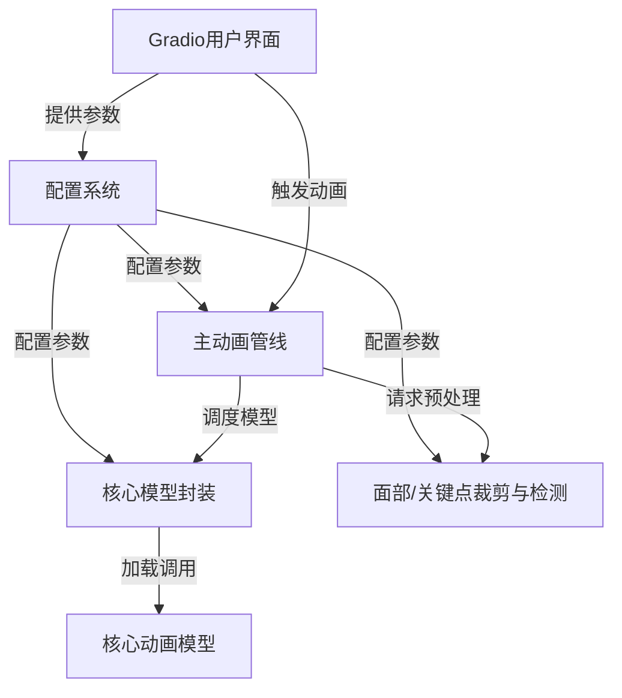
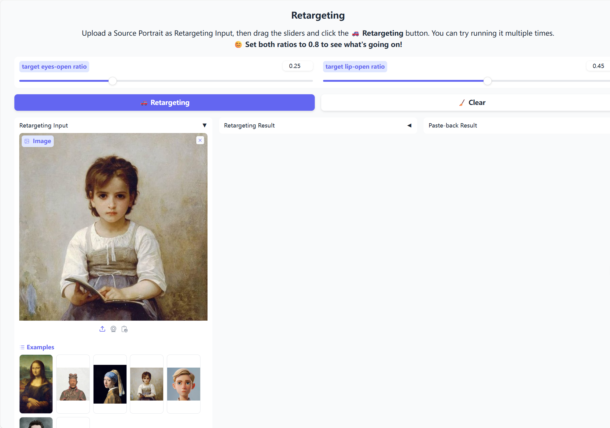
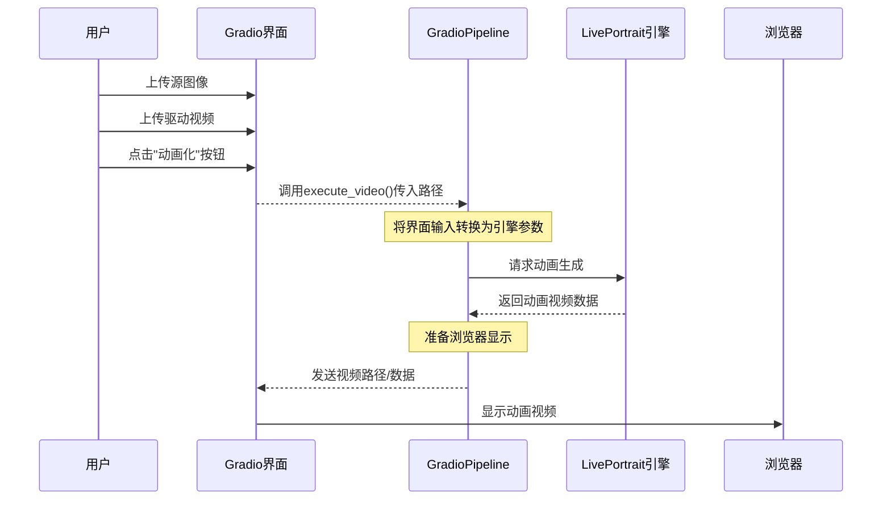

链接：[Efficient Portrait Animation with Stitching and Retargeting Control](https://liveportrait.github.io/)

[arxiv.org/pdf/2407.03168](https://arxiv.org/pdf/2407.03168)

[huggingface.co](https://huggingface.co/spaces/KlingTeam/LivePortrait)

# docs：LivePortrait

LivePortrait是一个专为**高效人像动画**设计的项目


通过==静态==源图像/视频和驱动视频==生成==新的==动画==输出。

用户可以通过直观的*Gradio网页界面*控制动画的多种参数，包括面部表情、头部运动、眼睛/嘴唇开合度，甚至还能为*动物肖像*制作动画。

## 可视化



## 章节

1. [Gradio用户界面](01_gradio_user_interface_.md)
2. [主动画管线](02_main_animation_pipeline_.md)
3. [配置系统](03_configuration_system_.md)
4. [面部/关键点裁剪与检测](04_face_keypoint_cropping___detection_.md)
5. [核心模型封装](05_core_model_wrapper_.md)
6. [核心动画模型](06_core_animation_models_.md)

---
# 第1章：Gradio用户界面

欢迎来到LivePortrait~

在第一章中，我们将从项目最直观的部分开始：**Gradio用户界面**。

可以把它想象成LivePortrait的"控制面板"或"遥控器"。通过它，用户无需编写任何代码就能轻松指挥强大的LivePortrait引擎



## 一键操作：Gradio的功能

想象你有一个神奇工具，能让静态照片中的人物开口说话、变换表情，甚至能让可爱的动物肖像动起来

这就是LivePortrait的功能。但如何告诉工具要动画化哪张照片、使用哪个视频驱动动作，或者控制嘴唇开合程度呢？这就是Gradio用户界面的用武之地。

Gradio直接在浏览器中提供一个友好的网页界面，取代了复杂的编程命令。在这个页面上，你会看到：
* **上传按钮**：选择源图像或视频
* **滑动条**：调整参数（如微笑幅度）
* **"动画化"按钮**：启动魔法
* **视频播放器**：即时查看动画结果

举个具体例子：如果你想用某人的说话视频来动画化自己的肖像照片，只需通过Gradio界面：
1. 在"源图像"区域上传静态照片
2. 在"驱动视频"区域上传说话视频
3. 点击"动画化"按钮
4. 在输出视频播放器中观看照片"活"起来！

脚本`app.py`（人像动画）和`app_animals.py`（动物动画）就是启动这些易用网页界面的程序。

## 控制面板：核心概念

Gradio用户界面的核心涉及几个关键概念：

### 1. Gradio：简易网页界面构建

Gradio是一个Python库，能极其简单地创建机器学习模型的交互式网页界面。你只需定义模型需要的输入（如图像文件、数字或文本）和产生的输出（如图像、视频或文本），Gradio就会自动生成包含所有必要按钮、滑动条和显示区域的网页。

### 2. UI组件：输入与输出

在Gradio网页上，你会与各种组件交互：
* **输入**：向LivePortrait提供信息的方式。例如`gr.Image`（上传照片）、`gr.Video`（上传视频）、`gr.Slider`（数值调节如"嘴唇开合度"）、`gr.Checkbox`（开关选项）和`gr.Button`（触发动作）
* **输出**：LivePortrait展示结果的方式。通常是`gr.Video`组件显示动画输出，或`gr.Image`显示单帧结果

### 3. `GradioPipeline`（或`GradioPipelineAnimal`）：解释器

这是关键桥梁！`GradioPipeline`类（位于`src/gradio_pipeline.py`）充当解释器或适配器，其职责是：
* **监听**：关注你在Gradio网页上的所有操作（如上传视频或移动滑动条）
* **转换**：将这些用户友好的输入（如文件路径或滑动条值）转换为LivePortrait动画引擎能理解的精确参数和数据格式
* **协调**：调用底层动画引擎（我们将在[第2章：主动画管线](02_main_animation_pipeline_.md)详细探讨）执行实际工作
* **展示**：动画引擎完成后，`GradioPipeline`将原始结果传回Gradio界面，在浏览器中美观地显示

本质上，`GradioPipeline`隐藏了运行LivePortrait的所有复杂技术细节，提供流畅直观的体验。

## 使用Gradio界面：快速指南

要使用LivePortrait的Gradio界面，通常从命令行运行Python脚本：

```bash
python app.py
# 或用于动物动画：
# python app_animals.py
```

运行后会获得本地URL（如`http://127.0.0.1:7860`），在浏览器中打开即可看到控制面板！

以下是`app.py`脚本设置主动画界面的简化示例：

```python
# --- 简化的app.py代码片段 ---
import gradio as gr
from src.gradio_pipeline import GradioPipeline
# ...（其他导入和设置）...

# 初始化Gradio界面解释器
gradio_pipeline = GradioPipeline(inference_cfg=inference_cfg, crop_cfg=crop_cfg, args=args)

# 点击'动画化'时调用的函数
def gpu_wrapped_execute_video(*args, **kwargs):
    return gradio_pipeline.execute_video(*args, **kwargs)

with gr.Blocks(theme=gr.themes.Soft()) as demo:
    gr.HTML("<h1>LivePortrait</h1>") # 主标题

    with gr.Row(): # 并排排列组件
        with gr.Column(): # 源输入列
            source_image_input = gr.Image(type="filepath", label="源图像")
        with gr.Column(): # 驱动输入列
            driving_video_input = gr.Video(label="驱动视频")

    process_button_animation = gr.Button("🚀 动画化", variant="primary")
    output_video_concat_i2v = gr.Video(autoplay=False, label="动画视频")

    # 核心连接：点击按钮时调用函数
    process_button_animation.click(
        fn=gpu_wrapped_execute_video, # 要运行的函数
        inputs=[source_image_input, driving_video_input], # 传递的输入
        outputs=[output_video_concat_i2v], # 结果显示位置
        show_progress=True
    )

demo.launch(server_port=args.server_port) # 启动网页界面！
```

## 幕后机制：`GradioPipeline`运作流程



## 人像与动物动画对比

| 特性     | `app.py`（人像）                  | `app_animals.py`（动物）         |
| :------- | :-------------------------------- | :------------------------------- |
| 目标     | 人脸                              | 动物脸                           |
| 管线类   | `GradioPipeline`                  | `GradioPipelineAnimal`           |
| 驱动输入 | 视频、图像或Pickle文件            | **主要Pickle文件**，也支持视频   |
| 特殊功能 | 图像/视频重定向，丰富面部调节滑块 | 更简单选项，通常不建议"贴回"操作 |
| 核心引擎 | `LivePortraitPipeline`            | `LivePortraitPipelineAnimal`     |

## 结语

本章探讨了作为LivePortrait友好控制面板的Gradio用户界面。我们了解了Gradio如何通过网页浏览器简化复杂机器学习模型的交互，以及`GradioPipeline`如何作为关键解释器，将你的界面操作转换为核心动画引擎的指令。

现在你已明白，当你点击"动画化"时，`GradioPipeline`会协调一系列步骤来准备输入、启动LivePortrait引擎并展示惊艳结果。

接下来，我们将深入LivePortrait项目的核心：[主动画管线](02_main_animation_pipeline_.md)，探索`GradioPipeline`将请求传递给引擎后发生的一切。

