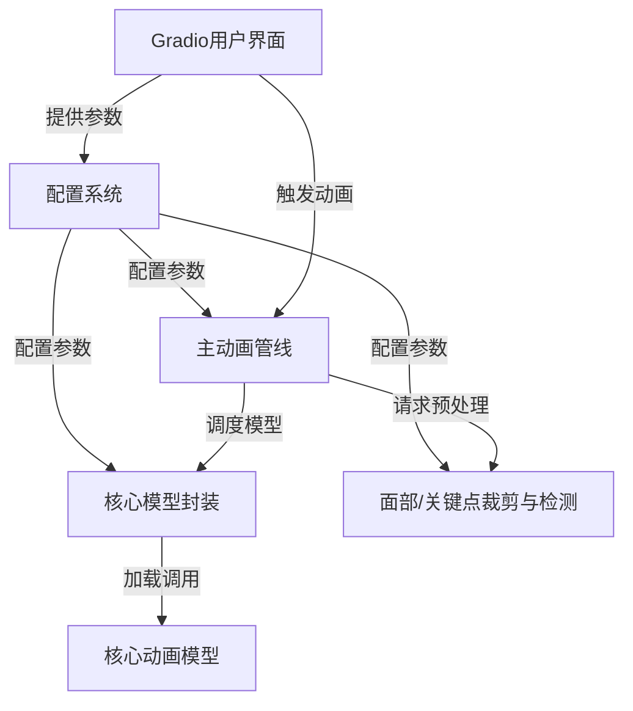

链接：[Efficient Portrait Animation with Stitching and Retargeting Control](https://liveportrait.github.io/)

# docs：LivePortrait

LivePortrait是一个专为**高效人像动画**设计的项目。它通过静态源图像/视频和驱动视频生成新的动画输出。用户可以通过直观的*Gradio网页界面*控制动画的多种参数，包括面部表情、头部运动、眼睛/嘴唇开合度，甚至还能为*动物肖像*制作动画。

## 可视化

## 章节

1. [Gradio用户界面](01_gradio_user_interface_.md)
2. [主动画管线](02_main_animation_pipeline_.md)
3. [配置系统](03_configuration_system_.md)
4. [面部/关键点裁剪与检测](04_face_keypoint_cropping___detection_.md)
5. [核心模型封装](05_core_model_wrapper_.md)
6. [核心动画模型](06_core_animation_models_.md)

---
