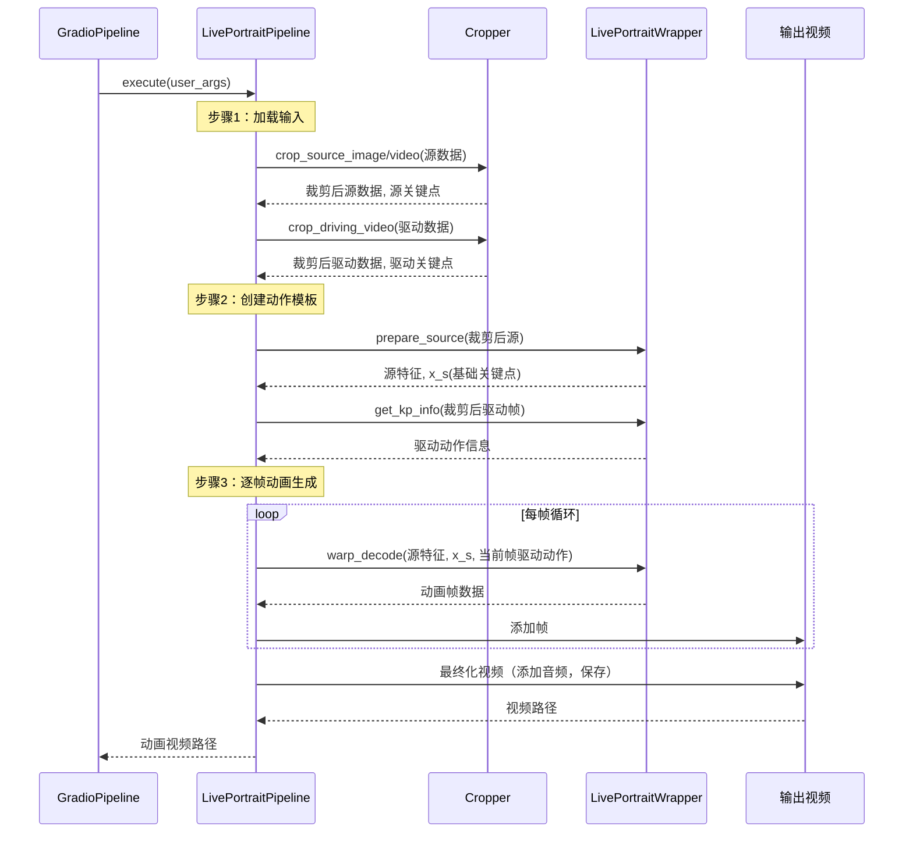

# 第2章：主动画管线

欢迎回来

在[第1章：Gradio用户界面](01_gradio_user_interface_.md)中，我们探索了无需编码即可操作LivePortrait的友好"控制面板"，了解了`GradioPipeline`如何作为解释器将点击和上传操作转换为指令。

现在，让我们揭开控制面板的面纱，探索实现魔法的核心"引擎"——**==主动画管线==**。这是将源图像与驱动动作逐步转化为生动动画的核心协调器

## 引擎室：主动画管线的功能

想象你在烘焙复杂蛋糕。

Gradio界面就像食谱书，让你选择食材和设置。而**主动画管线**就是实际的烘焙过程——按照精确步骤混合食材、烘焙和装饰。

主动画管线的核心职责包括：
1. **加载输入**：导入源图像/视频和驱动视频/模板
2. **数据准备**：智能裁剪人脸（或动物！）并检测关键面部特征点（称为"关键点"）
3. **提取动作**：解析驱动视频中主体的头部、眼睛和嘴唇运动
4. **动画生成**：使用强大AI模型将动作从驱动主体迁移到静态源图像
5. **输出生成**：将所有动画帧组合成最终视频或图像

LivePortrait有两条主要管线，==分别针对不同主体优化==：
* `LivePortraitPipeline`（==人像==）
* `LivePortraitPipelineAnimal`（==动物==）

两者遵循相似"配方"，但使用==针对特定任务优化的不同内部工具==。

## 首次动画制作：使用管线

若通过Gradio界面使用LivePortrait，无需直接调用`LivePortraitPipeline`——如第1章所述，`GradioPipeline`已代为处理！

但若想脱离网页界面运行（例如在脚本中），需使用"入口"脚本：人像用`inference.py`，动物用`inference_animals.py`。这些脚本直接初始化和运行相应管线。

以下是`inference.py`的简化示例，展示`LivePortraitPipeline`的调用方式：

```python
# --- 简化的inference.py代码片段 ---
import tyro
from src.config.argument_config import ArgumentConfig
from src.config.inference_config import InferenceConfig
from src.config.crop_config import CropConfig
from src.live_portrait_pipeline import LivePortraitPipeline # 人像主管线！

def main():
    # 1. 收集所有设置（如源图像路径、驱动视频路径）
    args = tyro.cli(ArgumentConfig)

    # 2. 准备特定配置对象
    inference_cfg = InferenceConfig() # 简化版，实际代码使用partial_fields
    crop_cfg = CropConfig()

    # 3. 创建动画引擎实例！
    live_portrait_pipeline = LivePortraitPipeline(
        inference_cfg=inference_cfg,
        crop_cfg=crop_cfg
    )

    # 4. 启动动画生成！
    live_portrait_pipeline.execute(args)

if __name__ == "__main__":
    main()
```
**说明**：
1. 脚本首先将所有设置（源图像、驱动视频、质量等）收集到`args`对象
2. 准备`InferenceConfig`和`CropConfig`对象，这些是管线不同部分的详细指令表（将在[第3章：配置系统](03_configuration_system_.md)详述）
3. 创建`LivePortraitPipeline`对象，用初始指令组装动画引擎
4. 调用`live_portrait_pipeline.execute(args)`——这是启动整个动画过程的**核心命令**，如同按下复杂机器的"启动"按钮

`inference_animals.py`脚本几乎相同，但初始化的是`LivePortraitPipelineAnimal`。

## 内部机制：逐步动画配方

当调用`live_portrait_pipeline.execute(args)`时，将执行详细的操作序列，如同遵循食谱：



**解析**：

1. **请求接收**：`GradioPipeline`（或`inference.py`）调用`LivePortraitPipeline`的`execute()`方法，传入所有用户设置
2. **输入加载**：管线首先从指定路径加载源图像/视频和驱动视频
3. **裁剪与关键点检测**：将原始图像/视频数据交给`Cropper`（将在[第4章：面部/关键点裁剪与检测](04_face_keypoint_cropping___detection_.md)详述）。`Cropper`智能识别人脸/动物，裁剪为标准尺寸，并检测定义面部结构和姿态的"关键点"（如眼睛、鼻子、嘴角）
4. **提取动作模板**：利用驱动视频的关键点，管线在`LivePortraitWrapper`（[第5章：核心模型封装](05_core_model_wrapper_.md)详述）协助下创建"动作模板"。该模板如同详细脚本，描述驱动视频中的所有动作（头部旋转、表情、眨眼、嘴唇动作），可保存为`.pkl`文件供后续快速复用
5. **准备源特征**：源图像也由`LivePortraitWrapper`处理，提取其独特"特征"和初始关键点信息。这些特征是源图像保持自身特性的关键，即使动画化后亦然
6. **动画循环**：核心魔法所在！管线循环生成每帧动画：
    * 从驱动动作模板获取当前时刻的"动作脚本"
    * 智能结合驱动动作与静态源特征及关键点
    * 将组合信息发送给`LivePortraitWrapper`生成新动画帧，涉及复杂AI模型对源图像进行形变以匹配驱动动作
7. **输出最终化**：生成所有帧后，管线将其拼接成视频，可选添加驱动或源视频的音频，保存最终动画结果（及显示源+驱动+输出的对比视频）

### 🎢探索：`LivePortraitPipeline`代码

yjh

查看`src/live_portrait_pipeline.py`的关键部分，了解如何实现这一配方。

首先，`__init__`方法设置管线将使用的主要工具：

```python
# --- 简化的src/live_portrait_pipeline.py片段（init方法）---
from .config.inference_config import InferenceConfig
from .config.crop_config import CropConfig
from .utils.cropper import Cropper
from .live_portrait_wrapper import LivePortraitWrapper

class LivePortraitPipeline(object):
    def __init__(self, inference_cfg: InferenceConfig, crop_cfg: CropConfig):
        # 初始化核心AI模型处理器
        self.live_portrait_wrapper: LivePortraitWrapper = LivePortraitWrapper(inference_cfg=inference_cfg)
        # 初始化面部/动物裁剪和关键点检测工具
        self.cropper: Cropper = Cropper(crop_cfg=crop_cfg)
```
**说明**：
`LivePortraitPipeline`充当管理者，将具体任务委托给专用工具：
* `self.live_portrait_wrapper`：实际生成动画的深度学习模型接口
* `self.cropper`：处理图像/视频中面部/动物的识别和准备

接下来，简化`execute`方法以突出其主要阶段：

```python
# --- 简化的src/live_portrait_pipeline.py片段（execute方法）---
class LivePortraitPipeline(object):
    def execute(self, args: ArgumentConfig):
        # 1. 加载源输入（图像或视频）
        if is_image(args.source):
            source_rgb_lst = [load_image_rgb(args.source)]
        elif is_video(args.source):
            source_rgb_lst = load_video(args.source)
        # ... 驱动输入类似加载 ...

        # 2. 处理驱动数据并创建动作模板
        if is_template(args.driving):
            driving_template_dct = load(args.driving) # 加载预制模板
        else: # 若驱动为视频则处理
            # 使用cropper将驱动视频裁剪为256x256
            ret_d = self.cropper.crop_driving_video(driving_rgb_lst)
            driving_rgb_crop_256x256_lst = [cv2.resize(_, (256, 256)) for _ in ret_d['frame_crop_lst']]
            # 准备帧并计算眼/唇比例
            I_d_lst = self.live_portrait_wrapper.prepare_videos(driving_rgb_crop_256x256_lst)
            # 从准备帧创建动作模板
            driving_template_dct = self.make_motion_template(I_d_lst, c_d_eyes_lst, c_d_lip_lst, output_fps=output_fps)
            dump(wfp_template, driving_template_dct) # 保存供后续复用

        # 3. 处理源数据（裁剪、提取特征）
        if inf_cfg.flag_do_crop:
            crop_info = self.cropper.crop_source_image(source_rgb_lst[0], self.cropper.crop_cfg)
            img_crop_256x256 = crop_info['img_crop_256x256']
        else:
            img_crop_256x256 = cv2.resize(source_rgb_lst[0], (256, 256))

        I_s = self.live_portrait_wrapper.prepare_source(img_crop_256x256)
        x_s_info = self.live_portrait_wrapper.get_kp_info(I_s)
        f_s = self.live_portrait_wrapper.extract_feature_3d(I_s)
        x_s = self.live_portrait_wrapper.transform_keypoint(x_s_info)

        # 4. 主动画循环：逐帧生成
        I_p_lst = [] # 存储生成帧的列表
        for i in track(range(n_frames), description='🚀动画生成中...', total=n_frames):
            # 从模板获取当前帧动作信息
            x_d_i_info = driving_template_dct['motion'][i]
            x_d_i_info = dct2device(x_d_i_info, device)

            # ... 结合源特征和驱动动作的复杂计算 ...
            # ... 以及应用重定向/拼接逻辑（若启用）...

            # 核心动画步骤：使用wrapper变形和解码图像
            out = self.live_portrait_wrapper.warp_decode(f_s, x_s, x_d_i_new)
            I_p_i = self.live_portrait_wrapper.parse_output(out['out'])[0]
            I_p_lst.append(I_p_i) # 添加生成帧到列表

        # 5. 保存并最终化输出（带或不带音频的视频、图像）
        mkdir(args.output_dir)
        frames_concatenated = concat_frames(driving_rgb_crop_256x256_lst, [img_crop_256x256], I_p_lst)
        images2video(frames_concatenated, wfp=wfp_concat, fps=output_fps)
        # ... 添加音频，保存独立输出视频 ...
        return wfp, wfp_concat
```
**说明**：
实际代码中的`execute`方法较长，但简化版突出了主要阶段：
1. **输入加载**：检查源是图像还是视频并加载，驱动输入同理
2. **驱动数据处理与动作模板**：若驱动输入为视频，使用`self.cropper`准备驱动帧，调用`self.make_motion_template`提取所有必要动作信息（头部姿态、表情等）并存入`driving_template_dct`，可保存（`dump`）供快速复用
3. **源数据处理**：裁剪源图像/视频（若`flag_do_crop`为`True`），使用`self.live_portrait_wrapper`进行`prepare_source`和`extract_feature_3d`，这对动画过程至关重要
4. **动画循环（`for i in track(range(n_frames))`）**：逐帧生成：
    * 从`driving_template_dct`获取当前时刻的特定动作
    * 执行复杂计算以混合源特征与驱动动作，可能调整眼/唇重定向或拼接（后续章节讨论）
    * 调用`self.live_portrait_wrapper.warp_decode`——实际*生成*新动画图像的核心AI模型调用
    * 将新生成帧（`I_p_i`）加入列表
5. **输出保存**：生成所有帧后，管线将动画帧列表与源和驱动输入拼接对比，保存为视频文件（`images2video`），并处理音频添加（若可用）

### 人像与动物动画管线对比

尽管人像和动物管线执行相似的协调任务，但由于面部特征差异，它们使用略有不同的底层工具。

| 特性            | `LivePortraitPipeline`（人像） | `LivePortraitPipelineAnimal`（动物） |
| :-------------- | :----------------------------- | :----------------------------------- |
| **目标主体**    | 人脸                           | 动物脸（如猫、狗）                   |
| **核心封装器**  | `LivePortraitWrapper`          | `LivePortraitWrapperAnimal`          |
| **裁剪器设置**  | `Cropper()`（默认人脸）        | `Cropper(image_type='animal_face')`  |
| **眼/唇重定向** | 针对人眼/唇控制的特定逻辑      | 通常更简单，眼/唇控制较少            |
| **驱动输入**    | 视频、图像或Pickle模板         | 主要是Pickle模板，也支持视频         |

## 结语

现在已揭开LivePortrait"==引擎==室"的奥秘

`LivePortraitPipeline`（及`LivePortraitPipelineAnimal`）是遵循精确多步配方的主协调器，将静态图像赋予生命。从==输入==加载到数据==准备==、动作==提取==，最终利用强大AI模型==生成==动画帧，这条==管线承担了所有繁重工作==。

我们了解到它将任务委托给`Cropper`和`LivePortraitWrapper`等专用工具，使整个过程高效且模块化。

接下来，我们将深入指导整个过程的指令：[第3章：配置系统](03_configuration_system_.md)。

