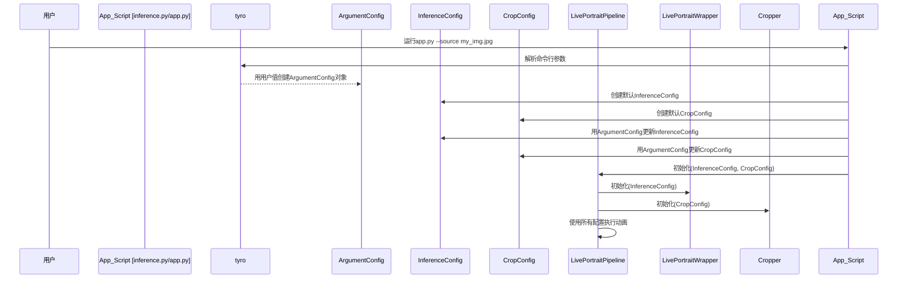

# 第3章：配置系统

欢迎回来

- 在[第1章：Gradio用户界面](01_gradio_user_interface_.md)中，我们学习了如何通过友好网页界面操作LivePortrait。

- 随后在[第2章：主动画管线](02_main_animation_pipeline_.md)中，我们深入=="引擎室"探索了动画过程的协调机制==。

但LivePortrait如何*精确*知道每个步骤的配置？

例如如何选择AI模型、设定面部检测精度，或是否启用快速但精度略低的"半精度"模式？这就是**配置系统**的舞台

## 项目设置面板：功能解析

将LivePortrait想象为精密相机。相机可调整模式（照片/视频）、光圈、快门速度、对焦等参数。LivePortrait的**配置系统**正是这样的设置面板，它定义了*整个项目的运行方式*，是所有操作参数的中枢大脑。

**具体场景**：你想用说话视频(`driving.mp4`)动画化静态肖像(`source.jpg`)，同时希望利用GPU加速运行、指定输出目录，并确保面部裁剪非常精确。无需修改核心代码，通过配置系统即可实现这些偏好。

配置系统涵盖以下设置：
* **命令行参数(`ArgumentConfig`)**：启动时指定的输入/输出文件等
* **AI模型推理参数(`InferenceConfig`)**：模型运行细节，如精度或特定动画功能
* **面部/动物裁剪(`CropConfig`)**：识别和准备面部/动物的方式

这些配置在启动时加载，从输入输出路径到模型精度、面部检测与动画行为，确保系统按指定参数运行。

## 设置解析：核心概念

让我们拆解LivePortrait如何管理这些设置。

### 1. 作为数据蓝图的配置(`dataclass`)

LivePortrait核心使用Python的`dataclass`定义配置。`dataclass`可视为相关设置的"蓝图"，每个设置包含名称（如`source`或`flag_use_half_precision`）和默认值。

```python
# 简化示例：src/config/argument_config.py
from dataclasses import dataclass
import tyro
from typing_extensions import Annotated

@dataclass(repr=False)
class ArgumentConfig:
    source: Annotated[str, tyro.conf.arg(aliases=["-s"])] = '../../assets/examples/source/s0.jpg'
    driving:  Annotated[str, tyro.conf.arg(aliases=["-d"])] = '../../assets/examples/driving/d0.mp4'
    output_dir: Annotated[str, tyro.conf.arg(aliases=["-o"])] = 'animations/'
    flag_use_half_precision: bool = True
    device_id: int = 0
    # ... 更多设置 ...
```
**说明**：
* `@dataclass`：该装饰器自动为类添加实用功能，便于创建和管理设置
* `source: Annotated[str, ...] = '...'`：定义名为`source`的设置，接受字符串(`str`)，默认值为`'../../assets/examples/source/s0.jpg'`，`tyro.conf.arg(aliases=["-s"])`表示可通过命令行`-s`或`--source`修改
* `flag_use_half_precision: bool = True`：简单布尔值设置，默认为`True`

这种方式保持所有相关设置有序，并提供清晰默认值。

### 2. 配置系统的三大支柱

LivePortrait将设置组织为三种主要类型，每种由独立`dataclass`表示：

#### a. `ArgumentConfig`（命令行设置）
最贴近用户的配置，包含从命令行或Gradio界面启动时可轻松修改的设置。
* **包含内容**：源图像/视频路径、驱动视频/模板、输出目录、GPU设备ID、基础动画标志（如`flag_use_half_precision`、`flag_stitching`、`flag_pasteback`）及Gradio服务器详情
* **定义位置**：`src/config/argument_config.py`

```python
# src/config/argument_config.py片段（简化）
@dataclass(repr=False)
class ArgumentConfig:
    source: str = 'path/to/source.jpg' # 源图像/视频
    driving: str = 'path/to/driving.mp4' # 驱动视频/模板
    output_dir: str = 'animations/' # 结果保存位置

    flag_use_half_precision: bool = True # 启用更快(FP16)计算
    flag_stitching: bool = True # 平滑融合裁剪面部
    server_port: int = 8890 # Gradio网页端口
    # ...
```

#### b. `InferenceConfig`（AI模型设置）
包含直接影响AI模型动画任务表现的技术参数。
* **包含内容**：AI模型检查点路径（如`checkpoint_F`、`checkpoint_G`）、高级重定向标志（如`flag_eye_retargeting`、`flag_lip_retargeting`）、输出视频格式和动画速度(FPS)，以及特定动物模型路径
* **定义位置**：`src/config/inference_config.py`

```python
# src/config/inference_config.py片段（简化）
@dataclass(repr=False)
class InferenceConfig:
    # AI模型路径（通常用户无需修改）
    checkpoint_F: str = 'path/to/feature_extractor.pth'
    checkpoint_G: str = 'path/to/generator.pth'
    # ... 更多模型路径 ...

    flag_eye_retargeting: bool = False # 高级眼部动作控制
    output_fps: int = 25 # 输出视频帧率
    # ...
```
注意`InferenceConfig`也包含`ArgumentConfig`中的某些标志（如`flag_use_half_precision`），因为`InferenceConfig`通常用*默认*模型设置初始化，随后可能被`ArgumentConfig`或Gradio界面的用户选择*覆盖*。

#### c. `CropConfig`（面部/动物裁剪设置）
专用于控制从图像/视频中检测和裁剪面部/动物的设置。
* **包含内容**：检测阈值(`det_thresh`)、裁剪缩放系数(`scale`)、偏移量(`vx_ratio`、`vy_ratio`)，以及动物面部的特定设置(`animal_face_type`)
* **定义位置**：`src/config/crop_config.py`

```python
# src/config/crop_config.py片段（简化）
@dataclass(repr=False)
class CropConfig:
    landmark_ckpt_path: str = 'path/to/landmark.onnx' # 特征点检测器路径
    det_thresh: float = 0.1 # 面部检测敏感度
    scale: float = 2.3 # 裁剪缩放系数
    vy_ratio: float = -0.125 # 裁剪垂直位置调整
    animal_face_type: str = "animal_face_9" # 动物特征点类型
    # ...
```

### 3. 辅助工具(`PrintableConfig`, `make_abs_path`)

你可能注意到代码中的`PrintableConfig`和`make_abs_path`：
* `PrintableConfig`（来自`src/config/base_config.py`）：以整洁可读格式打印配置对象的所有设置
* `make_abs_path(fn)`（来自`src/config/base_config.py`）：将相对路径（如`../../assets/examples/source/s0.jpg`）转换为绝对路径，确保脚本在任何位置运行时都能找到文件

## 配置系统使用指南（解决用例）

与LivePortrait配置交互的主要方式是通过命令行或Gradio界面。

回顾[第2章：主动画管线](02_main_animation_pipeline_.md)中的`inference.py`脚本。这是脱离Gradio界面运行LivePortrait的入口点，也是配置首次加载的位置。

```python
# 简化的inference.py片段
import tyro
from src.config.argument_config import ArgumentConfig # 面向用户的主配置
from src.config.inference_config import InferenceConfig
from src.config.crop_config import CropConfig
from src.live_portrait_pipeline import LivePortraitPipeline

def main():
    # 1. 从命令行加载设置（或使用默认值）
    args: ArgumentConfig = tyro.cli(ArgumentConfig) # `tyro`自动读取参数

    # 2. 初始化其他配置（通常为默认值）
    inference_cfg = InferenceConfig()
    crop_cfg = CropConfig()

    # 3. 根据用户参数更新内部配置
    # ArgumentConfig中的许多标志可覆盖InferenceConfig/CropConfig的默认值
    inference_cfg.flag_use_half_precision = args.flag_use_half_precision
    crop_cfg.det_thresh = args.det_thresh
    crop_cfg.scale = args.scale
    # ... 更多从args到inference_cfg和crop_cfg的更新 ...

    # 4. 用准备好的配置创建动画管线
    live_portrait_pipeline = LivePortraitPipeline(
        inference_cfg=inference_cfg,
        crop_cfg=crop_cfg
    )

    # 5. 使用最终'args'执行动画（包含路径）
    live_portrait_pipeline.execute(args)

if __name__ == "__main__":
    main()
```
**说明**：
1. `args: ArgumentConfig = tyro.cli(ArgumentConfig)`：这是关键行！`tyro`库自动从命令行读取值并填充`ArgumentConfig`对象。若未提供某设置的值，则使用`ArgumentConfig`中的默认值
2. `inference_cfg = InferenceConfig()`和`crop_cfg = CropConfig()`：创建`InferenceConfig`和`CropConfig`对象，初始为默认值
3. **配置更新**：如`inference_cfg.flag_use_half_precision = args.flag_use_half_precision`的行非常重要，表明命令行提供的用户设置(`args`)优先于`inference_cfg`和`crop_cfg`的默认值，使系统灵活
4. 最后创建`LivePortraitPipeline`，接收完全配置的`inference_cfg`和`crop_cfg`对象，确保整个动画过程遵循所需设置

### 示例：通过命令行修改设置

假设你需要：
* 使用`my_source.jpg`作为源图像
* 使用`my_driving.mp4`提供动作
* 关闭半精度（`flag_use_half_precision`设为`False`）
* 设置服务器端口为`8000`

可如下运行`app.py`（或`inference.py`）：

```bash
python app.py -s my_source.jpg -d my_driving.mp4 --flag_use_half_precision False -p 8000
```
* `-s`设置`source`路径
* `-d`设置`driving`路径
* `--flag_use_half_precision False`覆盖默认`True`
* `-p`设置`server_port`

这展示了配置系统如何让你无需修改核心代码文件即可调整LivePortrait行为。

## 内部机制：配置流程

启动LivePortrait时，配置对象被创建并传递给系统中需要它们的各个部分。

### 逐步解析：

1. **启动**：运行`python app.py`或`python inference.py`启动LivePortrait
2. **初始加载(`ArgumentConfig`)**：主脚本用`tyro`读取所有命令行参数（未提供则用默认值），创建包含用户选择的`ArgumentConfig`对象
3. **默认技术设置(`InferenceConfig`, `CropConfig`)**：创建`InferenceConfig`和`CropConfig`对象，预填充技术性默认设置（如模型路径、默认裁剪比例）
4. **用户覆盖**：`ArgumentConfig`的命令行选择用于更新并可能*覆盖*`InferenceConfig`和`CropConfig`的特定默认值，确保应用用户偏好
5. **管线初始化**：将完全配置的`InferenceConfig`和`CropConfig`对象传递给初始化时的`LivePortraitPipeline`（主动画引擎）
6. **组件配置**：`LivePortraitPipeline`将这些配置进一步传递给内部组件，如与AI模型交互的`LivePortraitWrapper`和处理面部检测/裁剪的`Cropper`，每个组件接收其正确操作所需的特定设置
7. **Gradio动态更新**：若使用Gradio界面，当操作滑动条或复选框并点击"动画化"时，`GradioPipeline`（第1章）会动态更新运行系统中的活动配置对象，实现实时调整而无需重启



### 代码深入探索

查看`src/live_portrait_pipeline.py`中`__init__`方法如何接收和使用这些配置对象：

```python
# 简化的src/live_portrait_pipeline.py片段（init方法）
from .config.inference_config import InferenceConfig
from .config.crop_config import CropConfig
from .utils.cropper import Cropper
from .live_portrait_wrapper import LivePortraitWrapper

class LivePortraitPipeline(object):
    def __init__(self, inference_cfg: InferenceConfig, crop_cfg: CropConfig):
        # 存储接收的配置对象
        self.inference_cfg = inference_cfg
        self.crop_cfg = crop_cfg

        # 用特定配置初始化核心AI模型处理器
        self.live_portrait_wrapper: LivePortraitWrapper = LivePortraitWrapper(
            inference_cfg=self.inference_cfg
        )
        # 用特定配置初始化面部/动物裁剪工具
        self.cropper: Cropper = Cropper(
            crop_cfg=self.crop_cfg
        )
```
**说明**：
* `LivePortraitPipeline`的`__init__`方法显式要求`InferenceConfig`和`CropConfig`对象
* 存储这些配置(`self.inference_cfg`, `self.crop_cfg`)以便在整个操作过程中访问
* 关键是将*其*`inference_cfg`传递给`LivePortraitWrapper`，*其*`crop_cfg`传递给`Cropper`，这种配置传递链确保每个组件获得正确指令

### Gradio动态更新

回忆第1章，`GradioPipeline`作为解释器。当在Gradio界面修改滑动条或复选框时，需更新底层配置。

```python
# 简化的src/gradio_pipeline.py片段（execute_video方法）
class GradioPipeline(LivePortraitPipeline):
    def execute_video(
        self,
        input_source_image_path=None,
        input_driving_video_path=None,
        flag_do_crop_input=True,
        # ... 更多Gradio界面输入 ...
    ):
        # 1. 收集当前界面输入到字典
        args_user = {
            'source': input_source_image_path,
            'driving': input_driving_video_path,
            'flag_do_crop': flag_do_crop_input,
            # ... 分配所有界面输入 ...
        }

        # 2. 用用户选择更新主ArgumentConfig对象
        # 'self.args'保存当前会话的ArgumentConfig
        self.args = update_args(self.args, args_user) # 辅助合并参数

        # 3. 通知LivePortraitWrapper和Cropper更新设置
        self.live_portrait_wrapper.update_config(self.args.__dict__)
        self.cropper.update_config(self.args.__dict__)

        # 4. 调用主动画逻辑（来自LivePortraitPipeline）
        output_path, output_path_concat = self.execute(self.args)
        # ... 返回结果 ...
```
**说明**：
1. `execute_video`方法收集Gradio界面的当前值
2. `self.args = update_args(self.args, args_user)`：用界面新值(`args_user`)更新原始`ArgumentConfig`(`self.args`)
3. `self.live_portrait_wrapper.update_config(self.args.__dict__)`和`self.cropper.update_config(self.args.__dict__)`是关键行，告知`LivePortraitWrapper`和`Cropper`："Gradio界面的用户交互已更改某些设置！请用`self.args`的新值更新内部配置"，确保下次动画运行使用界面的最新设置

## 人像与动物配置差异

尽管配置系统高度统一，人像与动物动画的配置仍存在细微差别：

| 特性                   | 人像配置（`ArgumentConfig`, `InferenceConfig`, `CropConfig`默认值） | 动物配置（覆盖值）                                           |
| :--------------------- | :----------------------------------------------------------- | :----------------------------------------------------------- |
| **模型检查点**         | `checkpoint_F`, `checkpoint_G`等指向人像训练模型             | `checkpoint_F_animal`, `checkpoint_G_animal`等指向动物训练模型 |
| **`flag_stitching`**   | 通常`True`（推荐用于人像无缝融合）                           | 常为`False`（动物结构多样，融合可能不自然）                  |
| **`animal_face_type`** | 不适用（默认人像检测）                                       | 在`CropConfig`中设为`"animal_face_9"`或`"animal_face_68"`    |
| **`driving_option`**   | 可选`"expression-friendly"`或`"pose-friendly"`适应不同人像动作 | 通常`"pose-friendly"`更普适于动物                            |
| **眼/唇重定向**        | `flag_eye_retargeting`, `flag_lip_retargeting`提供精细人像表情控制 | 较简单，动物表情通常更简单且控制粒度较粗                     |

这些差异展示了灵活配置系统如何让LivePortrait适应不同主体，同时保持结构一致。

## 结语

现在已掌握LivePortrait灵活性的秘诀：强大的配置系统~

- 了解了`ArgumentConfig`、`InferenceConfig`和`CropConfig`如何作为项目的中央设置面板，让你微调动画过程的每个环节。
- 从命令行设置输入输出路径，到指导AI模型行为和面部裁剪精度，这些配置使LivePortrait按需适配。
- 还看到Gradio如何动态更新设置，以及配置如何通过管线传递确保所有组件协调工作。

接下来，我们将探索这些配置管理的关键任务之一：[第4章：面部/关键点裁剪与检测](04_face_keypoint_cropping___detection_.md)，了解LivePortrait如何==智能定位并准备面部和动物以生成动画==。

