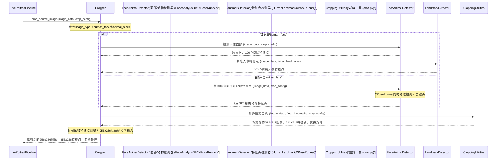

# 第4章：面部/关键点裁剪与检测

欢迎回来

在[第3章：配置系统](03_configuration_system_.md)中，我们学习了LivePortrait如何通过智能配置文件定制其行为，从模型路径到动画速度，甚至如何处理面部。

现在，我们将探讨由这些配置指导的最基础预处理步骤之一：**面部/关键点裁剪与检测**。

## 守门员：裁剪与检测的功能

想象你是一位正在绘制肖像的艺术家。在添加任何笔触之前，你需要先：
1. **找到面部**：画布上人物的面部在哪里？
2. **识别关键特征**：眼睛、鼻子和嘴巴的位置在哪里？这些是定义面部的"关键点"。
3. **完美构图**：裁剪画布，使面部居中、对齐并缩放得当。

这正是"面部/关键点裁剪与检测"模块为LivePortrait所做的事情。它充当动画引擎的"预处理单元"或"守门员"，其职责是精确定位输入图像或视频中的面部（或动物！），识别其关键面部特征点，然后裁剪和对齐图像。这确保核心动画模型（我们将在后续章节介绍）获得干净、聚焦且完美对齐的输入，从而产生最佳且逼真的动画效果。

**为什么这如此重要？**
AI模型通常针对非常特定的输入类型进行训练，例如大小和方向大致相同的面部。如果输入的是面部很小的全身照片或倾斜的面部，模型可能会混淆或产生较差的结果。此模块通过标准化AI的输入来解决这个问题。

**具体示例**：你想为一个人（或一只猫！）的肖像制作动画。你提供了一张高分辨率照片。此模块将：
1. 扫描照片以**检测**面部位置。
2. 精确定位眼睛、鼻子、嘴巴等的位置（**关键点**）。
3. **裁剪**照片中的面部，将其调整为标准尺寸（如256x256像素），并确保其对齐，即使原始照片略有倾斜。
然后，这个完美准备的面部将被传递给动画管线的后续阶段。

## 拆解守门员：核心概念

让我们分解使这一关键预处理成为可能的主要组件。

### 1. `Cropper`：主协调器

此模块的核心是`Cropper`类（位于`src/utils/cropper.py`）。将`Cropper`视为所有面部检测、关键点提取和图像处理任务的主要管理者。它本身并不完成所有工作，而是协调专门的"执行器"来处理特定任务。

它使用`CropConfig`（我们在[第3章：配置系统](03_configuration_system_.md)中讨论过）来确切知道*如何*执行其任务——例如，面部检测的敏感度或裁剪时的"缩放"程度。

### 2. 专业侦探：寻找面部/动物

`Cropper`根据你是在为人像还是动物制作动画，使用不同的"侦探"：

* **人像面部：`FaceAnalysisDIY`（使用InsightFace）**
  * 这个执行器（`src/utils/face_analysis_diy.py`）基于一个强大的库InsightFace。其主要职责是稳健地**检测人像面部**并提供初始的边界框坐标（面部位置）和一些基本特征点。
  * 它针对人像主体设计，快速且准确。

* **动物面部：`XPoseRunner`**
  * 当涉及到我们的毛茸茸朋友时，`FaceAnalysisDIY`并未针对动物进行训练。这时`XPoseRunner`（`src/utils/animal_landmark_runner.py`）就派上用场了。
  * `XPoseRunner`是一个更通用的姿态估计模型，LivePortrait将其用于**检测动物面部**并直接提取其关键点。这使其成为动物动画的多功能工具。

### 3. 精确定位细节：关键点检测（特征点）

一旦检测到面部或动物，下一步就是找到精确的"关键点"或"特征点"。这些是特定的点，如眼角、鼻尖和嘴角。这些点至关重要，因为它们告诉动画模型面部的哪一部分在哪里以及其方向如何。

* **人像面部：`HumanLandmark`**
  * 在`FaceAnalysisDIY`找到人像面部后，`HumanLandmark`执行器（`src/utils/human_landmark_runner.py`）接手。它是一个专门的ONNX模型，将初始特征点细化为更丰富的点集（例如，人像面部的203个点）。这提供了面部结构的详细地图。

* **动物面部：`XPoseRunner`（再次登场！）**
  * 如前所述，`XPoseRunner`是一个多才多艺的侦探。对于动物，它既处理动物面部的初始检测，又提取其特定的关键点（例如，一般动物面部的9个点或更详细的68个点）。

### 4. 完美构图：裁剪与对齐

在定位面部并识别其关键点后，最后一步是利用这些信息裁剪图像。这包括：
* **计算变换**：确定如何旋转、缩放和移动图像，使检测到的面部居中并对齐。
* **应用裁剪**：切出图像的相关部分，并将其调整为标准输入尺寸（通常为LivePortrait模型的256x256像素）。

`src/utils/crop.py`文件包含许多用于这些几何变换的辅助函数，确保面部完美准备。

## 如何使用裁剪与检测（解决用例）

你通常不会直接与`Cropper`类或其内部执行器交互。相反，[主动画管线](02_main_animation_pipeline_.md)会自动使用它。当你通过`inference.py`或`app.py`运行LivePortrait时，管线会创建一个`Cropper`实例并根据需要调用其方法。

让我们看看第2章的`LivePortraitPipeline`如何集成`Cropper`来准备源图像：

```python
# 简化的src/live_portrait_pipeline.py片段（execute方法内）
from .utils.cropper import Cropper # 导入Cropper
# ...（其他导入）...

class LivePortraitPipeline(object):
    def __init__(self, inference_cfg, crop_cfg):
        # ...（初始化LivePortraitWrapper）...
        # 初始化面部/动物裁剪和关键点检测工具
        self.cropper: Cropper = Cropper(crop_cfg=crop_cfg) # Cropper在此创建！

    def execute(self, args):
        # ...（加载source_rgb_lst）...

        # 1. 处理源数据（裁剪、提取特征）
        if self.inference_cfg.flag_do_crop: # 检查是否启用裁剪
            # 调用cropper处理源图像！
            crop_info = self.cropper.crop_source_image(source_rgb_lst[0], self.crop_cfg)
            if crop_info is None:
                raise Exception("源图像中未检测到面部。")
            img_crop_256x256 = crop_info['img_crop_256x256']
            # ...（存储lmk_crop_256x256, M_c2o）...
        else:
            img_crop_256x256 = cv2.resize(source_rgb_lst[0], (256, 256))

        # ...（使用img_crop_256x256继续动画）...
        return output_path, output_path_concat
```
**说明**：
1. 在`LivePortraitPipeline`的`__init__`中，创建了一个`Cropper`对象，接收`crop_cfg`（裁剪设置）作为输入。
2. 随后，在`execute`方法中，如果`flag_do_crop`为`True`（表示需要裁剪面部），则调用`self.cropper.crop_source_image()`。这是`Cropper`处理输入图像的关键步骤。
3. `crop_source_image`返回的`crop_info`字典包含`img_crop_256x256`（完美裁剪和对齐的面部！）和检测到的`lmk_crop_256x256`（关键点）。
4. 这些准备好的输出随后被管线的其余部分用于动画化面部。

你也可以通过[配置系统](03_configuration_system_.md)影响`Cropper`的行为。例如，调整面部检测的敏感度：

```bash
# 修改检测阈值的示例命令
python app.py --det_thresh 0.5
```
这个`--det_thresh 0.5`命令行参数（`ArgumentConfig`的一部分）将更新`crop_cfg.det_thresh`，使`FaceAnalysisDIY`或`XPoseRunner`在判断何为面部时更加保守。

## 内部机制：裁剪配方逐步解析

让我们追踪当调用`crop_source_image`时，图像在`Cropper`中的旅程。



**逐步解析**：
1. **管线请求**：`LivePortraitPipeline`调用`cropper.crop_source_image()`，传递原始图像数据和`crop_config`设置。
2. **主体识别**：`Cropper`首先检查其`image_type`（来自配置）以确定处理的是人像还是动物。
3. **面部/动物检测与初始特征点**：
   * 如果是`human_face`：`Cropper`委托`FaceAnalysisDIY`查找人像面部并获取106个初始特征点。
   * 如果是`animal_face`：`Cropper`使用`XPoseRunner`检测动物面部并直接提取其特定动物关键点（例如9或68个点）。
4. **特征点精炼（人像）**：对于人像面部，`Cropper`将原始图像和106个初始特征点发送给`HumanLandmark`。此执行器使用专门模型输出更详细且一致的203个面部特征点。（对于动物，`XPoseRunner`已提供最终特征点，跳过此步骤。）
5. **裁剪计算**：有了精确的特征点后，`Cropper`调用`CroppingUtilities`（`src/utils/crop.py`）中的辅助函数。这些函数利用特征点和`crop_config`（例如`scale`、`vx_ratio`、`vy_ratio`用于缩放和位置调整）计算图像所需的旋转、缩放和平移。
6. **图像变换**：`CroppingUtilities`应用这些变换，生成裁剪后的图像（初始为512x512像素）并将特征点转换为新的裁剪坐标。
7. **标准化与返回**：`Cropper`将裁剪后的图像和特征点调整为标准的256x256分辨率（动画模型期望的输入大小），最后将这些准备好的输出返回给`LivePortraitPipeline`。

### 深入探索：`Cropper`代码

让我们看看`src/utils/cropper.py`文件中的关键部分，了解其实现方式。

首先，`Cropper`如何初始化其专门的"侦探"：

```python
# 简化的src/utils/cropper.py片段（init方法）
from ..config.crop_config import CropConfig
from .face_analysis_diy import FaceAnalysisDIY
from .human_landmark_runner import LandmarkRunner as HumanLandmark
# ...（其他导入）...

class Cropper(object):
    def __init__(self, **kwargs) -> None:
        self.crop_cfg: CropConfig = kwargs.get("crop_cfg", None)
        self.image_type = kwargs.get("image_type", 'human_face')
        # ...（设备设置）...

        # 初始化人像面部检测器
        self.face_analysis_wrapper = FaceAnalysisDIY(
            name="buffalo_l", root=self.crop_cfg.insightface_root,
            providers=face_analysis_wrapper_provider,
        )
        self.face_analysis_wrapper.prepare(
            ctx_id=device_id, det_size=(512, 512), det_thresh=self.crop_cfg.det_thresh
        )
        self.face_analysis_wrapper.warmup()

        # 初始化人像特征点精炼器
        self.human_landmark_runner = HumanLandmark(
            ckpt_path=self.crop_cfg.landmark_ckpt_path,
            onnx_provider=device,
            device_id=device_id,
        )
        self.human_landmark_runner.warmup()

        if self.image_type == "animal_face":
            from .animal_landmark_runner import XPoseRunner as AnimalLandmarkRunner
            # 初始化动物面部/特征点检测器
            self.animal_landmark_runner = AnimalLandmarkRunner(
                model_config_path=self.crop_cfg.xpose_config_file_path,
                model_checkpoint_path=self.crop_cfg.xpose_ckpt_path,
                embeddings_cache_path=self.crop_cfg.xpose_embedding_cache_path,
                flag_use_half_precision=kwargs.get("flag_use_half_precision", True),
            )
            self.animal_landmark_runner.warmup()
```
**说明**：
1. `Cropper`存储`CropConfig`和`image_type`（人像或动物）。
2. 然后初始化`FaceAnalysisDIY`（用于人像面部检测）和`HumanLandmark`（用于人像关键点精炼）。
3. **条件性**地，如果`image_type`为`"animal_face"`，还会初始化`XPoseRunner`（我们的多合一动物检测器和关键点提取器）。
4. 为每个执行器调用`warmup()`以预加载模型并运行虚拟输入，确保它们准备好处理实际输入并减少首次运行的延迟。

接下来，`crop_source_image`方法的简化版本：

```python
# 简化的src/utils/cropper.py片段（crop_source_image方法）
from .crop import crop_image # 导入主裁剪函数

class Cropper(object):
    def crop_source_image(self, img_rgb_: np.ndarray, crop_cfg: CropConfig):
        img_rgb = img_rgb_.copy()
        lmk = None # 特征点占位符

        if self.image_type == "human_face":
            # 1. 用FaceAnalysisDIY检测人像面部
            src_face = self.face_analysis_wrapper.get(cv2.cvtColor(img_rgb, cv2.COLOR_RGB2BGR), ...)
            if len(src_face) == 0:
                return None # 未找到面部
            src_face = src_face[0] # 选择第一个面部
            # 2. 用HumanLandmark精炼特征点
            lmk = self.human_landmark_runner.run(img_rgb, src_face.landmark_2d_106)
        else: # animal_face
            # 1. 用XPoseRunner检测动物面部并获取特征点
            img_rgb_pil = Image.fromarray(img_rgb)
            lmk = self.animal_landmark_runner.run(img_rgb_pil, 'face', crop_cfg.animal_face_type, 0, 0)

        # 如果此时未找到特征点，说明出现问题
        if lmk is None:
            return None

        # 3. 执行实际裁剪和变换
        ret_dct = crop_image(
            img_rgb, lmk,
            dsize=crop_cfg.dsize, scale=crop_cfg.scale,
            vx_ratio=crop_cfg.vx_ratio, vy_ratio=crop_cfg.vy_ratio,
            flag_do_rot=crop_cfg.flag_do_rot,
        )

        # 4. 调整为256x256以适配网络输入
        ret_dct["img_crop_256x256"] = cv2.resize(ret_dct["img_crop"], (256, 256), interpolation=cv2.INTER_AREA)
        ret_dct["lmk_crop_256x256"] = ret_dct["pt_crop"] * 256 / crop_cfg.dsize

        return ret_dct
```
**说明**：
1. `crop_source_image`方法首先确定`image_type`。
2. **对于人像**：调用`self.face_analysis_wrapper.get()`检测面部，然后调用`self.human_landmark_runner.run()`获取详细特征点。
3. **对于动物**：调用`self.animal_landmark_runner.run()`，一步完成检测和关键点提取。
4. 获取`lmk`（特征点）后，调用`crop_image()`（来自`src/utils/crop.py`的辅助函数）执行几何变换，根据这些特征点和`crop_cfg`中的设置裁剪图像。
5. 最后，将裁剪后的图像和特征点调整为256x256像素（动画模型的标准输入大小），并返回所有准备好的数据。

这展示了`Cropper`如何智能地使用正确的工具和配置来为核心动画模型准备输入。

### 人像与动物裁剪与检测对比

`Cropper`足够灵活，可以处理人像和动物主体，但它使用针对每种情况定制的不同底层模型：

| 特性           | 人像 (`image_type='human_face'`)                      | 动物 (`image_type='animal_face'`)                      |
| :------------- | :---------------------------------------------------- | :----------------------------------------------------- |
| **面部检测**   | `FaceAnalysisDIY`（基于InsightFace）                  | `XPoseRunner`                                          |
| **关键点检测** | `HumanLandmark`（ONNX模型的203个点）                  | `XPoseRunner`（通过`animal_face_type`配置为9或68个点） |
| **特征点数量** | 203个点，用于精细人像面部结构                         | 9个点用于一般动物特征，或68个点用于更详细描述          |
| **配置影响**   | `det_thresh`, `scale`, `vx_ratio`, `vy_ratio`（通用） | 相同通用裁剪配置，外加`animal_face_type`用于XPose      |
| **鲁棒性**     | 高度优化于人像面部                                    | 针对多种动物类型优化，更通用                           |

此表展示了LivePortrait如何根据目标主体智能切换其"侦探"和特征点查找策略，确保为人像和动物提供最佳预处理。

## 结语

在本章中，你深入了解了LivePortrait的关键预处理阶段：**面部/关键点裁剪与检测**。你了解到`Cropper`作为协调者，利用`FaceAnalysisDIY`、`HumanLandmark`和`XPoseRunner`等专门执行器准确找到面部或动物，精确定位其关键特征，并完美裁剪和对齐它们。这一关键步骤提供了干净、标准化的输入，这对核心动画模型的最佳性能至关重要。

现在你明白了在动画魔法真正开始之前，源图像或视频是如何被精心准备的。

接下来，我们将探索`LivePortraitWrapper`，即直接与执行实际动画的复杂AI模型交互的组件，详见[第5章：核心模型封装](05_core_model_wrapper_.md)。

