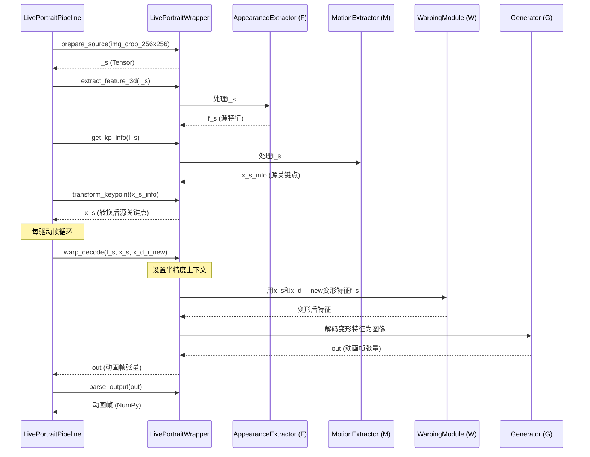

# 第5章：核心模型封装

欢迎回来

在[第4章：面部/关键点裁剪与检测](04_face_keypoint_cropping___detection_.md)中，我们了解了LivePortrait如何通过定位面部、识别关键面部点并精心裁剪来细致准备输入图像。现在"食材"已完美备好，是时候介绍实现动画魔法的"引擎"了：**核心模型封装**。

## AI的控制面板：核心模型封装的功能

想象你正在建造一台高度先进的机器人厨师。前一章的`Cropper`像是负责切菜和清洗的助手，而`Core Model Wrapper`则是机器人厨师真正的大脑和双手！它控制所有专业烹饪设备：智能烤箱、高科技搅拌机、自动装饰器等。

对LivePortrait而言，`LivePortraitWrapper`（及其动物版本`LivePortraitWrapperAnimal`）正是这种核心人工智能（AI）模型的控制面板。它是一个抽象层，整合了所有负责让静态照片动起来的复杂深度学习模型。

**为什么需要封装？**
深度学习模型强大但通常直接使用较为复杂，需要特定数据格式、谨慎的内存管理和技术配置。`LivePortraitWrapper`向系统其他部分隐藏了所有这些复杂性。

**具体示例**：你提供了一张人像面部源图像和一段说话驱动视频。`Cropper`已给出干净对齐的面部。现在`LivePortraitWrapper`开始工作：
1. 将所有必要的AI"大脑"（模型）加载到计算机内存中。
2. 确保它们高效运行在你的GPU（或CPU，若无GPU）上。
3. 使用这些模型执行特定任务，例如：
   * **提取外观特征**：理解源人物的"样貌"。
   * **获取关键点信息**：解析驱动人物的精确姿态和表情。
   * **图像变形**：将源面部变形以匹配驱动动作。
   * **解码为新图像**：生成最终动画帧。

此封装为LivePortrait系统其他部分（如[主动画管线](02_main_animation_pipeline_.md)）提供了与这些强大AI模型交互的简单高级方式，无需陷入技术细节。

## 拆解控制面板：核心概念

让我们解析`LivePortraitWrapper`背后的核心思想。

### 1. `LivePortraitWrapper`（及`LivePortraitWrapperAnimal`）：模型管理器

这是核心类（`src/live_portrait_wrapper.py`），作为所有深度学习模型的主要接口，负责：
* **初始化**：启动时加载所有所需模型（特征提取器、动作提取器、变形模块、生成器、可选拼接/重定向模块）。
* **硬件部署**：确保这些模型正确放置在GPU（或CPU）上以获得最佳性能。
* **配置更新**：根据[配置系统](03_configuration_system_.md)的设置动态调整模型行为。

`LivePortraitWrapperAnimal`是此管理器的特化版本，专为加载和使用针对动物面部训练的AI模型而设计。

### 2. 封装深度学习模型：AI工具包

LivePortrait使用多个专用模型而非单一巨型模型，每个模型专注于特定任务。`LivePortraitWrapper`将它们作为连贯工具包管理：
* **`appearance_feature_extractor` (F)**：学习并存储源图像的独特"外观"或身份。
* **`motion_extractor` (M)**：从驱动视频中提取细微动作线索（如头部姿态、眨眼、嘴唇动作）。
* **`warping_module` (W)**：根据驱动动作变形源图像的外观特征。
* **`spade_generator` (G)**：将变形特征解码为逼真图像。
* **`stitching_retargeting_module` (S/R，可选)**：帮助将动画面部无缝融合回原始背景，并提供对眼唇动作的精细控制。

### 3. 硬件管理：CPU、GPU与MPS

封装智能决定运行模型的最佳硬件：
* **CUDA (GPU)**：若有NVIDIA GPU，LivePortrait将利用其能力实现快速动画。
* **MPS (Apple Silicon GPU)**：对较新苹果电脑，可使用Metal Performance Shaders加速。
* **CPU**：若无兼容GPU，则回退到CPU，但动画速度较慢。

它还处理**半精度推理**（`torch.float16`），即在兼容GPU上使用较少内存且通常更快地执行计算，可能略微牺牲精度（但对视觉任务通常不明显）。

### 4. 提供高级函数：简化交互

`LivePortraitWrapper`的真正力量在于其高级函数。无需了解每个AI模型的复杂细节，封装提供直观方法如：
* `prepare_source(img)`：将图像转换为AI模型期望的格式。
* `extract_feature_3d(x)`：使用模型F获取源的独特外观。
* `get_kp_info(x)`：使用模型M获取动作信息（关键点、姿态、表情）。
* `transform_keypoint(kp_info)`：根据姿态和表情调整关键点。
* `warp_decode(feature_3d, kp_source, kp_driving)`：核心动画步骤，使用模型W和G生成动画帧。
* `retarget_eye(kp_source, eye_close_ratio)`：调整眼部动作。
* `retarget_lip(kp_source, lip_close_ratio)`：调整唇部动作。
* `stitch(kp_source, kp_driving)`：无缝融合动画面部。

这些函数使[主动画管线](02_main_animation_pipeline_.md)能轻松协调动画过程。

## 如何使用核心模型封装（解决用例）

作为用户，通常不会直接调用`LivePortraitWrapper`的方法。相反，[主动画管线](02_main_animation_pipeline_.md)（特别是`LivePortraitPipeline`类）作为总指挥，在动画每个步骤调用适当的`LivePortraitWrapper`方法。

让我们回顾`LivePortraitPipeline`的`execute`方法的简化片段，展示其如何与`LivePortraitWrapper`交互：

```python
# 简化的src/live_portrait_pipeline.py片段（execute方法内）
class LivePortraitPipeline(object):
    def __init__(self, inference_cfg, crop_cfg):
        # 初始化核心AI模型处理器（我们的封装！）
        self.live_portrait_wrapper: LivePortraitWrapper = LivePortraitWrapper(inference_cfg=inference_cfg)
        # ...（初始化Cropper）...

    def execute(self, args):
        # ...（加载并裁剪source_rgb_lst为img_crop_256x256）...

        # 1. 为封装准备源图像
        I_s = self.live_portrait_wrapper.prepare_source(img_crop_256x256) # 转为torch.Tensor
        # 2. 从源提取关键点信息
        x_s_info = self.live_portrait_wrapper.get_kp_info(I_s)
        # 3. 从源提取3D外观特征
        f_s = self.live_portrait_wrapper.extract_feature_3d(I_s)
        # 4. 为变形转换关键点
        x_s = self.live_portrait_wrapper.transform_keypoint(x_s_info)

        # ...（加载并处理驱动视频，创建driving_template_dct）...

        # 5. 主动画循环：生成每帧动画
        I_p_lst = []
        for i in range(n_frames):
            x_d_i_info = driving_template_dct['motion'][i] # 当前帧动作
            # ...（重定向、拼接等复杂逻辑以获取x_d_i_new）...

            # 6. 核心动画步骤：使用封装变形和解码！
            out = self.live_portrait_wrapper.warp_decode(f_s, x_s, x_d_i_new)
            # 7. 将输出从张量转为numpy图像
            I_p_i = self.live_portrait_wrapper.parse_output(out['out'])[0]
            I_p_lst.append(I_p_i)

        # ...（保存并最终化输出）...
        return output_path, output_path_concat
```
**说明**：
1. 在`LivePortraitPipeline`的`__init__`中创建`LivePortraitWrapper`，接收`inference_cfg`（指定模型路径和半精度使用等）。
2. `execute`中，`I_s = self.live_portrait_wrapper.prepare_source(img_crop_256x256)`将`Cropper`的NumPy图像转为`torch.Tensor`，准备供AI模型使用。
3. `x_s_info = self.live_portrait_wrapper.get_kp_info(I_s)`使用动作提取器模型理解源图像的初始姿态和表情。
4. `f_s = self.live_portrait_wrapper.extract_feature_3d(I_s)`使用外观特征提取器获取源身份的深层表示。
5. `out = self.live_portrait_wrapper.warp_decode(f_s, x_s, x_d_i_new)`是每帧动画的核心，接收源外观（`f_s`）、其关键点（`x_s`）和当前帧驱动动作关键点（`x_d_i_new`），使用变形和生成模型生成新动画图像。
6. `I_p_i = self.live_portrait_wrapper.parse_output(out['out'])[0]`将AI模型输出（`torch.Tensor`）转回标准NumPy图像格式，可保存为视频帧。

此流程展示了`LivePortraitWrapper`如何作为所有AI模型操作的单一接触点，为`LivePortraitPipeline`提供简洁方法调用。

你也可以通过[配置系统](03_configuration_system_.md)影响`LivePortraitWrapper`行为。例如启用半精度或拼接：

```bash
# 启用半精度和拼接的示例命令
python app.py --flag_use_half_precision True --flag_stitching True
```
这些`flag_use_half_precision`和`flag_stitching`参数将更新`inference_cfg`对象，随后传递给`LivePortraitWrapper`。封装据此配置其内部模型和推理上下文。

## 内部机制：AI工作流逐步解析

让我们可视化`LivePortraitWrapper`在被要求`warp_decode`一帧时如何协调不同AI模型。



**`LivePortraitWrapper`运作逐步解析**：

1. **准备（来自管线）**：`LivePortraitPipeline`首先要求`LivePortraitWrapper`执行`prepare_source`（图像转张量），然后`extract_feature_3d`（用模型F）和`get_kp_info`（用模型M）处理源图像，并转换关键点。
2. **动画请求**：对驱动视频每帧，`LivePortraitPipeline`调用`LivePortraitWrapper.warp_decode()`，提供源独特特征（`f_s`）、转换后关键点（`x_s`）和当前帧驱动动作转换后关键点（`x_d_i_new`）。
3. **硬件上下文**：在`warp_decode`内，`LivePortraitWrapper`首先设置`inference_ctx()`。此上下文确保操作（如`warp_decode`本身）在正确设备（GPU/CPU）上运行，并可能使用半精度（`float16`）加速。
4. **变形（模型W）**：`LivePortraitWrapper`将源特征（`f_s`）、源关键点（`x_s`）和驱动关键点（`x_d_i_new`）传递给`warping_module`（模型W）。此模型的任务是根据驱动关键点指示的新姿态和表情变形源的"外观"。
5. **生成（模型G）**：`warping_module`输出为"变形特征"。这些还不是图像。`LivePortraitWrapper`随后将这些变形特征送入`spade_generator`（模型G），后者将这些抽象特征解码为逼真全彩动画图像（`torch.Tensor`）。
6. **输出解析**：最后，`LivePortraitWrapper`的`parse_output()`方法将此`torch.Tensor`转回标准NumPy图像格式，供`LivePortraitPipeline`保存为动画视频的一部分。

### 代码探索

查看`src/live_portrait_wrapper.py`的关键片段，了解这些操作如何实现。

首先，`__init__`方法，加载所有模型：

```python
# 简化的src/live_portrait_wrapper.py片段（init方法）
class LivePortraitWrapper(object):
    def __init__(self, inference_cfg: InferenceConfig):
        self.inference_cfg = inference_cfg
        # 确定设备（cuda、mps或cpu）
        self.device = 'cuda:' + str(inference_cfg.device_id) # 简化
        self.compile = inference_cfg.flag_do_torch_compile # torch.compile标志

        model_config = yaml.load(open(inference_cfg.models_config, 'r'), Loader=yaml.SafeLoader)

        # 加载外观特征提取器（F）
        self.appearance_feature_extractor = load_model(
            inference_cfg.checkpoint_F, model_config, self.device, 'appearance_feature_extractor')
        log(f'从{inference_cfg.checkpoint_F}加载F完成。')

        # 加载动作提取器（M）
        self.motion_extractor = load_model(
            inference_cfg.checkpoint_M, model_config, self.device, 'motion_extractor')
        log(f'从{inference_cfg.checkpoint_M}加载M完成。')

        # 加载变形模块（W）
        self.warping_module = load_model(
            inference_cfg.checkpoint_W, model_config, self.device, 'warping_module')
        log(f'从{inference_cfg.checkpoint_W}加载W完成。')

        # 加载SPADE生成器（G）
        self.spade_generator = load_model(
            inference_cfg.checkpoint_G, model_config, self.device, 'spade_generator')
        log(f'从{inference_cfg.checkpoint_G}加载G完成。')

        # 加载可选拼接/重定向模块（S）
        if inference_cfg.checkpoint_S is not None: # 检查路径是否提供
            self.stitching_retargeting_module = load_model(
                inference_cfg.checkpoint_S, model_config, self.device, 'stitching_retargeting_module')
            log(f'从{inference_cfg.checkpoint_S}加载S完成。')
        else:
            self.stitching_retargeting_module = None

        # 如启用则应用torch.compile优化
        if self.compile:
            self.warping_module = torch.compile(self.warping_module, mode='max-autotune')
            self.spade_generator = torch.compile(self.spade_generator, mode='max-autotune')
```
**说明**：
1. `__init__`方法接收`InferenceConfig`，包含所有模型检查点文件路径和其他设置。
2. 确定适当的`self.device`（如`cuda:0`、`cpu`）。
3. 使用辅助函数`load_model`重复加载每个核心AI模型（F、M、W、G及可选的S）从各自检查点文件，并放置在选定设备上。
4. 如配置中启用`torch.compile`，则应用此PyTorch优化到`warping_module`和`spade_generator`以潜在加速执行。

接下来，查看对性能和核心动画过程至关重要的`inference_ctx`和`warp_decode`方法：

```python
# 简化的src/live_portrait_wrapper.py片段（inference_ctx和warp_decode方法）
class LivePortraitWrapper(object):
    def inference_ctx(self):
        # 提供半精度推理的上下文管理器
        if self.device == "mps":
            ctx = contextlib.nullcontext() # MPS不像CUDA使用autocast
        else:
            ctx = torch.autocast(device_type=self.device[:4], dtype=torch.float16,
                                 enabled=self.inference_cfg.flag_use_half_precision)
        return ctx

    def warp_decode(self, feature_3d: torch.Tensor, kp_source: torch.Tensor, kp_driving: torch.Tensor) -> dict:
        """ 获取变形和解码后的图像 """
        with torch.no_grad(), self.inference_ctx(): # 无需梯度，使用推理上下文
            if self.compile:
                torch.compiler.cudagraph_mark_step_begin() # torch.compile提示
            
            # 1. 变形：基于关键点变形源特征
            ret_dct = self.warping_module(feature_3d, kp_source=kp_source, kp_driving=kp_driving)
            
            # 2. 解码：从变形特征生成图像
            ret_dct['out'] = self.spade_generator(feature=ret_dct['out'])

            # 如使用半精度则将输出转为float32
            if self.inference_cfg.flag_use_half_precision:
                for k, v in ret_dct.items():
                    if isinstance(v, torch.Tensor):
                        ret_dct[k] = v.float()
        return ret_dct
```
**说明**：
1. `inference_ctx()`：如使用CUDA设备且启用半精度，此方法返回`torch.autocast`上下文管理器，告知PyTorch在此上下文内自动使用`float16`加速。对MPS则使用空上下文，因MPS处理方式不同。
2. `warp_decode()`：核心动画函数。
   * `with torch.no_grad(), self.inference_ctx():`：重要行。`torch.no_grad()`表示非训练模式，PyTorch无需存储反向传播信息，节省内存加速推理。`self.inference_ctx()`应用半精度设置（如配置）。
   * `ret_dct = self.warping_module(...)`：调用`warping_module`（模型W）变形源特征。
   * `ret_dct['out'] = self.spade_generator(...)`：将变形器输出送入`spade_generator`（模型G）创建最终图像张量。
   * `if self.inference_cfg.flag_use_half_precision:`块确保如任何张量以`float16`处理，则在返回前转为`float32`以保持一致性，因系统其他部分可能期望`float32`。

### 人像与动物封装：专用引擎

`LivePortraitWrapper`和`LivePortraitWrapperAnimal`结构相同且共享高级函数，但初始化时使用不同底层AI模型。

查看动物版本的简化`__init__`：

```python
# 简化的src/live_portrait_wrapper.py片段（LivePortraitWrapperAnimal init）
class LivePortraitWrapperAnimal(LivePortraitWrapper): # 继承自LivePortraitWrapper
    def __init__(self, inference_cfg: InferenceConfig):
        self.inference_cfg = inference_cfg
        self.device = 'cuda:' + str(inference_cfg.device_id) # 简化
        self.compile = inference_cfg.flag_do_torch_compile

        model_config = yaml.load(open(inference_cfg.models_config, 'r'), Loader=yaml.SafeLoader)

        # 注意检查点路径中的'_animal'！
        self.appearance_feature_extractor = load_model(
            inference_cfg.checkpoint_F_animal, model_config, self.device, 'appearance_feature_extractor')
        log(f'从{inference_cfg.checkpoint_F_animal}加载F_animal完成。')

        self.motion_extractor = load_model(
            inference_cfg.checkpoint_M_animal, model_config, self.device, 'motion_extractor')
        log(f'从{inference_cfg.checkpoint_M_animal}加载M_animal完成。')

        self.warping_module = load_model(
            inference_cfg.checkpoint_W_animal, model_config, self.device, 'warping_module')
        log(f'从{inference_cfg.checkpoint_W_animal}加载W_animal完成。')

        self.spade_generator = load_model(
            inference_cfg.checkpoint_G_animal, model_config, self.device, 'spade_generator')
        log(f'从{inference_cfg.checkpoint_G_animal}加载G_animal完成。')

        if inference_cfg.checkpoint_S_animal is not None:
            self.stitching_retargeting_module = load_model(
                inference_cfg.checkpoint_S_animal, model_config, self.device, 'stitching_retargeting_module')
            log(f'从{inference_cfg.checkpoint_S_animal}加载S_animal完成。')
        else:
            self.stitching_retargeting_module = None

        # ...（如启用则应用torch.compile）...
```
**说明**：
关键区别在`log`消息中突出：不使用`checkpoint_F`，而用`inference_cfg.checkpoint_F_animal`，对`M`、`W`、`G`和`S`同理。这确保`LivePortraitWrapperAnimal`加载专为动物面部动画训练的模型，与人像面部有本质不同。

对比表：

| 特性               | `LivePortraitWrapper`（人像）    | `LivePortraitWrapperAnimal`（动物）            |
| :----------------- | :------------------------------- | :--------------------------------------------- |
| **目标主体**       | 人像面部                         | 动物面部（如猫、狗）                           |
| **模型==检查点==** | `checkpoint_F`, `checkpoint_G`等 | `checkpoint_F_animal`, `checkpoint_G_animal`等 |
| **==底层==模型**   | 基于人像面部数据集训练           | 基于动物面部数据集训练                         |
| **功能接口**       | 相同高级方法（`warp_decode`等）  | 相同高级方法（`warp_decode`等）                |
| **==基类==**       | `object`                         | `LivePortraitWrapper`（继承自人像版本）        |
| **眼/唇比例计算**  | 使用人像==特定==比例计算方法     | 对动物控制较粗略，通常默认                     |

这展示了LivePortrait的模块化设计：整体`Wrapper`概念保留，但内部"大脑"（模型）根据主体替换。

## 结语

现在你已探索了LivePortrait动画能力的核心：**核心模型封装**。了解到`LivePortraitWrapper`（及其动物版本）作为所有复杂深度学习模型的控制面板，处理它们的加载、硬件部署、性能优化，并为动画任务提供高级函数。它简化了与AI模型的交互，使[主动画管线](02_main_animation_pipeline_.md)能无缝协调惊艳动画。

现在你明白了当LivePortrait栩栩如生时，正是这精密的封装在幕后管理着AI模型的复杂舞蹈。

接下来，我们将再揭开一层，深入探讨实际AI模型的具体角色，详见[第6章：核心动画模型](06_core_animation_models_.md)
