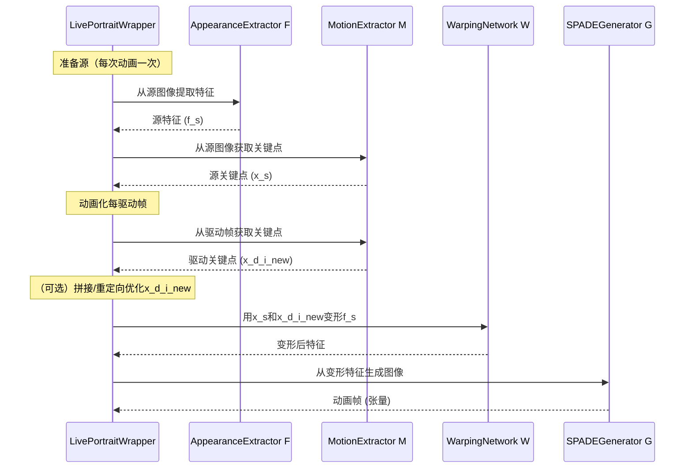

# 第6章：核心动画模型

欢迎回来

在[第5章：核心模型封装](05_core_model_wrapper_.md)中，我们了解到`LivePortraitWrapper`如同控制面板，管理着幕后所有复杂的AI模型。

现在，让我们进一步揭开帷幕，认识这些"专业艺术家"本身：**核心动画模型**。

它们并非单一巨型大脑，而是各自独立的神经网络，每个都是经过高度训练、在赋予静态肖像生命力中扮演独特角色的专家。将LivePortrait比作电影工作室：`LivePortraitWrapper`是统筹全局的导演，而这些"核心动画模型"则是才华横溢的专业人士——服装设计师、编舞师、CGI特效师和最终渲染师——各自执行着动画杰作中的特定环节。

## 专业艺术家：各模型的功能

面部动画是项复杂任务，涉及理解人物外观、分析动作、面部变形以及最终渲染逼真新图像。通过将这种复杂性分解为更小、更专业的任务，LivePortrait实现了令人印象深刻的效果。

**具体用例**：我们想用人物B说话视频(`driving.mp4`)的面部动作来动画化人物A的静态图像(`source.jpg`)。每个核心模型在此过程中都扮演着关键而独特的角色：

### 1. 外观特征提取器 (F)：服装设计师

*   **角色**：如同"服装设计师"或"身份艺术家"，其任务是捕捉**源图像**中人物的独特视觉风格和身份特征。它理解是什么让人物A看起来像人物A——肤色、发质、独特面部轮廓等。
*   **工作原理**：接收静态源图像并提取丰富细致的3D"外观特征体"。此体积并非可见图像，而是源视觉特征的复杂数学表示。
*   **代码参考**：位于`src/modules/appearance_feature_extractor.py`，实现为`AppearanceFeatureExtractor`。

### 2. 动作提取器 (M)：编舞师

*   **角色**：担任"编舞师"，分析**驱动视频**并提取所有动作线索——头部旋转、眨眼、嘴唇动作和整体面部表情。将这些动作转化为其他模型能理解的语言：关键点及姿态/表情参数。
*   **工作原理**：处理驱动视频帧（或源图像的初始姿态），输出"隐式关键点"（如面部虚拟关节点）及描述俯仰角（pitch）、偏航角（yaw）、翻滚角（roll）、平移（translation）和表情变化的参数。
*   **代码参考**：在`src/modules/motion_extractor.py`中实现为`MotionExtractor`，使用`ConvNeXtV2`骨干网络实现强大特征提取能力。

### 3. 变形网络 (W)：CGI变形师

*   **角色**：想象一位能雕塑面部的"CGI变形师"。变形网络接收源图像的外观特征（来自模型F）和驱动视频的动作线索（来自模型M），其职责是字面意义上**变形**源外观特征以匹配驱动人物的动作。它计算出*如何*弯曲和拉伸源的"身份"以适应新姿态和表情。
*   **工作原理**：预测"密集动作场"——为源特征的每个微小部分提供复杂移动指令集，同时可能估算"遮挡图"以处理动作中隐藏或显露的部分（如头部转动时）。
*   **代码参考**：此模型位于`src/modules/warping_network.py`，实现为`WarpingNetwork`，内部使用`DenseMotionNetwork`。

### 4. SPADE生成器 (G)：渲染师/画家

*   **角色**：工作室的"渲染师"或"画家"。变形网络(`W`)处理后的特征仍是抽象的，不像真实图像。SPADE生成器接收这些**变形特征**并将其重建为逼真、全彩、像素级精确的动画图像。
*   **工作原理**：采用SPADE（空间自适应去标准化）技术智能生成图像，确保即使面部移动和表情变化时仍保留原始源的视觉风格。
*   **代码参考**：位于`src/modules/spade_generator.py`，实现为`SPADEDecoder`。

### 5. 拼接/重定向网络 (S/R)：融合师与细节师（可选）

*   **角色**："融合师"兼"细节师"。核心动画后有时需要微调。此模型优化关键点运动以实现与原始背景无缝融合，并精细控制眼唇开合度，解决如动画不同人物时眼睑闭合不完全等常见问题。
*   **工作原理**：小型神经网络，接收相关关键点信息和/或期望比例（如`eye_close_ratio`），输出调整后的关键点值，供`LivePortraitWrapper`修改传递给变形网络的动作。
*   **代码参考**：位于`src/modules/stitching_retargeting_network.py`，实现为`StitchingRetargetingNetwork`，通过配置可选启用。

## 如何使用核心动画模型

作为用户或使用`LivePortraitPipeline`的开发者，我们不会直接调用这些独立模型。相反，[核心模型封装](05_core_model_wrapper_.md) (`LivePortraitWrapper`) 充当中介。封装在启动时加载这些模型，并提供[主动画管线](02_main_animation_pipeline_.md)调用的高级函数。

例如，当`LivePortraitPipeline`需要从源图像提取特征时，它调用`LivePortraitWrapper`的方法，后者知道应调用`外观特征提取器 (F)`模型。

以下是`LivePortraitWrapper`与这些模型交互的简化示例（记住`self.appearance_feature_extractor`指代模型F，`self.motion_extractor`指代模型M等）：

```python
# 简化的src/live_portrait_wrapper.py片段
class LivePortraitWrapper(object):
    # ... (__init__方法加载所有模型F, M, W, G, S/R) ...

    def extract_feature_3d(self, source_tensor):
        # 调用外观特征提取器 (F)
        return self.appearance_feature_extractor(source_tensor)

    def get_kp_info(self, image_tensor):
        # 调用动作提取器 (M)
        return self.motion_extractor(image_tensor)

    def warp_decode(self, feature_3d, kp_source, kp_driving):
        # 调用变形网络 (W)
        warped_output = self.warping_module(feature_3d, kp_source=kp_source, kp_driving=kp_driving)
        
        # 调用SPADE生成器 (G)
        final_image_tensor = self.spade_generator(feature=warped_output['out'])
        
        return {'out': final_image_tensor}

    # ... 重定向、拼接等方法也调用S/R模型 ...
```
**说明**：
*   当`LivePortraitWrapper`被要求`extract_feature_3d`时，它直接将输入`source_tensor`传递给内部的`appearance_feature_extractor`（模型F）。
*   类似地，`get_kp_info`委托给`motion_extractor`（模型M）。
*   `warp_decode`方法展示顺序性：先用`warping_module`（模型W）获取`warped_output`，再将其送入`spade_generator`（模型G）创建`final_image_tensor`。

这种模块化设计使每个模型专注于特定任务，`LivePortraitWrapper`确保它们高效协作。

## 内部机制：动画装配线

让我们可视化单帧在这些专业模型中的旅程，由`LivePortraitWrapper`协调。



**解析**：

1.  **源准备**：首先对静态源图像：
    *   `LivePortraitWrapper`要求`外观提取器 (F)`捕获源的身份特征，生成`f_s`（源特征）。
    *   同时要求`动作提取器 (M)`获取源的初始姿态和关键点，生成`x_s`（源关键点）。
2.  **驱动动作提取**：对驱动视频每帧：
    *   将当前驱动帧送入`动作提取器 (M)`获取其关键点和姿态`x_d_i_new`（驱动关键点）。
    *   *（可选拼接/重定向）*：如启用，`LivePortraitWrapper`可能用`拼接/重定向网络 (S/R)`微调`x_d_i_new`以实现更平滑融合或特定眼唇控制。
3.  **特征变形**：`LivePortraitWrapper`将`f_s`（源身份）、`x_s`（源姿态）和`x_d_i_new`（当前帧驱动动作）传递给`变形网络 (W)`。模型W的任务是变形`f_s`以匹配`x_d_i_new`动作。
4.  **图像生成**：`变形网络`输出为"变形特征"，随后被`LivePortraitWrapper`送入`SPADE生成器 (G)`。模型G将这些抽象特征重建为该帧最终的动画图像。
5.  **组装与重复**：生成的图像（张量形式）返回给`LivePortraitWrapper`，转为标准图像格式后加入输出视频帧列表。此过程对驱动视频每帧重复。

### 代码探索：`forward`方法

每个核心模型都是PyTorch `nn.Module`，包含定义层的`__init__`方法和实际计算的`forward`方法

我们聚焦`forward`方法，因其展示输入输出流。

#### 1. 外观特征提取器 (F) - `AppearanceFeatureExtractor`
**文件：** `src/modules/appearance_feature_extractor.py`
```python
class AppearanceFeatureExtractor(nn.Module):
    def forward(self, source_image):
        out = self.first(source_image) # Bx3x256x256 -> Bx64x256x256
        for i in range(len(self.down_blocks)):
            out = self.down_blocks[i](out)
        out = self.second(out) # -> Bx512x64x64
        
        # 重塑为3D特征体
        bs, c, h, w = out.shape
        f_s = out.view(bs, self.reshape_channel, self.reshape_depth, h, w) # -> Bx32x16x64x64
        f_s = self.resblocks_3d(f_s) # 应用3D残差块
        return f_s
```
**说明**：此模型接收`source_image`（2D图像），通过多个卷积和下采样层提取丰富特征，随后`view`（重塑）这些2D特征为3D`f_s`（特征体）并应用3D残差块精炼。此`f_s`即"身份蓝图"。

#### 2. 动作提取器 (M) - `MotionExtractor`（使用`ConvNeXtV2`）
**文件：** `src/modules/motion_extractor.py`
```python
class MotionExtractor(nn.Module):
    def forward(self, x):
        out = self.detector(x) # 输入x为驱动帧（2D图像）
        return out
```
**说明**：`forward`方法简单将输入图像`x`（驱动帧）传递给内部`detector`（`ConvNeXtV2`模型）。`detector`计算并返回字典`out`，包含`kp`（隐式关键点）、`pitch`、`yaw`、`roll`（头部姿态）、`t`（平移）、`exp`（表情变形）和`scale`。

#### 3. 变形网络 (W) - `WarpingNetwork`
**文件：** `src/modules/warping_network.py`
```python
class WarpingNetwork(nn.Module):
    def deform_input(self, inp, deformation):
        # 将变形应用于输入特征体
        return F.grid_sample(inp, deformation, align_corners=False)

    def forward(self, feature_3d, kp_driving, kp_source):
        # 1. 用DenseMotionNetwork计算密集动作和遮挡
        dense_motion = self.dense_motion_network(
            feature=feature_3d, kp_driving=kp_driving, kp_source=kp_source
        )
        deformation = dense_motion['deformation'] # Bx16x64x64x3（变形场）
        occlusion_map = dense_motion.get('occlusion_map', None)

        # 2. 对源feature_3d应用变形
        out = self.deform_input(feature_3d, deformation) # Bx32x16x64x64（变形特征）

        # ... 进一步处理和重塑 ...

        if self.flag_use_occlusion_map and (occlusion_map is not None):
            out = out * occlusion_map # 对精炼特征应用遮挡

        ret_dct = {
            'occlusion_map': occlusion_map,
            'deformation': deformation,
            'out': out, # 变形特征，准备生成
        }
        return ret_dct
```
**说明**：此模型接收`feature_3d`（源外观）、`kp_driving`（驱动动作）和`kp_source`（源姿态）。首先用`dense_motion_network`计算*如何*变形（`deformation`）及可能隐藏部分（`occlusion_map`）。随后`self.deform_input`应用此`deformation`场至`feature_3d`，实质是雕刻源外观以匹配新动作。输出`out`为变形特征图。

#### 4. SPADE生成器 (G) - `SPADEDecoder`
**文件：** `src/modules/spade_generator.py`
```python
class SPADEDecoder(nn.Module):
    def forward(self, feature):
        seg = feature # 输入为变形特征（如Bx256x64x64）
        x = self.fc(feature) # 初始卷积层
        
        # 通过多个SPADE残差块
        x = self.G_middle_0(x, seg)
        # ... G_middle_1至G_middle_5 ...
        
        # 上采样和精炼
        x = self.up(x) # 提升分辨率
        x = self.up_0(x, seg)
        x = self.up(x)
        x = self.up_1(x, seg)
        
        # 最终卷积和激活生成图像
        x = self.conv_img(F.leaky_relu(x, 2e-1))
        x = torch.sigmoid(x) # 输出像素值介于0和1
        return x
```
**说明**：`SPADEDecoder`接收`feature`（来自模型W的变形特征）。它使用一系列`SPADEResnetBlock`——结合特征语义信息（`seg`）同时上采样分辨率的特殊层。最后用`conv_img`和`sigmoid`激活将这些处理特征转为逼真全彩图像`x`（像素值0到1）。这就是动画帧！

#### 5. 拼接/重定向网络 (S/R) - `StitchingRetargetingNetwork`
**文件：** `src/modules/stitching_retargeting_network.py`
```python
class StitchingRetargetingNetwork(nn.Module):
    def forward(self, x):
        return self.mlp(x) # x可为关键点坐标或眼唇开合比例
```
**说明**：简单多层感知机（MLP）

接收输入`x`（可代表关键点坐标或眼唇开合比例），通过一系列线性层和ReLU激活（`self.mlp`）处理。输出为优化后的关键点坐标或调整比例，用于动画微调。

## 人像与动物动画模型对比

虽然模型*类型*（F、M、W、G、S/R）对人像和动物动画相同，但实际加载的模型文件（其"大脑"或"权重"）不同。它们在不同数据集上训练，因此专精于人像或动物面部。

| 模型类型              | 人像动画模型                       | 动物动画模型                               |
| :-------------------- | :--------------------------------- | :----------------------------------------- |
| **外观提取器 (F)**    | 在多样化人像上训练以捕捉身份特征。 | 在各类动物面部（如猫、狗）上训练。         |
| **动作提取器 (M)**    | 在人类面部动作、表情和姿态上训练。 | 在动物面部动作和姿态上训练。               |
| **变形网络 (W)**      | 针对人类面部结构变形优化。         | 针对动物面部结构变形优化。                 |
| **SPADE生成器 (G)**   | 从变形特征生成逼真人像。           | 从变形特征生成逼真动物面部。               |
| **拼接/重定向 (S/R)** | 微调人类眼唇动作，无缝融合面部。   | 对动物控制较粗略；通常简化调整或较少使用。 |

`LivePortraitWrapperAnimal`（来自[第5章：核心模型封装](05_core_model_wrapper_.md)）确保在动画动物时加载正确的动物==专用模型检查点==，实质是替换为动物主题训练的"专业艺术家"。

## 结语

现在你已认识了构成LivePortrait动画引擎核心的"专业艺术家"们：**核心动画模型**。

- ==从捕捉身份的`外观特征提取器 (F)`，分析动作的`动作提取器 (M)`，变形特征的`变形网络 (W)`，渲染最终图像的`SPADE生成器 (G)`，到微调的`拼接/重定向网络 (S/R)`，每个模型都扮演着关键角色==。

这些独立神经网络在[核心模型封装](05_core_model_wrapper_.md)的协调下，以精密装配线方式协作，将静态图像无缝转化为动态动画肖像。这种模块化设计使LivePortrait强大而灵活，能够为多样主题赋予生命力。

END *★,°*:.☆(￣▽￣)/.°★* 。