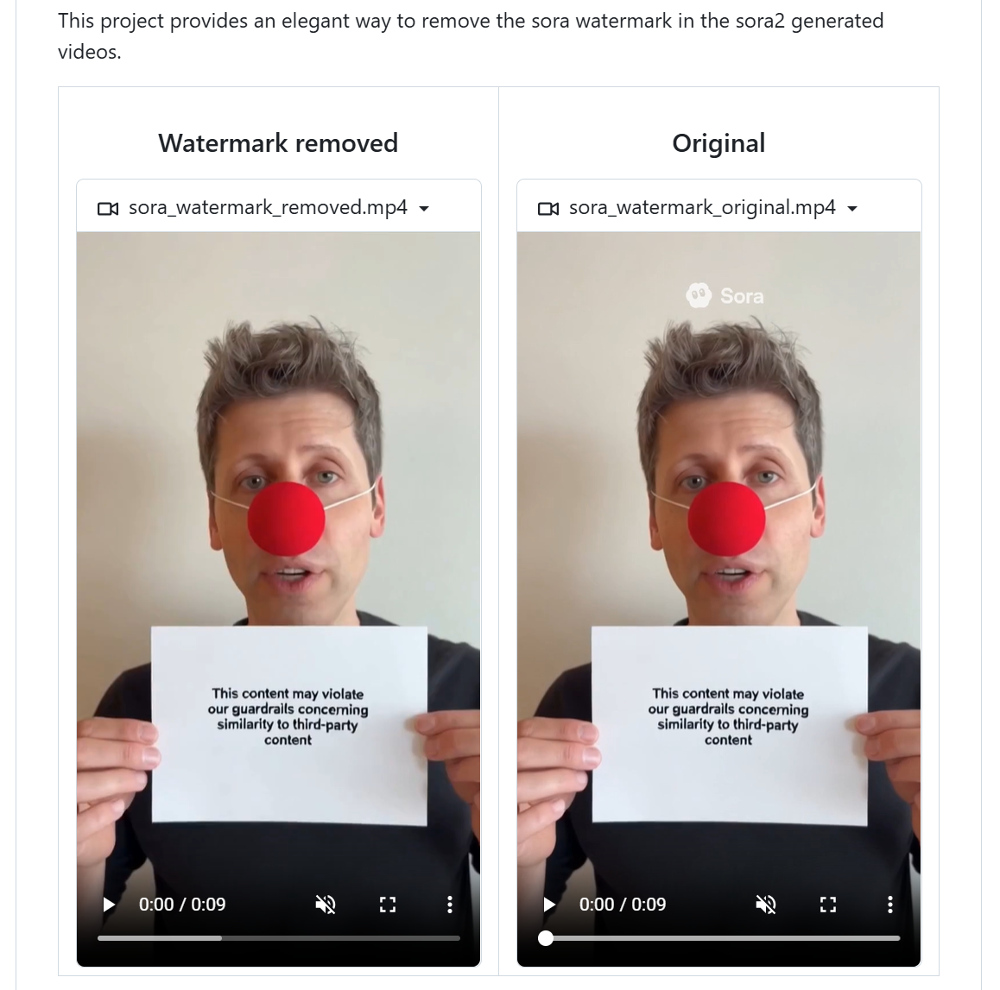
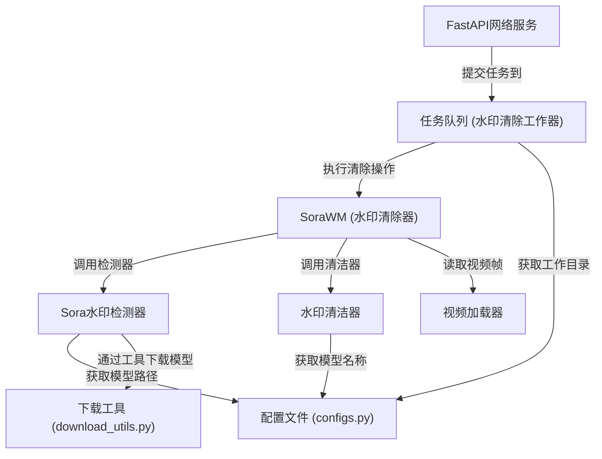

链接：[github.com/linkedlist771/SoraWatermarkCleaner](https://github.com/linkedlist771/SoraWatermarkCleaner)

# docs：Sora水印清除工具

SoraWatermarkCleaner项目是一个**AI驱动工具**，专门用于*自动移除*Sora生成视频中的水印

其工作原理是首先通过深度学习模型**检测**水印的精确位置，然后通过**修复填充**(inpainting)技术用与周围视频内容无缝融合的画面替换水印区域

用户可以通过简单的Python API、**Streamlit网页界面**或可扩展的**FastAPI网络服务**与之交互，后者能高效处理批量任务。

## 可视化

## 目录

1. [视频加载器](01_videoloader_.md)
2. [Sora水印检测器](02_sorawatermarkdetector_.md)
3. [水印清洁器](03_watermarkcleaner_.md)
4. [SoraWM (水印清除主模块)](04_sorawm__watermark_remover__.md)
5. [FastAPI网络服务](05_fastapi_web_server_.md)
6. [任务队列 (水印清除工作器)](06_worker_queue__wmremovetaskworker__.md)
7. [配置文件](07_configuration__configs_py__.md)
8. [下载工具](08_download_utilities__download_utils_py__.md)

---

