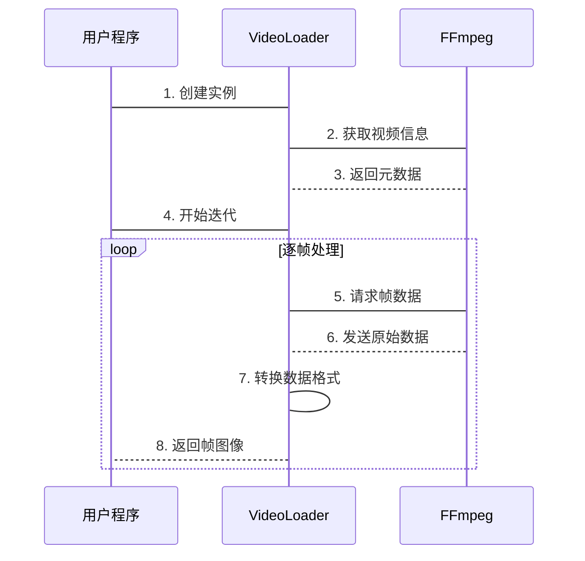

# 第1章：视频加载器

假设我们有一段精彩的视频，但上面有烦人的水印需要去除

该如何开始呢？视频不是单张图片，而是由无数快速切换的画面组成的序列

在进行水印检测或清除等智能操作前，我们首先需要能逐帧查看视频内容。

这就是`VideoLoader`的用武之地

它就像一台"数字视频播放器"，可以暂停在任何一帧并将画面交给我们处理。它能处理打开视频文件、分解为独立图像等复杂操作，让程序处理变得异常简单。

## 核心功能

直接处理视频文件非常棘手。视频格式多样(.mp4/.avi/.mov)、分辨率各异(如1920x1080)、帧率不同。若手动提取每帧，需要专业工具和大量代码。

**核心需求：** 去除水印需要==检查视频的每一帧==。`VideoLoader`通过提供==简单一致的帧获取方式==解决这个问题。

## 术语

- **帧(Frame):** ==视频由连续静止图像组成==，每幅图像称为一帧
- **分辨率:** 帧的像素尺寸，如1920x1080表示宽1920像素、高1080像素
- **帧率(FPS):** 每秒显示的帧数，决定视频流畅度，通常为30FPS
- **FFmpeg:** `VideoLoader`使用的开源工具，是视频处理的"瑞士军刀"

## 使用指南

### 1. 创建VideoLoader实例

```python
from pathlib import Path
from sorawm.utils.video_utils import VideoLoader

video_path = Path("示例视频.mp4")
loader = VideoLoader(video_path)  
//将视频地址path 传给函数VideoLoader处理 获取信息参数return至loader
print("视频加载器准备就绪！")
```

> 创建时会自动获取视频元信息。

### 2. 获取视频信息

```python
print(f"分辨率: {loader.width}x{loader.height}")
print(f"帧率: {loader.fps:.2f}FPS") 
print(f"总帧数: {loader.total_frames}")
print(f"时长: {loader.total_frames/loader.fps:.2f}秒")
```

输出示例：
```
分辨率: 1920x1080
帧率: 30.00FPS
总帧数: 900
时长: 30.00秒
```

### 3. 逐帧处理

```python
for i, frame in enumerate(loader):
    if i < 3:  # 仅查看前3帧
        print(f"第{i+1}帧尺寸: {frame.shape}")
    if i >= 4:  # 示例提前结束
        break
```

输出示例：
```
第1帧尺寸: (1080, 1920, 3)
第2帧尺寸: (1080, 1920, 3) 
第3帧尺寸: (1080, 1920, 3)
```

每帧返回NumPy数组，形状为(高,宽,3)，对应RGB通道。

## 技术实现

### 工作流程

1. **初始化**：创建时调用FFmpeg获取视频元信息
2. **迭代**：==启动FFmpeg进程流式传输帧数据==
3. **转换**：将原始字节流转换为NumPy数组
4. **清理**：确保FFmpeg进程正确关闭



### 代码

(注意 参数传递 的逻辑流即可)

```python
class VideoLoader:
    def __init__(self, video_path):
        self.video_path = video_path
        self._get_video_info()  # 初始化元数据
        
    def __iter__(self):
        process = ffmpeg.input(self.video_path).output(
            "pipe:", format="rawvideo", pix_fmt="bgr24"
        ).run_async()
        
        try:
            while True:
                raw_frame = process.stdout.read(self.width*self.height*3)
                if not raw_frame: break
                yield np.frombuffer(raw_frame, np.uint8).reshape(
                    [self.height, self.width, 3]
                )
        finally:
            process.stdout.close()
            process.wait()
```

## 总结

`VideoLoader`是视频处理的基础组件，它：
- 抽象了视频文件处理的复杂性
- 提供逐帧访问接口
- 内存效率高（流式处理）
- 确保资源正确释放

有了帧数据后，下一步就是==检测水印位置==。[下一章：Sora水印检测器](02_sorawatermarkdetector_.md)将介绍如何实现这一功能

