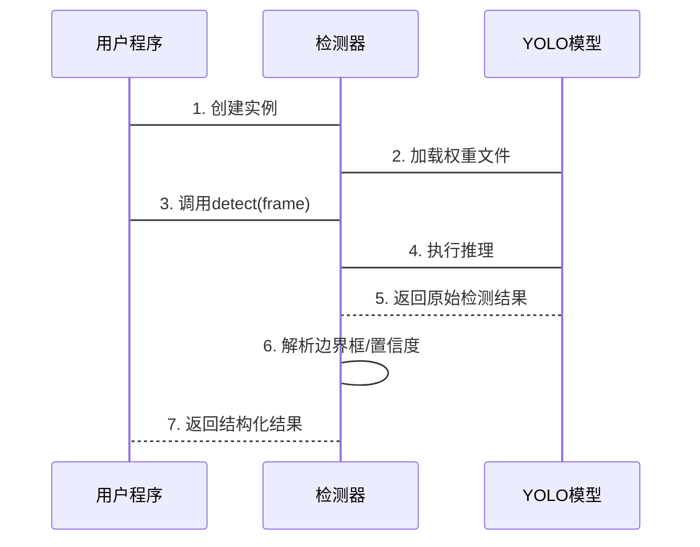

# 第2章：Sora水印检测器

在上一章[视频加载器](01_videoloader_.md)中，我们学会了如何打开视频并获取单帧画面

现在面临的问题是：如何在这些画面中找到需要去除的水印？

这就是`SoraWaterMarkDetector`的使命——它如同专业侦探，能精准定位每一帧中的Sora水印

## 核心功能

在复杂视频画面中定位半透明水印极具挑战性。传统基于颜色或形状的检测方法效果有限，因为水印外观会随背景变化。

**技术方案：** 通过YOLO深度学习模型，该检测器能自动识别每帧画面中的水印位置，返回其精确坐标和置信度。

## 关键技术

- **深度学习：** 模型通过数千张带水印/无水印的样本训练，学习水印特征
- **YOLO模型：** =="You Only Look Once"架构==，单次扫描即可完成目标检测
- **边界框(BBox)：** 以(x1,y1,x2,y2)坐标表示水印矩形区域
- **置信度：** 0-1之间的数值，表示检测结果的可靠程度

## 使用指南

### 1. 初始化检测器

```python
from sorawm.watermark_detector import SoraWaterMarkDetector

detector = SoraWaterMarkDetector()  # 自动加载YOLO模型
print("水印检测器准备就绪！")
```

首次使用时会下载模型文件（详见[下载工具](08_download_utilities__download_utils_py_.md)）

### 2. 单帧检测

```python
from sorawm.utils.video_utils import VideoLoader

loader = VideoLoader("示例视频.mp4")
frame = next(iter(loader))  # 获取首帧

result = detector.detect(frame)
if result["detected"]:
    print(f"水印位置: {result['bbox']}")
    print(f"置信度: {result['confidence']:.2%}")
```

输出示例：
```
水印位置: (1700, 950, 1900, 1050)  
置信度: 98.00%
```

### 3. 批量处理视频

```python
watermark_log = []
for i, frame in enumerate(loader):
    if i >= 10:  # 仅处理前10帧示例
        break
    result = detector.detect(frame)
    if result["detected"]:
        watermark_log.append({
            "帧序号": i,
            "坐标": result["bbox"],
            "置信度": result["confidence"]
        })

print(f"在{len(watermark_log)}帧中检测到水印")
```

## 技术实现

### 工作流程

1. **初始化**：加载YOLO模型至指定设备(CPU/GPU)
2. **检测**：将输入图像送入模型推理
3. **后处理**：提取置信度最高的检测结果
4. **输出**：返回标准化字典格式



### 核心代码

```python
class SoraWaterMarkDetector:
    def __init__(self):
        self.model = YOLO(预训练权重路径)
        self.model.to(计算设备)
        self.model.eval()

    def detect(self, frame):
        results = self.model(frame, verbose=False)
        if not results[0].boxes:
            return {"detected": False}
        
        box = results[0].boxes[0]
        x1, y1, x2, y2 = map(int, box.xyxy[0].tolist())
        return {
            "detected": True,
            "bbox": (x1, y1, x2, y2),
            "confidence": float(box.conf[0]),
            "center": ((x1+x2)//2, (y1+y2)//2)
        }
```

## 总结

`SoraWaterMarkDetector`通过：
- 基于深度学习的精准检测
- 实时处理能力
- 结构化结果输出

为水印清除提供了关键的位置信息。

下一步将使用[水印清除器](03_watermarkcleaner_.md)基于这些检测结果进行水印去除。

