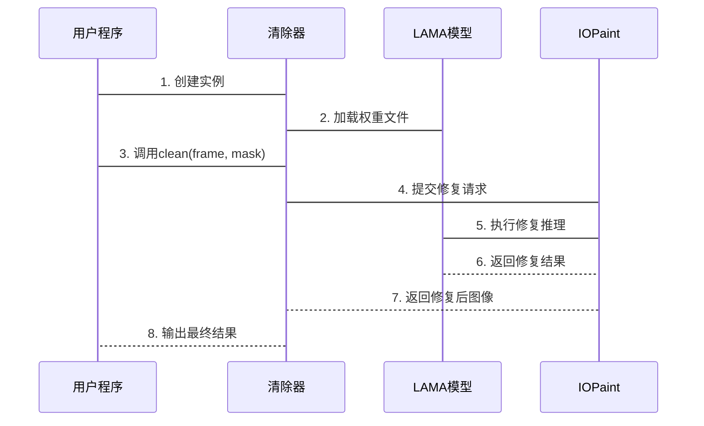

# 第3章：水印清除器

在上一章[Sora水印检测器](02_sorawatermarkdetector_.md)中，我们学会了如何定位视频帧中的水印位置

但仅仅知道水印在哪里还不够——我们需要让它**彻底消失**

这就是`WaterMarkCleaner`的使命，它如同数字魔法师，能智能修复水印区域，让画面恢复自然。

## 核心功能

简单覆盖水印会导致明显修补痕迹。水印常出现在复杂背景（如人脸、风景、文字）上，需要根据周围像素**智能生成**修复内容。

**技术方案：** ==基于LAMA深度学习模型==，通过图像修复(inpainting)技术，对检测到的水印区域进行**无缝填充**。

## 关键技术

- **图像修复(Inpainting):** 核心算法，根据周边像素智能生成修复内容
- **LAMA模型:** 专为大区域修复优化的深度学习模型
- **掩膜(Mask):** 黑白矩阵，白色区域标记需修复的水印位置
- **IOPaint库:** 提供模型管理和==修复==流程封装

## 使用指南

### 1. 初始化清除器

```python
from sorawm.watermark_cleaner import WaterMarkCleaner

cleaner = WaterMarkCleaner()  # 自动加载LAMA模型
print("水印清除器准备就绪！")
```

首次使用时会下载模型文件（详见[下载工具](08_download_utilities__download_utils_py_.md)）。

### 2. 创建掩膜

```python
import numpy as np

# 假设视频帧尺寸为1080p
height, width = 1080, 1920
mask = np.zeros((height, width), dtype=np.uint8)  # 全黑掩膜

# 标记水印区域为白色(255)
x1, y1, x2, y2 = 1700, 950, 1900, 1050  # 检测器返回的坐标
mask[y1:y2, x1:x2] = 255
```

### 3. 执行修复

```python
# 假设frame是从VideoLoader获取的视频帧
cleaned_frame = cleaner.clean(frame, mask)  //通过 frame 和 mask 实现

print(f"修复后帧尺寸: {cleaned_frame.shape}")
```

## 实现

### 工作流程

1. **初始化**：加载LAMA模型至指定设备(CPU/GPU)
2. **修复准备**：将原始帧与掩膜转换为模型输入格式
3. **智能修复**：LAMA模型分析周边纹理生成修复内容
4. **后处理**：调整输出色彩空间并返回结果



### 代码

```python
class WaterMarkCleaner:
    def __init__(self):
        self.model_manager = ModelManager("lama")  # 初始化LAMA模型
        self.inpaint_request = InpaintRequest()  # 默认修复参数

    def clean(self, frame, mask):
        # 执行修复并转换色彩空间
        result = self.model_manager(frame, mask, self.inpaint_request)
        return cv2.cvtColor(result, cv2.COLOR_BGR2RGB)
```

## 总结

`WaterMarkCleaner`通过：
- 基于深度学习的智能修复
- 精确的掩膜定位
- 自动化处理流程
实现了水印的无痕去除。

下一步将整合[视频加载器](01_videoloader_.md)、[水印检测器](02_sorawatermarkdetector_.md)和清除器，构建完整的水印去除流程。

