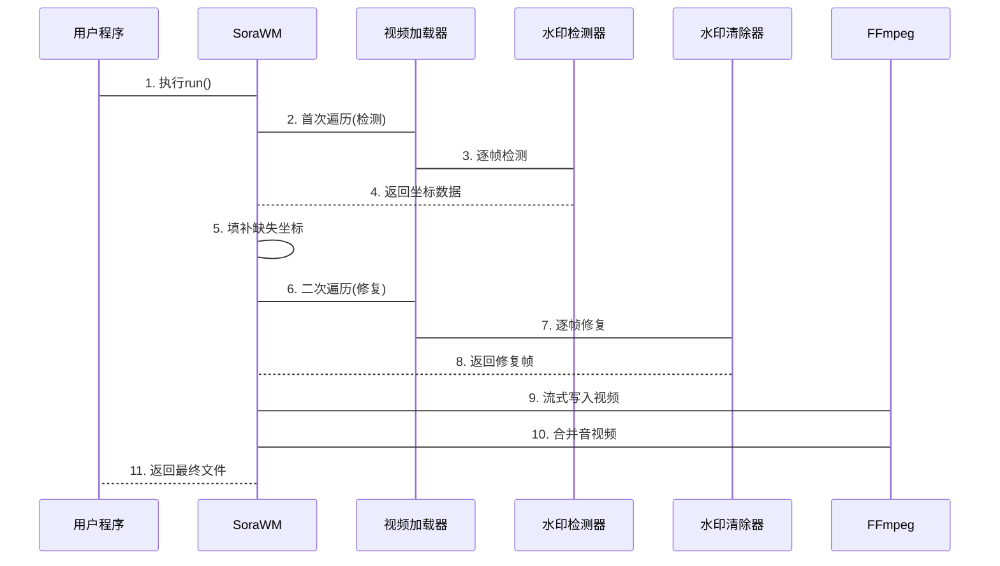

# 第4章：SoraWM（水印清除主模块）

在前几章中，我们已经构建了强大的工具链：
* [视频加载器](01_videoloader_.md)：逐帧提取视频画面的"数字播放器"（ffmeg）
* [Sora水印检测器](02_sorawatermarkdetector_.md)：精准定位水印的"AI侦探"（yolo）
* [水印清除器](03_watermarkcleaner_.md)：智能修复画面的"数字画师"（IOpaits（lama））

现在面临的问题是：如何自动化处理**完整视频**？

`SoraWM`就是这个流程的"总指挥"，能==智能调度==各个模块，完成从水印检测到最终视频生成的==全流程==处理。

## 核心功能

完整视频水印清除包含多个复杂步骤：
1. **逐帧检测**：定位每帧画面中的水印位置
2. **智能填补**：对漏检帧进行位置预测
3. **批量修复**：对标记区域执行修复
4. **视频重建**：将修复后的帧重新编码为视频
5. **音轨合并**：保留原始音频并合成到新视频

> **技术方案：** 通过两阶段处理流程（检测+修复）和智能填补算法，确保长视频处理的稳定性和可靠性。

## 使用指南

### 1. 初始化模块

```python
from sorawm.core import SoraWM

processor = SoraWM()  # 自动加载检测器和清除器
print("水印清除系统准备就绪！")
```

### 2. 执行处理流程

```python
from pathlib import Path

input_file = Path("输入视频.mp4")
output_file = Path("输出视频_无水印.mp4")

# 进度回调函数示例
def show_progress(percent):
    print(f"处理进度: {percent}%")

processor.run(input_file, output_file, progress_callback=show_progress)
```

控制台将显示~
```
检测水印: 100%|████| 300/300 [00:15<00:00]
修复水印: 100%|████| 300/300 [01:02<00:00]
音频合并完成！
```

## 技术实现

### 🎢两阶段处理流程

1. **检测阶段**：
   - 遍历所有帧并记录水印位置
   - 对漏检帧使用滑动窗口预测算法填补坐标
   - 生成水印位置映射表

2. **修复阶段**：
   - 二次遍历视频帧
   - 根据映射表创建修复掩膜
   - 调用清除器进行逐帧修复
   - 通过FFmpeg流式写入临时视频文件

3. **后处理阶段**：
   - 提取原始视频音轨
   - 与修复后视频合并
   - 清理临时文件



### 核心算法

**智能填补算法**：
```python
def impute_missing_bboxes(bbox_sequence):
    for i in range(len(bbox_sequence)):
        if bbox_sequence[i] is None:
            # 向前查找最近的有效坐标
            prev = next((b for b in bbox_sequence[:i][::-1] if b is not None), None)
            # 向后查找最近的有效坐标  
            next_ = next((b for b in bbox_sequence[i:] if b is not None), None)
            
            if prev and next_:
                # 线性插值计算中间坐标
                bbox_sequence[i] = interpolate(prev, next_, i)
```

## 总结

`SoraWM`作为核心调度模块：
- 实现全自动化视频水印清除
- 通过==两阶段处理==确保稳定性
- 智能填补算法提升容错能力
- 保持原始音视频质量

下一步可通过[FastAPI服务](05_fastapi_web_server_.md)将功能开放为网络服务。

