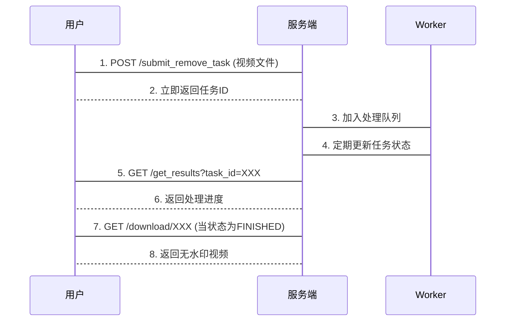
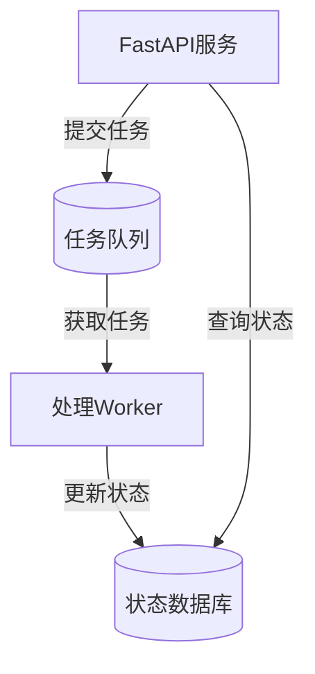

# 第5章：FastAPI网络服务

在上一章[SoraWM水印清除器](04_sorawm__watermark_remover__.md)中，我们构建了能自动清除视频水印的强大工具

但如何让这项服务通过互联网对外提供？

这就是**FastAPI网络服务**的使命——它如同项目的"服务前台"，==将核心功能封装为可通过网络调用的API接口==。

## 核心功能

传统使用方式要求用户：
1. 本地安装Python环境
2. 手动调用处理脚本
3. 具备计算资源（如GPU）

**技术方案：** 通过RESTful API提供标准化服务：
- 视频上传接口
- 任务状态查询
- 结果文件下载

所有交互通过HTTP协议完成，支持高并发处理。

## 关键技术

- **FastAPI框架：** 高性能Python Web框架，自动生成交互式API文档
- **异步处理：** 使用BackgroundTasks实现长任务非阻塞处理
- **任务队列：** 通过Worker模块解耦请求处理与实际运算
- **状态管理：** 数据库记录任务进度和结果路径

## 接口设计

### 1. 启动服务

```bash
python start_server.py
```
服务启动后监听`http://0.0.0.0:5344`，访问`/docs`可查看交互式API文档。

### 2. 接口说明

| 端点                  | 方法 | 功能             | 参数     | 响应     |
| --------------------- | ---- | ---------------- | -------- | -------- |
| `/submit_remove_task` | POST | 提交视频处理请求 | 视频文件 | 任务ID   |
| `/get_results`        | GET  | 查询任务状态     | task_id  | 进度状态 |
| `/download/{task_id}` | GET  | 下载处理结果     | task_id  | 视频文件 |

### 3. 典型交互流程



## 实现细节

### 核心代码结构

```
sorawm/server/
├── app.py          # FastAPI应用初始化
├── router.py       # API端点定义
├── worker.py       # 任务队列实现
├── schemas.py      # 数据模型定义
└── lifespan.py     # 服务生命周期管理
```

### 异步处理示例

```python
@router.post("/submit_remove_task")
async def submit_task(background_tasks: BackgroundTasks, video: UploadFile):
    task_id = generate_id()
    video_path = save_upload(video)
    
    # 非阻塞加入处理队列
    background_tasks.add_task(worker.process_video, task_id, video_path)
    
    return {"task_id": task_id}
```

### 状态管理机制

```python
class TaskStatus(str, Enum):
    UPLOADING = "UPLOADING"
    PROCESSING = "PROCESSING"
    FINISHED = "FINISHED"
    ERROR = "ERROR"

class TaskInfo(BaseModel):
    task_id: str
    status: TaskStatus
    progress: float
    output_path: Optional[Path]
```

## 总结

FastAPI服务通过：
- 清晰的接口设计
- 异步任务处理
- 完善的进度反馈
将核心功能转化为易用的网络服务。

下一步将学习[任务队列系统](06_worker_queue__wmremovetaskworker__.md)，了解如何高效管理后台处理任务

----

# 第6章：任务队列系统（WMRemoveTaskWorker）

在上一章[FastAPI网络服务](05_fastapi_web_server_.md)中，我们实现了视频上传和任务跟踪功能。但视频水印清除是计算密集型任务，直接在Web服务中处理会导致请求阻塞——这就是**任务队列系统**的价值所在，它如同"后台厨师"，专门负责耗时任务的执行。

## 核心功能解析

传统Web服务在处理长任务时会面临：
- 请求响应延迟
- 并发能力受限
- 任务状态丢失风险

**技术方案：** 通过异步任务队列实现：
- Web服务快速响应请求
- 后台Worker顺序处理任务
- 数据库实时记录进度

## 系统架构

### 组件关系



### 关键流程

1. **任务提交**：Web服务接收视频后立即返回任务ID，将任务加入队列
2. **任务处理**：Worker从队列获取任务，调用SoraWM处理视频
3. **进度更新**：通过回调函数实时更新数据库进度
4. **结果返回**：处理完成后记录输出文件路径

## 实现细节

### 核心类设计

```python
class WMRemoveTaskWorker:
    def __init__(self):
        self.queue = asyncio.Queue()  # 异步任务队列
        self.sora_wm = None  # 延迟加载SoraWM

    async def initialize(self):
        """初始化时加载AI模型"""
        self.sora_wm = SoraWM()

    async def run(self):
        """核心处理循环"""
        while True:
            task_id, video_path = await self.queue.get()
            await self._process_task(task_id, video_path)

    async def _process_task(self, task_id: str, video_path: Path):
        """单个任务处理流程"""
        try:
            # 更新任务状态为处理中
            await self._update_status(task_id, "PROCESSING")
            
            # 定义进度回调
            def progress_callback(pct):
                asyncio.create_task(self._update_progress(task_id, pct))

            # 执行水印清除（同步函数转异步执行）
            await asyncio.to_thread(
                self.sora_wm.run,
                video_path,
                output_path:=get_output_path(task_id),
                progress_callback
            )

            # 更新任务状态为完成
            await self._update_status(task_id, "FINISHED", output_path)
        except Exception as e:
            await self._update_status(task_id, "ERROR", error=str(e))
        finally:
            self.queue.task_done()
```

### 关键技术点

1. **异步队列管理**：
   - 使用`asyncio.Queue`实现线程安全的任务缓冲
   - `queue.get()`自动阻塞等待新任务

2. **进度回调机制**：
   ```python
   def progress_callback(pct):
       asyncio.create_task(worker._update_progress(task_id, pct))
   ```
   通过创建子协程避免阻塞主处理线程

3. **同步转异步处理**：
   ```python
   await asyncio.to_thread(self.sora_wm.run, ...)
   ```
   将同步的SoraWM执行过程放到独立线程

## 数据库设计

### 任务状态表

| 字段        | 类型     | 描述                                |
| ----------- | -------- | ----------------------------------- |
| id          | UUID     | 任务唯一标识                        |
| status      | Enum     | 任务状态（上传中/处理中/完成/错误） |
| progress    | Integer  | 处理进度百分比                      |
| input_path  | String   | 原始视频路径                        |
| output_path | String   | 处理后视频路径                      |
| created_at  | DateTime | 任务创建时间                        |

## 总结

任务队列系统通过：
- 异步任务分发
- 独立处理进程
- 实时状态追踪
构建了稳定高效的后台处理能力。

下一步将介绍[系统配置管理](07_configuration__configs_py_.md)，实现参数集中化控制。

