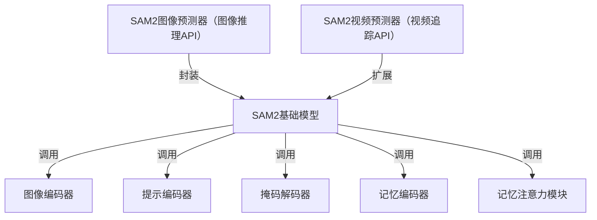

链接：

# docs：SAM2图像分割框架

SAM2是一个强大的**对象分割**框架，适用于静态*图像*和动态*视频*场景。其核心`SAM2基础模型`作为中央处理单元，协调多个专业组件协同工作：`图像编码器`处理视觉输入，`提示编码器`解析用户交互（如点击或框选），`掩码解码器`生成最终分割结果。针对视频任务，系统通过`记忆编码器`存储对象信息，并利用`记忆注意力`机制实现跨帧追踪，从而智能地*实现时序对象跟踪*。框架还提供用户友好的`SAM2图像预测器`和`SAM2视频预测器`API接口，将复杂系统封装为易用工具。

## 架构

## 章节目录

1. [SAM2图像预测器（图像推理API）](01_sam2imagepredictor__image_inference_api__.md)
2. [SAM2视频预测器（视频追踪API）](02_sam2videopredictor__video_tracking_api__.md)
3. [SAM2基础模型](03_sam2base_model_.md)
4. [图像编码器](04_image_encoder_.md)
5. [提示编码器](05_prompt_encoder_.md)
6. [掩码解码器](06_mask_decoder_.md)
7. [记忆编码器](07_memory_encoder_.md)
8. [记忆注意力模块](08_memory_attention_.md)

---
