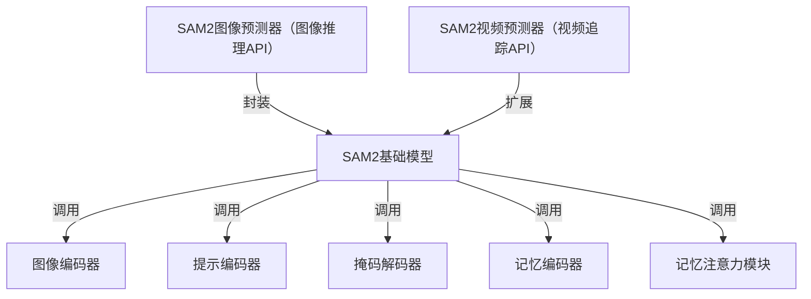

链接：[Update: Expanding access to Meta Segment Anything 2.1 on Amazon SageMaker JumpStart](https://ai.meta.com/blog/segment-anything-2/)

[SAM 2: Segment Anything in Images and Videos | Research - AI at Meta](https://ai.meta.com/research/publications/sam-2-segment-anything-in-images-and-videos/)

# docs：SAM2图像分割框架

SAM2是一个强大的**对象分割**框架，适用于静态*图像*和动态*视频*场景。其核心`SAM2基础模型`作为中央处理单元，协调多个专业组件协同工作：`图像编码器`处理视觉输入，`提示编码器`解析用户交互（如点击或框选），`掩码解码器`生成最终分割结果。针对视频任务，系统通过`记忆编码器`存储对象信息，并利用`记忆注意力`机制实现跨帧追踪，从而智能地*实现时序对象跟踪*。框架还提供用户友好的`SAM2图像预测器`和`SAM2视频预测器`API接口，将复杂系统封装为易用工具。

## 架构

## 章节目录

1. [SAM2图像预测器（图像推理API）](01_sam2imagepredictor__image_inference_api__.md)
2. [SAM2视频预测器（视频追踪API）](02_sam2videopredictor__video_tracking_api__.md)
3. [SAM2基础模型](03_sam2base_model_.md)
4. [图像编码器](04_image_encoder_.md)
5. [提示编码器](05_prompt_encoder_.md)
6. [掩码解码器](06_mask_decoder_.md)
7. [记忆编码器](07_memory_encoder_.md)
8. [记忆注意力模块](08_memory_attention_.md)

---

# Meta开源更新：在Amazon SageMaker JumpStart上扩展Meta Segment Anything 2.1的访问权限  
2025年2月12日 • 15分钟阅读  

2025年2月12日更新：  

去年7月，我们发布了Meta Segment Anything 2（SAM 2），作为我们广受欢迎的开源分割模型的后续版本，为开发者提供了一个统一的模型，用于实时可提示的图像和视频对象分割与追踪。SAM 2在社区中产生了巨大影响，包括简化视频数据标注、辅助自然灾害后的恢复工作、追踪野生动物、数字时装设计等。去年秋天，我们发布了Meta Segment Anything 2.1（SAM 2.1），其中包含一个性能更强的更新检查点，并提升了在视觉相似对象和遮挡情况下的表现。  

我们一直在倾听社区的反馈，并不断寻找改进SAM的机会，让更多开发者能够使用它。从今天开始，SAM 2.1已在Amazon SageMaker JumpStart上提供，使得部署SAM 2.1并将其集成到新应用和工作流中变得前所未有的简单。Amazon SageMaker AI在我们训练SAM模型的过程中一直是重要的合作伙伴，我们很高兴继续与AWS合作，将SAM 2.1的能力带给更多人。  

点击此处了解更多关于SAM 2.1在Amazon SageMaker JumpStart中的信息。  

2024年7月29日发布：  

## 介绍SAM 2：下一代Meta Segment Anything模型，支持视频和图像  

### 要点：  
- 继Meta Segment Anything Model（SAM）在图像领域的成功后，我们发布了SAM 2，这是一个统一的模型，用于实时可提示的图像和视频对象分割，实现了最先进的性能。  
- 秉承我们对开放科学的承诺，我们以宽松的Apache 2.0许可证分享代码和模型权重。  
- 我们还分享了SA-V数据集，包含约51,000个真实世界视频和超过600,000个掩膜片段（时空掩膜）。  
- SAM 2可以分割任何视频或图像中的任何对象，即使是之前未见过的对象和视觉领域，无需自定义适配即可支持多样化的用例。  
- SAM 2具有许多潜在的实际应用。例如，其输出可与生成式视频模型结合，创造新的视频效果和创意应用。它还可以用于构建更快的视觉数据标注工具，以训练更好的计算机视觉系统。  

### SAM 2的预览  
我们提供了一个基于网络的演示，允许在视频中分割和追踪对象并应用效果。  

今天，我们宣布推出Meta Segment Anything Model 2（SAM 2），这是Meta Segment Anything Model的下一代版本，现在支持视频和图像中的对象分割。我们以Apache 2.0许可证发布SAM 2，任何人都可以使用它来构建自己的体验。我们还以CC BY 4.0许可证分享了用于构建SAM 2的SA-V数据集，并发布了一个基于网络的演示体验，让每个人都能尝试我们的模型。  

### 对象分割的重要性  
对象分割——识别图像中与目标对象对应的像素——是计算机视觉领域的一项基本任务。去年发布的Meta Segment Anything Model（SAM）为这一任务提供了一个基础模型。  

我们的最新模型SAM 2是第一个统一的实时可提示图像和视频对象分割模型，实现了视频分割体验的飞跃，并支持跨图像和视频应用的无缝使用。SAM 2在图像分割准确性上超越了之前的能力，并在视频分割性能上优于现有工作，同时所需的交互时间减少了三倍。SAM 2还可以分割任何视频或图像中的任何对象（通常称为零样本泛化），这意味着它可以应用于未见过的视觉内容，而无需自定义适配。  

### SAM 2的开放科学  
秉承我们的开放科学方法，我们与社区分享了SAM 2的研究成果，以便他们探索新的能力和用例。我们今天分享的内容包括：  
- **SAM 2代码和权重**：以Apache 2.0许可证开源。  
- **SA-V数据集**：比现有最大的视频分割数据集多4.5倍的视频和53倍的标注。  
- **网络演示**：支持短视频的实时交互式分割，并在模型预测上应用视频效果。  

### SAM 2的构建  
SAM能够学习图像中对象的一般概念。然而，图像只是动态现实世界的静态快照，其中视觉片段可能表现出复杂的运动。许多重要的实际用例需要视频数据中的准确对象分割，例如混合现实、机器人、自动驾驶和视频编辑。我们认为，通用分割模型应同时适用于图像和视频。  

### 提示式视觉分割  
我们设计了一个提示式视觉分割任务，将图像分割任务推广到视频领域。SAM 2可以接受视频中任何帧的输入提示来定义时空掩膜（即“掩膜片段”），并预测目标对象在所有视频帧中的掩膜片段。  

### 统一架构  
SAM 2的架构可以看作是SAM从图像领域到视频领域的推广。SAM 2可以通过点击（正或负）、边界框或掩膜来提示定义对象在给定帧中的范围。轻量级掩膜解码器接收当前帧的图像嵌入和编码提示，输出该帧的分割掩膜。在视频设置中，SAM 2将此掩膜预测传播到所有视频帧以生成掩膜片段。  

### 内存机制  
为了在所有视频帧中准确预测掩膜，我们引入了由内存编码器、内存库和内存注意力模块组成的内存机制。当应用于图像时，内存组件为空，模型的行为类似于SAM。对于视频，内存组件能够存储关于对象和先前用户交互的信息，使SAM 2能够在整个视频中生成掩膜片段预测。  

### SA-V数据集  
扩展“分割任何内容”能力到视频的一个挑战是缺乏用于训练模型的标注数据。当前的视频分割数据集规模小且缺乏多样性。为了收集一个大规模且多样化的视频分割数据集，我们构建了一个数据引擎，利用交互式模型与人类标注者的循环设置。  

### 结果  
SAM 2在17个零样本视频数据集上的交互式视频分割性能显著优于之前的方法，并且需要大约三倍更少的人工交互。SAM 2在23个零样本基准测试中优于SAM，同时速度快六倍。SAM 2在现有视频对象分割基准（DAVIS、MOSE、LVOS、YouTube-VOS）上优于之前的最先进模型。  

### 局限性  
尽管SAM 2在图像和短视频中的对象分割上表现出色，但其性能在具有挑战性的场景中仍有提升空间。例如，在剧烈的相机视角变化、长时间遮挡、拥挤场景或长视频中，SAM 2可能会丢失目标对象的追踪。  

### 未来展望  
我们鼓励AI社区下载模型、使用数据集并尝试我们的演示。通过分享这项研究，我们希望为通用视频和图像分割及相关感知任务的进展做出贡献。我们期待看到社区通过这项研究创造的新见解和有用体验。  
