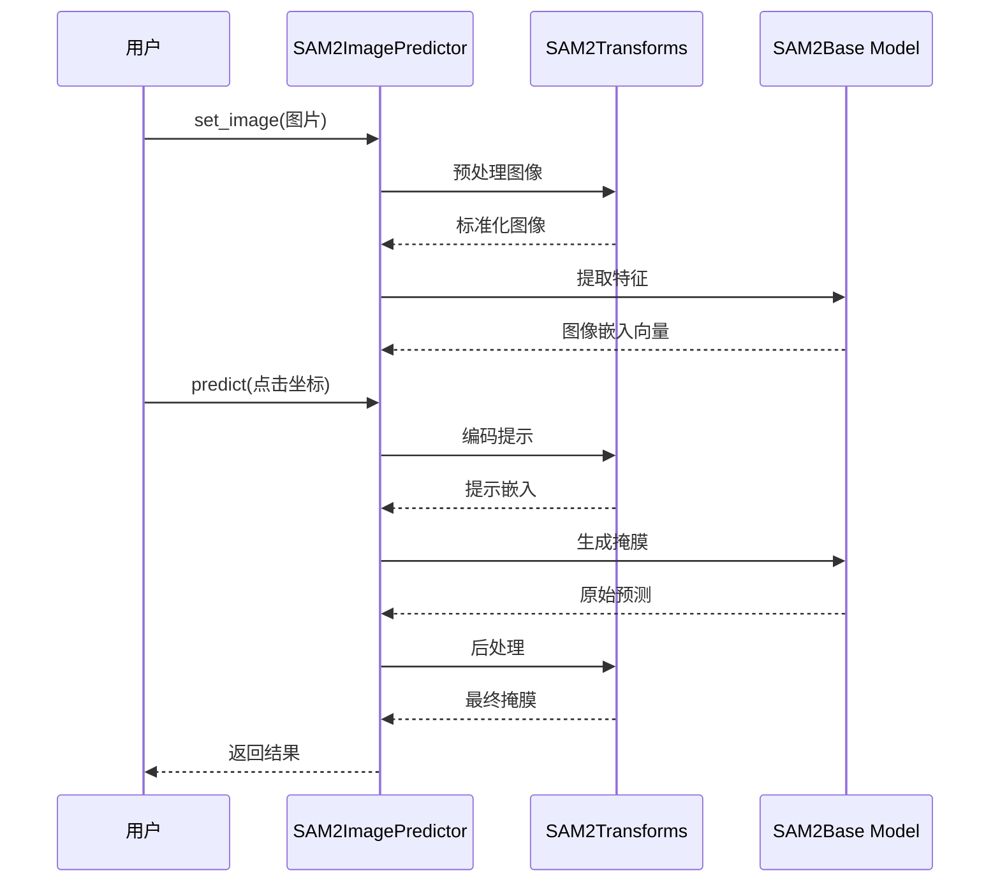

# 第一章：SAM2图像预测器（图像推理API）

欢迎来到SAM-2

本章我们将认识第一个重要工具：`SAM2ImagePredictor`。它如同一位全能的智能助手，专门用于**单张图像**中的对象识别与"抠图"。

### 功能定位

假设有一张宠物猫的照片，希望精确选中猫咪并将其与背景分离——这就是**图像分割**任务。

表面看似简单，实则包含像素解析、AI模型运算、结果优化等复杂步骤。

`SAM2ImagePredictor`的价值在于：它==将[SAM2基础模型](03_sam2base_model_.md)的强大能力封装为易用接口==。

只需提供图像和简单提示（如点击目标对象），即可获得完美的对象轮廓

### 智能助手的工作流程

让我们拆解`SAM2ImagePredictor`的三大核心职能：

1. **输入预处理**  
   当传入原始图像时，系统会执行==标准化操作==：调整尺寸、色彩归一化。若提供点击或框选提示，也会同步进行==编码==处理。

2. **核心推理**  
   预处理后的数据送入[SAM2基础模型](03_sam2base_model_.md)——这个"大脑"负责==解析==图像特征并生成==原始掩膜预测==。

3. **结果优化**  
   对原始预测结果进行升采样（还原原始尺寸）、孔洞填充、噪点消除等后处理，输出精细分割结果。

简言之，`SAM2ImagePredictor`是==单图分割的一站式解决方案==，所有技术细节都已封装在简洁API之下

### 实战演示

**步骤1：初始化预测器**

```python
from sam2.sam2_image_predictor import SAM2ImagePredictor
from sam2.build_sam import build_sam2_hf

# 加载预训练模型（示例使用hiera-large架构）
sam_model = build_sam2_hf(model_id="facebook/sam2-hiera-large")
predictor = SAM2ImagePredictor(sam_model)  # 创建预测器实例
```
> *说明*：首先加载核心模型，再将其封装为预测器接口。

**步骤2：载入图像**

```python
import numpy as np
from PIL import Image

# 实际应用时应替换为真实图片路径
# image = np.array(Image.open("cat.jpg").convert("RGB"))
demo_image = np.zeros((256, 256, 3), dtype=np.uint8)  # 创建示例黑图
predictor.set_image(demo_image)  # 载入预测器
```
*说明*：`set_image()`方法会==自动执行图像标准化和特征提取==(底层已封装设计好给调用)，为后续快速推理做准备。

**步骤3：交互式预测**

```python
# 模拟在图像中心(128,128)处点击选中对象
click_point = np.array([[128, 128]])  # 坐标格式为[X,Y]
click_label = np.array([1])  # 1表示前景，0表示背景

# 执行预测（multimask_output=False表示只返回最优结果）
masks, scores, _ = predictor.predict(
    point_coords=click_point,
    point_labels=click_label,
    multimask_output=False
)

print(f"预测掩膜形状：{masks.shape}")  # 输出示例：(1, 256, 256)
print(f"置信度评分：{scores.item():.2f}")  # 范围0-1，越高越可靠
```
*说明*：通过点击坐标生成交互提示，==预测器返回二值化掩膜（True/False矩阵）和置信度评分==

### ⭕技术

让我们用厨房比喻解析内部流程：

1. **食材准备**（`set_image`）  
   用户提供生鲜食材（原始图像），由帮厨（`SAM2Transforms`）进行清洗切配（尺寸归一化/标准化），主厨（`SAM2Base Model`）提取风味特征（图像嵌入向量）

2. **烹饪指令**（`predict`）  
   用户指定口味偏好（点击/框选提示），帮厨转化为标准食谱（提示编码）。主厨结合食材特征和食谱，用专业厨具（`sam_mask_decoder`）烹制原始菜品（低分辨率掩膜）

3. **摆盘装饰**（后处理）  
   帮厨进行最后摆盘：放大至原尺寸、修补瑕疵、去除杂质，呈现完美料理（最终分割结果）



### 关键代码

1. **图像特征提取**  
   ```python
   # sam2/sam2_image_predictor.py 节选
   def set_image(self, image: Union[np.ndarray, Image]) -> None:
       input_image = self._transforms(image)  # 预处理
       backbone_out = self.model.forward_image(input_image)  # 特征提取
       self._features = {"image_embed": feats[-1], "high_res_feats": feats[:-1]}
   ```
   *技术点*：通过`forward_image`方法提取多尺度图像特征，存储供后续快速调用。

2. **掩膜生成核心**  
   ```python
   # 预测流程关键代码
   sparse_embeddings, dense_embeddings = self.model.sam_prompt_encoder(
       points=(point_coords, point_labels),
       boxes=None, 
       masks=None
   )
   
   low_res_masks = self.model.sam_mask_decoder(
       image_embeddings=self._features["image_embed"],
       sparse_prompt_embeddings=sparse_embeddings,
       dense_prompt_embeddings=dense_embeddings
   )
   ```
   *技术点*：提示编码器（[第五章](05_prompt_encoder_.md)）将用户交互转为数学表达，掩膜解码器（[第六章](06_mask_decoder_.md)）结合图像特征生成预测。
   
3. **结果精修**  
   ```python
   masks = self._transforms.postprocess_masks(
       low_res_masks, 
       original_size  # 还原原始尺寸
   )
   masks = masks > self.mask_threshold  # 二值化处理
   ```
   *技术点*：==后处理模块确保输出掩膜与输入图像像素级对齐，并通过阈值过滤噪声==。

### 小结

`SAM2ImagePredictor`作为SAM-2的静态图像处理入口，完美实现了：

- 复杂技术栈的简洁==封装==
- 交互式提示的==实时==响应
- 工业级精度的==分割==输出

当需要处理视频中的==运动对象==时，我们将请出更强大的`SAM2VideoPredictor`——

[下一章：SAM2视频预测器（视频追踪API）](02_sam2videopredictor__video_tracking_api__.md)

