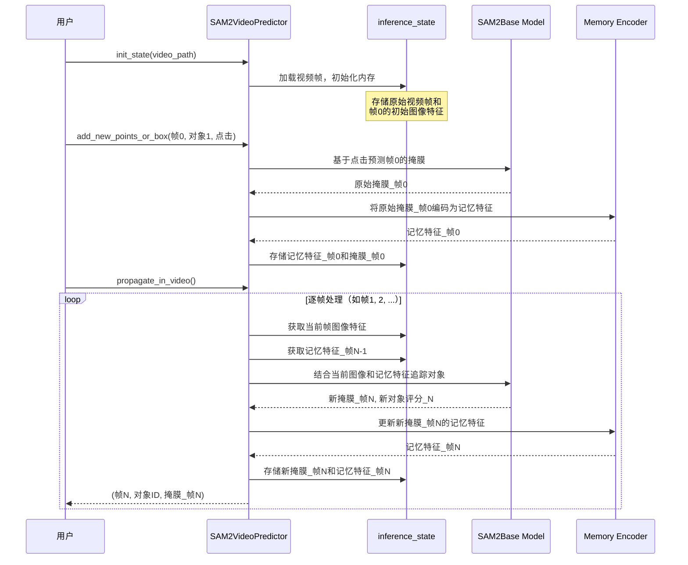
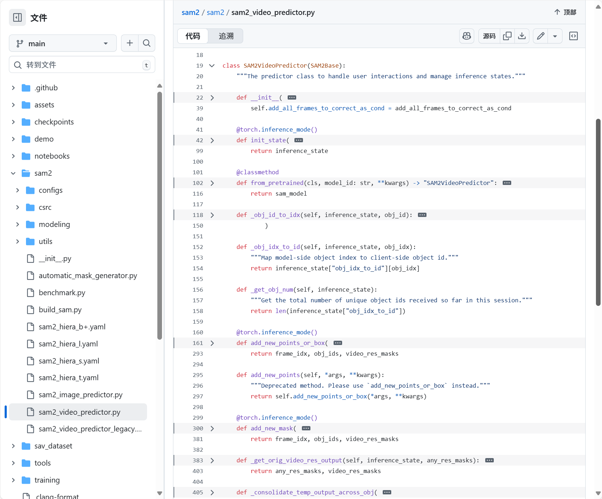
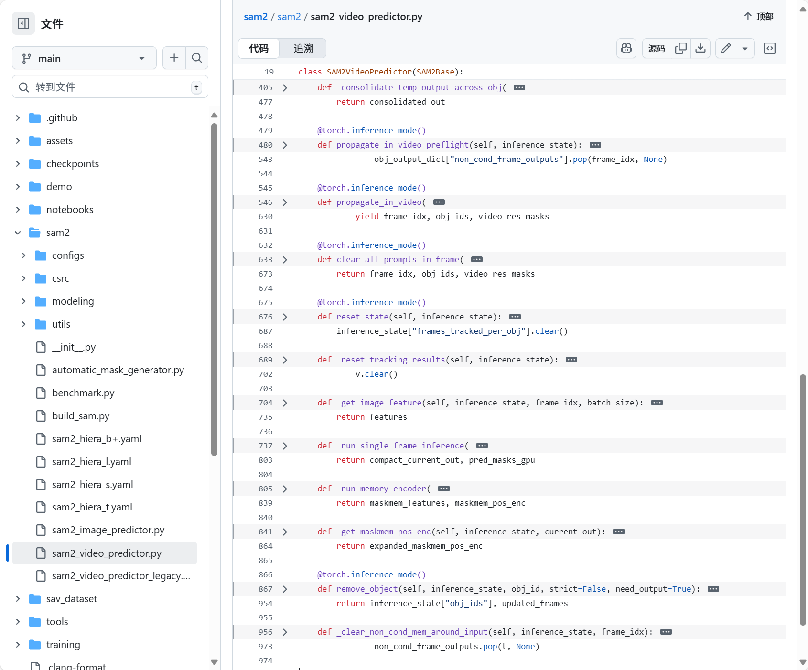

# 第二章：SAM2视频预测器（视频追踪API）

欢迎回来

在[第一章：SAM2图像预测器（图像推理API）](01_sam2imagepredictor__image_inference_api_.md)中，我们学习了`SAM2ImagePredictor`如何帮助我们精确地从*单张*图片中分割对象。它就像是为静态图像配备了一位超级智能的修图师。

但如果你的目标对象不是静止的呢？如果你的宠物猫正在视频中奔跑，而你希望每一帧都能突出显示它，手动在数百甚至数千帧中点击猫咪简直是噩梦！

这时，我们的下一个强大工具`SAM2VideoPredictor`就派上用场了。你可以把它想象成SAM-2的专属**视频追踪导演**。它不仅能够编辑单张图像，还能智能地==追踪并分割==视频中移动的对象。

### 解决的问题

`SAM2VideoPredictor`的核心任务是**视频对象分割（VOS）**，即在视频的所有帧中找到并勾勒出特定对象。

假设有一段繁忙街道的视频，==想从红车出现的那一刻开始追踪，直到它驶出画面==。这非常具有挑战性，因为：

*   **对象会移动和变形**：车辆可能转弯、靠近或被部分遮挡。
*   **光照变化**：阴影、阳光或夜晚会改变其外观。
*   **遮挡问题**：其他车辆或物体可能暂时挡住红车。

`SAM2VideoPredictor`通过记忆对象的外观、预测其位置，并根据新帧调整预测来解决这些问题。它就像一位专业的视频编辑，能够==智能地跟随==并高亮对象，即使它暂时消失又出现！

### 视频追踪导演

让我们拆解`SAM2VideoPredictor`如何完成这项复杂任务，就像导演指挥一部电影：

1.  **场景设置（`inference_state`）**：  
    在开始追踪之前，导演需要一个“项目文件”。`inference_state`是一个特殊的存储区，记录视频和待分割对象的所有重要信息，包括视频帧、初始提示（如点击红车）、历史预测以及描述对象随时间变化的“记忆特征”。随着追踪的进行，这个状态会不断更新。

2.  **初始选角（添加点击/掩膜）**：  
    你告诉导演要追踪哪个对象，通常通过在第一帧点击红车或绘制一个粗略的掩膜来完成。导演会将这些信息记录在`inference_state`中。

3.  **故事推进（视频追踪）**：  
    一旦有了初始提示，导演就会接管工作。它利用`inference_state`中的信息预测对象在*下一帧*的位置和形状，更新记忆，并继续处理后续帧。它甚至可以*反向*追踪时间，这个过程称为==分割传播==

简而言之，`SAM2VideoPredictor`根据初始指引，自动在每一帧中找到目标对象，使视频分割变得高效实用。

### 如何使用SAM2VideoPredictor

让我们通过一个简单示例来学习如何追踪视频中的对象

**步骤1：加载视频预测器**  
与图像预测器类似，我们需要准备`SAM2VideoPredictor`，这包括加载核心SAM-2模型并将其封装为视频预测工具。

```python
from sam2.build_sam import build_sam2_video_predictor_hf
import torch

# 指定设备（通常为NVIDIA GPU的"cuda"）
device = torch.device("cuda" if torch.cuda.is_available() else "cpu")

# 1. 加载专为视频追踪训练的SAM-2模型
# "facebook/sam2-hiera-base-plus"是一个示例模型ID。
predictor = build_sam2_video_predictor_hf(
    model_id="facebook/sam2-hiera-base-plus",
    device=device
)
```
*说明*：我们使用`build_sam2_video_predictor_hf`（类似于第一章的`build_sam2_hf`）加载必要组件。现在，`predictor`就是我们的视频追踪导演，准备就绪

**步骤2：初始化视频追踪项目（`inference_state`）**  
接下来，我们为导演提供视频。预测器会加载帧并设置“项目文件”（`inference_state`）。

```python
import os
import numpy as np
# 假设你有一个名为'my_video_frames'的文件夹，包含JPEG图像
# 例如：my_video_frames/00000.jpg, my_video_frames/00001.jpg等
video_dir = "my_video_frames" # 替换为你的视频帧路径

# 为此示例创建虚拟视频目录和帧
os.makedirs(video_dir, exist_ok=True)
dummy_image = np.zeros((256, 256, 3), dtype=np.uint8)
from PIL import Image
Image.fromarray(dummy_image).save(os.path.join(video_dir, "00000.jpg"))
# 添加另一帧用于追踪
Image.fromarray(dummy_image).save(os.path.join(video_dir, "00001.jpg"))

# 用视频帧初始化追踪状态
inference_state = predictor.init_state(video_path=video_dir)

print(f"视频帧数：{inference_state['num_frames']}")
print(f"视频分辨率：{inference_state['video_height']}x{inference_state['video_width']}")
```
*说明*：`init_state()`准备`inference_state`，加载视频帧（或其路径），确定视频尺寸，并==设置存储对象数据和追踪结果的内部字典==

通过处理第一帧的图像特征进行“预热”，加速后续步骤

**步骤3：为对象添加初始提示（点击/掩膜）**  
现在，我们==告诉导演*追踪哪个对象*==。通常在第一帧（索引0）点击或绘制掩膜，并为对象分配唯一ID（如1）

```python
# 假设我们在帧0的(x=100, y=150)处点击对象
ann_frame_idx = 0
ann_obj_id = 1 # 待追踪对象的唯一ID
points = np.array([[100, 150]], dtype=np.float32) # 点击坐标
labels = np.array([1], np.int32) # 标签1表示前景点

# 将此提示添加到预测器
frame_idx_out, obj_ids_out, masks_out = predictor.add_new_points_or_box(
    inference_state=inference_state,
    frame_idx=ann_frame_idx,
    obj_id=ann_obj_id,
    points=points,
    labels=labels,
)

print(f"帧{frame_idx_out}的掩膜（对象{obj_ids_out}）形状：{masks_out.shape}")
```
*说明*：`add_new_points_or_box()`接收你的提示（此处为点击），并将其应用到指定帧和对象。内部调用类似`SAM2ImagePredictor`的组件，在*单帧*中分割对象，结果（掩膜）存储在`inference_state`中，作为==对象1在帧0的起点==。

**步骤4：在视频中==传播分割==**  
最后，我们让导演开始追踪！`propagate_in_video`方法会逐帧处理整个视频，利用记忆跟随对象。

```python
all_tracked_masks = {}

# 'propagate_in_video'是一个Python生成器，
# 逐帧生成处理结果。
for frame_idx, obj_ids, video_res_masks in predictor.propagate_in_video(inference_state):
    # 'video_res_masks'包含当前帧所有追踪对象的掩膜，
    # 已调整为原始视频分辨率。
    # 我们可以存储或显示这些掩膜。
    all_tracked_masks[frame_idx] = video_res_masks
    print(f"已处理帧{frame_idx}。掩膜形状：{video_res_masks.shape}")

print(f"成功追踪{len(all_tracked_masks)}帧。")
# 循环结束后，'all_tracked_masks'将包含所有追踪帧的分割对象。
```
*说明*：`propagate_in_video()`遍历视频帧。对于每帧，它利用累积的`inference_state`（包含对象外观和运动历史）预测当前帧的掩膜，更新`inference_state`并返回结果。这是视频追踪的核心。

### 技术

让我们深入幕后，了解`SAM2VideoPredictor`的魔法。

#### 🎢工作流程
将`SAM2VideoPredictor`想象成一位经验丰富的导演，配备智能助手（`inference_state`）。

1.  **你（用户）**将视频（JPEG图像文件夹）交给导演（`SAM2VideoPredictor`）。
2.  导演让助手（`inference_state`）准备整个视频。助手加载所有帧，并为每个对象和帧创建空文件，同时从第一帧提取初始“精华”（`image_features`）。
3.  在初始帧（如帧0）点击目标对象。
4.  导演处理此点击（类似[SAM2ImagePredictor](01_sam2imagepredictor__image_inference_api_.md)的方式），获取掩膜，并将对象的第一张分割图像存入`inference_state`，形成“初始外观档案”。导演还使用[记忆编码器](07_memory_encoder_.md)计算并存储此帧的“记忆特征”。
5.  你发出指令：“在整个视频中追踪此对象！”（`propagate_in_video`）。
6.  对于后续每帧：
    *   导演从`inference_state`获取对象的最新“外观档案”和“记忆特征”。
    *   结合当前帧图像和对象历史（记忆特征），预测对象的当前位置。此步骤利用强大的[SAM2基础模型](03_sam2base_model_.md)及其[记忆注意力](08_memory_attention_.md)组件。
    *   优化预测，填补小孔，并将新掩膜和更新的“记忆特征”存回`inference_state`。
    *   展示当前帧的分割对象。

这种“预测、更新记忆、保存、移至下一帧”的循环，使`SAM2VideoPredictor`能够稳健地追踪视频中的对象。

以下是简化的工作流程图：



#### 关键代码





让我们看看`sam2/sam2_video_predictor.py`中如何实现这些步骤。

1.  **初始化（`init_state`）**  
    
    ```python
    def init_state(self, video_path, **kwargs):
        images, video_height, video_width = load_video_frames(
            video_path=video_path, image_size=self.image_size, **kwargs
        )
        
        inference_state = {
            "images": images,  # 存储所有视频帧
            "num_frames": len(images),
            "video_height": video_height,
            "video_width": video_width,
            "device": self.device,
            "point_inputs_per_obj": {},  # 每帧对象的点击输入
            "mask_inputs_per_obj": {},    # 每帧对象的掩膜输入
            "output_dict_per_obj": {},    # 追踪结果（掩膜、记忆特征）
            "obj_id_to_idx": OrderedDict(),  # 对象ID到内部索引的映射
            "obj_idx_to_id": OrderedDict(),
            "obj_ids": []
        }
        
        # 预热第一帧的图像编码器
        self._get_image_feature(inference_state, frame_idx=0, batch_size=1)
        return inference_state
    ```
    *说明*：`init_state`设置`inference_state`字典，加载视频帧，存储原始尺寸，并初始化对象数据和追踪结果的存储区。它还预处理第一帧以确保模型就绪。
    
2.  **添加初始提示（`add_new_points_or_box`）**  
    
    ```python
    def add_new_points_or_box(self, inference_state, frame_idx, obj_id, points=None, labels=None, **kwargs):
        obj_idx = self._obj_id_to_idx(inference_state, obj_id)  # 对象ID映射
        
        # 存储点击输入
        inference_state["point_inputs_per_obj"][obj_idx][frame_idx] = concat_points(
            inference_state["point_inputs_per_obj"][obj_idx].get(frame_idx, None), points, labels
        )
    
        # 运行单帧推理（类似SAM2ImagePredictor）
        current_out, _ = self._run_single_frame_inference(
            inference_state=inference_state,
            output_dict=inference_state["output_dict_per_obj"][obj_idx],
            frame_idx=frame_idx,
            batch_size=1,
            is_init_cond_frame=True,  # 标记为初始输入帧
            point_inputs=inference_state["point_inputs_per_obj"][obj_idx][frame_idx],
            mask_inputs=None,
            reverse=False,
            run_mem_encoder=False,  # 记忆编码器稍后运行
            prev_sam_mask_logits=None,
        )
        
        # 临时存储当前输出掩膜
        inference_state["temp_output_dict_per_obj"][obj_idx]["cond_frame_outputs"][frame_idx] = current_out
    
        # 返回调整到原始视频分辨率的掩膜
        consolidated_out = self._consolidate_temp_output_across_obj(inference_state, frame_idx, is_cond=True)
        _, video_res_masks = self._get_orig_video_res_output(inference_state, consolidated_out["pred_masks_video_res"])
        return frame_idx, inference_state["obj_ids"], video_res_masks
    ```
    *说明*：此方法将对象ID映射到内部索引，存储点击数据，并调用`_run_single_frame_inference`生成单帧掩膜。结果掩膜临时存入`inference_state`，并返回调整后的掩膜。
    
3.  **传播分割（`propagate_in_video`）**  
    ```python
    def propagate_in_video(self, inference_state, start_frame_idx=None, **kwargs):
        self.propagate_in_video_preflight(inference_state)  # 预处理初始输入
        
        for frame_idx in processing_order:  # 按顺序处理每帧
            pred_masks_per_obj = []
            for obj_idx in range(batch_size):
                if frame_idx in obj_output_dict["cond_frame_outputs"]:
                    current_out = obj_output_dict["cond_frame_outputs"][frame_idx]
                else:
                    # 运行追踪推理
                    current_out, pred_masks = self._run_single_frame_inference(
                        inference_state=inference_state,
                        output_dict=obj_output_dict,
                        frame_idx=frame_idx,
                        batch_size=1,
                        is_init_cond_frame=False,
                        point_inputs=None,
                        mask_inputs=None,
                        reverse=False,
                        run_mem_encoder=True,  # 启用记忆编码器更新记忆
                    )
                    obj_output_dict["non_cond_frame_outputs"][frame_idx] = current_out
                
                pred_masks_per_obj.append(pred_masks)
    
            # 返回调整后的掩膜
            all_pred_masks = torch.cat(pred_masks_per_obj, dim=0)
            _, video_res_masks = self._get_orig_video_res_output(inference_state, all_pred_masks)
            yield frame_idx, obj_ids, video_res_masks
    ```
    *说明*：此方法预处理初始输入后，逐帧追踪对象。对于每帧，它调用`_run_single_frame_inference`（启用记忆编码器），利用对象的历史记忆和当前帧特征预测新掩膜。结果掩膜调整后返回，形成连续追踪。

### 总结

`SAM2VideoPredictor`是一款复杂但用户友好的工具，将SAM-2强大的分割能力从单张图像扩展到整个视频

通过管理持久的`inference_state`并利用历史信息逐帧智能传播对象分割，==将手动视频标注转变为高效的自动化过程==。它是处理动态对象时间维度的理想解决方案。

现在，我们已经了解了`SAM2ImagePredictor`和`SAM2VideoPredictor`如何提供高级API与SAM-2交互，接下来让我们深入探索其==核心智能==：[SAM2基础模型](03_sam2base_model_.md)。

[下一章：SAM2基础模型](03_sam2base_model_.md)

