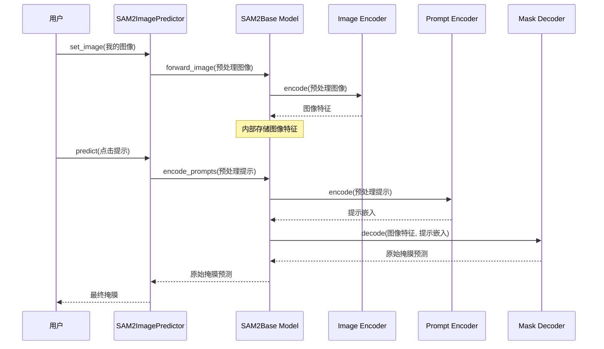

# 第三章：SAM2基础模型

欢迎回来

在[第一章：SAM2图像预测器（图像推理API）](01_sam2imagepredictor__image_inference_api_.md)中，你学会了如何分割单张图像中的对象；在[第二章：SAM2视频预测器（视频追踪API）](02_sam2videopredictor__video_tracking_api_.md)中，你掌握了如何追踪视频中的对象。这两个强大的工具就像魔法一样，只需点击几下就能轻松分割对象。

但你有没有想过，这种魔法背后的真正力量是什么？这些智能预测器的“大脑”究竟是什么？

### SAM-2的大脑：SAM2基础模型

来认识一下**`SAM2Base Model`**吧！它是整个SAM-2项目的核心智能中枢。如果说`SAM2ImagePredictor`和`SAM2VideoPredictor`是你手机上的用户友好型应用，那么`SAM2Base Model`就是手机内部*超级强大的处理器、内存和图形芯片*，让一切功能得以实现。

你不会像调用`predictor.predict()`那样直接通过代码与`SAM2Base Model`“对话”。相反，`SAM2ImagePredictor`和`SAM2VideoPredictor`就像是高度专业的助手，它们==向`SAM2Base Model`发送请求并解释其响应==。

#### 解决的问题

`SAM2Base Model`解决了一个根本性问题：**“如何理解图像或视频，并根据用户的提示==生成分割掩膜==。”**

想象你是一位指挥家，带领一支宏伟的乐团。每位乐手演奏不同的乐器（小提琴、长笛、鼓），但*你的*任务是确保他们完美协作，演奏出美妙的交响乐。

`SAM2Base Model`就是那位指挥家。它协调多个专门的“乐手”（小型专用AI组件）共同工作。它接收信息、处理信息，然后告诉这些组件该做什么，确保它们共同实现最终目标：==在对象周围绘制准确的掩膜==

### SAM-2的乐团：关键组件

`SAM2Base Model`整合了几个关键组件，每个组件都有特定的职责：

| 组件                                      | 角色（类比）   | 为`SAM2Base`提供的功能                             |
| :---------------------------------------- | :------------- | :------------------------------------------------- |
| [图像编码器](04_image_encoder_.md)        | “眼睛”         | 理解图片或视频帧的视觉内容。                       |
| [提示编码器](05_prompt_encoder_.md)       | “倾听者”       | 解析你的提示（点击、边界框），明确需要分割的内容。 |
| [掩膜解码器](06_mask_decoder_.md)         | “艺术家”       | 结合视觉理解和你的提示，*绘制*实际的掩膜。         |
| [记忆编码器](07_memory_encoder_.md)       | “短期记忆”     | 记住视频中对象在前几帧的外观。                     |
| [记忆注意力模块](08_memory_attention_.md) | “长期记忆回忆” | 将当前视觉信息与过去的记忆对比，以追踪对象。       |

> 你可以把`SAM2Base Model`想象成一个舞台，所有这些聪明的组件在上面各司其职。

它是一个统一的框架，确保它们高效沟通，共同完成最终的分割任务。

### 如何与SAM2基础模型“互动”

如前所述，作为用户，你通常==不会直接==与`SAM2Base Model`交互。相反，你会使用更高级的“助手”，比如`SAM2ImagePredictor`或`SAM2VideoPredictor`。

当你调用`predictor.set_image()`或`predictor.predict()`时，这些助手会秘密地将信息传递给`SAM2Base Model`。

`SAM2Base Model`随后执行其复杂的内部操作，协调子组件，并将原始结果返回给预测器，预测器再为你清理和呈现结果。

因此，虽然你不会编写类似`sam2_base.segment_my_image()`的代码，但理解`SAM2Base Model`的功能是掌握SAM-2核心智能的关键。

### 幕后：SAM2基础模型如何协调分割

让我们回顾一下[第一章：SAM2图像预测器](01_sam2imagepredictor__image_inference_api_.md)中的一个简单图像分割任务，看看`SAM2Base Model`如何扮演指挥家的角色。

#### 工作流程
假设你在照片中点击了一只猫。以下是`SAM2Base Model`在`SAM2ImagePredictor`协调下的简化操作序列：

1.  **图像输入**：`SAM2ImagePredictor`预处理你的图像，并将其发送给`SAM2Base Model`。
2.  **视觉理解**：`SAM2Base Model`指示其[图像编码器](04_image_encoder_.md)分析图像并提取“特征”——一种智能的、浓缩的图像内容表示。
3.  **提示解析**：你点击了猫。`SAM2ImagePredictor`将此点击发送给`SAM2Base Model`。`SAM2Base Model`随后要求其[提示编码器](05_prompt_encoder_.md)将此点击转换为模型可以理解的数值“提示嵌入”。
4.  **掩膜生成**：现在，`SAM2Base Model`拥有两个关键信息：图像特征（图片内容）和提示嵌入（你对猫的提示）。它将两者输入其[掩膜解码器](06_mask_decoder_.md)。
5.  **最终输出**：[掩膜解码器](06_mask_decoder_.md)生成原始掩膜预测。`SAM2Base Model`接收此结果并将其传回`SAM2ImagePredictor`，进行最终清理并呈现给你。

以下是这一流程的简化序列图：



这张图展示了`SAM2Base Model`作为中央枢纽，接收输入、将任务分配给其专用组件，并将它们的输出整合为最终的掩膜。对于视频预测，`SAM2Base Model`还会额外调用其[记忆编码器](07_memory_encoder_.md)和[记忆注意力模块](08_memory_attention_.md)。

#### 关键代码解析（内部实现）

让我们看看`sam2/modeling/sam2_base.py`中的一些简化代码片段，了解`SAM2Base`的构造及其子组件的调用方式。

1.  **初始化（`__init__`）**  
    当`SAM2Base Model`创建时，它会接收其主要组件作为输入。这是它获取“乐团成员”的地方。

    ```python
    # 摘自sam2/modeling/sam2_base.py（简化版）
    class SAM2Base(torch.nn.Module):
        def __init__(
            self,
            image_encoder,  # “眼睛”
            memory_attention,  # 用于视频追踪
            memory_encoder,  # 用于视频追踪
            # ... 其他参数 ...
        ):
            super().__init__()
            self.image_encoder = image_encoder
            self.memory_attention = memory_attention
            self.memory_encoder = memory_encoder
            # ... 其他内部设置 ...
            self._build_sam_heads()  # 构建提示编码器和掩膜解码器
    ```
    *说明*：`SAM2Base`通过接收`image_encoder`、`memory_attention`和`memory_encoder`的实例完成初始化，随后调用`_build_sam_heads()`设置`Prompt Encoder`和`Mask Decoder`。这展示了`SAM2Base`如何*持有*所有专用子组件的引用。

2.  **构建SAM头部（`_build_sam_heads`）**  
    此方法专门设置[提示编码器](05_prompt_encoder_.md)和[掩膜解码器](06_mask_decoder_.md)，它们是解析提示和绘制掩膜的关键。

    ```python
    # 摘自sam2/modeling/sam2_base.py（简化版）
    # 在SAM2Base类内部
    def _build_sam_heads(self):
        # ... 设置维度 ...
        self.sam_prompt_encoder = PromptEncoder(  # “倾听者”
            embed_dim=self.sam_prompt_embed_dim,
            # ... 其他参数 ...
        )
        self.sam_mask_decoder = MaskDecoder(  # “艺术家”
            num_multimask_outputs=3,
            # ... 其他参数 ...
        )
        # ... 其他相关设置 ...
    ```
    *说明*：此代码展示了`SAM2Base`如何创建`PromptEncoder`和`MaskDecoder`的实例，并将其==存储为自身属性==（`self.sam_prompt_encoder`和`self.sam_mask_decoder`）。这些组件随后可被调用。

3.  **处理图像（`forward_image`）**  
    当`SAM2ImagePredictor`调用`SAM2Base.forward_image()`时，`SAM2Base Model`直接将图像传递给其`image_encoder`。

    ```python
    # 摘自sam2/modeling/sam2_base.py（简化版）
    # 在SAM2Base类内部
    def forward_image(self, img_batch: torch.Tensor):
        """获取输入批次的图像特征。"""
        backbone_out = self.image_encoder(img_batch)  # 调用图像编码器
        # ...（如果需要高分辨率特征，进一步处理backbone_out）...
        return backbone_out
    ```
    *说明*：此方法展示了`SAM2Base`如何将理解图像的任务委托给`self.image_encoder`

    它简单地将`img_batch`传递给编码器，并返回接收到的`backbone_out`（图像特征）
    
    
    
4.  **生成掩膜（`_forward_sam_heads`）**  
    这个内部方法由预测器（如`SAM2ImagePredictor`的`_predict()`方法）调用，展示了如何结合图像特征和提示嵌入以生成掩膜预测

    ```python
    # 摘自sam2/modeling/sam2_base.py（简化版）
    # 在SAM2Base类内部
    def _forward_sam_heads(
        self,
        backbone_features,  # 来自图像编码器
        point_inputs=None,  # 用户的点击
        mask_inputs=None,
        high_res_features=None,
        multimask_output=False,
    ):
        # 1. 提示编码
        sparse_embeddings, dense_embeddings = self.sam_prompt_encoder(
            points=(sam_point_coords, sam_point_labels),  # 使用提示编码器
            boxes=None,
            masks=sam_mask_prompt,
        )
    
        # 2. 掩膜解码
        low_res_multimasks, ious, _, _ = self.sam_mask_decoder(
            image_embeddings=backbone_features,  # 图像特征
            image_pe=self.sam_prompt_encoder.get_dense_pe(),
            sparse_prompt_embeddings=sparse_embeddings,  # 提示嵌入
            dense_prompt_embeddings=dense_embeddings,
            multimask_output=multimask_output,
            high_res_features=high_res_features,
        )
        # ...（进一步处理以选择最佳掩膜、放大等）...
        return low_res_multimasks, high_res_multimasks, ious, low_res_masks, high_res_masks, obj_ptr, object_score_logits
    ```
    *说明*：这里可以看到`SAM2Base`使用`self.sam_prompt_encoder`将`point_inputs`转换为`sparse_embeddings`和`dense_embeddings`。随后，它将`prompt_embeddings`与`backbone_features`（来自`Image Encoder`）结合，并输入`self.sam_mask_decoder`以生成`low_res_multimasks`和`ious`（置信度分数）。这是核心分割计算发生的地方

### 总结

`SAM2Base Model`是SAM-2真正的智能核心。

它是指挥家，协调[图像编码器](04_image_encoder_.md)、[提示编码器](05_prompt_encoder_.md)、[掩膜解码器](06_mask_decoder_.md)和记忆组件的专业工作，以实现精确的对象分割。虽然你通过高级预测器与其交互，但理解`SAM2Base`能让你更深入地欣赏SAM-2背后的复杂工程。

现在，我们已经了解了核心大脑，接下来让我们探索其各个组件，从SAM-2的“眼睛”开始：[图像编码器](04_image_encoder_.md)。

[下一章：图像编码器](04_image_encoder_.md)

