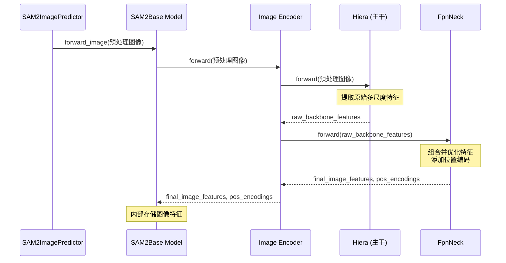

# 第四章：图像编码器

欢迎回来

在[第三章：SAM2基础模型](03_sam2base_model_.md)中，我们了解到`SAM2Base Model`是SAM-2的核心"大脑"，负责协调多个专用组件。我们将这些组件比作乐团，而`SAM2Base`是指挥家。

现在，是时候认识这个乐团中第一位（也可以说是最基础的）乐手了：**图像编码器**。

### SAM-2的"眼睛"

想象你正在看一张照片。在你能够识别猫、狗或树之前，你的眼睛需要先捕捉光线并将信号发送给大脑。随后，你的大脑将这些原始信号处理成有意义的信息——区分形状、颜色、纹理和图案。

**图像编码器**正是为SAM-2模型扮演这一角色。它就==像是AI的"眼睛"，其任务是接收原始的输入图像（由无数像素组成），并将其转化为对图像内容的智能"理解"==。

#### 解决的问题

图像编码器解决的核心问题是**将原始像素转换为AI能够理解和处理的视觉特征**。

计算机不会像人类一样"看"图像。它看到的只是一个数字网格（像素值）。

如果你让它找一只"猫"，它无法直接将文本"猫"与数字网格对比。

==它需要一种方法从图像中提取重要的视觉线索==——比如猫的毛茸茸的纹理、耳朵形状、相对于背景的大小以及大致轮廓。

图像编码器正是完成这一任务。它处理原始图像并生成"视觉特征"。

你可以将这些特征视为图像内容的高度浓缩、==智能化的摘要，突出所有重要的视觉线索，而无需存储每一个像素==。这些特征随后可供`SAM2Base Model`的其他部分进行分析。

### 关键概念

让我们拆解图像编码器的工作原理：

1. **原始图像输入**：起点是你的图像，就像你看到的那样，由数百万像素组成。

2. **特征提取**：这是最神奇的部分。图像编码器是一个深度神经网络，专门用于分析图像并提取各种视觉信息。它不仅能提取简单的颜色，还能识别边缘、角落、纹理甚至更高层次的形状和图案。

3. **多尺度视觉特征**：图像编码器不仅提供一个"摘要"，而是在不同细节层次或"尺度"上提供摘要。

   *   **细粒度特征**：比如看到猫的每一根毛发或砖墙的纹理。
   *   **粗粒度特征**：比如看到猫的整体形状或整栋建筑。
   这种多尺度信息对SAM-2准确分割不同大小和细节的对象至关重要。

4. **Hiera主干**：SAM-2使用一种强大的神经网络**Hiera**作为图像编码器的主要"主干"。Hiera专门设计用于高效提取丰富的多尺度视觉特征。

5. **浓缩表示**：图像编码器的输出不是另一张图像，而是==一组数值向量==（张量），它们是图像的高度智能化表示。

   

   > 就像你的大脑用几个关键细节总结复杂场景，而不是记住每一个光子。

### 图像编码器的使用方式

正如我们在[第三章：SAM2基础模型](03_sam2base_model_.md)中学到的，通常不会直接与图像编码器交互。相反，它是`SAM2Base Model`的内部组件，随后被`SAM2ImagePredictor`和`SAM2VideoPredictor`使用。

当调用`predictor.set_image(my_image)`（如[第一章：SAM2图像预测器](01_sam2imagepredictor__image_inference_api_.md)所示），`SAM2ImagePredictor`会准备图像，然后让`SAM2Base Model`通过其图像编码器"查看"图像。

让我们快速回顾这一部分：

```python
from sam2.sam2_image_predictor import SAM2ImagePredictor
from sam2.build_sam import build_sam2_hf
import numpy as np
from PIL import Image

# 1. 加载核心SAM-2模型（"大脑"）
sam_model = build_sam2_hf(model_id="facebook/sam2-hiera-large")

# 2. 创建SAM2ImagePredictor（"助手"）
predictor = SAM2ImagePredictor(sam_model)

# 3. 创建虚拟图像
my_image = np.zeros((256, 256, 3), dtype=np.uint8)

# 4. 将图像传递给预测器
# 此调用*内部*激活了图像编码器
predictor.set_image(my_image)
print("图像已设置，内部特征已提取！")
```
interesting~

*说明*：当调用`predictor.set_image(my_image)`时，原始`my_image`首先被预处理（调整大小、归一化）。然后，准备好的图像被发送到`sam_model`（即`SAM2Base Model`），特别是其图像编码器。图像编码器随后工作以提取`image_features`，这些特征存储在`predictor`中，供掩膜解码器后续使用。

### 幕后揭秘：图像编码器的工作原理

让我们更深入地看看`SAM2Base Model`如何具体使用图像编码器。

#### 工作流程
当`SAM2ImagePredictor`告诉`SAM2Base Model`处理图像时，以下是具体步骤：

1.  **图像接收**：`SAM2Base Model`接收预处理后的图像。
2.  **委托给图像编码器**：`SAM2Base Model`将图像直接传递给其`Image Encoder`组件。
3.  **Hiera处理（主干）**：`Image Encoder`将图像发送到其"主干"——**Hiera**神经网络。Hiera通过多层处理图像，执行复杂的计算（如注意力和池化），逐步构建越来越丰富的视觉特征。它在不同阶段输出特征，代表不同层次的细节。
4.  **FPN Neck（特征金字塔网络）**：Hiera的特征随后传递给`FpnNeck`（特征金字塔网络）。该组件获取Hiera的多尺度特征，并巧妙地组合它们，确保模型在不同分辨率下对图像有一致且强大的表示。它还为这些特征添加位置信息。
5.  **特征输出**：最后，`FpnNeck`输出一组经过优化的多尺度`image_features`及其相关的位置编码。这些随后返回给`SAM2Base Model`并存储起来。

以下是这一流程的简化序列图：



#### 关键代码

让我们看看代码中如何定义和使用`ImageEncoder`。

1.  **SAM2Base模型初始化图像编码器**  
    如[第三章：SAM2基础模型](03_sam2base_model_.md)所示，`SAM2Base Model`通过接收其核心组件（包括`image_encoder`）完成初始化。这一设置通常通过配置文件（如`sam2_hiera_b+.yaml`）完成

    ```python
    # 摘自sam2/configs/sam2/sam2_hiera_b+.yaml（简化版）
    # 展示SAM2Base如何配置使用ImageEncoder
    model:
      _target_: sam2.modeling.sam2_base.SAM2Base
      image_encoder:
        _target_: sam2.modeling.backbones.image_encoder.ImageEncoder
        scalp: 1
        trunk:
          _target_: sam2.modeling.backbones.hieradet.Hiera # Hiera是"主干"
          # ... Hiera特定参数 ...
        neck:
          _target_: sam2.modeling.backbones.image_encoder.FpnNeck # FpnNeck是"颈部"
          # ... FpnNeck特定参数 ...
    ```
    *说明*：此配置片段显示，当创建`SAM2Base`模型时，其`image_encoder`组件是`ImageEncoder`的实例

    `ImageEncoder`本身有两个主要子组件：`trunk`（即`Hiera`模型）和`neck`（即`FpnNeck`）。这就是各部分的组装方式。
    
    
    
2.  **SAM2Base模型调用图像编码器**  
    在`SAM2Base Model`内部，`forward_image`方法负责将预处理后的图像传递给`Image Encoder`。

    ```python
    # 摘自sam2/modeling/sam2_base.py（简化版）
    # 在SAM2Base类内部
    def forward_image(self, img_batch: torch.Tensor):
        """获取输入批次的图像特征。"""
        # 'self.image_encoder'是ImageEncoder实例
        backbone_out = self.image_encoder(img_batch) # 调用Image Encoder的forward方法
        # ... 进一步处理输出特征 ...
        return backbone_out
    ```
    *说明*：这是直接调用！`SAM2Base Model`简单地将`img_batch`传递给`self.image_encoder``

    `image_encoder`随后完成其复杂工作并返回`backbone_out`，其中包含`vision_features`和`vision_pos_enc`（位置编码）。

3. **==图像编码器协调Hiera和FPN Neck==**
   现在，让我们看看`ImageEncoder`内部如何利用`Hiera`（`trunk`）和`FpnNeck`（`neck`）。

```python
# 摘自sam2/modeling/backbones/image_encoder.py（简化版）
class ImageEncoder(nn.Module):
    def __init__(
        self,
        trunk: nn.Module, # 这是Hiera模型
        neck: nn.Module,  # 这是FpnNeck
        scalp: int = 0,
    ):
        super().__init__()
        self.trunk = trunk # 存储Hiera实例
        self.neck = neck   # 存储FpnNeck实例
        self.scalp = scalp
        # ... 检查主干和颈部维度是否匹配 ...

    def forward(self, sample: torch.Tensor):
        # 1. 首先，通过Hiera"主干"传递图像
        hiera_features = self.trunk(sample) # Hiera输出特征列表

        # 2. 然后，将Hiera的输出传递给FPN"颈部"
        # 颈部组合这些特征并添加位置编码
        features, pos = self.neck(hiera_features)

        # ... 可选"scalp"步骤以丢弃最低分辨率特征 ...

        src = features[-1] # 取最高分辨率的组合特征
        output = {
            "vision_features": src,
            "vision_pos_enc": pos, # 位置编码
            "backbone_fpn": features, # 所有组合的FPN特征
        }
        return output
```
*说明*：`ImageEncoder`的`forward`方法清晰展示了其作为协调者的角色。

它首先调用`self.trunk(sample)`（即`Hiera`）获取初始特征。然后，将这些`hiera_features`传递给`self.neck(hiera_features)`（即`FpnNeck`）以进一步处理、组合并添加位置编码。

最终的精炼`features`和`pos`（位置编码）作为`ImageEncoder`的输出返回。

这一详细拆解展示了`ImageEncoder`如何利用强大的`Hiera`和`FpnNeck`，将==原始像素==高效转化为SAM-2分割能力所需的==智能视觉特征==。

### 总结

图像编码器是SAM-2理解世界的"第一步"。

作为"眼睛"，它将原始、难以理解的像素转化为丰富的多尺度视觉特征，捕捉图像的精髓。这种由Hiera和FPN等复杂网络生成的智能表示，对后续所有任务至关重要——从解析用户提示到绘制精确的分割掩膜。

现在SAM-2已经能"看"了，下一步是让它"听"懂你的指令。让我们继续了解下一个组件，它让SAM-2理解你的提示：[提示编码器](05_prompt_encoder_.md)。

[下一章：提示编码器](05_prompt_encoder_.md)

