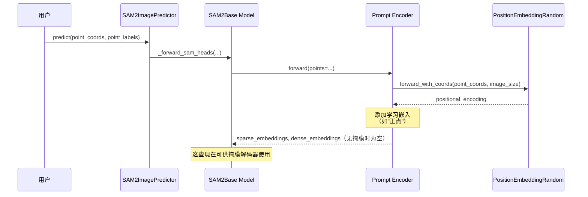

# 第五章：提示编码器

欢迎回来

在[第四章：图像编码器](04_image_encoder_.md)中，我们了解了`图像编码器`——SAM-2的"眼睛"，它将原始像素转化为对图像视觉内容的丰富智能理解。现在SAM-2已经能"看"世界了，下一步是让它"听懂"并理解*你的具体指令*。

### SAM-2的"倾听者与翻译官"

想象你面前有一台强大的绘图机器人（SAM-2）。它能完美地"看"到你的图像（多亏了[图像编码器](04_image_encoder_.md)）。但你如何告诉它*具体*要在哪里绘制掩膜？你需要一种方式来传达你的意图。你可能会用手指点一下（点击）、画一个粗略的框，甚至快速勾勒一个轮廓。

**提示编码器**就是这座关键的沟通桥梁。它是[SAM2基础模型](03_sam2base_model_.md)中的一个组件，扮演SAM-2的**"倾听者"和"翻译官"**角色。当你提供"提示"（你的指令）时，==提示编码器会将这些简单的输入转化为模型其他部分能够理解的复杂数值语言==。

#### 解决的问题

提示编码器解决的核心问题是**将多样化的用户友好输入（如点击和方框）转化为AI能够处理的标准化的高级数值格式**。

可以这样理解：
- 你在(100,150)处的点击只是原始坐标。
- 你的边界框`[x1,y1,x2,y2]`只是四个数字。
- 你的粗略掩膜只是另一个像素网格。

AI需要理解这些输入背后的*含义*。点击是否意味着"包含这个像素"？方框是否意味着"分割这个区域内的所有内容"？提示编码器会解读这些意图，并将它们转化为"嵌入"——特殊的数字代码，携带提示的完整含义、位置和类型。这些嵌入随后可以指导[掩膜解码器](06_mask_decoder_.md)绘制最终的掩膜。

### 关键概念

让我们拆解提示编码器背后的魔法：

1.  **提示：你的指令**：这些是你告诉SAM-2要分割内容的方式。
    - **点（点击）**：一个具体的(X,Y)坐标。你可以将它们标记为"正"（对象的一部分）或"负"（背景的一部分）。
    - **边界框**：一个矩形`[x1,y1,x2,y2]`，大致包围对象。
    - **掩膜输入**：你可以提供一个粗略的低分辨率掩膜作为起点。

2.  **数值嵌入：AI的语言**：提示编码器不会直接将你的点击作为原始数字传递。它会将它们==转化为"嵌入"==。
    - 嵌入是一个向量（数字列表），捕捉输入的*含义*和*上下文*。
    - 例如，猫头上的正点击与背景上的负点击会有不同的嵌入，即使它们位置相近。

3.  **空间感知（位置编码）**：仅知道提示的类型（如正点）是不够的；SAM-2还需要知道它在图像中的*位置*。提示编码器使用一种称为**位置编码**的技术，为嵌入赋予精确的空间信息。这样，左上角的点击与右下角的点击在本质上就不同。

4.  **稀疏与密集嵌入**：
    - **稀疏嵌入**：用于"稀疏"或离散的提示，如单个点和边界框角点。这些是小规模的嵌入集。
    - **密集嵌入**：用于覆盖较大区域的提示，如输入掩膜。这些是网格状的嵌入，在更广的区域内保留空间信息。

提示编码器确保无论如何提供提示，[掩膜解码器](06_mask_decoder_.md)都能获得关于*分割什么*和*在哪里分割*的清晰智能指令。

### 提示编码器的使用方式

与[图像编码器](04_image_encoder_.md)类似，通常不会直接与提示编码器交互。它是`SAM2Base Model`的内部组件，当使用`SAM2ImagePredictor`或`SAM2VideoPredictor`的`predict()`方法时会被调用。

让我们回顾[第一章：SAM2图像预测器](01_sam2imagepredictor__image_inference_api_.md)中的`SAM2ImagePredictor`示例，重点关注提示部分：

```python
from sam2.sam2_image_predictor import SAM2ImagePredictor
from sam2.build_sam import build_sam2_hf
import numpy as np
from PIL import Image

# 1. 加载核心SAM-2模型和预测器（如第一章所示）
sam_model = build_sam2_hf(model_id="facebook/sam2-hiera-large")
predictor = SAM2ImagePredictor(sam_model)

# 2. 设置虚拟图像（已由图像编码器内部处理）
my_image = np.zeros((256, 256, 3), dtype=np.uint8)
predictor.set_image(my_image)

# 3. 提供提示（你的指令）
point_coords = np.array([[128, 128]]) # 中心点击
point_labels = np.array([1]) # 标签1表示前景（对象的一部分）

# 你也可以提供一个框：
# box_coords = np.array([[50, 50, 200, 200]]) # 边界框

# 或一个粗略掩膜（这将是一个单通道二值图像）：
# rough_mask_input = np.zeros((64, 64), dtype=np.float32) # 低分辨率掩膜

# 此调用*内部*激活提示编码器
masks, scores, _ = predictor.predict(
    point_coords=point_coords,
    point_labels=point_labels,
    # boxes=box_coords,            # 取消注释以使用框提示
    # mask_input=rough_mask_input, # 取消注释以使用掩膜提示
    multimask_output=False
)
print("提示已处理，掩膜已生成！")
```
*说明*：当你调用`predictor.predict()`并传递`point_coords`、`point_labels`（或`boxes`、`mask_input`）时，这些原始输入会被发送到`SAM2Base Model`。`SAM2Base Model`随后委托其`提示编码器`组件。`提示编码器`施展魔法，将你的简单点击、方框或掩膜转化为复杂的数值`sparse_embeddings`和`dense_embeddings`，供[掩膜解码器](06_mask_decoder_.md)用于创建分割。

### 幕后揭秘：提示编码器的工作原理

让我们深入`SAM2Base Model`，看看提示编码器的具体工作方式。

#### 工作流程
当`SAM2ImagePredictor`调用`_predict()`（随后调用`SAM2Base._forward_sam_heads()`）并传入你的提示时，`提示编码器`内部会发生以下操作：

1.  **提示接收**：`提示编码器`接收你的原始提示（如`point_coords`、`point_labels`）。
2.  **位置编码**：对于点和框提示，它首先计算它们在图像中的空间位置。它使用一个名为`PositionEmbeddingRandom`的组件为每个点生成数值"位置编码"。这对于告诉模型提示的*位置*至关重要。
3.  **学习嵌入**：除了位置编码，`提示编码器`还添加"学习嵌入"。这些是模型训练出的特殊数值，用于理解提示的*类型*。例如：
    - 正点获得"正点嵌入"。
    - 负点获得"负点嵌入"。
    - 框的左上角获得"左上角嵌入"，右下角获得"右下角嵌入"。
4.  **掩膜下采样和嵌入**：如果你提供原始掩膜，`提示编码器`不会仅添加位置编码。它使用小型卷积神经网络层（`mask_downscaling`）处理并缩小掩膜。这将原始掩膜像素转化为密集、富含特征的嵌入，仍保留其空间信息，但现在是AI能理解的数值语言。
5.  **输出嵌入**：最后，`提示编码器`输出两种类型的嵌入：
    - `sparse_embeddings`：用于点和框（因为它们是离散输入）。
    - `dense_embeddings`：用于掩膜输入（因为它们覆盖连续区域）。
    这些嵌入随后传回`SAM2Base Model`，供[掩膜解码器](06_mask_decoder_.md)使用。

以下是点提示的简化序列图：



#### 关键代码


让我们看看`sam2/modeling/sam/prompt_encoder.py`文件中的关键部分，了解这些步骤如何实现。

1.  **提示编码器初始化（`__init__`）**
    当`提示编码器`创建时（作为`SAM2Base Model`的一部分），它会设置其嵌入层和位置编码层。

    ```python
    # 摘自sam2/modeling/sam/prompt_encoder.py（简化版）
    class PromptEncoder(nn.Module):
        def __init__(
            self,
            embed_dim: int,
            image_embedding_size: Tuple[int, int],
            input_image_size: Tuple[int, int],
            mask_in_chans: int,
            activation: Type[nn.Module] = nn.GELU,
        ) -> None:
            super().__init__()
            self.embed_dim = embed_dim
            # 点/框的位置编码层
            self.pe_layer = PositionEmbeddingRandom(embed_dim // 2)
    
            # 点类型（正/负/框角）的学习嵌入
            self.num_point_embeddings: int = 4 
            self.point_embeddings = nn.ModuleList(
                [nn.Embedding(1, embed_dim) for i in range(self.num_point_embeddings)]
            )
            self.not_a_point_embed = nn.Embedding(1, embed_dim) # 用于填充
    
            # 掩膜输入的卷积层
            self.mask_downscaling = nn.Sequential(
                nn.Conv2d(1, mask_in_chans // 4, kernel_size=2, stride=2),
                # ... 更多卷积/归一化/激活层 ...
                nn.Conv2d(mask_in_chans, embed_dim, kernel_size=1),
            )
            self.no_mask_embed = nn.Embedding(1, embed_dim) # 无掩膜时使用
    ```
    *说明*：`提示编码器`初始化`self.pe_layer`（我们的`PositionEmbeddingRandom`助手），负责提供空间上下文。它还创建`point_embeddings`，这是为"正点"、"负点"、"框左上角"和"框右下角"学习的小型数值向量。最后，`mask_downscaling`是一个小型神经网络，用于处理掩膜输入。

2.  **嵌入点（`_embed_points`）**
    此方法将位置编码与学习到的点嵌入结合。

    ```python
    # 摘自sam2/modeling/sam/prompt_encoder.py（简化版）
    # 在PromptEncoder类内部
    def _embed_points(
        self,
        points: torch.Tensor, # 原始(x, y)坐标
        labels: torch.Tensor, # 1为前景，0为背景
        pad: bool,
    ) -> torch.Tensor:
        # 将坐标移至像素中心
        points = points + 0.5 
        
        # 获取每个点的位置编码
        point_embedding = self.pe_layer.forward_with_coords(
            points, self.input_image_size
        )
    
        # 根据点的标签添加学习嵌入
        # 正点示例（label == 1）：
        point_embedding = torch.where(
            (labels == 1).unsqueeze(-1),
            point_embedding + self.point_embeddings[1].weight, # 为正点添加学习嵌入
            point_embedding,
        )
        # ... 类似逻辑用于label == 0（负）、-1（填充）等 ...
        return point_embedding
    ```
    *说明*：此函数首先使用`self.pe_layer.forward_with_coords()`获取每个`(x, y)`坐标的位置嵌入。然后，根据标签是否为1（前景/正）、0（背景/负）等，有条件地添加*学习*嵌入（来自`self.point_embeddings`）。这会创建一个组合嵌入，知道点的*位置*和*类型*。

3.  **嵌入掩膜（`_embed_masks`）**
    此方法通过下采样处理原始掩膜输入。

    ```python
    # 摘自sam2/modeling/sam/prompt_encoder.py（简化版）
    # 在PromptEncoder类内部
    def _embed_masks(self, masks: torch.Tensor) -> torch.Tensor:
        """嵌入掩膜输入。"""
        # mask_downscaling Sequential模块处理掩膜
        mask_embedding = self.mask_downscaling(masks)
        return mask_embedding
    ```
    *说明*：如果你提供粗略掩膜（`masks`），`提示编码器`只需将其通过`self.mask_downscaling`卷积层。此过程将原始高分辨率掩膜转化为更小、特征丰富的`mask_embedding`（"密集嵌入"），以更抽象、模型可理解的格式携带空间信息。

4.  **主`forward`方法**
    这是`提示编码器`被`SAM2Base Model`调用时的入口点。它协调不同提示类型的嵌入。

    ```python
    # 摘自sam2/modeling/sam/prompt_encoder.py（简化版）
    # 在PromptEncoder类内部
    def forward(
        self,
        points: Optional[Tuple[torch.Tensor, torch.Tensor]], # (坐标, 标签)
        boxes: Optional[torch.Tensor],
        masks: Optional[torch.Tensor],
    ) -> Tuple[torch.Tensor, torch.Tensor]:
        
        sparse_embeddings = torch.empty(...) # 初始化空张量
        
        if points is not None:
            coords, labels = points
            point_embeddings = self._embed_points(coords, labels, pad=(boxes is None))
            sparse_embeddings = torch.cat([sparse_embeddings, point_embeddings], dim=1)
        
        if boxes is not None:
            box_embeddings = self._embed_boxes(boxes) # 类似于_embed_points处理角点
            sparse_embeddings = torch.cat([sparse_embeddings, box_embeddings], dim=1)
    
        if masks is not None:
            dense_embeddings = self._embed_masks(masks)
        else:
            # 如无掩膜，使用特殊"无掩膜"嵌入
            dense_embeddings = self.no_mask_embed.weight.reshape(...)
            
        return sparse_embeddings, dense_embeddings
    ```
    *说明*：`forward`方法像一个中央调度器。它检查提供了哪些提示（`points`、`boxes`、`masks`）。如果有`points`，就调用`_embed_points()`；如果有`boxes`，就调用`_embed_boxes()`；如果有`masks`，就调用`_embed_masks()`。所有点和框的嵌入被拼接为`sparse_embeddings`，而掩膜嵌入形成`dense_embeddings`。这两组嵌入随后返回给`SAM2Base Model`，供下一阶段使用。

这一详细解析展示了`提示编码器`如何高效地将你多样且直观的提示转化为SAM-2复杂层所需的结构化数值语言。

### 总结

提示编码器是SAM-2不可或缺的"倾听者与翻译官"。

它==将你的简单点击、方框或掩膜转化为丰富的数值"嵌入"==，捕捉提示的类型和图像中的精确位置。通过智能编码这些用户指令，提示编码器为[掩膜解码器](06_mask_decoder_.md)提供了准确绘制所需分割掩膜的关键指导。

现在SAM-2已经能"看"（通过[图像编码器](04_image_encoder_.md)）和"理解你的指令"（通过提示编码器），接下来它要=="绘制"实际的掩膜了==！让我们进入下一个组件：[掩膜解码器](06_mask_decoder_.md)。

[下一章：掩膜解码器](06_mask_decoder_.md)

