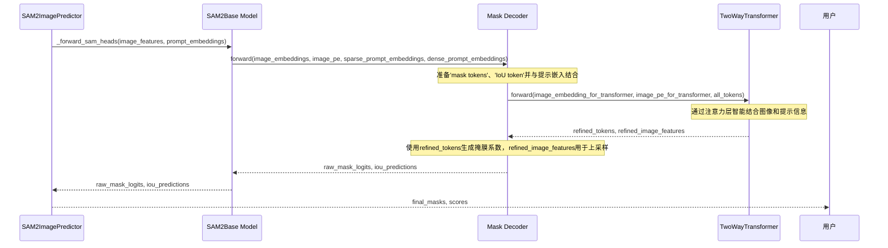
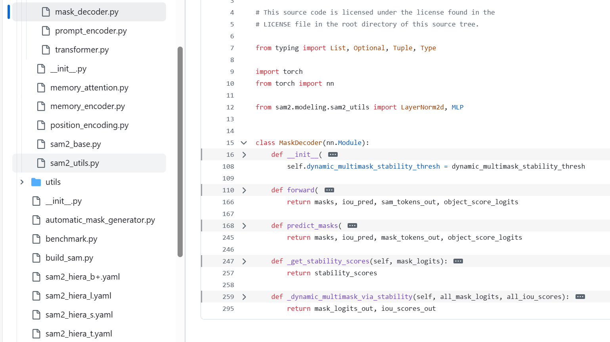
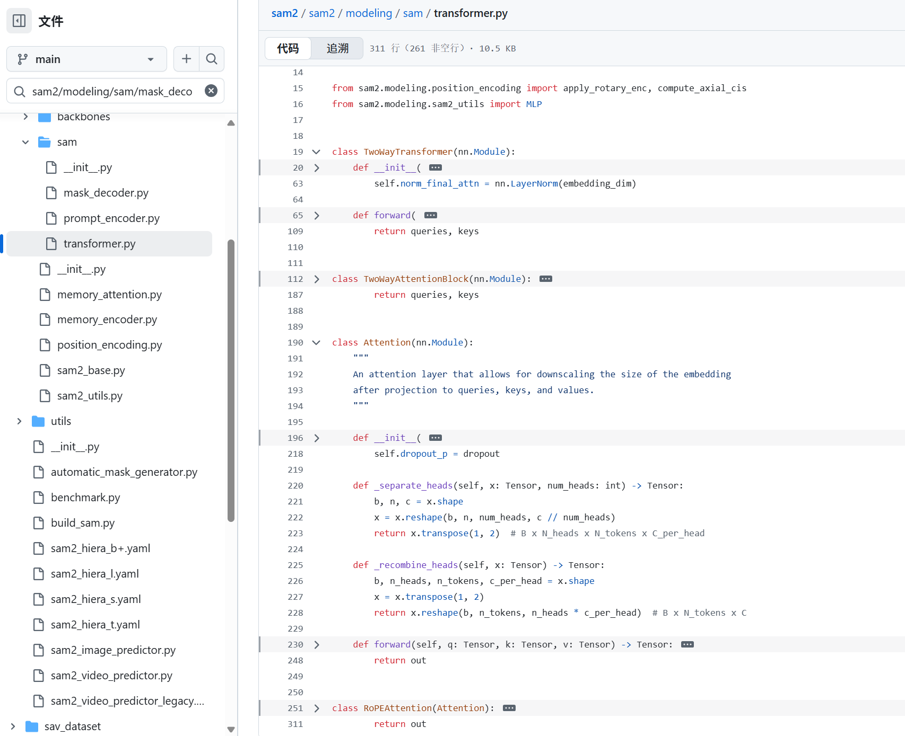

# 第六章：掩膜解码器

欢迎回来

在[第五章：提示编码器](05_prompt_encoder_.md)中，我们看到了SAM-2如何理解你的具体指令（如点击或方框）。现在SAM-2已经能"看"到视觉世界（多亏了[图像编码器](04_image_encoder_.md)）并"听懂"你的命令（通过[提示编码器](05_prompt_encoder_.md)），接下来呢？它需要真正*执行*你要求的任务：**绘制分割掩膜！**

### SAM-2的"艺术家"

想象你有一位技艺高超的艺术家，需要绘制一个特定对象。你向他们展示场景的照片（来自[图像编码器](04_image_encoder_.md)的图像特征），并明确告诉他们要画什么以及在哪里画（来自[提示编码器](05_prompt_encoder_.md)的提示嵌入）。艺术家随后综合所有信息，理解你的要求，并细致地绘制出目标对象。

**掩膜解码器**就是[SAM2基础模型](03_sam2base_model_.md)中的这位艺术家。它的主要工作是结合图像的高级视觉理解和你的提示指令，智能地**"绘制"实际的分割掩膜**，围绕你指定的对象。它还会给你一个评分，告诉你它对自己的绘制结果有多自信！

#### 解决的问题

掩膜解码器解决的核心问题是**==基于复杂的视觉信息和用户提供的提示，生成精确的像素级分割掩膜==**。

它是连接AI对图像的内部理解与你的高级请求的桥梁，将抽象的数字转化为对象的具体轮廓。它确保当你点击一只猫时，你会得到一个漂亮且准确的*仅包含猫*的掩膜，而不是背景或其他对象的一部分。

### 关键概念

让我们探索掩膜解码器背后的关键思想：

1.  **信息整合**：掩膜解码器是终极的混合器。它接收两种主要成分：
    - **图像特征**：来自[图像编码器](04_image_encoder_.md)的整个图像的==详细视觉理解==。
    - **提示嵌入**：你的具体指令（如点击、方框或掩膜），由[提示编码器](05_prompt_encoder_.md)转化为==AI的语言==。

2.  **Transformer"大脑"**：掩膜解码器的核心是一个强大的神经网络，称为**Transformer**，具体来说是一个`TwoWayTransformer`。==这个Transformer非常擅长让不同的信息（如图像特征和提示嵌入）"对话"==。它找出你的提示与图像特征的关系，==突出==图像中与你的请求相关的部分。

3.  **特殊的绘制"令牌"**：掩膜解码器使用特殊的数值"绘制工具"，称为**掩膜令牌**和**IoU令牌**。
    - **掩膜令牌**：这些就像不同的画笔或风格。Transformer处理这些令牌以及你的提示和图像特征，学习用它们生成不同的掩膜预测。SAM-2通常可以==为同一对象生成几个略有不同的掩膜==，以处理模糊情况（例如重叠对象）。
    - **IoU令牌**：这是==一个特殊令牌，模型用它预测每个生成掩膜的**置信度分数**==。这个分数告诉你模型认为它的掩膜预测有多好（接近1.0的分数表示高置信度）。

4.  **掩膜上采样**：Transformer在低分辨率表示上运行以提高效率。生成低分辨率掩膜后，掩膜解码器使用一系列上采样层（如`ConvTranspose2d`）将掩膜"放大"回输入图像的原始尺寸。这确保最终掩膜细节丰富且完美贴合。

### 掩膜解码器的使用方式

你不会直接在代码中调用`MaskDecoder`。相反，它是[SAM2基础模型](03_sam2base_model_.md)的重要内部组件，当你==使用高级工具（如`SAM2ImagePredictor`）的`predict()`方法时会被激活==。

让我们回顾[第一章：SAM2图像预测器](01_sam2imagepredictor__image_inference_api_.md)中的`SAM2ImagePredictor`示例，看看掩膜解码器在哪里发挥作用：

```python
from sam2.sam2_image_predictor import SAM2ImagePredictor
from sam2.build_sam import build_sam2_hf
import numpy as np
from PIL import Image

# 1. 加载核心SAM-2模型和预测器（如前几章所示）
sam_model = build_sam2_hf(model_id="facebook/sam2-hiera-large")
predictor = SAM2ImagePredictor(sam_model)

# 2. 设置虚拟图像（图像编码器已内部处理）
my_image = np.zeros((256, 256, 3), dtype=np.uint8)
predictor.set_image(my_image)

# 3. 提供提示（提示编码器已内部翻译）
point_coords = np.array([[128, 128]]) # 中心附近的点击
point_labels = np.array([1])         # 标签1表示前景

# 此调用*内部*激活掩膜解码器！
masks, scores, low_res_masks_logits = predictor.predict(
    point_coords=point_coords,
    point_labels=point_labels,
    multimask_output=False # 我们要求一个主掩膜以简化
)

print(f"预测掩膜形状：{masks.shape}")
print(f"掩膜的置信度分数（IoU）：{scores.item():.2f}")
print("掩膜解码器已成功绘制掩膜并给出置信度分数")
```
*说明*：当你调用`predictor.predict()`并传入`point_coords`和`point_labels`时，`SAM2ImagePredictor`会将这些与预计算的图像特征一起发送给`SAM2Base Model`。

在`SAM2Base Model`内部，`掩膜解码器`接收这些输入，处理它们，==生成原始掩膜预测（`low_res_masks_logits`），并估计其质量（`scores`==）。

`SAM2ImagePredictor`随后对这些原始输出进行后处理，给你最终的干净`masks`和`scores`。

### 幕后揭秘：掩膜解码器的工作原理

让我们揭开层层迷雾，了解`掩膜解码器`如何协调这一"绘制"过程。

#### 工作流程
当`SAM2ImagePredictor`要求`SAM2Base Model`生成掩膜时，以下是`掩膜解码器`内部的简化操作：

1.  **输入到达**：`掩膜解码器`接收处理后的`image_embeddings`（来自[图像编码器](04_image_encoder_.md)）、`image_pe`（图像的位置编码）以及`sparse_prompt_embeddings`和`dense_prompt_embeddings`（来自[提示编码器](05_prompt_encoder_.md)）。
2.  **准备Transformer输入**：它为内部的`TwoWayTransformer`准备一组"令牌"。这些令牌包括`iou_token`（用于置信度预测）、`mask_tokens`（用于生成掩膜）和你的`sparse_prompt_embeddings`。它还将`dense_prompt_embeddings`和`image_pe`直接添加到`image_embeddings`中以丰富它们。
3.  **Transformer交互**：所有这些输入被送入`TwoWayTransformer`。这个强大的组件执行多轮"注意力"计算，让提示信息影响图像特征，反之亦然。它有效地在图像特征中找到提示描述的对象。Transformer输出精炼后的令牌和图像特征。
4.  **生成掩膜系数**：从精炼的`mask_tokens`（由Transformer输出）中，==掩膜解码器使用小型神经网络（`output_hypernetworks_mlps`）生成"超网络系数"==。可以将其视为绘制掩膜的具体笔触指令。
5.  **上采样与合并**：同时，掩膜解码器使用`output_upscaling`网络获取精炼的图像特征并提高其分辨率。这些上采样后的图像特征就像一张高分辨率画布。生成的"超网络系数"随后与这张高分辨率画布结合，"绘制"出详细的`low_res_masks`。
6.  **预测置信度**：精炼的`iou_token`（也由Transformer输出）被发送到`iou_prediction_head`（一个小型MLP）。这个头预测`iou_predictions`，即每个生成掩膜的置信度分数。
7.  **输出**：`掩膜解码器`随后将这些原始`masks`和`iou_predictions`返回给`SAM2Base Model`，后者将它们传递给`SAM2ImagePredictor`进行最终调整和清理，然后呈现给你。

以下是此流程的简化序列图：



#### 关键代码



让我们看看`sam2/modeling/sam/mask_decoder.py`和`sam2/modeling/sam/transformer.py`文件中的关键部分，了解这些步骤如何实现。

1.  **掩膜解码器初始化（`__init__`）**
    当`掩膜解码器`创建时（作为`SAM2Base Model`的一部分），它会设置其主要组件：

    ```python
    # 摘自sam2/modeling/sam/mask_decoder.py（简化版）
    class MaskDecoder(nn.Module):
        def __init__(
            self,
            transformer_dim: int,
            transformer: nn.Module, # 这是TwoWayTransformer！
            num_multimask_outputs: int = 3,
            # ... 其他参数 ...
        ) -> None:
            super().__init__()
            self.transformer = transformer # 核心逻辑组合器
            self.iou_token = nn.Embedding(1, transformer_dim) # 用于置信度分数的特殊令牌
            self.num_mask_tokens = num_multimask_outputs + 1
            self.mask_tokens = nn.Embedding(self.num_mask_tokens, transformer_dim) # 用于绘制掩膜的特殊令牌
    
            self.output_upscaling = nn.Sequential( # 提高掩膜分辨率的网络
                nn.ConvTranspose2d(transformer_dim, transformer_dim // 4, kernel_size=2, stride=2),
                LayerNorm2d(transformer_dim // 4), # 帮助稳定训练
                nn.GELU(), # 激活函数
                nn.ConvTranspose2d(transformer_dim // 4, transformer_dim // 8, kernel_size=2, stride=2),
                nn.GELU(),
            )
            self.output_hypernetworks_mlps = nn.ModuleList( # 生成掩膜系数的网络
                [MLP(transformer_dim, transformer_dim, transformer_dim // 8, 3) for i in range(self.num_mask_tokens)]
            )
            self.iou_prediction_head = MLP( # 预测置信度分数的网络
                transformer_dim, 256, self.num_mask_tokens, 3 # 示例维度
            )
    ```
    *说明*：`掩膜解码器`初始化其核心`self.transformer`（混合器）。它还设置`self.iou_token`和`self.mask_tokens`，这些是学习到的特殊数值，作为Transformer生成置信度分数和各种掩膜输出的提示。`output_upscaling`是一个小型神经网络，用于放大最终掩膜；`output_hypernetworks_mlps`生成细粒度掩膜细节；`iou_prediction_head`计算置信度。

2.  **`MaskDecoder.predict_masks`（核心逻辑）**
    这是掩膜生成真正发生的主要内部方法。它由`MaskDecoder.forward`方法调用。

    ```python
    # 摘自sam2/modeling/sam/mask_decoder.py（简化版）
    # 在MaskDecoder类内部
    def predict_masks(
        self,
        image_embeddings: torch.Tensor,       # 来自图像编码器
        image_pe: torch.Tensor,               # 图像的位置编码
        sparse_prompt_embeddings: torch.Tensor, # 来自提示编码器（点/框）
        dense_prompt_embeddings: torch.Tensor,  # 来自提示编码器（掩膜输入）
        # ... 其他参数 ...
    ) -> Tuple[torch.Tensor, torch.Tensor]:
    
        # 1. 为Transformer的查询输入组合所有"令牌"
        # 包括IoU令牌、掩膜令牌和用户的稀疏提示
        output_tokens = torch.cat([self.iou_token.weight, self.mask_tokens.weight], dim=0)
        # 扩展令牌以匹配批次大小
        output_tokens = output_tokens.unsqueeze(0).expand(sparse_prompt_embeddings.size(0), -1, -1)
        tokens = torch.cat((output_tokens, sparse_prompt_embeddings), dim=1)
    
        # 2. 为Transformer的键/值输入准备图像特征和位置编码
        b, c, h, w = image_embeddings.shape # 获取图像尺寸
        src = image_embeddings + dense_prompt_embeddings # 将图像特征与密集提示结合
        pos_src = image_pe # 使用图像位置编码
    
        # 3. 重塑并运行核心TwoWayTransformer以混合所有信息
        # Transformer期望B x N_tokens x C，所以将HxW展平为N_tokens
        src_flat = src.flatten(2).permute(0, 2, 1) # B x (H*W) x C
        pos_src_flat = pos_src.flatten(2).permute(0, 2, 1) # B x (H*W) x C
        hs, src_out = self.transformer(src_flat, pos_src_flat, tokens) # hs是令牌特征，src_out是注意力后的图像特征
    
        # 4. 分离Transformer输出的IoU和掩膜令牌
        iou_token_out = hs[:, 0, :] # 'hs'中的第一个令牌通常是IoU令牌
        mask_tokens_out = hs[:, 1 : (1 + self.num_mask_tokens), :] # 其余令牌是掩膜令牌
    
        # 5. 上采样精炼的图像特征（src_out）并生成掩膜预测
        # 将src_out重塑回类似图像的特征（B, C, H, W）
        src_out = src_out.transpose(1, 2).view(b, c, h, w)
        upscaled_embedding = self.output_upscaling(src_out) # 提高分辨率
    
        hyper_in_list = []
        for i in range(self.num_mask_tokens):
            # 每个掩膜令牌（来自mask_tokens_out）生成绘制掩膜的系数
            hyper_in_list.append(self.output_hypernetworks_mlps[i](mask_tokens_out[:, i, :]))
        hyper_in = torch.stack(hyper_in_list, dim=1) # 堆叠这些系数
    
        # 6. 将系数与上采样图像特征结合以"绘制"掩膜
        masks = (hyper_in @ upscaled_embedding.view(b, c, h * w)).view(b, -1, h, w)
    
        # 7. 使用IoU令牌预测置信度分数（IoU）
        iou_pred = self.iou_prediction_head(iou_token_out)
    
        return masks, iou_pred # 返回原始掩膜及其置信度分数
    ```
    *说明*：此方法是核心。它接收丰富的`image_embeddings`和`dense_prompt_embeddings`，将它们结合并重塑以供`self.transformer`使用。它还将你的`sparse_prompt_embeddings`与特殊的`iou_token`和`mask_tokens`结合为Transformer的查询。Transformer（`self.transformer`）随后混合所有这些信息，生成精炼的`iou_token_out`和`mask_tokens_out`。`mask_tokens_out`被`self.output_hypernetworks_mlps`用于生成系数，随后与`upscaled_embedding`（来自`self.output_upscaling`）结合以"绘制"`masks`。最后，`iou_token_out`被`self.iou_prediction_head`用于预测`iou_pred`（置信度分数）。



3.**`TwoWayTransformer.forward`（掩膜解码器内部）**
`TwoWayTransformer`是掩膜解码器内部的智能混合器。以下是其主`forward`方法的简化版：

```python
# 摘自sam2/modeling/sam/transformer.py（简化版）
class TwoWayTransformer(nn.Module):
    # ... 初始化设置注意力层 ...

    def forward(
        self,
        image_embedding: Tensor, # 精炼的图像特征（来自图像编码器+密集提示）
        image_pe: Tensor,        # 图像的位置编码
        point_embedding: Tensor, # 所有组合令牌（IoU、掩膜、稀疏提示）
    ) -> Tuple[Tensor, Tensor]:
        # 将image_embedding和image_pe从Bx(H*W)xC重塑为Bx(H*W)xC（已展平）

        # 'queries'是掩膜和提示令牌，'keys'是图像特征
        queries = point_embedding
        keys = image_embedding

        # 应用一系列Transformer块
        # 每层是一个TwoWayAttentionBlock，允许queries和keys交互
        for layer in self.layers:
            queries, keys = layer(
                queries=queries,     # 令牌
                keys=keys,           # 图像特征
                query_pe=point_embedding, # 令牌的位置信息
                key_pe=image_pe,     # 图像特征的位置信息
            )
        
        # 应用从令牌到图像特征的最终注意力层
        # ...（进一步注意力和归一化）...

        return queries, keys # 返回精炼的令牌和图像特征
```
*说明*：`TwoWayTransformer`接收处理后的`image_embedding`（来自[图像编码器](04_image_encoder_.md)加上密集提示）和`point_embedding`（你的稀疏提示加上掩膜和IoU令牌）。它随后通过多个`TwoWayAttentionBlock`层传递这些输入。这些块包含自注意力（令牌与令牌对话）和交叉注意力（令牌与图像对话，图像与令牌对话），实现深度双向交互。此过程精炼`queries`（令牌）和`keys`（图像特征），使它们准备好用于`掩膜解码器`中的最终掩膜生成步骤。

### 总结

掩膜解码器是SAM-2的关键"艺术家"，负责将所有信息结合起来精确绘制你所需的分割掩膜

通过使用强大的Transformer架构智能结合[图像编码器](04_image_encoder_.md)的视觉特征和[提示编码器](05_prompt_encoder_.md)的指令丰富嵌入，它生成准确的掩膜预测及置信度分数。这是将请求转化为具体分割对象的最后一步。

现在我们已经了解SAM-2如何==看、听和绘制单张图像==，接下来探索它如何在视频中==跨时间记忆对象==。下一章，我们将深入SAM-2中的"记忆"概念！

[下一章：记忆编码器](07_memory_encoder_.md)

