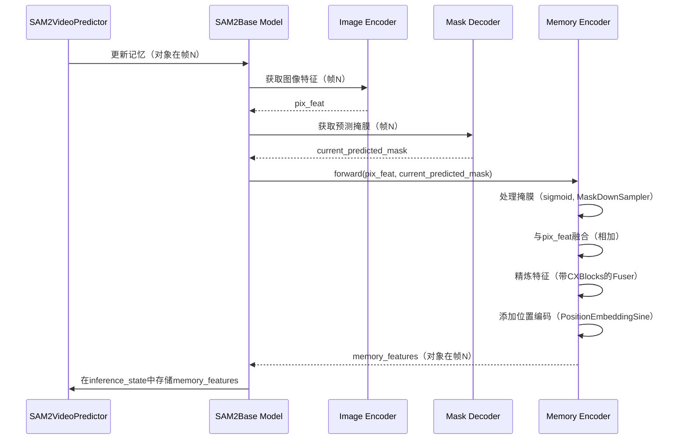

# 第七章：记忆编码器

欢迎回来

在[第六章：掩膜解码器](06_mask_decoder_.md)中，我们学习了SAM-2如何通过其"眼睛"（[图像编码器](04_image_encoder_.md)）和"倾听者"（[提示编码器](05_prompt_encoder_.md)）在单张图像中巧妙地"绘制"对象的分割掩膜。这对静态图像来说非常棒

但如果对象不是静止的呢？如果你的宠物猫在视频中奔跑，或者一辆特定的汽车在屏幕上移动呢？对于这些**视频任务**，SAM-2需要==记住对象随时间变化的外观==。它不能简单地在每一帧中从头开始重新分割对象，那样效率低下且容易出错。

### SAM-2的"记忆记录器"

这时**记忆编码器**就派上用场了！你可以把记忆编码器想象成SAM-2用于视频中对象的个人**"记忆记录器"**。它的主要工作是观察一个对象，理解其当前的外观和位置，然后**将这些信息压缩成一个智能的"记忆特征"**。这个记忆特征就像一个数字快照，SAM-2可以在以后快速回忆。

#### 解决的问题

记忆编码器解决的核心问题是**==如何有效地"记住"对象在之前视频帧中的视觉特征和位置==**

想象你正在追踪视频中一个弹跳的红色球

球在移动，光照条件在变化，甚至可能被其他对象部分遮挡。

如果SAM-2只看当前帧，它可能会感到困惑。但如果它对那个红色球通常的样子有一个良好的"记忆"，它就能更稳健地找到并分割它，即使在条件复杂的情况下。

记忆编码器接收当前帧的详细视觉==信息==（来自[图像编码器](04_image_encoder_.md)）和对象当前掩膜的最佳==猜测==（来自[掩膜解码器](06_mask_decoder_.md)）。

然后，它将这两者结合起来处理，创建一个紧凑的"记忆特征"，捕捉对象的最新外观。这个特征随后被存储，并在未来的帧中用于帮助模型一致地追踪对象。

### 关键概念

让我们拆解记忆编码器背后的重要思想：

1.  **记忆作为"对象档案"**：输出不是一张图片，而是对象的数值"档案"，捕捉其关键视觉特征和位置。
2.  **==双重输入==**：记忆编码器需要两条主要信息：
    - **视觉特征（来自[图像编码器](04_image_encoder_.md)）**：对整个当前帧的视觉理解。
    - **预测掩膜（来自[掩膜解码器](06_mask_decoder_.md)）**：对象在当前帧中的具体轮廓。这告诉记忆编码器应该关注图像特征的哪一部分。
3.  **压缩与增强**：
    - **掩膜下采样（`MaskDownSampler`）**：预测掩膜可能是高分辨率的。==记忆编码器首先高效地缩小并处理这个掩膜==，同时保留其形状信息。
    - **特征融合（带`CXBlock`的`Fuser`）**：它将对象的下采样掩膜与当前帧的更广泛的视觉特征智能地结合起来。这个融合步骤帮助它准确学习对象在当前上下文中的样子。
    - **位置编码**：与提示类似，记忆特征也需要知道对象的位置。记忆编码器使用位置编码添加精确的空间信息。
4.  **输出：记忆特征**：最终输出是一个密集的数值表示（张量），总结了对象的外观和位置。这是存储的"记忆"，供[记忆注意力](08_memory_attention_.md)组件后续使用。

### 记忆编码器的使用方式

记忆编码器与[SAM2视频预测器](02_sam2videopredictor__video_tracking_api_.md)紧密合作，是[SAM2基础模型](03_sam2base_model_.md)的核心组件。

不会直接调用`MemoryEncoder`的方法。

相反，当`SAM2VideoPredictor`通过帧追踪对象时（尤其是在`propagate_in_video`循环中），它会通过`SAM2Base Model`隐式使用`记忆编码器`来更新对象的存储"记忆"。

让我们回顾`SAM2VideoPredictor`的传播循环。记住，对于每一帧，预测器会：
1.  加载当前帧。
2.  使用对象的*过去记忆*来预测其在*当前帧*中的掩膜。
3.  **使用新预测的掩膜和当前帧的特征更新其记忆**。

第三步就是`记忆编码器`发挥作用的地方。

```python
from sam2.build_sam import build_sam2_video_predictor_hf
import torch
import os
import numpy as np
from PIL import Image

# 1. 加载视频预测器（如第二章所示）
device = torch.device("cuda" if torch.cuda.is_available() else "cpu")
predictor = build_sam2_video_predictor_hf(
    model_id="facebook/sam2-hiera-base-plus",
    device=device
)

# 2. 初始化虚拟视频的追踪（如第二章所示）
video_dir = "my_video_frames"
os.makedirs(video_dir, exist_ok=True)
Image.fromarray(np.zeros((256, 256, 3), dtype=np.uint8)).save(os.path.join(video_dir, "00000.jpg"))
Image.fromarray(np.zeros((256, 256, 3), dtype=np.uint8)).save(os.path.join(video_dir, "00001.jpg"))
inference_state = predictor.init_state(video_path=video_dir)

# 3. 为帧0中的对象1添加初始提示（如第二章所示）
predictor.add_new_points_or_box(
    inference_state=inference_state,
    frame_idx=0,
    obj_id=1,
    points=np.array([[100, 150]], dtype=np.float32),
    labels=np.array([1], np.int32),
)

# 4. 传播分割（这是记忆编码器内部调用的地方！）
print("开始视频传播。记忆编码器将逐帧更新对象记忆。")
for frame_idx, obj_ids, video_res_masks in predictor.propagate_in_video(inference_state):
    print(f"已处理帧{frame_idx}。对象{obj_ids[0]}的记忆已更新。")
    # 在此循环中，为obj_ids[0]在frame_idx中预测掩膜后，
    # 使用记忆编码器更新此对象的'记忆特征'。
```
*说明*：当`predictor.propagate_in_video()`运行时，对于每一帧，[SAM2基础模型](03_sam2base_model_.md)首先预测对象的掩膜

然后，它使用新预测的掩膜和当前帧的视觉特征，并将它们传递给`记忆编码器`组件。`记忆编码器`为对象创建一个更新的"记忆特征"，随后存储在`inference_state`中供未来帧使用。这保持了对象在视频中移动时的记忆更新。

### 幕后揭秘：记忆编码器的工作原理

让我们深入幕后，看看记忆编码器如何构建这些关键的"记忆特征"。

#### 工作流程
当`SAM2Base Model`需要更新对象的记忆特征时（例如，在视频帧中为其预测新掩膜后），以下是`记忆编码器`内部的简化流程：

1.  **输入到达**：`记忆编码器`接收`pix_feat`（来自[图像编码器](04_image_encoder_.md)的当前帧视觉特征）和`masks`（来自[掩膜解码器](06_mask_decoder_.md)的对象新预测掩膜）。
2.  **掩膜准备**：`masks`首先通过`sigmoid`函数（归一化值），然后传递给`MaskDownSampler`。这会缩小掩膜的分辨率，同时增加其通道数，使其更紧凑且特征丰富。
3.  **像素特征投影**：`pix_feat`（图像特征）通过小型`1x1 Conv2d`层（`pix_feat_proj`）处理。这一步为融合做准备。
4.  **融合**：处理后的图像特征（`x`）和下采样掩膜简单地相加（`x + masks`）。这是关键步骤，*通用图像上下文*（来自`pix_feat`）和*具体对象形状*（来自`masks`）在此结合。
5.  **精炼（`Fuser`）**：这个组合特征随后通过`Fuser`。`Fuser`包含几个`CXBlock`（ConvNeXt块）层，这些小型但强大的神经网络块精炼并进一步整合融合信息，学习对象的更稳健表示。
6.  **输出投影**：可选地，最终的`1x1 Conv2d`层（`out_proj`）调整精炼特征的通道数。
7.  **位置编码**：最后，`PositionEmbeddingSine`（一种位置编码）应用于精炼特征。这添加了重要的空间上下文，告诉模型记忆特征在图像中的*位置*。
8.  **输出**：`记忆编码器`返回这个结合且空间感知的特征作为对象在该帧中的"记忆特征"。

以下是此流程的简化序列图：



### 关键代码

让我们看看`sam2/modeling/memory_encoder.py`文件中的关键部分，了解这些步骤如何实现。

#### 1.**记忆编码器初始化（`__init__`）**

当`记忆编码器`创建时（作为`SAM2Base Model`的一部分），它会设置其主要组件：

```python
# 摘自sam2/modeling/memory_encoder.py（简化版）
class MemoryEncoder(nn.Module):
    def __init__(
        self,
        out_dim,
        mask_downsampler, # 处理掩膜的组件
        fuser,            # 融合和精炼特征的组件
        position_encoding, # 添加空间感知的组件
        in_dim=256,
    ):
        super().__init__()
        self.mask_downsampler = mask_downsampler
        self.pix_feat_proj = nn.Conv2d(in_dim, in_dim, kernel_size=1)
        self.fuser = fuser
        self.position_encoding = position_encoding
        self.out_proj = nn.Identity() # 可选的输出投影
        if out_dim != in_dim:
            self.out_proj = nn.Conv2d(in_dim, out_dim, kernel_size=1)
```
*说明*：

`记忆编码器`在构建时获取其"工具"：

`mask_downsampler`用于处理掩膜，`pix_feat_proj`用于图像特征，`fuser`用于混合和精炼，`position_encoding`用于添加空间信息


#### 2.**`MemoryEncoder.forward`（核心逻辑）**

这是生成记忆特征的主要方法。

```python
# 摘自sam2/modeling/memory_encoder.py（简化版）
# 在MemoryEncoder类内部
def forward(
    self,
    pix_feat: torch.Tensor, # 当前帧的视觉特征
    masks: torch.Tensor,    # 对象在此帧中的预测掩膜
    skip_mask_sigmoid: bool = False,
) -> Tuple[torch.Tensor, torch.Tensor]:
    
    ## 1. 处理掩膜
    if not skip_mask_sigmoid:
        masks = F.sigmoid(masks) # 归一化掩膜值
    masks = self.mask_downsampler(masks) # 缩小并丰富掩膜

    ## 2. 融合像素特征和下采样掩膜
    pix_feat = pix_feat.to(masks.device) # 确保特征在同一设备上
    x = self.pix_feat_proj(pix_feat)     # 准备图像特征
    x = x + masks                        # 将图像特征与处理后的掩膜结合
    x = self.fuser(x)                    # 精炼组合特征
    x = self.out_proj(x)                 # 可选的最终调整

    ## 3. 添加位置编码
    pos = self.position_encoding(x).to(x.dtype) # 添加空间上下文

    # 返回记忆特征及其位置编码
    return {"vision_features": x, "vision_pos_enc": [pos]}
```
*说明*：这个`forward`方法是记忆编码器的核心。它首先使用`sigmoid`和`self.mask_downsampler`处理输入`masks`。

然后，它==用`self.pix_feat_proj`投影`pix_feat`，并将处理后的`masks`*相加*到它==——这是关键的融合步骤。这个组合特征`x`随后被`self.fuser`精炼，并可能被`self.out_proj`调整。

最后，`self.position_encoding`添加空间感知，结果`x`（记忆特征）和`pos`（位置编码）被返回

#### 3. **`MaskDownSampler`（辅助组件）**

这个模块在`记忆编码器`内部用于处理输入`masks`。

```python
# 摘自sam2/modeling/memory_encoder.py（简化版）
class MaskDownSampler(nn.Module):
    def __init__(
        self,
        embed_dim=256,
        kernel_size=4,
        stride=4,
        padding=0,
        total_stride=16,
        activation=nn.GELU,
    ):
        super().__init__()
        # 一系列卷积层逐步下采样掩膜
        self.encoder = nn.Sequential(
            # 示例：Conv2d(1通道 -> 16通道), LayerNorm, GELU
            # 然后，Conv2d(16通道 -> 256通道), LayerNorm, GELU
            # 最后，1x1 Conv2d匹配embed_dim
            # ... 定义了许多层 ...
        )

    def forward(self, x):
        return self.encoder(x)
```
*说明*：

`MaskDownSampler`接收输入`mask`（通常是表示对象形状的单通道），并通过一系列卷积层传递它。

==这些层大幅减少掩膜的空间大小==（`stride=4`意味着每层缩小4x4），同时增加其通道数。这将简单掩膜转化为更复杂、特征丰富的表示，适合融合。


#### 4.**`Fuser`（辅助组件）**

这个模块在`记忆编码器`内部用于精炼融合特征

```python
# 摘自sam2/modeling/memory_encoder.py（简化版）
class Fuser(nn.Module):
    def __init__(self, layer, num_layers, dim=None, input_projection=False):
        super().__init__()
        # `layer`通常是这里的CXBlock。
        self.layers = get_clones(layer, num_layers) # CXBlock的多个副本

    def forward(self, x):
        for layer in self.layers:
            x = layer(x) # 通过每个CXBlock传递
        return x
```
*说明*：`Fuser`接收组合的图像和掩膜特征，然后通过几个`CXBlock`s（类似于ConvNeXt架构中的小型高效神经网络块）处理它们。这些块帮助进一步精炼、整合和增强特征，使其更稳健和信息丰富，便于记忆。

### 总结

记忆编码器是SAM-2视频功能的幕后英雄。

它作为"记忆记录器"，智能地将当前帧的视觉信息和对象的预测掩膜处理成一个紧凑的"记忆特征"。这个特征封装了对象的外观和位置，使SAM-2能够在动态视频序列中稳健地追踪对象。没有它，SAM-2将难以在对象移动和变化时保持一致的理解。

现在我们知道SAM-2如何创建这些"记忆特征"，下一个逻辑问题是：它如何*使用*它们？我们将在下一章探索[记忆注意力](08_memory_attention_.md)的作用。

[下一章：记忆注意力](08_memory_attention_.md)

