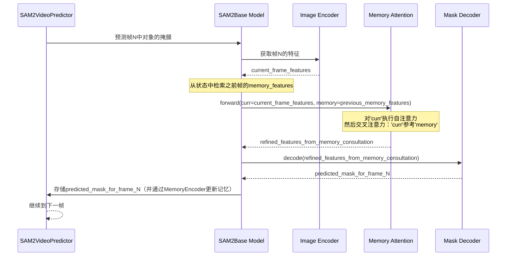

# 第八章：记忆注意力

欢迎回来

在[第七章：记忆编码器](07_memory_encoder_.md)中，我们学习了SAM-2如何智能地记录和存储对象在之前视频帧中的==外观和位置==，生成有用的"记忆特征"。这种记忆对于在视频中追踪对象至关重要。

但如果不能*有效使用*记忆，拥有它又有什么用呢？SAM-2如何实际*参考*这些存储的"记忆特征"来在新视频帧中找到并追踪对象？

这就是**记忆注意力**组件发挥作用的地方

### SAM-2的"记忆顾问"

可以将**记忆注意力**视为SAM-2的专属**"记忆顾问"**。当SAM-2尝试在新视频帧中追踪对象时，它面临一个挑战：对象可能已经移动、改变了姿态，甚至被短暂遮挡。仅看新帧不足以确认这是*同一个*对象。

这时就需要调用==记忆注意力==顾问。它的工作是：
1.  查看==当前帧==的视觉信息（[图像编码器](04_image_encoder_.md)看到的内容）。
2.  参考==存储==的"记忆特征"（[记忆编码器](07_memory_encoder_.md)从之前帧记录的对象的记忆）。
3.  仔细==比较==当前帧的内容与这些过去的记忆。
4.  帮助模型确认："是的，即使有这些变化，这*仍然是*同一个对象！"

#### 解决的问题

> 记忆注意力解决的核心问题是**如何智能地检索和应用历史信息（记忆特征），以指导当前视频帧中的对象追踪**。

想象你在观看视频版的"寻找沃尔多"游戏。沃尔多在移动，有时被部分遮挡，背景也在变化。你的大脑不会仅仅在当前帧中寻找"穿红白条纹衣服的人"；它会记住*这个特定沃尔多的脸*、他的配饰以及之前看到的整体轮廓。

记忆注意力也做类似的事情：它利用对象的特定"记忆"在当前可能模糊的帧中稳健地识别和定位对象。

它确保SAM-2在整个视频中对对象保持一致的认知，使得追踪比简单地在每一帧中从头分割更加稳健和准确。

### 关键概念

让我们拆解记忆注意力组件的角色：

1.  **输入：当前帧的"查询"和存储的"记忆"**：
    - **当前帧信息（`curr`）**：这是SAM-2当前在新帧中"看到"的表示，特别是基于前一帧的预测，对象*可能*在哪里或看起来像什么。就像在问："这是对象现在的样子吗？"
    - **存储的记忆特征（`memory`）**：这是对象在之前帧中的智能"记忆档案"，由[记忆编码器](07_memory_encoder_.md)创建。这是对象*过去样子*的"参考档案"。

2.  **"比较引擎"：注意力机制**：记忆注意力的核心是一个复杂的**注意力机制**（类似于我们在[掩膜解码器](06_mask_decoder_.md)中看到的Transformer模型）。这种机制允许"当前帧信息"去"查询"存储的记忆特征"。
    - 就像打聚光灯。当前帧的查询问："在我的记忆中，哪些部分与我现在看到的内容匹配？"
    - 记忆特征回应："这些是我与你当前查询最相关的部分。"
    - 这种比较帮助记忆注意力精确定位当前帧内容与对象过去外观的关系，即使存在细微差异。

3.  **为掩膜解码器提供的精炼输出**：记忆注意力的输出不是掩膜本身，而是当前帧信息的**精炼表示**，现在*意识到并强化了*对象的过去记忆。这种丰富的信息随后传递给[掩膜解码器](06_mask_decoder_.md)，用于在当前帧中生成更准确和稳健的对象分割掩膜。

本质上，记忆注意力是关键的桥梁，使SAM-2能够利用随时间积累的对象外观知识，使视频追踪更加智能和可靠。

### 记忆注意力的使用方式

与[记忆编码器](07_memory_encoder_.md)类似，记忆注意力是[SAM2基础模型](03_sam2base_model_.md)的内部组件，由`SAM2VideoPredictor`在其`propagate_in_video`循环中隐式激活。你不会在代码中直接调用`MemoryAttention`。

让我们回顾[第二章：SAM2视频预测器](02_sam2videopredictor__video_tracking_api_.md)中的`SAM2VideoPredictor`传播循环。记住以下步骤：

1.  加载当前帧。
2.  **使用对象的*过去记忆*预测其在*当前帧*中的掩膜。**
3.  使用新预测的掩膜和当前帧的特征更新其记忆。

在步骤2中，当SAM-2使用*过去记忆*为*当前帧*做预测时，`记忆注意力`组件被激活。它促进了"参考"过去记忆以指导新帧中的分割过程。

```python
from sam2.build_sam import build_sam2_video_predictor_hf
import torch
import os
import numpy as np
from PIL import Image

# 1. 加载视频预测器（如前几章所示）
device = torch.device("cuda" if torch.cuda.is_available() else "cpu")
predictor = build_sam2_video_predictor_hf(
    model_id="facebook/sam2-hiera-base-plus",
    device=device
)

# 2. 初始化虚拟视频的追踪
video_dir = "my_video_frames"
os.makedirs(video_dir, exist_ok=True)
Image.fromarray(np.zeros((256, 256, 3), dtype=np.uint8)).save(os.path.join(video_dir, "00000.jpg"))
Image.fromarray(np.zeros((256, 256, 3), dtype=np.uint8)).save(os.path.join(video_dir, "00001.jpg"))
inference_state = predictor.init_state(video_path=video_dir)

# 3. 为帧0中的对象1添加初始提示
predictor.add_new_points_or_box(
    inference_state=inference_state,
    frame_idx=0,
    obj_id=1,
    points=np.array([[100, 150]], dtype=np.float32),
    labels=np.array([1], np.int32),
)

# 4. 传播分割
print("开始视频传播。记忆注意力将被激活。")
for frame_idx, obj_ids, video_res_masks in predictor.propagate_in_video(inference_state):
    print(f"已处理帧{frame_idx}。通过记忆注意力参考对象{obj_ids[0]}的记忆。")
    # 对于初始帧之后的每一帧，记忆注意力
    # 组件使用存储的来自之前帧的'memory_features'
    # 来帮助预测当前帧中对象的掩膜。
```
*说明*：当`propagate_in_video()`循环处理新帧（例如从帧0到帧1）时，`SAM2Base Model`内部从`inference_state`中检索对象的"记忆特征"。它还获取*当前帧*的初始视觉信息。然后，它使用`记忆注意力`组件结合和比较这些信息，生成一个增强的表示，指导[掩膜解码器](06_mask_decoder_.md)在新帧中准确分割对象。

### 幕后揭秘：记忆注意力的工作原理

让我们更深入地看看记忆注意力如何在SAM-2中执行其"参考"功能。

#### 工作流程
当`SAM2VideoPredictor`需要使用对象的过去记忆在新帧中预测掩膜时，以下是涉及记忆注意力的简化事件序列：

1.  **当前帧和记忆输入**：`SAM2Base Model`为`记忆注意力`组件提供两个关键输入：
    - `curr`：这是*当前帧视觉内容*的表示，特别是SAM-2当前认为的对象候选。
    - `memory`：这是对象在之前帧中的丰富`memory_feature`，由[记忆编码器](07_memory_encoder_.md)生成并存储在`inference_state`中。
2.  **用于比较的注意力层**：`记忆注意力`组件通常由多个堆叠的`MemoryAttentionLayer`组成。每层执行一系列注意力操作：
    - **自注意力**：`curr`输入首先"关注"自身。这帮助它精炼对当前帧中对象候选的内部理解。
    - **交叉注意力（核心参考）**：这是魔法发生的地方！精炼后的`curr`（现在作为"查询"）与`memory`（作为"键"和"值"）进行比较。这种交叉注意力机制主动搜索存储的记忆特征中与当前对象候选匹配的模式。它突出并强调记忆中最相关的部分，以指导当前帧的预测。
3.  **MLP进一步精炼**：在注意力步骤之后，==一个小型多层感知器（MLP）块进一步处理和精炼特征==，整合从记忆参考中获得的信息。
4.  **输出**：`记忆注意力`返回一个`normed_output`。这个输出是`curr`表示，但现在它被对象的`memory`历史信息丰富和强化。这个`normed_output`随后传递给[掩膜解码器](06_mask_decoder_.md)，以生成当前帧的最终准确分割掩膜。

以下是此流程的简化序列图：



#### 关键代码解析（内部实现）

让我们看看`sam2/modeling/memory_attention.py`文件中的关键部分，了解这些步骤如何实现。

1.  **记忆注意力初始化（`__init__`）**
    当创建`记忆注意力`模块时，它会设置其堆叠的`MemoryAttentionLayer`s。

    ```python
    # 摘自sam2/modeling/memory_attention.py（简化版）
    class MemoryAttention(nn.Module):
        def __init__(
            self,
            d_model: int,
            pos_enc_at_input: bool,
            layer: nn.Module, # 通常是MemoryAttentionLayer实例
            num_layers: int,
            batch_first: bool = True,
        ):
            super().__init__()
            self.d_model = d_model
            # 创建多个MemoryAttentionLayer副本
            self.layers = get_clones(layer, num_layers) 
            self.num_layers = num_layers
            self.norm = nn.LayerNorm(d_model)
            self.pos_enc_at_input = pos_enc_at_input
            self.batch_first = batch_first
    ```
    *说明*：`记忆注意力`组件构建时指定了数量的`layer`s（通常是`MemoryAttentionLayer`实例）。这意味着"记忆参考"过程会多次发生，允许当前帧与存储的记忆之间进行深入和稳健的比较。

2.  **`MemoryAttention.forward`（主入口点）**
    此方法接收`curr`（当前帧信息）和`memory`（存储的对象记忆），并将它们传递给堆叠的层。

    ```python
    # 摘自sam2/modeling/memory_attention.py（简化版）
    # 在MemoryAttention类内部
    def forward(
        self,
        curr: torch.Tensor,       # 当前帧的对象候选特征
        memory: torch.Tensor,     # 之前帧存储的记忆特征
        curr_pos: Optional[Tensor] = None, # 'curr'的位置编码
        memory_pos: Optional[Tensor] = None, # 'memory'的位置编码
        num_obj_ptr_tokens: int = 0,
    ):
        output = curr # 从当前帧的特征开始
    
        # 遍历每个MemoryAttentionLayer
        for layer in self.layers:
            # 每层通过自注意力和交叉注意力处理输入
            output = layer(
                tgt=output,       # 'output'成为查询（当前帧表示）
                memory=memory,    # 'memory'是键/值（过去记忆）
                pos=memory_pos,   # 记忆的位置编码
                query_pos=curr_pos, # 查询的位置编码
                num_k_exclude_rope=num_obj_ptr_tokens,
            )
        
        # 应用最终归一化
        normed_output = self.norm(output)
        return normed_output # 返回记忆丰富的特征
    ```
    *说明*：`forward`方法遍历每个`MemoryAttentionLayer`。在每次迭代中，前一层的`output`（或初始的`curr`输入）作为当前层的`tgt`（目标或查询）。这个`tgt`然后通过注意力与`memory`交互，通过历史上下文进行精炼。最终的`normed_output`是当前帧的表示，现在深度参考了对象的过去。

3.  **`MemoryAttentionLayer._forward_ca`（交叉注意力 - 核心参考）**
    此方法是`MemoryAttentionLayer`的一部分，专门负责交叉注意力步骤，其中当前帧的特征与存储的记忆进行比较。

    ```python
    # 摘自sam2/modeling/memory_attention.py（简化版）
    # 在MemoryAttentionLayer类内部
    def _forward_ca(self, tgt, memory, query_pos, pos, num_k_exclude_rope=0):
        # 交叉注意力
        tgt2 = self.norm2(tgt) # 归一化目标（当前帧信息）
        tgt2 = self.cross_attn_image( # 这是交叉注意力模块
            q=tgt2 + query_pos if self.pos_enc_at_cross_attn_queries else tgt2, # 当前帧（查询）
            k=memory + pos if self.pos_enc_at_cross_attn_keys else memory,       # 记忆（键）
            v=memory, # 记忆（值）
            # ... RoPEAttention的额外参数 ...
        )
        tgt = tgt + self.dropout2(tgt2) # 将注意力输出添加回目标
        return tgt
    ```
    *说明*：这里，`tgt`代表当前帧的对象候选。它被归一化，然后用作`self.cross_attn_image`的`q`（查询）。`memory`（来自之前帧）同时作为`k`（键）和`v`（值）。`cross_attn_image`模块（通常是`RoPEAttention`块，处理位置编码）然后执行实际的比较，找出`memory`中哪些部分与`tgt`最相关。结果（`tgt2`）被添加回`tgt`，用历史上下文丰富它。

这一深入解析揭示了记忆注意力如何通过其==多层注意力机制==，作为SAM-2的关键"==记忆顾问=="，通过智能比较当前观察与存储的历史知识，实现跨视频帧的稳健和一致的对象追踪。

### 总结

记忆注意力是SAM-2视频追踪能力中至关重要的"记忆顾问"。

通过使用复杂的注意力机制智能比较当前帧的视觉信息与对象的存储"记忆特征"，它确保SAM-2能够一致地识别和追踪对象，即使它们在视频中移动或改变外观。它是有效利用SAM-2"记忆"使其视频预测稳健和准确的组件。

现在我们已经探索了`SAM2Base Model`的所有核心组件，对SAM-2如何看、听、绘制、记忆和参考其记忆以进行图像和视频分割有了全面的理解

END *★,°*:.☆(￣▽￣)/*.°★* 。