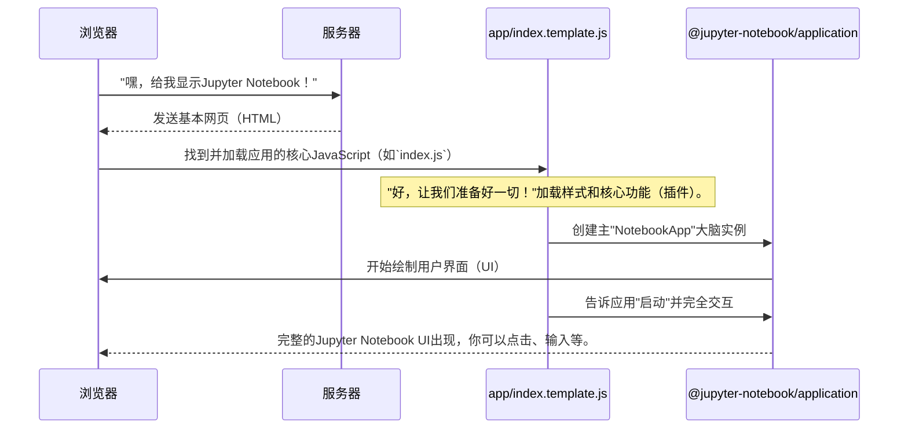

# 第1章：Jupyter Notebook前端应用(NotebookApp)

欢迎来到Jupyter Notebook

在本章中，我们将从理解拼图的第一块开始我们的旅程："Jupyter Notebook前端应用"，通常简称为`NotebookApp`。可以把它想象成当你打开网页版Jupyter Notebook时看到和交互的主控制中心。

### NotebookApp解决了什么问题？

假设你想使用Jupyter Notebook。你打开浏览器，输入网址，突然出现一个复杂的界面：你可以看到文件、创建新笔记本的按钮、菜单栏，以及最终可以编写代码并查看结果的笔记本本身。这些魔法是如何发生的？

这就是`NotebookApp`的作用！它的主要任务是**构建和管理你在浏览器中看到的整个用户界面**。没有它，你将无法以可视化的方式打开文件、运行代码或管理Jupyter环境。

**核心用例**：在浏览器中显示并允许与Jupyter Notebook界面交互。

让我们用一个类比：把`NotebookApp`想象成**汽车的仪表盘和主计算机系统**。
*   仪表盘显示一切：速度、油量、警告灯。
*   主计算机系统协调不同部件的工作方式：它将引擎控制连接到油门踏板，收音机连接到扬声器，GPS连接到显示屏。

同样，`NotebookApp`确保所有视觉元素（如文件列表、笔记本单元格、菜单和侧边栏）正确显示，并在你点击或输入时做出响应。

### NotebookApp的核心概念

1.  **它运行在浏览器中（前端）**：`NotebookApp`是一个**JavaScript应用**，直接在浏览器中运行。这就是为什么你可以关闭终端（启动Jupyter的地方），而浏览器界面仍然可以工作一段时间——因为它已经加载好了！
2.  **中央协调器**：它是协调Jupyter界面不同部分加载和交互的大脑，确保一切看起来和感觉像一个统一的应用。
3.  **管理用户界面（UI）**：从显示文件列表到展示笔记本内容，`NotebookApp`负责渲染这些元素并使其可交互。

### 如何“使用”NotebookApp（从用户角度）

作为用户，你不需要直接编写代码来“使用”`NotebookApp`。相反，当你启动Jupyter Notebook服务器（我们将在[Jupyter Notebook服务器(JupyterNotebookApp)](02_jupyter_notebook_server__jupyternotebookapp__.md)中讨论）并在浏览器中访问其地址时，`NotebookApp`会自动加载并开始工作。它是你用来与笔记本交互的应用。

### 加载Jupyter Notebook时发生了什么？（内部流程）

当你在浏览器中打开Jupyter Notebook的URL时，一系列事件会展开，将`NotebookApp`带入生活：



1.  **浏览器请求**：你的浏览器向Jupyter Notebook服务器发送请求（我们将在下一章讨论！）。
2.  **服务器响应**：服务器返回一个HTML页面。这个页面就像一个蓝图，告诉浏览器要显示什么内容以及加载哪些其他文件（如JavaScript和CSS）。
3.  **JavaScript加载**：首先加载的关键JavaScript文件之一是启动`NotebookApp`的核心文件。这通常由类似`app/index.template.js`的文件处理（它会编译为浏览器可用的`index.js`）。
4.  **配置检查**：在应用完全启动之前，它需要知道从哪里找到资源（图片、其他脚本等）。类似`app/publicpath.js`的小脚本帮助Webpack（一个打包JavaScript的工具）理解这些位置。

    ```javascript
    // app/publicpath.js - 简化示例
    // 这段代码首先运行，告诉浏览器从哪里加载应用文件
    function getOption(name) {
      // 查找嵌入在HTML页面中的配置数据
      const el = document.getElementById('jupyter-config-data');
      if (el) {
        return JSON.parse(el.textContent || '{}')[name] || '';
      }
      return '';
    }
    // 设置所有其他加载文件的基础路径
    __webpack_public_path__ = getOption('fullStaticUrl') + '/';
    ```
    *解释*：这段代码运行得非常早。它查找网页上的一些特殊配置细节（如`fullStaticUrl`），帮助浏览器知道从哪里加载所有其他必要的文件（图片、样式、应用的其他部分）。就像告诉汽车的计算机去哪里找地图！

5.  **应用初始化**：主`index.template.js`随后加载各种“插件”或扩展，这些是Jupyter Notebook生态系统中的不同功能或应用。然后创建`NotebookApp`的实例。

    ```javascript
    // app/index.template.js - 主函数片段
    async function main() {
      // ...（加载各种插件和扩展的代码）...

      // 获取核心应用类
      const NotebookApp = require('@jupyter-notebook/application').NotebookApp;

      // 创建Jupyter Notebook应用的新实例
      const app = new NotebookApp({
        // ...（插件、服务等的配置）...
      });

      // 告诉应用启动并渲染其UI
      await app.start();
    }

    // 当浏览器窗口完成加载时，启动主函数
    window.addEventListener('load', main);
    ```
    *解释*：这是前端启动的核心。一旦网页加载完成（`window.addEventListener('load', main)`），`main`函数就会运行。它首先收集Jupyter Notebook需要的所有不同“功能”（插件），然后创建一个新的`NotebookApp`对象。最后，调用`app.start()`，启动整个用户界面的渲染。就像转动汽车的钥匙，看着仪表盘亮起来！

6.  **NotebookApp定义**：`NotebookApp`类本身定义在`@jupyter-notebook/application`包中，具体在`packages/application/src/app.ts`。

    ```typescript
    // packages/application/src/app.ts - 简化结构
    import { JupyterFrontEnd } from '@jupyterlab/application';
    import { NotebookShell } from './shell'; // 这将在后续章节中介绍
    
    // NotebookApp是主应用类
    export class NotebookApp extends JupyterFrontEnd<INotebookShell> {
      constructor(options: NotebookApp.IOptions = { shell: new NotebookShell() }) {
        // 调用基类（JupyterFrontEnd）的构造函数
        super({ ...options, shell: options.shell ?? new NotebookShell() });
    
        // 添加处理不同文件类型的方式（文档注册表）
        this.docRegistry.addModelFactory(new Base64ModelFactory());
    
        // 处理选项，如mime扩展（如何显示不同文件类型）
        if (options.mimeExtensions) {
          // ... 注册mime扩展插件的代码 ...
        }
    
        // 设置应用信息，如名称和版本
        this.name = 'Jupyter Notebook';
        this.version = PageConfig.getOption('appVersion') ?? 'unknown';
    
        // 'restored'是一个promise，当应用完全准备好时解析
        this.restored = this.shell.restored;
      }
    
      // ... 其他方法和属性 ...
    }
    ```
    *解释*：这段代码定义了`NotebookApp`实际上*是什么*。可以看到它`extends JupyterFrontEnd`，这意味着它建立在Project Jupyter开发的更通用的Web应用框架之上。`constructor`就像汽车的工厂装配线：它设置所有初始组件，比如如何打开不同类型的文件（`docRegistry`）、应用的名称（`Jupyter Notebook`），以及一个名为`restored`的promise，表示整个应用已完全加载并准备好供用户交互。

### 它从哪里获取组件？

`NotebookApp`依赖于一系列可重用的构建块。其中许多列在`app/package.json`文件的`dependencies`和`resolutions`部分。这些就像汽车的各个部件（引擎、车轮、座椅），组合在一起形成完整的汽车。

例如，你会看到类似以下内容：

```json
// app/package.json - 片段
{
  "name": "@jupyter-notebook/app",
  "version": "7.5.0-alpha.2",
  // ...
  "dependencies": {
    "@jupyter-notebook/application": "^7.5.0-alpha.2",
    "@jupyterlab/application-extension": "~4.5.0-alpha.3",
    "@jupyterlab/filebrowser-extension": "~4.5.0-alpha.3",
    // ... 更多包 ...
  },
  "jupyterlab": {
    "plugins": {
      "/": {
        "@jupyter-notebook/application-extension": true,
        "@jupyterlab/filebrowser-extension": [
          "@jupyterlab/filebrowser-extension:factory",
          "@jupyterlab/filebrowser-extension:default-file-browser"
        ],
        // ... 更多插件 ...
      }
    }
  }
}
```
*解释*：`package.json`文件列出了`NotebookApp`运行所需的所有其他软件“包”。可以把它想象成所有组件的购物清单（比如`@jupyterlab/filebrowser-extension`用于管理文件，`@jupyterlab/application-extension`用于通用应用功能）。`jupyterlab.plugins`部分告诉`NotebookApp`应该为应用的不同部分（如主`/`页面或文件浏览的`/tree`页面）激活这些包的哪些特定部分（插件）。

### 总结

在本章中，我们了解到`Jupyter Notebook前端应用(NotebookApp)`是运行在浏览器中的核心JavaScript应用。它是协调和显示你看到和交互的一切的“大脑”，从文件浏览器到实际的笔记本。它加载各种插件和组件来构建完整的用户界面。

现在我们已经理解了浏览器中运行的内容，接下来让我们探索计算机背后提供所有这些数据和功能的内容。

[下一章：Jupyter Notebook服务器(JupyterNotebookApp)](02_jupyter_notebook_server__jupyternotebookapp__.md)

