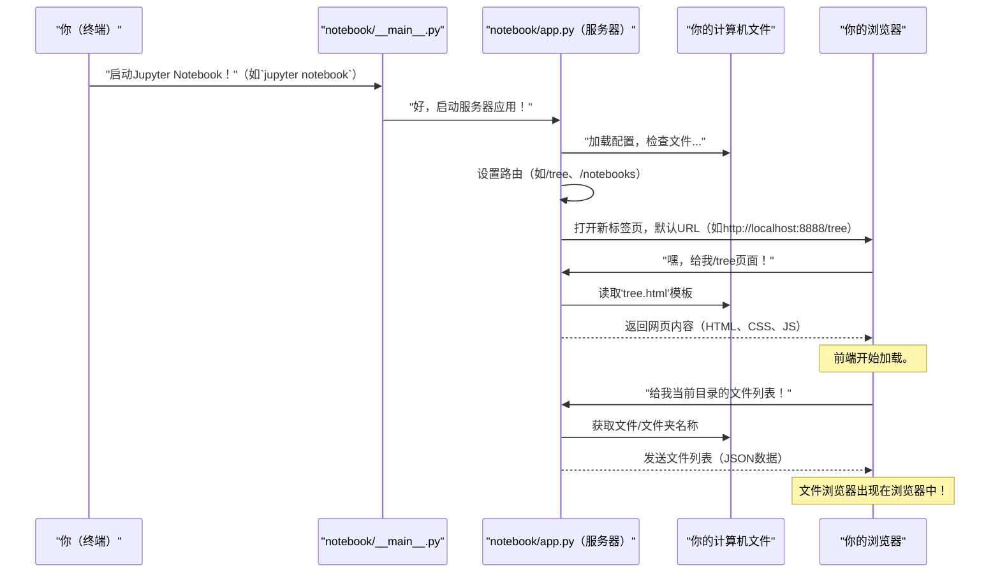

# 第2章：Jupyter Notebook服务器(JupyterNotebookApp)

在[第1章：Jupyter Notebook前端应用(NotebookApp)](01_jupyter_notebook_frontend_application__notebookapp__.md)中，我们探讨了`NotebookApp`，这是你在浏览器中直接看到和交互的Jupyter Notebook部分。它是我们汽车的漂亮仪表盘和控件。但汽车需要引擎、燃料和与外部世界的连接，对吧？

这就是**Jupyter Notebook服务器**（内部也称为`JupyterNotebookApp`）的作用！它是运行在你计算机上的强大引擎，使前端的一切成为可能。

### JupyterNotebookApp解决了什么问题？

想象你正在驾驶你的汽车（浏览器中的`NotebookApp`）。你踩油门、转动方向盘并使用导航系统。但如果没有引擎运转、车轮转动和GPS接收信号，这些操作都无法实现。

`JupyterNotebookApp`（服务器）是Jupyter Notebook的后端动力源。它的主要任务是**为运行在浏览器中的前端应用提供所有必要的服务和数据**。它充当中央枢纽，管理你的文件、运行你的代码，并传递你看到的网页。

**核心用例**：让你的浏览器能够与计算机的文件交互并运行代码，尽管浏览器本身无法直接完成这些操作。它是浏览器与计算机能力之间的桥梁。

让我们继续用汽车类比：如果`NotebookApp`（前端）是**仪表盘和控件**，那么`JupyterNotebookApp`（服务器）就是**引擎、油箱和车库中的机械师**。
*   **引擎**（服务器）执行你给出的指令（你的Python代码）。
*   **油箱**（服务器）存储你的所有文件和数据。
*   **车库中的机械师**（服务器）在仪表盘请求时提供汽车的部件（网页、图片、JavaScript）。

### JupyterNotebookApp的核心概念

1.  **它运行在你的计算机上（后端）**：与运行在浏览器中的前端不同，`JupyterNotebookApp`是一个直接运行在你计算机上的Python应用。你通常会在终端或命令提示符中看到它作为一个进程运行。
2.  **提供网页和文件**：当你在浏览器中输入`http://localhost:8888`（或类似地址）时，是`JupyterNotebookApp`将初始的HTML、CSS和JavaScript文件发送到你的浏览器，从而加载`NotebookApp`（前端）。
3.  **管理文件**：当你通过浏览器界面保存笔记本、创建新文件夹或打开现有文件时，`JupyterNotebookApp`会处理这些请求，从计算机的文件系统中读取或写入。
4.  **启动和管理内核**：这非常重要！当你创建一个新笔记本并开始编写Python代码时，`JupyterNotebookApp`负责启动一个“内核”（通常是Python本身）来实际执行你的代码，然后将结果发送回浏览器。
5.  **处理请求**：每次你在Jupyter界面中点击按钮（如“运行单元格”、“保存”或“新建笔记本”）时，浏览器会向`JupyterNotebookApp`发送请求，服务器处理请求并返回响应。

### 如何“使用”JupyterNotebookApp（从用户角度）

作为用户，你通常从命令行启动`JupyterNotebookApp`。这是你可能已经知道的命令：

```bash
jupyter notebook
```

或者，如果你将其安装为Python包，可能会看到：

```bash
python -m notebook
```

运行此命令后，你会在终端中看到大量文本滚动，最终浏览器会打开一个网页。运行命令的终端窗口就是`JupyterNotebookApp`运行的地方。如果你关闭该终端，服务器会停止，浏览器将失去连接！

### 启动Jupyter Notebook服务器时发生了什么？（内部流程）

让我们看看在终端中输入`jupyter notebook`时的简化步骤：



1.  **你启动命令**：当你输入`jupyter notebook`并按下回车时，计算机会查找`jupyter`命令。
2.  **主入口点**：该命令最终会调用类似`notebook/__main__.py`的Python文件。这个文件非常简单，其主要任务是调用启动`JupyterNotebookApp`的函数。
3.  **服务器初始化**：`JupyterNotebookApp`随后启动。它执行以下任务：
    *   读取自身配置。
    *   为应用的不同部分（如文件浏览器的`/tree`、打开笔记本的`/notebooks`、管理代码执行的`/api/kernels`）设置“路由”（地址）。
    *   准备监听来自浏览器的请求。
4.  **浏览器连接**：服务器通常会在浏览器中打开一个新标签页，指向其默认地址（如`http://localhost:8888/tree`）。
5.  **提供网页**：当浏览器请求`http://localhost:8888/tree`时，`JupyterNotebookApp`接收请求。然后找到适当的HTML模板文件（如`tree.html`），填充必要数据（如当前目录路径），并将完整的网页发送回浏览器。这就是`NotebookApp`（前端）加载的方式。
6.  **处理API请求**：前端加载后，会向服务器发送更多请求（如“给我这个文件夹的文件列表”、“运行这个代码单元格”、“保存这个文件”）。`JupyterNotebookApp`通过与计算机文件系统交互或启动新的“内核”（稍后讨论）来处理这些请求。

### 深入代码

让我们看一些简化代码片段，了解其工作原理。

#### 1. 从命令行启动服务器（`notebook/__main__.py`）

这是运行`python -m notebook`或`jupyter notebook`时的第一步：

```python
# 文件：notebook/__main__.py
"""notebook的命令行入口点。"""

import sys

from notebook.app import main # 从app模块导入'main'函数

sys.exit(main()) # 调用main函数启动应用
```
*解释*：这个简短的文件只是从`notebook/app.py`（`JupyterNotebookApp`所在位置）导入`main`函数并调用它。就像启动引擎的“点火开关”。

#### 2. JupyterNotebookApp类（`notebook/app.py`）

服务器的核心是`JupyterNotebookApp`类。它继承自`jupyterlab_server.LabServerApp`，这意味着它直接获得了许多强大的Web服务器功能。

```python
# 文件：notebook/app.py - 简化结构
from jupyterlab_server import LabServerApp
from traitlets import Unicode, Bool, default
from pathlib import Path
import typing as t

# 获取前端文件（HTML、CSS、JS）的存储路径
HERE = Path(__file__).parent.resolve()

class JupyterNotebookApp(LabServerApp): # 我们的服务器应用继承自LabServerApp
    name = "notebook"
    app_name = "Jupyter Notebook"
    version = __version__ # 从_version.py文件获取版本

    # 首次打开Jupyter Notebook时的默认URL（文件浏览器）
    default_url = Unicode("/tree", config=True, help="从`/`重定向的默认URL")

    # 此属性告诉服务器静态文件（HTML、JS、CSS）的位置
    @default("static_dir")
    def _default_static_dir(self) -> str:
        return str(HERE / "static") # 指向app.py旁边的'static'文件夹

    # 此属性告诉服务器HTML模板文件的位置
    @default("templates_dir")
    def _default_templates_dir(self) -> str:
        return str(HERE / "templates") # 指向'templates'文件夹

    def initialize_handlers(self) -> None:
        """初始化服务器的所有Web处理器（路由）。"""
        # 添加特定路由，如/tree、/notebooks、/edit等
        self.handlers.append(("/tree(.*)", TreeHandler)) # 当浏览器请求/tree时，使用TreeHandler
        self.handlers.append(("/notebooks(.*)", NotebookHandler)) # 当浏览器请求/notebooks时，使用NotebookHandler
        self.handlers.append(("/edit(.*)", FileHandler))
        # ... 更多处理器 ...

        super().initialize_handlers() # 调用父类的处理器设置

# notebook/__main__.py调用的'main'函数
main = launch_new_instance = JupyterNotebookApp.launch_instance

if __name__ == "__main__":
    main()
```
*解释*：
*   `JupyterNotebookApp`类是我们的服务器定义。就像汽车引擎的主控制单元。
*   `name`和`app_name`标识我们的应用。
*   `default_url = Unicode("/tree")`告诉服务器启动时自动在浏览器中打开`/tree`页面（文件浏览器）。
*   `@default("static_dir")`和`@default("templates_dir")`非常重要！它们告诉服务器从哪里获取需要发送到浏览器的文件：
    *   **静态文件**：构成前端应用的JavaScript（`.js`）、CSS（`.css`）和图片文件（`.png`、`.svg`）。
    *   **模板文件**：发送到浏览器以构建初始网页的HTML文件（如`tree.html`、`notebooks.html`）。
*   `initialize_handlers()`是关键方法。服务器在此决定浏览器请求特定“地址”（URL）时的操作。它设置处理器，如`/tree`的`TreeHandler`、`/notebooks`的`NotebookHandler`等。这些处理器就像汽车可以采取的不同路线，每条路线通向应用的特定部分。

#### 3. 处理请求和提供页面（如`TreeHandler`在`notebook/app.py`中）

让我们看一个处理器的简化示例，`TreeHandler`负责显示文件浏览器：

```python
# 文件：notebook/app.py - 简化TreeHandler
from tornado import web
from jupyter_server.base.handlers import JupyterHandler
import typing as t
from jupyter_server.utils import url_escape, url_path_join as ujoin

class NotebookBaseHandler(JupyterHandler):
    # 此类为所有处理器提供通用功能
    def get_page_config(self) -> dict[str, t.Any]:
        # 此函数收集发送到前端的配置数据（如基础URL、令牌、终端是否可用）
        config = {
            "appVersion": self.extensionapp.version,
            "baseUrl": self.base_url,
            # ... 其他配置项 ...
        }
        return config

class TreeHandler(NotebookBaseHandler):
    """树页面处理器（文件浏览器）。"""

    @web.authenticated # 确保用户已登录
    async def get(self, path: str = "") -> None:
        """
        显示给定路径的适当页面。
        - 如果路径是目录，显示目录列表
        - 如果路径是笔记本，重定向到笔记本页面
        """
        path = path.strip("/") # 清理路径

        cm = self.contents_manager # 获取内容管理器（用于管理文件）

        if await cm.dir_exists(path=path): # 检查路径是否为目录
            # 如果是目录，准备显示文件浏览器
            page_config = self.get_page_config()
            page_config["treePath"] = path # 告诉前端要打开的目录

            # 渲染'tree.html'模板并发送到浏览器
            tpl = self.render_template("tree.html", page_config=page_config)
            return self.write(tpl) # 将HTML发送回浏览器

        if await cm.file_exists(path): # 检查路径是否为文件
            # 如果是文件，获取其类型
            model = await cm.get(path, content=False)
            if model["type"] == "notebook":
                # 如果是笔记本文件，重定向到笔记本页面
                url = ujoin(self.base_url, "notebooks", url_escape(path))
            else:
                # 如果是其他类型文件，重定向到文件编辑器页面
                url = ujoin(self.base_url, "files", url_escape(path))
            self.redirect(url) # 告诉浏览器跳转到新URL
            return None
        
        raise web.HTTPError(404) # 如果未找到，发送“未找到”错误
```
*解释*：
*   `TreeHandler`就像文件浏览器页面的专业机械师。
*   当浏览器向`/tree`（或`/tree/my-folder`）发送HTTP GET请求时，调用`get`方法。
*   `@web.authenticated`确保在显示任何内容前你已登录。
*   `self.contents_manager`是服务器的重要部分，知道如何与计算机上的实际文件和文件夹交互。
*   代码检查请求的`path`是目录还是文件：
    *   如果是**目录**，使用`self.render_template("tree.html", ...)`将`tree.html`文件（来自之前提到的`templates_dir`）发送到浏览器。此HTML页面随后加载`NotebookApp`前端，前端再向服务器请求该目录的文件列表。
    *   如果是**文件**（如`/tree/my_notebook.ipynb`），检查是否为笔记本。如果是，告诉浏览器**重定向**到`/notebooks/my_notebook.ipynb` URL，加载笔记本编辑器。如果是其他文件类型，重定向到通用文件编辑器。
*   这展示了服务器如何根据你访问的内容动态提供不同页面或重定向。

#### 4. 服务器如何被“发现”（`notebook/__init__.py`）

当你运行`jupyter notebook`时，`jupyter_server`应用（`JupyterNotebookApp`是其扩展）需要知道`notebook`项目是它可以加载的有效服务器扩展。这在`notebook/__init__.py`文件中定义：

```python
# 文件：notebook/__init__.py
from __future__ import annotations

from typing import Any

from ._version import __version__, version_info # noqa: F401

# 此函数告诉Jupyter Server 'notebook'是一个扩展
def _jupyter_server_extension_paths() -> list[dict[str, str]]:
    return [{"module": "notebook"}] # 告诉它在'notebook'模块中查找应用

# 此函数明确指向我们的JupyterNotebookApp类
def _jupyter_server_extension_points() -> list[dict[str, Any]]:
    from .app import JupyterNotebookApp # 导入我们的服务器应用类

    return [{"module": "notebook", "app": JupyterNotebookApp}] # 告诉Jupyter Server：“这是我们的服务器应用！”

# ...（其他labextension路径的函数）...
```
*解释*：这些特殊函数（`_jupyter_server_extension_paths`和`_jupyter_server_extension_points`）充当“注册”机制。它们告诉主`jupyter_server`框架：“嘿，我是一个Jupyter扩展，我的主服务器应用叫`JupyterNotebookApp`，位于`notebook`模块中。”这使得核心Jupyter系统能够找到并运行我们的服务器。

### 总结

`Jupyter Notebook服务器(JupyterNotebookApp)`是Jupyter Notebook的关键后端组件。它是驱动整个体验的引擎，向浏览器提供网页、管理文件，并通过内核协调代码执行。虽然[Jupyter Notebook前端应用(NotebookApp)](01_jupyter_notebook_frontend_application__notebookapp__.md)提供了可视化界面，但`JupyterNotebookApp`在幕后完成所有繁重工作，弥合了浏览器与计算机资源之间的鸿沟。

现在我们已经了解了前端和运行在背后的服务器，接下来让我们看看它们如何连接以及应用结构如何组织一切。

[下一章：应用外壳(NotebookShell)](03_application_shell__notebookshell__.md)

