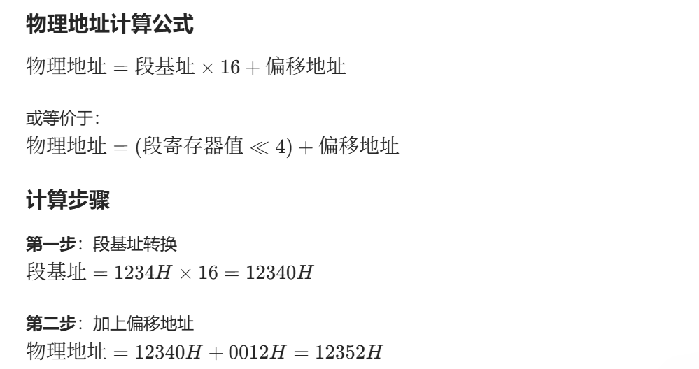
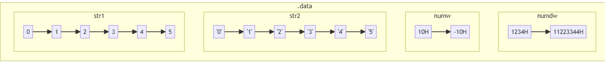
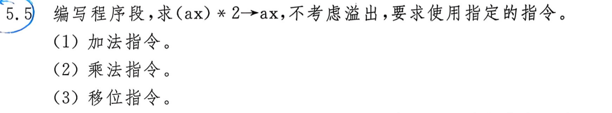
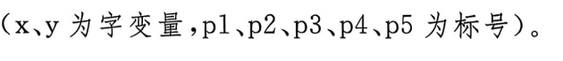

# 1.绪论

1.1 机器语言

机器语言是计算机==CPU唯一==能直接识别和执行的、由==0和1==代码构成的最底层指令集

而机器语言程序就是用这些==二进制指令编写的==、可被计算机直接运行的指令序列。


1.5 汇编语言相关概念

**汇编语言：** 用助记符（如MOV、ADD、JMP等）代替机器码的低级语言，与机器语言一一对应，便于人类阅读和编写。

**汇编语言源程序：** 用汇编语言编写的、未经编译的文本程序，需通过汇编器转换成机器语言才能执行。


1.7 三种语言的关系

**层次关系：**
- **机器语言** ← 最底层（计算机直接执行）
- **汇编语言** ← 中间层（与硬件紧密相关）
- **高级程序设计语言** ← 最高层（面向人类思维）

**转换关系：**

- 高级语言 → 编译器 → 汇编语言 → 汇编器 → 机器语言
- 高级语言更易学易用，但执行效率低；机器语言效率最高但难以编写
- 汇编语言是连接两者的桥梁，用于系统编程和性能优化

**特点：** ==三者本质都是指令集，只是表现形式不同==，最终都要转化为机器语言才能被CPU执行

# 2.中央处理器

2.6 带符号数的补码表示

（不用写说明）

## **n=8 位**

| 十六进制 | 二进制    | 补码表示  | 说明           |
| -------- | --------- | --------- | -------------- |
| **-3H**  | 0000 0011 | 1111 1101 | 负数：取反+1   |
| **5BH**  | 0101 1011 | 0101 1011 | 正数：直接表示 |
| **-76H** | 0111 0110 | 1000 1010 | 负数：取反+1   |
| **4CH**  | 0100 1100 | 0100 1100 | 正数：直接表示 |

---

## **n=16 位**

| 十六进制   | 二进制              | 补码表示            | 说明           |
| ---------- | ------------------- | ------------------- | -------------- |
| **-69DAH** | 0110 1001 1101 1010 | 1001 0110 0010 0110 | 负数：取反+1   |
| **-3E2DH** | 0011 1110 0010 1101 | 1100 0001 1101 0011 | 负数：取反+1   |
| **1AB6H**  | 0001 1010 1011 0110 | 0001 1010 1011 0110 | 正数：直接表示 |
| **-7231H** | 0111 0010 0011 0001 | 1000 1101 1100 1111 | 负数：取反+1   |

**补码转换规则**

- **正数**：最高位为0，直接表示
- **负数**：
  - 最高位为1
  - 原码取反后加1得到补码

# 3.主存储器及数据在计算机内的表示形式

3.8 物理地址计算

- **实模式**下的地址计算
- 数据段寄存器：(DS) = 1234H
- 偏移地址（段内偏移）：0012H
- 求：该单元的物理地址



### **该单元的物理地址是 12352H**

| 项目           | 值         |
| -------------- | ---------- |
| DS值（段基址） | 1234H      |
| 偏移地址       | 0012H      |
| 物理地址       | **12352H** |

---

## **说明**

✓ 实模式下，段地址左移4位（乘以16）再加偏移地址得到20位物理地址  
✓ 物理地址范围：0 ~ FFFFFH（1MB）  
✓ 十进制验证：74560 + 18 = 74578 = 12352H ✓


3.13 数据段在内存中的存放

1. **`str1`**:
   - 定义为一个字节数组 `db 0,1,2,3,4,5`，每个元素占用1字节。
   - 内存中连续存放，顺序为 `0, 1, 2, 3, 4, 5`。

2. **`str2`**:
   - 定义为一个字符串 `db '012345'`，每个字符占用1字节。
   - 内存中连续存放，顺序为 `'0', '1', '2', '3', '4', '5'`。

3. **`numw`**:
   - 定义为一个字数组 `dw 10H, -10H`，每个元素占用2字节（小端序）。
   - 内存中连续存放，顺序为 `10H, -10H`。

4. **`numdw`**:
   - 定义为一个双字数组 `dd 1234H, 11223344H`，每个元素占用4字节（小端序）。
   - 内存中连续存放，顺序为 `1234H, 11223344H`。

注意

- 小端序（Little-Endian）表示低字节在前，高字节在后。
- 负数以补码形式存储。



# 4.寻址方式


（直接看下面的总结表）

### (1) `mov esi, 10`
- **目的操作数**：`esi`  
  **寻址方式**：寄存器寻址（直接操作寄存器）。
- **源操作数**：`10`  
  **寻址方式**：立即数寻址（直接给出常数值）。

### (2) `mov x, 10` （`x` 是双字类型的变量）
- **目的操作数**：`x`  
  **寻址方式**：直接寻址（通过变量名直接访问内存地址）。
- **源操作数**：`10`  
  **寻址方式**：立即数寻址。

### (3) `mov x[4], 10` （`x` 是双字类型的变量）
- **目的操作数**：`x[4]`  
  **寻址方式**：基址寻址（`x` 是基址，`4` 是偏移量）。
- **源操作数**：`10`  
  **寻址方式**：立即数寻址。

### (4) `mov di, [eax]`
- **目的操作数**：`di`  
  **寻址方式**：寄存器寻址。
- **源操作数**：`[eax]`  
  **寻址方式**：寄存器间接寻址（通过寄存器 `eax` 的值作为内存地址）。

### (5) `add eax, 4[ebx]`
- **目的操作数**：`eax`  
  **寻址方式**：寄存器寻址。
- **源操作数**：`4[ebx]`  
  **寻址方式**：基址寻址（`ebx` 是基址，`4` 是偏移量）。

### (6) `sub al, [ebx+ecx*2+2]`
- **目的操作数**：`al`  
  **寻址方式**：寄存器寻址。
- **源操作数**：`[ebx+ecx*2+2]`  
  **寻址方式**：基址变址寻址（`ebx` 是基址，`ecx*2` 是变址，`2` 是偏移量）。

### (7) `mov [edi*4+6], ax`
- **目的操作数**：`[edi*4+6]`  
  **寻址方式**：变址寻址（`edi*4` 是变址，`6` 是偏移量）。
- **源操作数**：`ax`  
  **寻址方式**：寄存器寻址。

### (8) `mov eax, x+20` （`x` 是双字类型的变量）
- **目的操作数**：`eax`  
  **寻址方式**：寄存器寻址。
- **源操作数**：`x+20`  
  **寻址方式**：直接寻址（`x` 是基址，`20` 是偏移量）。

### (9) `mov x[ebx], 30` （`x` 是双字类型的变量）
- **目的操作数**：`x[ebx]`  
  **寻址方式**：基址寻址（`x` 是基址，`ebx` 是偏移量）。
- **源操作数**：`30`  
  **寻址方式**：立即数寻址。

### 总结表：
| 指令                    | 目的操作数寻址方式 | 源操作数寻址方式 |
| ----------------------- | ------------------ | ---------------- |
| `mov esi, 10`           | 寄存器寻址         | 立即数寻址       |
| `mov x, 10`             | 直接寻址           | 立即数寻址       |
| `mov x[4], 10`          | 基址寻址           | 立即数寻址       |
| `mov di, [eax]`         | 寄存器寻址         | 寄存器间接寻址   |
| `add eax, 4[ebx]`       | 寄存器寻址         | 基址寻址         |
| `sub al, [ebx+ecx*2+2]` | 寄存器寻址         | 基址变址寻址     |
| `mov [edi*4+6], ax`     | 变址寻址           | 寄存器寻址       |
| `mov eax, x+20`         | 寄存器寻址         | 直接寻址         |
| `mov x[ebx], 30`        | 基址寻址           | 立即数寻址       |

# 5.常用机器指令



用加法指令、乘法指令和移位指令实现 `(ax) * 2 → ax` 的程序段：

### (1) 使用加法指令
```assembly
add ax, ax  ; 将 ax 的值与自身相加，相当于 ax * 2
```

### (2) 使用乘法指令
```assembly
mov bx, 2   ; 将乘数 2 存入 bx
mul bx      ; ax = ax * bx (结果存储在 ax 中)
```

### (3) 使用移位指令
```assembly
shl ax, 1   ; 将 ax 左移 1 位，相当于 ax * 2
```

### 说明：
1. **加法指令**：直接通过 `add ax, ax` 实现 `ax * 2`，效率较高。
2. **乘法指令**：通过 `mul` 指令实现，需要额外寄存器存储乘数。
3. **移位指令**：通过 `shl`（逻辑左移）指令实现，效率最高，适合无符号数运算。

### 注意
- 以上程序段均不考虑溢出问题。
- 如果 `ax` 的值过大，可能导致溢出，需根据实际需求处理。

# 6.顺序和分支程序设计


6.4

实现 `if (z > y) z = x; else z = y;` 功能的汇编代码，不使用条件流控制伪指令：

```assembly
; 假设 x, y, z 是双字类型的有符号变量
mov eax, [z]      ; 将 z 的值加载到 eax
mov ebx, [y]      ; 将 y 的值加载到 ebx
cmp eax, ebx      ; 比较 z 和 y
jg set_z_to_x     ; 如果 z > y，跳转到 set_z_to_x
mov eax, [y]      ; 否则，将 y 的值加载到 eax
jmp store_result  ; 跳转到 store_result

set_z_to_x:
mov eax, [x]      ; 将 x 的值加载到 eax

store_result:
mov [z], eax      ; 将结果存储到 z
```

### 代码说明：
1. **比较 `z` 和 `y`**：
   - 使用 `cmp` 指令比较 `z` 和 `y` 的值。
   - 如果 `z > y`（有符号比较），跳转到 `set_z_to_x` 分支。
   - 否则，继续执行 `else` 部分的逻辑。

2. **分支逻辑**：
   - `set_z_to_x`：将 `x` 的值赋给 `z`。
   - `else` 分支：将 `y` 的值赋给 `z`。

3. **结果存储**：
   - 最终结果存储在 `z` 中。

### 注意事项：
- 代码中未使用条件流控制伪指令（如 `.if`、`.else`），完全通过跳转指令实现逻辑。
- 适用于 32 位汇编环境（如 x86 架构）。


6.6 程序段化简



原始程序段：

```assembly
mov ax, x
cmp ax, y
jc p1
cmp ax, y
jo p2
cmp ax, y
je p3
cmp ax, y
jns p4
p3:
add ax, y
jc p5
```

简化后的程序段：

```assembly
mov ax, x
cmp ax, y
jc p1    ; 如果 CF=1 (x < y 无符号), 跳转到 p1
jo p2    ; 如果 OF=1 (有符号溢出), 跳转到 p2
je p3    ; 如果 ZF=1 (x == y), 跳转到 p3
jns p4   ; 如果 SF=0 (x >= y 有符号), 跳转到 p4
p3:
add ax, y
jc p5    ; 如果 CF=1 (加法溢出), 跳转到 p5
```

说明：

1. **合并重复的 `cmp` 指令**：
   - 原始代码中多次重复 `cmp ax, y`，可以简化为一次比较操作。
   - 后续的跳转指令直接基于第一次比较的结果。

2. **跳转逻辑优化**：
   - `jc p1`：检查无符号比较结果（`x < y`）。
   - `jo p2`：检查有符号溢出（例如 `x` 和 `y` 的运算结果溢出）。
   - `je p3`：检查是否相等（`x == y`）。
   - `jns p4`：检查有符号比较结果（`x >= y`）。

3. **标号 `p3` 的逻辑**：
   - 如果 `x == y`，执行 `add ax, y`，并检查加法是否溢出（`jc p5`）。

注意

- 简化后的代码逻辑与原始代码完全一致，但减少了冗余操作。
- 跳转条件的顺序需要根据实际需求调整，确保逻辑正确。

# 7.循环程序设计

7.3

以 `buf` 为首地址的双字存储区中找出最大有符号数并显示出来的汇编程序：

### 程序代码
```assembly
section .data
    buf dd 10, -5, 20, 15, -30, 25  ; 示例数据（双字有符号数）
    n equ ($ - buf) / 4             ; 计算数据个数

section .text
    global _start

_start:
    mov ecx, n          ; 初始化计数器为数据个数
    mov esi, buf        ; 将 buf 的首地址存入 esi
    mov eax, [esi]      ; 将第一个数作为初始最大值

find_max:
    cmp eax, [esi]      ; 比较当前最大值与当前数
    jge next            ; 如果当前最大值 >= 当前数，跳过更新
    mov eax, [esi]      ; 否则更新最大值为当前数

next:
    add esi, 4          ; 移动到下一个双字数
    loop find_max       ; 循环处理所有数据

    ; 显示最大值（假设通过系统调用或其他方式显示）
    ; 这里以简单示例展示，实际显示逻辑需根据平台实现
    ; 例如 Linux 下可以使用 sys_write
    mov ebx, eax        ; 将最大值存入 ebx（或其他寄存器）
    ; 此处省略具体的显示代码

exit:
    mov eax, 1          ; 退出系统调用号
    xor ebx, ebx        ; 返回码 0
    int 0x80            ; 调用系统调用
```

### 说明
1. **数据定义**：
   - `buf` 是一个双字（`dd`）数组，存储有符号数。
   - `n` 通过计算 `buf` 的总字节数除以 4（双字大小）得到数据个数。

2. **初始化**：
   - `ecx` 设置为数据个数 `n`，用于循环控制。
   - `esi` 指向 `buf` 的首地址。
   - `eax` 初始化为第一个数，作为当前最大值。

3. **查找最大值**：
   - 使用 `cmp` 和 `jge` 指令比较当前最大值与当前数。
   - 如果当前数更大，则更新 `eax` 为当前数。
   - 通过 `loop` 指令循环处理所有数据。

4. **显示最大值**：
   - 示例中未具体实现显示逻辑，实际应用中可通过系统调用（如 Linux 的 `sys_write`）或其他方式显示 `eax` 的值。

### 注意
- **有符号数比较**：使用 `jge`（Jump if Greater or Equal）指令处理有符号数比较。
- **循环优化**：`loop` 指令会自动递减 `ecx` 并判断是否为 0。
- **平台适配**：显示逻辑需根据具体操作系统或环境实现（如 DOS、Linux 等）。

---

7.6

冒泡排序算法对以 `buf` 为首地址的双字存储区中的 `n` 个有符号数按从小到大排序，并输出排序结果的汇编程序：

### 代码
```assembly
section .data
    buf dd 10, -5, 20, 15, -30, 25  ; 示例数据（双字有符号数）
    n equ ($ - buf) / 4             ; 计算数据个数

section .text
    global _start

_start:
    ; 冒泡排序
    mov ecx, n          ; 外层循环计数器
    dec ecx             ; 外层循环次数为 n-1

outer_loop:
    mov esi, buf        ; 初始化内层循环指针
    mov edx, ecx        ; 内层循环计数器

inner_loop:
    mov eax, [esi]      ; 加载当前数
    mov ebx, [esi + 4]  ; 加载下一个数
    cmp eax, ebx        ; 比较当前数和下一个数
    jle no_swap         ; 如果当前数 <= 下一个数，不交换
    mov [esi], ebx      ; 交换两个数
    mov [esi + 4], eax

no_swap:
    add esi, 4          ; 移动到下一个数
    dec edx             ; 内层循环计数器减1
    jnz inner_loop      ; 继续内层循环

    loop outer_loop     ; 继续外层循环

    ; 输出排序结果（示例逻辑，需根据平台实现）
    mov esi, buf        ; 重新指向排序后的数组
    mov ecx, n          ; 初始化计数器

print_loop:
    mov eax, [esi]      ; 加载当前数
    ; 此处添加显示 eax 的代码（如系统调用）
    add esi, 4          ; 移动到下一个数
    loop print_loop     ; 继续输出循环

exit:
    mov eax, 1          ; 退出系统调用号
    xor ebx, ebx        ; 返回码 0
    int 0x80            ; 调用系统调用
```

### 说明
1. **数据定义**：
   - `buf` 是一个双字（`dd`）数组，存储有符号数。
   - `n` 通过计算 `buf` 的总字节数除以 4（双字大小）得到数据个数。

2. **冒泡排序**：
   - **外层循环**：控制排序轮数，共 `n-1` 轮。
   - **内层循环**：比较相邻的两个数，如果顺序错误则交换。
   - **交换逻辑**：使用 `mov` 指令实现数据交换。

3. **输出排序结果**：
   - 示例中未具体实现显示逻辑，实际应用中可通过系统调用（如 Linux 的 `sys_write`）或其他方式显示每个数。

### 注意
- **有符号数比较**：使用 `jle`（Jump if Less or Equal）指令处理有符号数比较。
- **循环优化**：`loop` 指令自动递减 `ecx` 并判断是否为 0。
- **平台适配**：显示逻辑需根据具体操作系统或环境实现（如 DOS、Linux 等）。