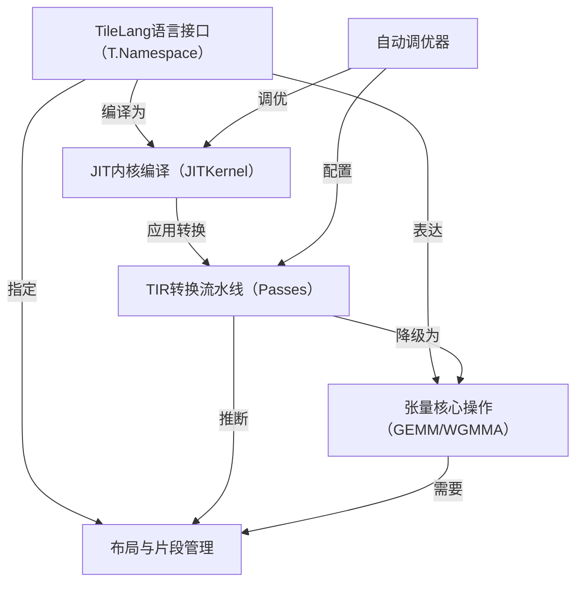
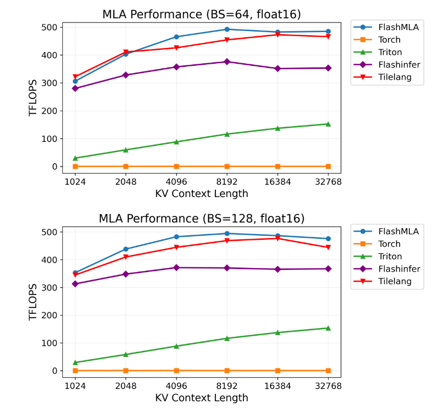
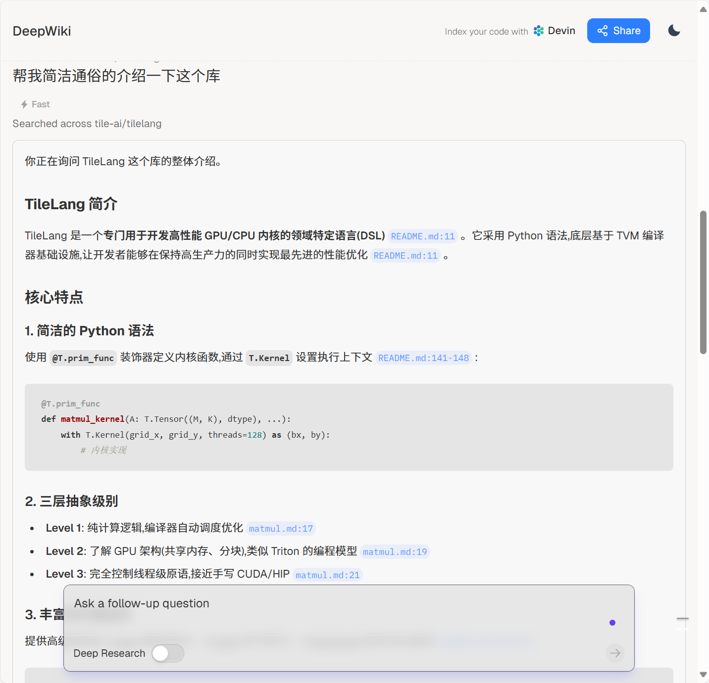

链接：[tile-ai/tilelang | DeepWiki](https://deepwiki.com/tile-ai/tilelang)

# docs：TileLang


**TileLang**是一种*Python风格的领域特定语言*，旨在简化*高性能GPU/CPU内核*的创建。它为用户`提供了一个强大的接口来描述计算过程`，这些计算随后通过基于TVM的*高级优化流水线*进行*即时编译（JIT）*，从而为矩阵乘法和注意力机制等AI工作负载提供最`先进的性能`。

## 可视化



## 章节

1. [TileLang语言接口（T.Namespace）](01_tilelang_language_interface__t_namespace__.md)
2. [张量核心操作（GEMM/WGMMA）](02_tensor_core_operations__gemm___wgmma__.md)
3. [布局与片段管理](03_layout_and_fragment_management_.md)
4. [JIT内核编译（JITKernel）](04_jit_kernel_compilation__jitkernel__.md)
5. [TIR转换流水线（Passes）](05_tir_transformation_pipeline__passes__.md)
6. [自动调优器](06_auto_tuner_.md)

---

# tile-lang

** (tile-lang)** 是一种简洁的领域特定语言，旨在==简化高性能GPU/CPU内核(如GEMM、反量化GEMM、FlashAttention、LinearAttention)的开发==

通过在TVM基础上采用Python风格的语法和底层编译器基础设施，tile-lang让开发者能够`专注于生产力，同时不牺牲实现最先进性能所需的底层优化`。


## 动态
* 2025/10/07 🍎: 新增Apple Metal设备支持，详情查看Pull Request #799
* 2025/09/29 🎉: 激动宣布现已支持面向华为昇腾芯片的**AscendC**和**AscendNPU IR**后端！预览链接：🔗 详见ascendc_pto和npuir两个分支的实现
* 2025/07/04 🚀: 引入T.gemm_sp支持2:4稀疏张量核心，详情查看Pull Request #526
* 2025/06/05 ✨: 新增NVRTC后端显著减少cute模板编译时间
* 2025/04/14 🚀: 为AMD MI300X新增高性能FlashMLA实现，性能媲美Aiter手工优化汇编内核(见example_mla_amd)
* 2025/03/03 🚀: 仅用80行Python代码实现高性能MLA解码，在H100上达到与FlashMLA相当的性能(见example_mla_decode.py)
* 2025/02/15 ✨: 新增WebGPU代码生成支持(见Pull Request #86)
* 2025/02/12 ✨: 激动发布v0.1.0版本
* 2025/02/10 🚀: 新增调试工具T.print(打印变量/缓冲区)和内存布局绘图器(examples/plot_layout)
* 2025/01/20 ✨: 高性能AI工作负载DSL tile-lang正式开源

## 测试设备
虽然tile-lang旨在跨多种设备通用，但已在以下设备上专门测试验证：
- NVIDIA GPU: H100(支持Auto TMA/WGMMA)、A100、V100、RTX 4090/3090/A6000
- AMD GPU: MI250(支持Auto MatrixCore)、MI300X(支持Async Copy)

## 算子实现示例
tile-lang为实现各类算子提供了基础构建模块，包括：
- 矩阵乘法
- 反量化GEMM  
- FlashAttention
- Flash LinearAttention
- Flash MLA解码
- 原生稀疏注意力

在examples目录中还可找到更多复杂内核实现，如卷积、FlashAttention前向/反向传播等，更多算子将持续添加。

## 基准测试摘要
tile-lang在各种计算模式中均表现出卓越性能。完整测试脚本和设置详见[tilelang-benchmark](链接)，部分亮点结果：

### H100上的MLA解码性能


### H100上的FlashAttention性能


### 多GPU矩阵乘性能(RTX 4090/A100/H100/MI300X)


### A100上的反量化矩阵乘性能


## 安装方式

### 方法1: Pip安装
从PyPI安装最新发布版：
```bash
pip install tilelang
```

或直接从GitHub仓库安装：
```bash
pip install git+https://github.com/tile-ai/tilelang
```

本地安装：
```bash
sudo apt-get update
sudo apt-get install -y python3-setuptools gcc libtinfo-dev zlib1g-dev build-essential cmake libedit-dev libxml2-dev
pip install -e . -v  # 移除-e选项可非开发模式安装，-v显示详细输出
```

### 方法2: 从源码构建
提供三种源码安装方式：
1. 使用自有TVM安装
2. 使用捆绑的TVM子模块  
3. 使用提供的脚本安装

### 方法3: 安装Nightly版本
```bash
pip install tilelang -f https://tile-ai.github.io/whl/nightly/cu121/
```
注意：Nightly版本包含最新代码变更但稳定性可能低于正式版，适合测试新特性或急需未发布的问题修复。

## 快速入门
本节展示如何使用tile-lang编写和执行简单的GEMM(矩阵乘法)内核，以及布局优化、流水线和L2缓存友好型swizzling等技术。

### 带注解的GEMM示例(布局、L2缓存Swizzling和流水线等)
```python
import tilelang
import tilelang.language as T

@tilelang.jit
def matmul(M, N, K, block_M, block_N, block_K, dtype="float16", accum_dtype="float"):
    
    @T.prim_func
    def matmul_relu_kernel(
            A: T.Tensor((M, K), dtype),
            B: T.Tensor((K, N), dtype),
            C: T.Tensor((M, N), dtype),
    ):
        with T.Kernel(T.ceildiv(N, block_N), T.ceildiv(M, block_M), threads=128) as (bx, by):
            A_shared = T.alloc_shared((block_M, block_K), dtype)
            B_shared = T.alloc_shared((block_K, block_N), dtype)
            C_local = T.alloc_fragment((block_M, block_N), accum_dtype)

            T.clear(C_local)

            for ko in T.Pipelined(T.ceildiv(K, block_K), num_stages=3):
                T.copy(A[by * block_M, ko * block_K], A_shared)
                T.copy(B[ko * block_K, bx * block_N], B_shared)
                T.gemm(A_shared, B_shared, C_local)
            
            for i, j in T.Parallel(block_M, block_N):
                C_local[i, j] = T.max(C_local[i, j], 0)

            T.copy(C_local, C[by * block_M, bx * block_N])

    return matmul_relu_kernel

# 测试代码
M = N = K = 1024
block_M = block_N = 128
block_K = 32
matmul_relu_kernel = matmul(M, N, K, block_M, block_N, block_K)

import torch
a = torch.randn(M, K, device="cuda", dtype=torch.float16)
b = torch.randn(K, N, device="cuda", dtype=torch.float16)  
c = torch.empty(M, N, device="cuda", dtype=torch.float16)

matmul_relu_kernel(a, b, c)
ref_c = torch.relu(a @ b)
torch.testing.assert_close(c, ref_c, rtol=1e-2, atol=1e-2)
print("验证通过")

# 性能分析
profiler = matmul_relu_kernel.get_profiler(tensor_supply_type=tilelang.TensorSupplyType.Normal)
print(f"延迟: {profiler.do_bench()} ms")
```

## 超越GEMM的深度探索
除GEMM外，我们还提供多种示例展示TileLang的多功能性和强大能力：
- **反量化GEMM**：通过精细控制每线程操作实现高性能反量化，多项特性已被BitBLAS采纳为默认行为
- **FlashAttention**：用简洁直观的语法实现跨算子融合，并提供自动调优示例
- **线性注意力**：包括RetNet和Mamba实现
- **卷积**：实现IM2Col卷积

## 即将推出的特性
查看[tilelang v0.2.0发布计划](链接)了解即将推出的功能。TileLang现已在BitBLAS和AttentionEngine项目中使用。

-----------



可以通过询问devin来了解学习~
