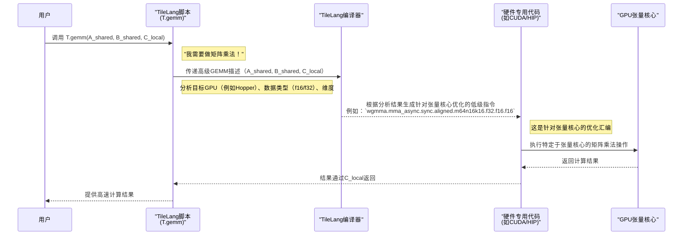

# 第2章：张量核心运算（GEMM/WGMMA）

欢迎回来

在[第1章：TileLang语言接口（T.Namespace）](01_tilelang_language_interface__t_namespace__.md)中，了解了`T.Namespace`以及`T.gemm`作为矩阵乘法的强大原语。看到==单行代码`T.gemm(A_shared, B_shared, C_local)`完成了大量繁重工作==。

> 但它为何如此高效？TileLang如何将Python指令转化为闪电般快速的GPU代码？

本章将揭开`T.gemm`背后的魔法，解释它如何利用**张量核心（Tensor Cores）**等专用硬件特性及其独特运算如**GEMM（通用矩阵乘法）**和**WGMMA（线程束组矩阵乘加）**。

## 为何需要专用矩阵运算硬件？AI革命的需求

假设正在运行一个大型AI模型，比如驱动ChatGPT或生成图像的模型

> 这些模型每秒执行*数十亿次*矩阵乘法。如果计算机逐个计算，将耗费极长时间

这就是专用硬件的用武之地。例如NVIDIA GPU配备了称为**张量核心**的专用单元。它们如同内置于芯片的超高速专用计算器，专为矩阵乘法和加法优化，速度远超GPU通用计算单元。AMD GPU也有类似单元称为"==矩阵核心=="。

==TileLang的`T.gemm`设计为自动调用这些专用单元==，确保你的代码在数学密集型任务中发挥极致性能。

## 核心概念：为速度而生的专用计算器

让我们解析这些高性能运算背后的核心思想。

### 1. 张量核心：GPU的数学加速器

* **本质**：现代GPU（NVIDIA Volta、Turing、Ampere、Hopper、Blackwell架构及AMD等效产品）中的专用硬件单元
* **功能**：==擅长快速计算小块矩阵==（如4x4或8x8）乘法并累加结果，整个过程==只需一步==。常称为"矩阵乘加"（MMA）运算
* **类比**：若GPU常规计算单元是全能厨师，张量核心则是*专精且极速*制作特定菜品（矩阵乘法）的机器人手臂

### 2. GEMM（通用矩阵乘法）：基础运算

`T.gemm`中的`gemm`即**通用矩阵乘法**，数学表达为`C = A @ B`

虽然张量核心操作小块矩阵，但整体目标仍是实现大规模矩阵的`C = A @ B`运算。

> 早期张量核心（Volta、Turing、Ampere）使用`MMA`（矩阵乘加）指令，通常由单个线程束（32线程）协作完成

### 3. WGMMA（线程束组矩阵乘加）：协同创造奇迹

新一代NVIDIA架构（尤其是Hopper/H100和Blackwell/B100/GB200 GPU）引入了**线程束组MMA（WGMMA）**，这是张量核心运算的进化。

* **本质**：WGMMA==允许多个线程束==（如4个线程束共128线程）协作执行更大规模的矩阵乘法指令
* **优势**：通过硬件级线程束组协同，WGMMA能以更高效率处理更大数据块，显著提升现代AI模型性能
* **类比**：若`MMA`是单个厨师机器人快速制作小份菜品，`WGMMA`则是四台高度同步的厨师机器人完美协作制作更复杂的大份菜品

## 使用`T.gemm`：TileLang处理复杂性

TileLang的卓越之处在于，用户无需关心底层是`MMA`还是`WGMMA`指令，只需使用`T.gemm`。

回顾第1章的`T.gemm`调用：

```python
# 在T.Kernel上下文中，'K'块循环内
# T.gemm将A_shared和B_shared相乘，结果存入C_local
T.gemm(A_shared, B_shared, C_local)
```

这行代码是强大的指令

TileLang自动检测目标GPU（如NVIDIA H100/A100/V100）、数据类型（`float16`/`float32`/`bfloat16`等）及`A_shared`/`B_shared`分块尺寸，据此决定：

1. **使用哪种专用指令**：`MMA`或`WGMMA`
2. **最优数据布局**：如何排列内存数据以供张量核心高效读取
3. **同步机制**：确保线程和线程束正确协调

这种自动化优化使TileLang成为高性能计算的利器——你用高级Python编写，它生成高度优化的硬件专用机器码。

## 幕后机制：`T.gemm`如何变为高速运算

让我们看看==TileLang处理`T.gemm`指令时的内部流程==。

### 决策流程：从Python到硬件指令

TileLang脚本编译时，`T.gemm`调用触发编译器的一系列检查：

1. **Python中的高级`T.gemm`调用**：你编写`T.gemm(A_shared, B_shared, C_local)`
2. **TileLang前端（`tilelang/language/gemm.py`）**：该Python函数捕获你的意图，将所有参数（缓冲区、转置标志、维度`M/N/K`等）打包为内部表示，随后调用核心TileLang操作：`tir.call_intrin("handle", tir.op.Op.get("tl.gemm"), ...)`
3. **TileLang编译器后端（`src/op/gemm.cc`）**：魔法发生地。编译器收到`tl.gemm`指令后执行关键步骤：
   * **识别目标GPU**：检查编译目标（如Ampere的`sm_80`、Hopper的`sm_90`）
   * **检查数据类型和维度**：分析`A`/`B`/`C`缓冲区的`dtype`及`M`/`N`/`K`维度
   * **确定最佳指令（`GetGemmInst`）**：根据GPU目标、数据类型和维度，选择可用且最高效的低级张量核心指令（如通用`MMA`指令`ptx_mma`或高级`WGMMA`指令`ptx_wgmma_ss`）
   * **生成低级调用字符串**：构建精确硬件指令字符串（含维度、数据类型、转置标志等模板参数），用于调用实际硬件内部函数



### MMA与WGMMA对比

以下是传统`MMA`与`WGMMA`的简化对比：

| 特性             | 传统MMA（如Ampere）                                 | WGMMA（如Hopper/Blackwell）       |
| ---------------- | --------------------------------------------------- | --------------------------------- |
| **GPU架构**      | Volta (sm70)/Turing (sm75)/Ampere (sm80)/Ada (sm89) | Hopper (sm90)/Blackwell (sm100)   |
| **执行单元**     | ==单线程束==（32线程）                              | ==线程束组==（如4线程束/128线程） |
| **延迟/吞吐量**  | 高吞吐量，单线程束延迟                              | 更高吞吐量，线程束组协同          |
| **处理分块尺寸** | 较小原子矩阵块（如16x8x16）                         | 较大原子矩阵块（如64x128x16）     |
| **同步机制**     | 线程束级同步（隐式/显式）                           | 线程==束组==级同步（mbarriers）   |
| **TileLang抽象** | 由`T.gemm`自动处理                                  | 由`T.gemm`自动处理                |

### 代码参考一览

无需深入理解C++或汇编细节，但了解这些概念在TileLang代码库中的位置很有帮助。

* **Python前端（`tilelang/language/gemm.py`）**：
  这是你调用的`T.gemm`函数。注意它如何收集所有参数并构建带`"tl.gemm"`操作的`tir.call_intrin`：

  ```python
  # 定义gemm函数，收集参数后调用tir.call_intrin
  def gemm(A, B, C, transpose_A=False, transpose_B=False, ...):
      return tir.call_intrin("handle", tir.op.Op.get("tl.gemm"), Aptr, Bptr, Cptr, ...)
  ```

* **C++编译器后端（`src/op/gemm.cc`）**：
  该文件包含`GemmNode`类，==负责将`tl.gemm`指令降级为实际GPU代码==。`GetGemmInst`方法根据GPU目标和参数决定使用`kTCGEN5MMA`（Blackwell）、`kWGMMA`（Hopper）、`kMFMA`（AMD）或`kMMA`（旧版NVIDIA张量核心）。

* **CUDA汇编内部函数（`src/tl_templates/cuda/instruction/wgmma.h`）**：
  这些头文件包含直接映射到GPU指令（PTX）的C++模板。例如WGMMA的实际汇编代码：

  ```c++
  // WGMMA的PTX汇编实现
  asm volatile("wgmma.mma_async.sync.aligned.m64n16k16.f16.f16.f16 ...");
  ```

## 总结

本章深入理解了TileLang如何实现极速矩阵乘法运算。学到了：

* **张量核心**：GPU上专用于加速矩阵运算的硬件单元
* **GEMM/MMA**：张量核心执行的基础矩阵乘法运算
* **WGMMA**：新一代GPU上更先进的==线程束组协同张量==核心运算
* TileLang的`T.gemm`如何根据目标GPU和数据`自动选择这些底层硬件指令`

这种抽象 用高级Python代码就能达到`手工优化CUDA的性能水平`。

然而，仅调用`T.gemm`还不够——数据还需正确布局以匹配这些专用单元。下一章将探索**布局与分块管理**，揭示如何==高效组织GPU内存层次中的数据==，以喂饱这些饥饿的张量核心

[第3章：布局与分块管理](03_layout_and_fragment_management_.md)

