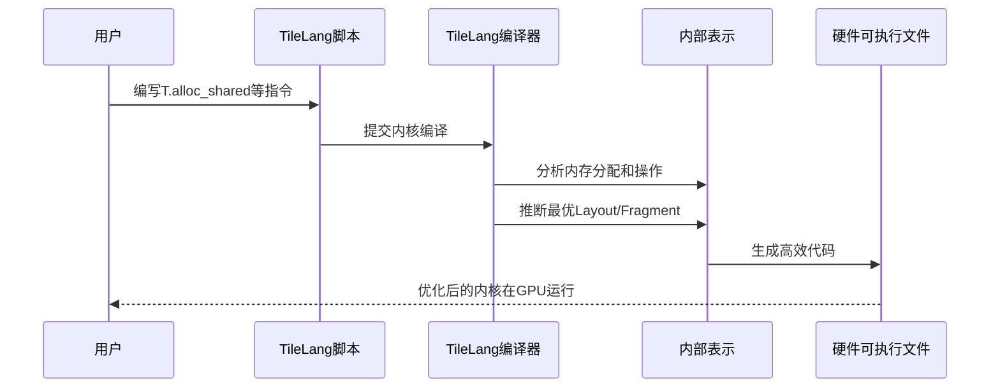

# 第3章：布局与分块管理

欢迎回来

在[第1章：TileLang语言接口（T.Namespace）](01_tilelang_language_interface__t_namespace__.md)中，学会了如何使用`T.Namespace`描述高性能计算，包括==用`T.alloc_shared`和`T.alloc_fragment`分配快速内存，以及用`T.copy`移动数据==

在[第2章：张量核心运算（GEMM/WGMMA）](02_tensor_core_operations__gemm___wgmma__.md)中，我们深入了解了`T.gemm`如何利用张量核心等专用硬件实现极速矩阵运算

> 但还缺少关键一环：这些数据如何在内存中组织，才能==高效地喂给==超快的张量核心？

就像厨师需要将食材完美切配放在案板上，GPU也需要将数据完美排列在快速内存中。这正是**布局与分块管理**的用武之地

## 数据组织的重要性

想象一位厨师准备复杂菜肴

他们有个大储藏室（类似GPU大而慢的**全局内存**）存放所有食材。烹饪时，他们将少量食材移到案板（类似快速中等大小的**共享内存**），将即时需要的更少量食材拿在手中（类似超快极小的**分块内存**或寄存器）。

如果案板或手中的食材杂乱无章，厨师会动作迟缓甚至出错。但若一切排列有序，厨师就能全速工作。

这正是**布局与分块管理**为GPU解决的问题。它定义了内存中数据排列的规范方式，确保：
1. **正确性**：数据总能被正确访问，避免错误
2. **速度**：数据排列方式让GPU处理单元和张量核心能以最快速度访问

本章目标是理解TileLang如何帮助定义（或自动推断）这些关键==数据排列方式==，特别是==对`T.alloc_shared`和`T.alloc_fragment`等高速内存的操作==，这对`T.gemm`等运算至关重要。

## 核心概念：数据排列蓝图

让我们解析TileLang用于数据组织的两大工具：`Layout`和`Fragment`。

### 1. `Layout`：通用内存蓝图

`Layout`如同蓝图，根据逻辑坐标指明数据在内存中的位置。

* **本质**：定义从*逻辑索引*（如矩阵的`[行,列]`）到*物理内存地址*（或代表内存的一维数组索引）的映射关系
* **重要性**：
  * **一致性**：确保`[0,0]`始终映射到同一物理位置，`[0,1]`到下一个位置，依此类推
  * **优化**：不同布局可极大影响性能。例如`T.copy`读取==连续==内存块通常比跳跃访问快得多
* **示例**：2x2矩阵的简单布局可将`[i,j]`映射为`i*2 + j`
  * `[0,0]` -> `0*2 + 0 = 0`
  * `[0,1]` -> `0*2 + 1 = 1`
  * `[1,0]` -> `1*2 + 0 = 2`
  * `[1,1]` -> `1*2 + 1 = 3`
  这样就==将2D逻辑结构映射到1D物理内存==

在TileLang中，通过指定`shape`和描述映射关系的`forward_fn`来定义`T.Layout`：

```python
import tilelang.language as T

# 简单2x2矩阵布局（行优先）
def row_major_2x2_map(i, j):
    return i * 2 + j  # 将(i,j)映射为1D索引

# 创建逻辑输入为2x2、映射到1D输出的布局
my_simple_layout = T.Layout(shape=[2,2], forward_fn=row_major_2x2_map)

print(f"输入形状: {my_simple_layout.get_input_shape()}")  # 输出: [2,2]
print(f"映射后形状: {my_simple_layout.get_output_shape()}")  # 输出: [4]
print(f"[0,1]的映射: {my_simple_layout.map_forward_index([0,1])}")  # 输出: 1
```

### 2. `Fragment`：线程专用布局

`Fragment`是特殊的`Layout`，专为GPU上最快的私有内存（如寄存器或"厨师的手"）设计，对张量核心运算至关重要。

* **本质**：不仅定义线程私有内存中数据的内部排列（`forward_index`），还指定*哪个线程*（`forward_thread`）负责哪部分数据
* **对张量核心的关键性**：张量核心期望其输入矩阵（A/B分块）和累加结果（C分块）以特定硬件优化布局存放在线程组寄存器中
* **==自动管理==**：TileLang的亮点, 使用`T.alloc_fragment`和`T.gemm`时，TileLang编译器自动推断最佳`Fragment`布局，完美匹配张量核心需求

`T.Fragment`的Python API类似`T.Layout`，但`增加线程映射和复制参数`：

```python
# 简化的4x4矩阵分块布局，4个线程各获取2x2子分块
def my_fragment_forward_fn(i, j, rep_var=None):
    thread_id = (i//2)*2 + (j//2)  # 将2x2块映射到线程
    local_index = (i%2, j%2)  # 每个线程处理2x2部分
    return thread_id, local_index  # 返回(线程ID, 本地索引)

my_fragment = T.Fragment(shape=[4,4], forward_fn=my_fragment_forward_fn)
print(f"[0,1]的线程: {my_fragment.map_forward_thread([0,1])}")  # 输出: 0
```

### Layout与Fragment对比

| 特性           | `Layout`（如共享内存）             | `Fragment`（如寄存器）                   |
| -------------- | ---------------------------------- | ---------------------------------------- |
| **用途**       | 内存中的通用数据组织               | 线程私有内存中的专用数据组织             |
| **关键信息**   | 逻辑索引到物理索引的映射           | 逻辑索引到*线程ID*和*本地物理索引*的映射 |
| **内存范围**   | 通常用于共享内存(`T.alloc_shared`) | 专用于分块内存(`T.alloc_fragment`)       |
| **主要目标**   | 优化整体数据访问模式               | 为专用硬件（张量核心）优化数据访问       |
| **编译器角色** | 可显式定义或推断                   | 常由编译器自动推断管理                   |

## 实战布局：用`T.gemm`喂养张量核心

第1章中见过`T.alloc_shared`和`T.alloc_fragment`调用：

```python
A_shared = T.alloc_shared((block_M, block_K), dtype)  # A分块的共享内存
B_shared = T.alloc_shared((block_K, block_N), dtype)  # B分块的共享内存
C_local = T.alloc_fragment((block_M, block_N), accum_dtype)  # 结果的私有寄存器
T.gemm(A_shared, B_shared, C_local)  # 执行分块矩阵乘法
```

当调用`T.alloc_shared`和`T.alloc_fragment`时，告诉TileLang以*默认布局*分配内存。但要让`T.gemm`高效工作，`A_shared`、`B_shared`和`C_local`中的数据需要特定布局。

工作流程通常为：
1. **`T.copy`到`A_shared`/`B_shared`**：==从全局内存拷贝数据时，TileLang常应用专用布局==（如用"存储体交错"避免内存冲突）
2. **`T.gemm`运算**：调用时，TileLang编译器将数据从共享内存布局转换为张量核心期望的分块布局

通常无需显式定义这些布局，TileLang的[TIR转换流水线](05_tir_transformation_pipeline__passes__.md)等编译器通道会自动推断应用最优布局。

## 幕后机制：布局推断过程

TileLang通过**布局推断**机制自动管理这些布局和分块。编写内核调用`T.alloc_shared`、`T.gemm`等时，==描述意图，TileLang编译器分析代码推断最优数据排列==。

### 逐步解析

高层流程如下：



### 代码

布局与分块管理的核心组件在C++中定义，通过FFI暴露给Python：

1. **C++定义（`src/layout/layout.h`）**：
   定义`LayoutNode`和`FragmentNode`类，存储逻辑维度、映射函数等：

   ```c++
   class LayoutNode 
   {
       Array<PrimExpr> input_size_;  // 逻辑维度
       Array<PrimExpr> forward_index_;  // 索引映射
   };
   
   class FragmentNode : public LayoutNode 
   {
       PrimExpr forward_thread_;  // 线程分配
   };
   ```
   
2. **Python封装（`tilelang/layout/layout.py`）**：
   `T.Layout`和`T.Fragment`类是对C++对象的Python封装：

   ```python
   class Layout:
       def __init__(self, shape, forward_fn):
           self.__init_handle_by_constructor__(_ffi_api.Layout, ...)
   ```

3. **专用布局定义（`tilelang/intrinsics/mma_layout.py`）**：
   为`T.gemm`等操作提供预定义的优化布局函数：

   ```python
   def ldmatrix_32x4_to_shared_16x8_layout_a(thread_id, local_id):
       return row, col  # 张量核心期望的数据排列
   ```

4. **布局推断通道（`src/transform/layout_inference.cc`）**：
   编译器遍历内核代码，分析缓冲区使用情况，推断最佳布局并附加到内部表示：

   ```c++
   class LayoutInferencer {
       Stmt VisitStmt_(const BlockNode* op) 
       {
           block_ptr->annotations.Set(attr::kLayoutMap, ...);
       }
   };
   ```

## 总结

本章学习了**布局与分块管理**对GPU高性能的关键作用：

* **`Layout`**：内存中数据组织的通用蓝图
* **`Fragment`**：==线程私有内存的专用布局，适配张量核心需求==
* TileLang的**布局推断**系统自动处理复杂布局优化，让你`专注计算逻辑而非实现细节`

数据完美组织后，下一步是了解TileLang如何==将这一切转化为可执行代码==

下一章将深入**[JIT内核编译（JITKernel）](04_jit_kernel_compilation__jitkernel__.md)**，探索TileLang如何将高级Python描述转化为可在GPU/CPU上运行的极速机器码

