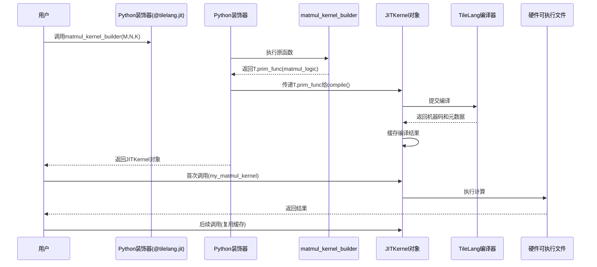

# 第4章：即时内核编译（JITKernel）

欢迎回来

在[第3章：布局与分块管理](03_layout_and_fragment_management_.md)中，了解了TileLang如何巧妙==组织内存数据以适配张量核心等专用硬件==。

但TileLang究竟如何将类Python代码转化为可在GPU/CPU上运行的机器指令？这正是**即时内核编译（JITKernel）**的舞台。

## 魔法黑盒：将蓝图转化为超快程序

想象你是建筑师，已完成高性能建筑（TileLang内核）的详细蓝图。现在需要将蓝图变为实体建筑。无需亲自砌砖，只需将蓝图交给专业建筑公司——他们负责材料采购、工人协调和建筑优化。

在TileLang中，`JITKernel`就是这家专业建筑公司。当你用`tilelang.language`编写内核并用`@tilelang.jit`标记时，实际上是在提供蓝图。`JITKernel`是将高级描述转化为硬件专用机器代码的"魔法黑盒"，是可从Python/PyTorch直接调用的"智能函数"。

**本章目标**：理解`JITKernel`对象的本质及其核心作用，掌握其编译运行代码的复杂流程。

## 什么是`JITKernel`？编译程序的智能封装

`JITKernel`是TileLang的核心编译单元，不仅是原始机器码，更是封装机器码并简化使用的Python对象。

当用`@tilelang.jit`装饰内核生成函数（如第1章所示），调用该函数时将返回`JITKernel`对象。这个"智能函数"具备以下能力：

* `代码降级`：将TileLang Python描述转化为低层级硬件无关的内部表示（如工程详图）
* `硬件编译`：将内部表示编译为针对GPU（如NVIDIA CUDA/AMD HIP）或CPU优化的机器码
* `参数管理`：处理PyTorch张量到编译内核的数据传递细节
* **性能分析**：追踪内核运行速度
* **缓存机制**：记忆编译结果，相同参数再次调用时直接使用缓存版本跳过重新编译

让我们通过第1章的例子理解`JITKernel`的应用。

## 使用`@tilelang.jit`获取`JITKernel`

回忆第1章的`matmul_kernel_builder`函数

```python
@tilelang.jit  # 关键装饰器

def matmul_kernel_builder(M, N, K, block_M, block_N, block_K, dtype="float16"):
    @T.prim_func
    def matmul_logic(A: T.Tensor((M,K), dtype), B: T.Tensor((K,N), dtype), C: T.Tensor((M,N), dtype)):
        pass  # 第1章的内核逻辑

    return matmul_logic  # 返回T.prim_func
```
**说明**：`@tilelang.jit`装饰器告知TileLang："调用`matmul_kernel_builder`时，==不要直接返回`matmul_logic`函数，而是将其编译为超快的`JITKernel`对象==。"

获取和使用`JITKernel`对象的流程

```python
# 定义矩阵尺寸和分块大小
M, N, K = 1024, 1024, 1024
block_M, block_N, block_K = 128, 128, 32

# 1. 调用被装饰的构建函数（首次调用触发实际编译）
my_matmul_kernel = matmul_kernel_builder(M, N, K, block_M, block_N, block_K)

# 此时my_matmul_kernel已是JITKernel对象
print(type(my_matmul_kernel))  # 输出: <class 'tilelang.jit.kernel.JITKernel'>

# 2. 准备PyTorch输入张量
a_torch = torch.randn(M, K, device="cuda", dtype=torch.float16)
b_torch = torch.randn(K, N, device="cuda", dtype=torch.float16)
c_torch = torch.empty(M, N, device="cuda", dtype=torch.float16)  # 输出张量

# 3. 像普通函数一样调用JITKernel对象
my_matmul_kernel(a_torch, b_torch, c_torch)

print("内核执行成功！")
print(c_torch[:2,:2])  # 打印部分结果
```
**关键点**

* `my_matmul_kernel = matmul_kernel_builder(...)`：调用时，`@tilelang.jit`拦截调用，将`matmul_logic`（`T.prim_func`蓝图）送入TileLang编译流水线，最终返回`JITKernel`对象
* `my_matmul_kernel(a_torch, b_torch, c_torch)`：此时`my_matmul_kernel`已是`JITKernel`对象，调用时会高效传递张量到编译好的GPU代码执行计算，结果写回`c_torch`

## 幕后机制：JITKernel工作流

`JITKernel`的创建和使用过程非常精密，以下是核心流程：

### 工作流



### JITKernel核心职责

| 职责              | 说明                                           |
| ----------------- | ---------------------------------------------- |
| **输入/输出处理** | 将PyTorch张量转化为编译内核预期的格式          |
| **触发编译**      | 首次遇到新参数组合时，协调完整编译流程         |
| **缓存机制**      | 存储编译后的机器码，相同参数再次调用时直接复用 |
| **执行后端**      | 选择适配器（如Cython/DLPack）高效启动编译内核  |
| **性能分析/调试** | 提供性能测量工具，暴露生成源码用于调试         |

### 代码

==`JITKernel`对象及相关`jit`装饰器定义在`tilelang/jit`目录中==：

1. **`jit`装饰器（`tilelang/jit/__init__.py`）**：
   这是`@tilelang.jit`的实现，负责拦截Python函数调用并委托实际编译。核心是`_JitImplementation`类，管理编译内核的缓存：

   ```python
   class _JitImplementation:
       self._kernel_cache: Dict[tuple, JITKernel] = {}  # 编译内核缓存
   
       def __call__(self, func: Callable) -> Callable:
           @functools.wraps(func)
           def wrapper(*args, **kwargs) -> Any:
               key = (args, tuple(sorted(kwargs.items())))  # 生成唯一调用标识
               if key not in self._kernel_cache:  # 检查缓存
                   program_result = func(*args, **kwargs)  # 获取用户T.prim_func
                   kernel_result = compile(program_result, ...)  # 核心编译
                   self._kernel_cache[key] = kernel_result  # 存入缓存
               return self._kernel_cache[key]  # 返回JITKernel
   ```

2. **`JITKernel`类（`tilelang/jit/kernel.py`）**：
   这是`JITKernel`对象的实现，`__init__`方法启动核心编译流程：

   ```python
   class JITKernel(object):
       def __init__(self, func: PrimFunc = None, ...):
           adapter = self._compile_and_create_adapter(func, ...)  # 编译并创建适配器
           self.adapter = adapter
           self.torch_function = adapter.func  # 可调用部分
   
       def _compile_and_create_adapter(self, tilelang_func: PrimFunc, ...):
           artifact = tilelang.lower(tilelang_func, target=self.target, ...)  # 核心编译
           self.artifact = artifact  # 存储编译产物
           if self.execution_backend == "dlpack":  # 选择执行适配器
               adapter = TorchDLPackKernelAdapter(...)
           elif self.execution_backend == "cython":
               adapter = CythonKernelAdapter(...)
           return adapter
   ```
   **关键点**：
   * `tilelang.lower`是实际编译器（将在[第5章：TIR转换流水线](05_tir_transformation_pipeline__passes__.md)详解），将`T.prim_func`转化为包含低级IR和生成源码的`CompiledArtifact`
   * 根据`execution_backend`创建适配器子类（如`CythonKernelAdapter`），生成知道如何高效调用编译函数的Python封装代码

## 总结

本章揭示了TileLang的核心机密——==即时内核编译==（JITKernel）**系统。我们了解到：

* `JITKernel`是封装高性能代码的"智能函数"，作为核心编译单元存在
* `@tilelang.jit`装饰器是生成`JITKernel`对象的关键
* `JITKernel`管理从代码降级到硬件专用机器码生成的完整流程，处理参数传递并缓存结果
* 内部通过`tilelang.lower`执行核心编译，利用各类`BaseKernelAdapter`实现高效执行

理解这些后，已掌握TileLang将Pythonic描述转化为可执行程序的核心机制。

下一章将深入**TIR转换流水线（Passes）**，探索`tilelang.lower`如何通过优化和转换生成极致高效的代码

[第5章：TIR转换流水线（Passes）](05_tir_transformation_pipeline__passes__.md)

