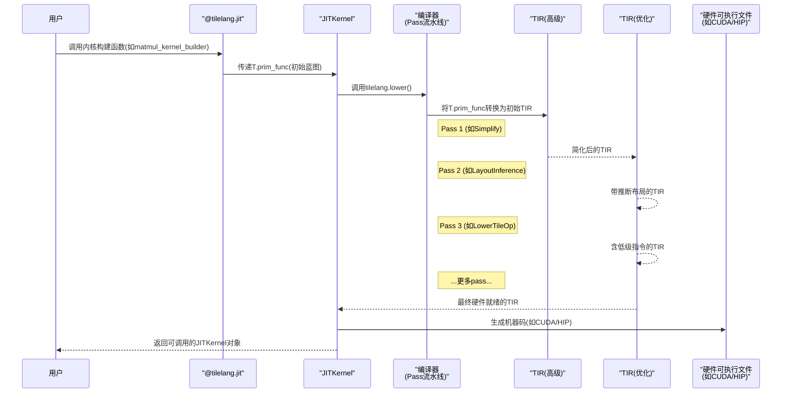

# 第5章：TIR转换流水线（Passes）

欢迎回来

在[第4章：即时内核编译（JITKernel）](04_jit_kernel_compilation__jitkernel__.md)中，你了解到TileLang的`JITKernel`是将高级Python代码转化为超快可执行程序的"魔法黑盒"。但这个==黑盒内部究竟如何运作==？

本章将揭示`JITKernel`编译过程中的精密"装配流水线"——**TIR转换流水线（Passes）**。想象这条流水线由多个专业工序组成，每道工序都对代码进行优化打磨，最终生成完美适配GPU/CPU的程序

## 装配流水线：为何代码需要多步转换

假设交给厨师一份精致菜谱（TileLang程序）。上桌前需要经历切配、腌制、煎炒、烘焙、调味、摆盘等多道工序。每道工序都专业且依赖前序步骤，若试图一气呵成只会导致混乱

同样，当TileLang将程序转化为初始蓝图（中间表示TIR）后，这个高级描述仍需：
* **简化**：移除冗余计算
* **内存优化**：按第3章布局管理优化数据排布
* **同步处理**：添加并行工作单元的协调点
* **硬件适配**：将高级`T.gemm`调用转化为实际GPU指令

这正是**TIR转换流水线**的职责所在。它由多个"pass"（编译步骤）组成，每个pass专注完成一项特定任务。通过==将复杂编译任务分解为多个简单有序的pass==，TileLang能系统性地实现极致性能与正确性。

**本章目标**：理解pass的本质、流水线的编排逻辑，以及它们如何协同将TileLang代码转化为高度优化的硬件就绪程序。

## 核心概念：流水线的构建模块

让我们解析TIR转换流水线的基本理念。

### 1. 何为"Pass"？专业优化工序

Pass如同装配线上的专业工人，每人只专注单一明确任务。

* **定义**：在编译器中，==pass是以中间表示（IR）为输入==，执行特定分析或转换后输出新IR的函数/模块
* **典型任务**：
  * 简化数学表达式（如将`1 + 0`转为`1`）
  * 确定最佳内存数据排布
  * 插入线程组同步指令
  * 将高级`T.gemm`调用转化为具体张量核心指令
* **粒度**：==Pass通常小巧专注，便于开发测试和维护==

### 2. 为何采用"流水线"？==链式转换==

流水线即pass的有序序列，前序pass的输出作为后续pass的输入。

* **定义**：TIR转换流水线是pass的有序列表，程序IR流经流水线逐步优化
* **依赖性**：许多pass依赖前序pass的成果。例如先简化表达式，再推断内存布局，最后优化数据拷贝
* **顺序关键**：pass顺序直接影响代码质量。错误顺序可能导致性能下降甚至逻辑错误

### 3. 中间表示（TIR）：通用语言

**中间表示TIR**是衔接流水线的通用语言。

* **定义**：TIR是结构化、硬件无关的程序描述，如同所有工人都能理解的标准化蓝图
* **演化**：随着IR流经流水线，每个pass都会更新这份蓝图，使其从高级描述逐步细化为逼近机器码的低级表示

## 流水线运作机制：JITKernel内部之旅

还记得`JITKernel`调用的`tilelang.lower`函数吗？TIR转换流水线正是在此执行。

工作流如下：



### Pass实例

结合前几章概念，以下是几个常见pass的作用：

| Pass名称                           | 功能(类比)                                                   | 关联前章内容                                                 |
| ---------------------------------- | ------------------------------------------------------------ | ------------------------------------------------------------ |
| **`Simplify`**                     | "清洁工"——移除冗余数学运算，简化逻辑                         | 通用优化                                                     |
| **`LayoutInference`**              | "室内设计师"——推断共享/分块内存的最佳数据排布                | [第3章：布局与分块管理](03_layout_and_fragment_management_.md) |
| **`LowerTileOp`**                  | "专业翻译"——将`T.gemm`/`T.copy`转为底层TIR指令或硬件内部函数 | [第2章：张量核心运算](02_tensor_core_operations__gemm___wgmma__.md) |
| **`InjectFenceProxy`**             | "交通指挥"——插入异步操作同步点(如Hopper WGMMA的`fence_proxy_async`) | [第2章：张量核心运算](02_tensor_core_operations__gemm___wgmma__.md) |
| **`MergeSharedMemoryAllocations`** | "仓库经理"——合并多个共享内存缓冲区提升空间利用率             | [第1章：TileLang接口](01_tilelang_language_interface__t_namespace__.md) |

这仅是冰山一角，==完整流水线可能包含数十个此类pass==

## 幕后机制：Pass管理体系

TileLang基于TVM基础设施定义和运行pass，通常==以C++类/函数操作TIR数据结构==。

### Python中的流水线定义

实际pass序列在Python中定义，可根据目标硬件灵活调整。核心定义位于`tilelang/engine/phase.py`，主要有两个组合函数：

1. **`LowerAndLegalize`阶段**：
   聚焦将高级TileLang描述转化为TVM通用低级TIR，执行初始简化和关键转换（如`LayoutInference`和`LowerTileOp`）：

   ```python
   def LowerAndLegalize(mod: IRModule, target: Target) -> IRModule:
       mod = tir.transform.BindTarget(target)(mod)
       mod = tilelang.transform.Simplify()(mod)         # 表达式清理
       mod = tilelang.transform.LayoutInference()(mod)  # 数据布局推断(第3章)
       mod = tilelang.transform.LowerTileOp()(mod)      # 转换T.gemm等(第2章)
       mod = tilelang.transform.Simplify()(mod)        # 转换后二次简化
       return mod
   ```

2. **`OptimizeForTarget`阶段**：
   在代码合法化后，应用目标硬件专属优化，如插入硬件同步、启用张量核心特化(`WarpSpecialized`)等：

   ```python
   def OptimizeForTarget(mod: IRModule, target: Target) -> IRModule:
       if 支持高级特性(target):  # 如Hopper架构
           mod = tilelang.transform.WarpSpecialized()(mod)    # 线程束特化
           mod = tilelang.transform.InjectFenceProxy()(mod)   # 异步操作同步
       mod = tilelang.transform.FlattenBuffer()(mod)  # 扁平化内存结构
       return mod
   ```

### Pass如何转换TIR

Pass逻辑通常用C++实现以获得性能。以下展示`Simplify`pass的简化片段，演示如何优化`IfThenElse`节点：

```c++
class StmtSimplifier : public IRMutatorWithAnalyzer {
    Stmt VisitStmt_(const IfThenElseNode *op) override {
        if (可证明条件恒真(op->condition)) {
            return 保留then分支;  // 移除冗余条件判断
        }
        return 默认处理;
    }
};
```
**说明**：当pass遇到`if (x > 0)`时，若能证明`x`恒为正（如`x=10`），则直接保留`then`分支移除条件判断，从而简化运行时开销。

类似`VisitStmt_`方法广泛存在于`LayoutInference.cc`、`LowerTileOp.cc`等文件中，各自实现特定转换。

## 总结

本章探索了**TIR转换流水线（Passes）**——TileLang优化高性能内核的核心机制。我们了解到：

* **Pass**是小型专业化的编译步骤，各自执行特定转换或优化
* 这些==pass通过**流水线**链式组合，程序的**中间表示TIR**在此过程中逐步优化==
* Pass负责从表达式简化、内存布局推断，到将`T.gemm`降级为硬件指令等全方位处理
* 流水线可根据目标硬件动态调整以获得最佳性能

这套精密系统让你能用高级Python代码获得高度优化的硬件专用机器码

但若==不确定内核参数（如`block_M`/`block_N`/`block_K`）如何设置最优==？这正是下一章**自动调优器**要解决的问题！

[第6章：自动调优器](06_auto_tuner_.md)

