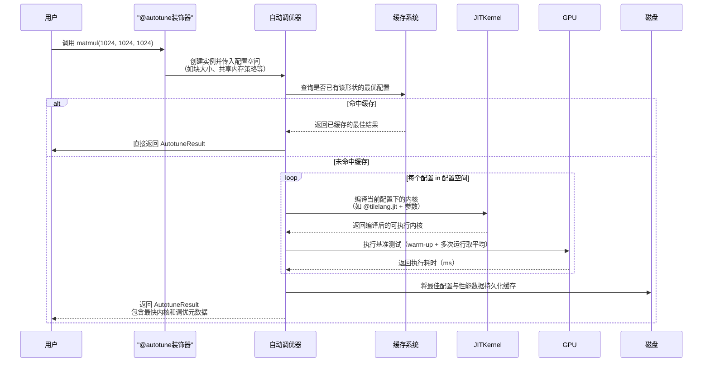

# 第6章：自动调优器

欢迎回来

在[第5章：TIR转换流水线（Passes）](05_tir_transformation_pipeline__passes__.md)中，了解了优化TileLang代码的精密"装配流水线"

但即使拥有最佳编译器，仍存在关键问题：**如何为特定硬件上的特定内核找到最佳参数？**诸如`block_M`、`block_N`、`block_K`、`num_stages`或`thread_num`等参数（第1章`matmul_kernel_builder`中接触过）会极大影响性能。==手动尝试数百种组合既繁琐又耗时==。

这正是**自动调优器**要解决的问题。它是能`自动化搜索过程的"智能助手"`，帮省去大量试错工作，确保TileLang内核以最佳性能运行

## 智能助手：寻找完美配方

假设有一份超级跑车的设计图，但包含多个可调参数：点火正时、燃油混合比、胎压、齿轮比等。每个组合都会影响速度。若手动逐个调整并计时，将耗费大量时间

TileLang自动调优器就像机器人工程师，它会：
1. 获取你的设计图（内核代码）
2. ==快速构建==并测试不同参数组合的版本
3. ==精确测量==每个版本的执行速度
4. 最终==告诉==你绝对最快的参数组合

> **本章目标**：掌握如何使用TileLang==自动调优器==自动发现内核最佳配置，无需手动猜测即可获得峰值性能。

## 核心概念：调优器的工作原理

自动调优器通过系统化流程寻找最优内核参数，其核心功能包括：

### 1. 定义搜索空间：可调"旋钮"

首先需要明确哪些参数可调及其取值范围（即"搜索空间"）：

* **参数化内核**：TileLang内核（`@T.prim_func`部分）需接受控制行为的参数（如`block_M`、`thread_num`）
* **配置列表**：提供字典列表，每个字典代表一组独特的参数值组合

### 2. 自动化编译与基准测试："试驾"

定义搜索空间后，调优器会：
* **==遍历==**：系统化遍历配置列表中的每个组合
* **==编译==**：为每个配置生成专属内核，送入完整编译流水线（含[即时内核编译](04_jit_kernel_compilation__jitkernel__.md)和[TIR转换流水线](05_tir_transformation_pipeline__passes__.md)）
* **==测试==**：在真实硬件上运行编译后的内核，精确测量执行耗时（包含"预热"运行和"重复"测试以消除波动）

### 3. 选择最佳配置："优胜者"

> 测试完所有配置后，调优器选择耗时最短（速度最快）的配置，返回该配置及其编译内核。

### 4. 结果缓存："==记忆最优解=="

为避免重复调优，调优器会：
* **磁盘缓存**：存储最佳配置和编译内核
* **快速复用**：相同内核和搜索空间再次调优时直接加载缓存结果

## 实战：矩阵乘法调优

以熟悉的矩阵乘法（GEMM）内核为例，演示自动调优器的使用（代码已简化）。

### 1. 参数化内核

首先使内核函数接受可调参数。注意`block_M`、`thread_num`等现作为`matmul`函数的参数

```python
def matmul(
    M, N, K,  # 固定维度
    # 可调参数：
    block_M=None, block_N=None, block_K=None,
    num_stages=None, thread_num=None, policy=None, enable_rasteration=None,
):
    
    @T.prim_func
    def main(A: T.Tensor((M,K), "float16"), B: T.Tensor((N,K), "float16"), C: T.Tensor((M,N), "float16")):
        with T.Kernel(T.ceildiv(N, block_N), T.ceildiv(M, block_M), threads=thread_num) as (bx, by):
            # ... 内核逻辑（含T.alloc_shared/T.copy/T.gemm等） ...
    return main
```

### 2. 定义配置搜索空间

通过`itertools.product`生成所有参数组合

```python
def get_configs(M, N, K):
    return [
        {'block_M':64, 'block_N':64, 'thread_num':128, ...},  # 配置1
        {'block_M':128, 'block_N':64, 'thread_num':256, ...}, # 配置2
        # ... 其他组合 ...
    ]
```

### 3. 应用`@autotune`装饰器

使用`@tilelang.autotune`装饰器激活自动调优：

```python
@tilelang.autotune(
    configs=get_configs,  # 配置生成函数
    warmup=3,             # 预热次数
    rep=20,               # 测试重复次数
    ref_prog=lambda A,B: A@B.T  # 正确性验证参考
)
@tilelang.jit(out_idx=[2])
def matmul(M, N, K, block_M=None, ...):  # 参数化内核
    # ... 同上 ...
```

### 4. 触发调优并使用结果

```python
# 触发调优（或加载缓存）
result = matmul(1024, 1024, 1024)  # 输入矩阵维度

# 输出最佳配置
print(f"最佳耗时：{result.latency:.6f}s")
print(f"最佳配置：{result.config}")

# 使用优化后的内核
A = torch.randn(1024, 1024, device="cuda", dtype=torch.float16)
B = torch.randn(1024, 1024, device="cuda", dtype=torch.float16)
C = torch.empty(1024, 1024, device="cuda", dtype=torch.float16)
result.kernel(A, B, C)  # result.kernel即最佳JITKernel
```

## 幕后机制：调优器运作流程

自动调优器精密==协调多配置的编译、测试和缓存==



(`存在缓存系统 实现记忆化`)

### 核心职责

| 职责             | 说明                                                         |
| ---------------- | ------------------------------------------------------------ |
| **配置生成**     | 调用用户提供的`configs`函数获取待探索参数组合                |
| **并行执行**     | 多线程并行编译测试不同配置以加速调优过程                     |
| **编译集成**     | 为每个配置调用[即时内核编译](04_jit_kernel_compilation__jitkernel__.md)系统 |
| **基准测试引擎** | 管理预热运行、重复测试和精确计时                             |
| **结果聚合**     | 收集所有测试结果并识别性能最佳配置                           |
| **正确性验证**   | 可选：用`ref_prog`验证内核功能正确性                         |
| **缓存系统**     | 内存和磁盘双缓存最佳结果                                     |

## 总结

本章掌握了TileLang**自动调优器**的强大能力：

* 作为"智能助手"自动寻找硬件最佳参数组合
* 通过`@tilelang.autotune`装饰器简化调优流程
* 支持并行测试与智能缓存加速重复调优
* 底层整合了即时编译系统与精密测试框架

至此已完整掌握TileLang核心特性——从语言接口、张量核心利用、内存布局管理到==即时编译、流水线优化和自动调优==

END *★,°*:.☆(￣▽￣)*.°★* 。