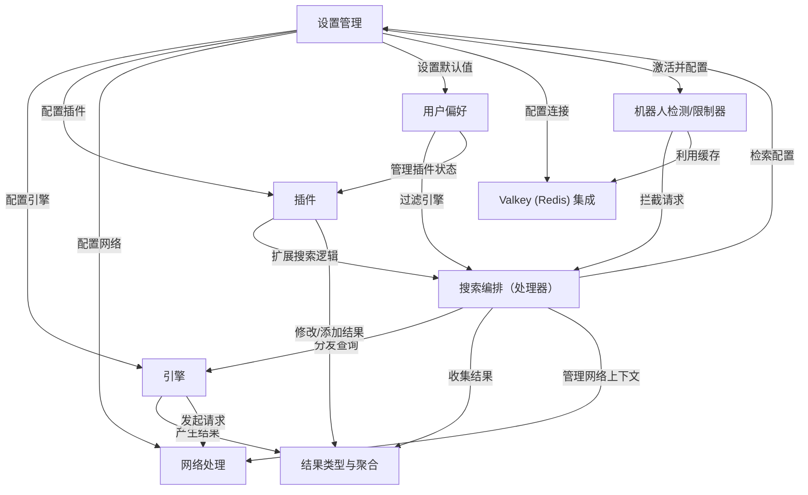
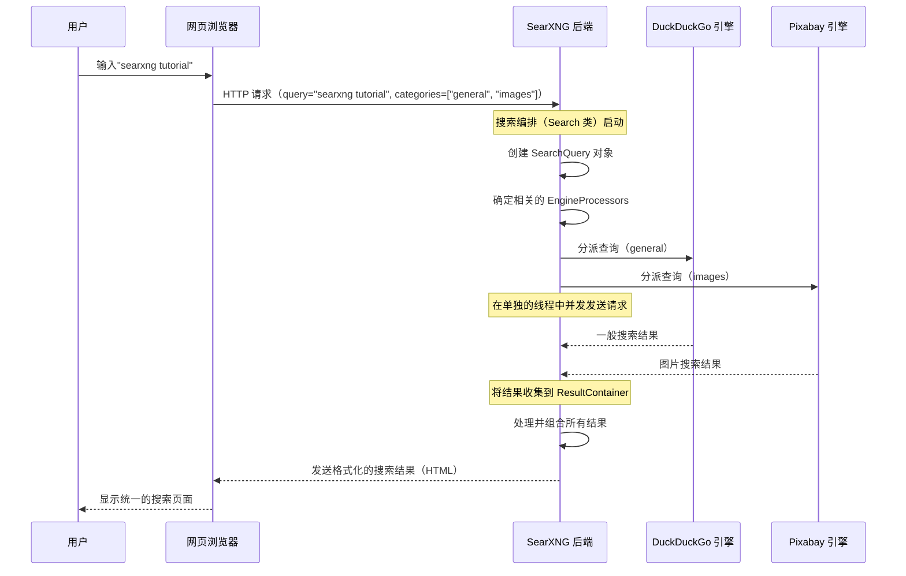

链接：[Welcome to SearXNG — SearXNG Documentation (2025.12.1+ab8224c93)](https://docs.searxng.org/)


# docs：searxng

SearXNG 是一个**尊重隐私的元搜索引擎**，它*收集并整合*来自许多不同搜索提供商的结果

它允许用户通过各种设置**自定义我们的搜索体验**，并通过*灵活的插件*扩展其功能，同时致力于**保护自身和外部服务免受机器人攻击**。


## 可视化



## 章节

1. [搜索编排（处理器）
](01_search_orchestration__processor__.md)
2. [设置管理
](02_settings_management_.md)
3. [用户偏好
](03_user_preferences_.md)
4. [引擎
](04_engines_.md)
5. [结果类型与聚合
](05_result_types___aggregation_.md)
6. [插件
](06_plugins_.md)
7. [机器人检测/限制器
](07_bot_detection___limiter_.md)
8. [网络处理
](08_network_handling_.md)
9. [Valkey (Redis) 集成
](09_valkey__redis__integration_.md)

----

# 第 1 章：搜索编排（处理器）

在第一章中，我们将探讨使 SearXNG 如此强大的最基本概念之一：**搜索编排**。可以将其视为我们执行的每次搜索的中央大脑或管弦乐队的指挥。

### 搜索编排解决什么问题？

想象一下，我们想搜索一些特定的内容，比如"最佳素食食谱"。当我们在 SearXNG 中输入这个并按下回车键时，发生的事情远不止将我们的查询发送到单个搜索引擎。SearXNG 被设计为"元搜索引擎"，这意味着它没有自己的搜索索引。相反，它巧妙地将我们的查询发送到*多个*其他搜索引擎，收集它们的结果，然后以统一的方式呈现给我们。

这是一个很棒的功能，但它也带来了一个挑战：

*   SearXNG 如何决定*哪些*引擎（如 DuckDuckGo、Wikipedia、Pixabay、YouTube 等）应该接收我们的查询？
*   如果我们只想要英文的"食谱"结果，或者专门针对图片呢？
*   它如何高效地同时向多个引擎发送这些请求？
*   如果一个引擎很慢，甚至完全失败了怎么办？
*   它如何收集所有不同的结果并将它们组合成一个无缝的页面？

这些正是**搜索编排**所解决的问题。它是管理整个复杂舞蹈的智能系统，确保我们每次都能获得全面可靠的搜索结果。

### 指挥和乐谱：理解基础知识

让我们用一个类比：想象 SearXNG 是一个宏大的管弦乐队。

*   **搜索编排**（我们的主题）是**指挥**。它指导每个人，决定谁在什么时候演奏，并确保和谐。
*   我们的**搜索查询**（例如，"最佳素食食谱"）是**乐谱**。它包含演出的所有指令。
*   各个**搜索引擎**（DuckDuckGo、Wikipedia）是**音乐家**（例如，小提琴手、小号手）。每个人都专门制作某种类型的声音（结果）。
*   **引擎处理器**就像每个音乐家的特定乐谱架或工具，帮助他们正确演奏自己的部分。
*   最终的**搜索结果页面**是我们听到的美妙**交响乐**。

因此，指挥（搜索编排）拿着我们的乐谱（搜索查询），识别哪些音乐家（引擎）应该演奏哪些部分（类别、语言），然后指导他们的演出以创造和谐的交响乐（搜索结果）。

### 我们的搜索之旅：逐步查看

让我们追踪当我们在 SearXNG 中输入"my favorite bands"时会发生什么：

1.  **我们输入查询：** 我们在搜索栏中输入"my favorite bands"。
2.  **创建乐谱：** SearXNG 获取我们的查询和其他设置（如选定的类别 - 可能是"general"和"music" - 以及语言），并将它们打包成一个名为 `SearchQuery` 的特殊对象。这个 `SearchQuery` 是我们搜索的完整"指令手册"。
    ```python
    # 来自 searx/search/models.py
    class SearchQuery:
        def __init__(
            self,
            query: str, # 我们的搜索文本："my favorite bands"
            engineref_list: list["EngineRef"], # 要使用哪些引擎/类别
            lang: str = 'all', # 结果的语言
            # ... 其他搜索设置，如安全搜索、页码
        ):
            self.query = query
            self.engineref_list = engineref_list
            self.lang = lang
            # ...
    ```
    `SearchQuery` 内部的 `engineref_list` 保存 `EngineRef` 对象。每个 `EngineRef` 只是指向一个引擎名称（如"duckduckgo"）和一个类别（如"general"）。

    ```python
    # 来自 searx/search/models.py
    class EngineRef:
        __slots__ = 'name', 'category'
    
        def __init__(self, name: str, category: str):
            self.name = name # 示例："duckduckgo"
            self.category = category # 示例："general"
    ```
3.  **指挥登场：** SearXNG 中的主要编排者是 `Search` 类（或 `SearchWithPlugins`，它扩展了它）。这个类接收我们的 `SearchQuery` 并开始管理搜索过程。
    ```python
    # 来自 searx/search/__init__.py
    class Search:
        def __init__(self, search_query: "SearchQuery"):
            self.search_query: "SearchQuery" = search_query
            self.result_container: ResultContainer = ResultContainer()
            # ...
    ```
    注意 `result_container`。这是来自不同引擎的所有结果将被收集的地方。我们将在[结果类型与聚合](05_result_types___aggregation_.md)中了解更多信息。

4.  **识别音乐家及其工具：** 指挥现在查看 `SearchQuery` 的 `engineref_list`。对于我们选择的每个引擎和类别（例如，用于一般搜索的 DuckDuckGo、用于视频的 YouTube、用于音乐的 Spotify），它会找到一个专用的 `EngineProcessor`。这些处理器是专门的工具，确切知道如何与它们特定的搜索引擎"对话"。
    ```python
    # 来自 searx/search/__init__.py
    def _get_requests(self) -> tuple[list[tuple[str, str, RequestParams]], float]:
        requests: list[tuple[str, str, RequestParams]] = []
        for engineref in self.search_query.engineref_list:
            # 获取此引擎的特定'处理器'（例如，DuckDuckGo 的 OnlineProcessor）
            processor = PROCESSORS.get(engineref.name)
            if not processor:
                continue
    
            # 获取此引擎请求所需的特定参数
            request_params = processor.get_params(self.search_query, engineref.category)
            if request_params is None:
                continue
    
            requests.append((engineref.name, self.search_query.query, request_params))
            # ... 计算超时 ...
        return requests, actual_timeout
    ```
    `PROCESSORS` 是一个全局映射，保存所有可用的 `EngineProcessor` 实例。这个映射在 SearXNG 启动期间设置，正如我们在 `initialize` 函数中看到的：

    ```python
    # 来自 searx/search/__init__.py
    def initialize(
        settings_engines: list[dict[str, t.Any]] = None,
        # ...
    ):
        # ... 其他初始化 ...
        PROCESSORS.init(settings_engines) # 这是加载处理器的地方！
        # ...
    ```
    来自 `searx/search/processors/__init__.py` 的 `PROCESSORS.init` 方法遍历我们的[设置管理](02_settings_management_.md)配置中的引擎，并为每个引擎创建正确的 `EngineProcessor`：
    ```python
    # 来自 searx/search/processors/__init__.py
    class ProcessorMap(dict[str, EngineProcessor]):
        processor_types: dict[str, type[EngineProcessor]] = {
            OnlineProcessor.engine_type: OnlineProcessor,
            OfflineProcessor.engine_type: OfflineProcessor,
            # ... 其他专门的处理器 ...
        }
    
        def init(self, engine_list: list[dict[str, t.Any]]):
            for eng_settings in engine_list:
                eng_obj = engines.engines.get(eng_settings["name"])
                eng_type = getattr(eng_obj, "engine_type", "online")
                proc_cls = self.processor_types.get(eng_type)
                if proc_cls is None:
                    # 如果遇到未知的引擎类型，记录错误
                    continue
    
                eng_proc = proc_cls(eng_obj)
                # 注册初始化的处理器
                eng_proc.initialize(self.register_processor)
    ```
    这种设置确保每个引擎（如 DuckDuckGo，它是一个"在线"引擎）都有正确的"工具"（`OnlineProcessor`）来处理其请求。一些引擎可能是"离线"的（意味着它们在本地计算结果而不进行外部网络调用），它们会使用 `OfflineProcessor`。我们将在后面的章节中深入了解[引擎](04_engines_.md)的结构。

5.  **并发演出：** 准备好每个引擎的 `SearchQuery` 和特定的 `RequestParams` 后，指挥（`Search` 类）现在分派这些请求。这是*并发*完成的，这意味着使用 Python 的 `threading` 模块同时发送多个请求。这就像指挥告诉所有音乐家同时开始演奏他们的部分。
    ```python
    # 来自 searx/search/__init__.py
    def search_multiple_requests(self, requests: list[tuple[str, str, RequestParams]]):
        search_id = str(uuid4()) # 此搜索会话的唯一 ID
    
        for engine_name, query, request_params in requests:
            _search = copy_current_request_context(PROCESSORS[engine_name].search)
            th = threading.Thread(
                target=_search, # 单个引擎的实际搜索逻辑
                args=(query, request_params, self.result_container, self.start_time, self.actual_timeout),
                name=search_id, # 将此线程链接回我们当前的搜索
            )
            th.start() # 启动线程（发送请求）
    
        for th in threading.enumerate():
            if th.name == search_id:
                # 等待线程完成，或直到发生超时
                remaining_time = max(0.0, self.actual_timeout - (default_timer() - self.start_time))
                th.join(remaining_time)
                if th.is_alive():
                    # 如果线程在超时后仍然活着，则它无响应
                    th._timeout = True
                    self.result_container.add_unresponsive_engine(th._engine_name, 'timeout')
    ```
    这段代码片段至关重要！它展示了 SearXNG 如何为每个引擎请求使用单独的"线程"（并行运行的迷你程序）。这样，如果一个引擎很慢，它不会阻碍整个搜索过程。它还设置了超时，因此如果引擎没有及时响应，SearXNG 会继续前进，防止无休止的等待。

6.  **收集交响乐：** 当结果从各个 `EngineProcessor` 返回时（或者如果它们超时或失败），指挥将它们全部收集到 `ResultContainer` 中。此容器还跟踪每个引擎响应所需的时间。
    ```python
    # 来自 searx/search/processors/abstract.py
    class EngineProcessor(ABC):
        # ...
        def extend_container(
            self,
            result_container: "ResultContainer",
            start_time: float,
            search_results: "list[Result | LegacyResult]|None",
        ):
            if getattr(threading.current_thread(), '_timeout', False):
                # 如果线程超时，添加无响应引擎条目
                self.handle_exception(result_container, 'timeout', False)
            else:
                if search_results is not None:
                    # 将结果添加到容器
                    result_container.extend(self.engine.name, search_results)
                    # 记录时间信息
                    engine_time = default_timer() - start_time
                    result_container.add_timing(self.engine.name, engine_time, ...)
                self.suspended_status.resume() # 再次将引擎标记为健康
    ```
    当每个 `EngineProcessor` 有结果或错误时，会调用 `extend_container` 方法。它更新 `Search` 类正在管理的中央 `ResultContainer`。它还处理引擎的"暂停"，如果它反复失败，以避免向损坏的服务发送查询。

7.  **最终呈现：** 一旦所有请求完成或超时，`ResultContainer` 就保存所有原始结果。然后 SearXNG 处理这些结果（例如，删除重复项、格式化它们）并将它们作为单个统一的搜索页面呈现给我们。

以下是用户搜索"searxng tutorial"的"general"和"images"类别的简化事件序列：



### 结论

在本章中，我们了解到搜索编排是 SearXNG 如何处理我们的搜索查询背后的大脑。它充当指挥，接收我们的请求，智能地将其分发到多个搜索引擎（通过它们的专门处理器），使用超时并发管理这些请求，然后细致地收集和组合所有不同的结果，形成一个连贯的搜索体验。

这个复杂的系统确保 SearXNG 不仅仅是一个简单的代理，而是一个提供全面可靠结果的强大元搜索引擎。

接下来，我们将==了解 SearXNG 如何管理其各种配置和偏好，这直接影响搜索编排的行为==

[下一章：设置管理](02_settings_management_.md)

