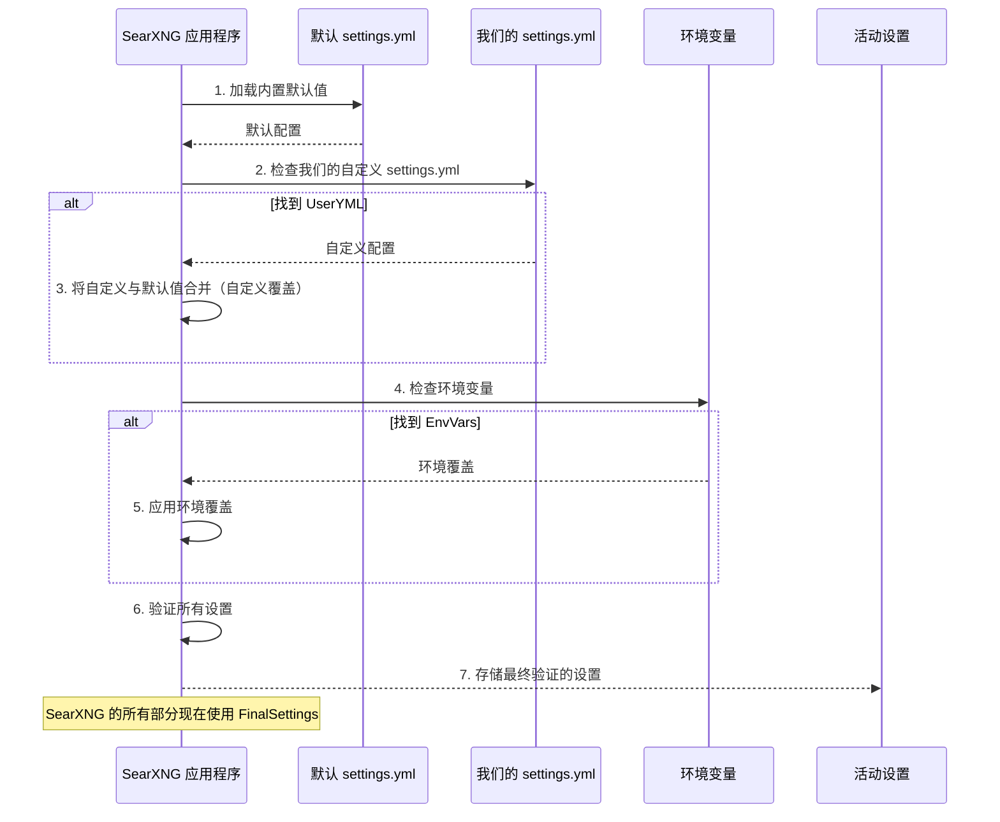

# 第 2 章：设置管理

在上一章中，我们遇到了**搜索编排**（指挥），它智能地管理我们的搜索查询。但这个指挥如何知道*要指挥什么*？它遵循什么规则？这就是**设置管理**的作用——它是告诉 SearXNG *如何*行为的中央大脑。

### 设置管理解决什么问题？

想象一下运行整个搜索引擎。作为管理员，我们需要决定许多事情：

*   SearXNG 是否应该默认显示"安全搜索"结果（过滤露骨内容）？
*   哪些特定的搜索引擎（如 DuckDuckGo、Wikipedia、YouTube）应该处于活动状态并对用户可用？
*   SearXNG 在放弃之前应该等待外部搜索引擎响应多长时间（"超时"）？
*   我们的 SearXNG 实例应该显示什么名称（例如，"My Private Search"）？
*   默认应该使用哪个视觉主题？

如果没有管理这些决策的方法，SearXNG 就不知道如何操作，或者会以我们不希望的方式操作。**设置管理**提供了一种强大而灵活的方式来配置所有这些行为等等，让我们完全控制我们的 SearXNG 实例。

可以将其视为我们的 SearXNG 管弦乐队的终极"规则手册"或"蓝图"。在指挥（搜索编排）开始之前，它需要知道有哪些乐器可用、演奏速度以及要创作什么样的音乐！

### 中央规则手册：`settings.yml`

SearXNG 设置的核心是一个名为 `settings.yml` 的文件。此文件使用一种简单、人类可读的格式，称为 YAML（Yet Another Markup Language）。这是定义所有默认行为和配置的地方。

让我们看一个在 `settings.yml` 中可能找到的小例子：

```yaml
general:
  debug: false
  instance_name: "My Awesome SearXNG"

search:
  safe_search: 1 # 0: 无，1: 中等，2: 严格
  default_lang: "en"

engines:
  - name: duckduckgo
    engine: duckduckgo
    shortcut: ddg
  - name: wikipedia
    engine: wikipedia
    shortcut: wp
    display_type: ["infobox"]
```

**此片段的含义：**
*   `general`：这是一个主要部分。
    *   `debug: false`：关闭调试模式（对开发有用，生产环境中通常为 `false`）。
    *   `instance_name: "My Awesome SearXNG"`：设置在我们的 SearXNG 实例上显示的名称。
*   `search`：与搜索行为相关的另一个主要部分。
    *   `safe_search: 1`：将默认安全搜索级别设置为"中等"。
    *   `default_lang: "en"`：将默认搜索语言设置为英语。
*   `engines`：这是所有可用搜索引擎及其特定配置的列表。在这里，DuckDuckGo 和 Wikipedia 已启用，并具有各自的设置。

此文件充当主要配置源，允许我们自定义 SearXNG 实例的几乎每个方面。

### SearXNG 如何读取其规则手册

SearXNG 不只是读取一次 `settings.yml` 就完事了。它有一种智能的加载设置的方式，允许灵活性和覆盖：

1.  **默认设置：** SearXNG 首先加载其*内置默认设置*。这些是它开箱即用的设置（来自其源代码中的 `searx/settings.yml` 文件）。
2.  **我们的自定义 `settings.yml`：** 接下来，SearXNG 查找*我们的*自定义 `settings.yml` 文件。这通常位于特殊位置，如 `/etc/searxng/settings.yml`。如果此文件存在，它将*合并*其设置与默认值，可能会覆盖我们选择更改的任何默认值。
3.  **环境变量：** 最后，检查环境变量（如 `SEARXNG_DEBUG` 或 `SEARXNG_PORT`）。这些具有*最高优先级*，可以覆盖默认或我们的自定义 `settings.yml` 文件中的任何内容。这对于快速更改或在容器（如 Docker）中部署 SearXNG 非常有用。

以下是设置加载优先级的简单说明：

| 来源                    | 优先级 | 描述                                             |
| :---------------------- | :----- | :----------------------------------------------- |
| **环境变量**            | 最高   | 覆盖一切。对快速更改/容器部署有用。              |
| **用户 `settings.yml`** | 中等   | 我们的自定义配置文件。与默认值合并并覆盖默认值。 |
| **默认 `settings.yml`** | 最低   | SearXNG 的内置、开箱即用的设置。                 |

### 将设置付诸实践：我们的用例

假设我们想更改默认实例名称并确保为我们的用户始终启用"严格"安全搜索。

**之前：**
*   `instance_name: "SearXNG"`
*   `safe_search: 0`（无）

**期望的更改：**
*   `instance_name: "My Private Search"`
*   `safe_search: 2`（严格）

我们将创建或修改我们的自定义 `settings.yml` 文件（例如，在 `/etc/searxng/settings.yml` 中）以包含：

```yaml
general:
  instance_name: "My Private Search"

search:
  safe_search: 2
```

当 SearXNG 启动时，它将：
1.  加载其内部默认值。
2.  加载*我们的* `settings.yml` 并合并这些值。我们的 `instance_name` 和 `safe_search` 值将覆盖默认值。
3.  如果没有为这些特定选项设置环境变量，将使用我们的自定义值。

### SearXNG 内部如何管理设置

当 SearXNG 启动时，它有一个专门的过程来加载和准备所有这些设置。

#### 概述：

1.  **启动：** 当 SearXNG 应用程序开始时，它需要配置自己。
2.  **加载默认值：** 它首先读取主要的 `searx/settings.yml` 文件（内置文件）以建立基线配置。
3.  **查找用户配置：** 然后它检查我们（管理员）是否在识别的位置（如 `/etc/searxng` 或由 `SEARXNG_SETTINGS_PATH` 指定）提供了我们自己的 `settings.yml` 文件。
4.  **合并与覆盖：** 如果找到用户 `settings.yml`，SearXNG 会智能地将其内容与默认设置合并。我们在自定义文件中定义的任何值都将替换相应的默认值。
5.  **环境变量检查：** 最后，它检查任何相关的环境变量。如果找到，这些变量优先并覆盖从 YAML 文件加载的任何冲突设置。
6.  **验证：** 在使设置生效之前，SearXNG 验证它们以确保它们的类型和格式正确（例如，`safe_search` 必须是 0、1 或 2，而不是"hello"）。如果验证失败，它会记录错误并可能拒绝启动。
7.  **全局可用性：** 一旦所有设置都被加载、合并和验证，它们就存储在中央 Python 字典中，使 SearXNG 应用程序的所有部分都可以访问它们。

以下是此过程的简化序列：



#### 代码

让我们看看这在 SearXNG 代码库中是如何完成的。

初始化设置的主要入口点是 `searx/__init__.py` 中的 `init_settings` 函数：

```python
# 来自 searx/__init__.py

# ...（导入和其他全局变量）...

settings: dict[str, t.Any] = {} # 这将保存我们的最终设置

def init_settings():
    """从 ``SEARXNG_SETTINGS_PATH`` 初始化全局 ``settings`` 和 ``sxng_debug`` 变量以及
    ``logger``。
    """
    from searx import settings_loader
    from searx.settings_defaults import SCHEMA, apply_schema

    global settings, sxng_debug # 声明修改全局变量的意图

    # 从文件和环境变量加载设置
    cfg, msg = settings_loader.load_settings(load_user_settings=True)
    cfg = cfg or {} # 确保 cfg 是字典

    # 应用模式进行验证和类型转换
    apply_schema(cfg, SCHEMA, [])

    settings.clear()
    settings.update(cfg) # 更新全局设置字典
    # ...（日志设置和其他详细信息）...

init_settings() # 在启动时调用此函数
```
此 `init_settings` 函数在 SearXNG 启动时立即调用。它依赖于 `settings_loader` 模块来完成读取文件的繁重工作，以及 `settings_defaults` 进行验证。

`settings_loader.load_settings` 函数（来自 `searx/settings_loader.py`）负责查找和组合各种 `settings.yml` 文件：

```python
# 来自 searx/settings_loader.py

# ...（导入）...

DEFAULT_SETTINGS_FILE = Path(searx_dir) / "settings.yml" # 内置默认值的路径

def load_settings(load_user_settings: bool = True) -> tuple[SettingsType, str]:
    """用于加载 SearXNG 应用程序设置的函数。"""

    # 1. 加载内置默认设置
    cfg = load_yaml(DEFAULT_SETTINGS_FILE)

    # 查找用户自定义设置的位置（例如，/etc/searxng）
    cfg_folder = get_user_cfg_folder()

    if not load_user_settings or not cfg_folder:
        return cfg, "仅加载默认设置。"

    # 确定用户设置文件的实际路径
    settings_yml_path = Path(os.environ.get("SEARXNG_SETTINGS_PATH") or "settings.yml")
    cfg_file = cfg_folder / settings_yml_path.name

    if not cfg_file.exists():
        return cfg, "未找到用户设置文件，仅加载默认设置。"

    # 2. 加载用户的自定义设置
    user_cfg = load_yaml(cfg_file)

    # 检查用户是否想要合并或完全替换默认值
    if is_use_default_settings(user_cfg):
        # 3. 将用户设置与默认值合并
        update_settings(cfg, user_cfg)
        return cfg, "已合并默认和用户设置。"
    else:
        # 用户想要完全替换默认值
        return user_cfg, "已加载用户设置（默认值已替换）。"

# ...（其他辅助函数，如 get_user_cfg_folder、update_settings 等）...
```
此片段显示了加载默认值的逻辑，然后检查用户提供的 `settings.yml` 并合并它。`update_settings` 函数处理实际的合并逻辑，确保我们的自定义值优先。

一旦 `settings` 字典被填充，SearXNG 的任何部分都可以使用 `get_setting` 函数检索特定设置：

```python
# 来自 searx/__init__.py

# ...（其他函数）...

_unset = object() # 未设置值的特殊标记

def get_setting(name: str, default: t.Any = _unset) -> t.Any:
    """返回 ``name`` 指向的值。如果设置中没有这样的名称且 ``default`` 未设置，
    则引发 :py:obj:`KeyError`。
    """
    value = settings # 从全局设置字典开始
    for part in name.split('.'): # 将 "general.debug" 拆分为 "general"、"debug"
        if isinstance(value, dict):
            value = value.get(part, _unset) # 尝试获取值
        else:
            value = _unset # 如果我们遇到非字典，则路径无效

        if value is _unset: # 如果沿路径未找到
            if default is _unset:
                raise KeyError(name) # 如果未提供默认值，则引发错误
            value = default # 否则，使用提供的默认值
            break # 停止查找

    return value

# 使用示例：
# is_debug_mode = get_setting("general.debug")
# default_timeout = get_setting("outgoing.request_timeout")
```
此 `get_setting` 函数是 SearXNG 的模块和组件访问配置值的方式。它允许"点表示法"（如 `general.debug`）轻松导航设置的嵌套结构。

### 结论

设置管理是 SearXNG 可配置性的支柱。它允许管理员准确定义其实例应该如何操作，从启用特定搜索引擎到设置超时和显示名称。通过==理解 `settings.yml` 文件、加载顺序和 `get_setting` 函数，我们可以控制 SearXNG 实例的行为==。

在下一章中，我们将看到各个==用户如何在管理员配置设置的边界内自定义*他们自己的*搜索体验==。

[下一章：用户偏好](03_user_preferences_.md)

