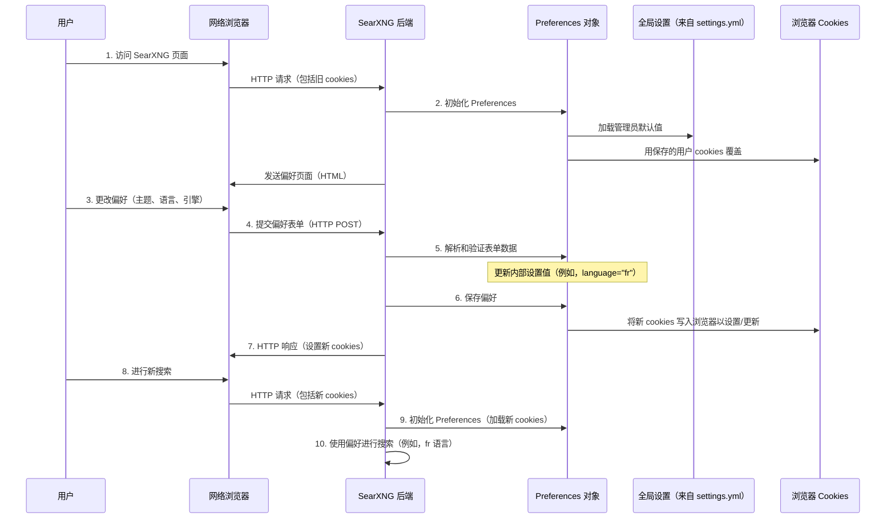

# 第 3 章：用户偏好

欢迎回来

在前面的章节中，我们了解了**搜索编排**（第 1 章），即管理我们搜索的智能指挥，以及**设置管理**（第 2 章），它是我们的 SearXNG 实例如何运作的整体规则手册。

现在，想象一下我们正在使用公共 SearXNG 实例，或者甚至是我们自己的实例，但我们有特定的品味。我们可能更喜欢深色主题，或者总是希望以特定语言显示结果，或者我们可能只想为自己禁用某些搜索引擎。这就是**用户偏好**发挥作用的地方！

### 用户偏好解决什么问题？

虽然**设置管理**为整个 SearXNG 实例定义了*全局*规则和默认值（由管理员设置），但**用户偏好**允许*每个单独的用户*自定义他们的个人搜索体验。

可以这样想：
*   我们的房子有一个**蓝图**（就像**设置管理**）。这决定了墙壁在哪里、外部的默认颜色以及存在哪些房间。房子里的每个人都使用这个基本结构。
*   但在里面，*我们的*房间有**我们的个人装饰**（这就是**用户偏好**）。我们可能会为墙壁选择不同的油漆颜色、特定的灯具，或者按照我们喜欢的方式布置家具。这不会改变房子的蓝图，但它会个性化*我们的*空间。

用户偏好解决的问题是使 SearXNG 真正个性化。它允许我们：

*   **选择我们的主题：** 浅色、深色或其他。
*   **设置我们的默认语言：** 英语、法语、德语等。
*   **决定我们的安全搜索级别：** 无、中等或严格。
*   **启用/禁用特定的搜索引擎或类别：** 只想要来自 Pixabay 的图片？我们可以设置。
*   **还有更多！**

该系统确保即使在共享的 SearXNG 实例中，我们每次访问时都能获得一致且个性化的体验，同时尊重我们的隐私。

### 我们的个性化搜索之旅：用例

让我们想象一下，作为用户，我们想要自定义我们的 SearXNG 体验。具体来说，我们想要：
1.  为 `simple` 主题使用 `dark` 样式。
2.  将我们的搜索语言设置为 `法语（fr）`。
3.  禁用 `Wikipedia` 引擎（也许我们更喜欢另一个百科全书）。

SearXNG 如何为我们记住这些选择？这就是我们将要探索的！

### Cookie 的作用

SearXNG 在访问之间记住我们的偏好的主要方式是将它们存储在我们的网络浏览器上的 **cookies** 中。

**什么是 cookies？**
Cookies 是网站存储在我们计算机上的小块数据。当我们访问网站时，它可以向我们的浏览器发送 cookies。然后，我们的浏览器在每个后续请求中将这些 cookies 发送回网站。这允许网站"记住"关于我们的信息，比如我们的登录状态，或者在我们的情况下，我们的偏好。

SearXNG 使用这些 cookies 在我们每次访问时自动加载我们的设置。

### 用户偏好的结构

在 SearXNG 的代码中，每个单独的偏好（如"主题"或"语言"）都被视为一个 `Setting`。对于不同类型的值（字符串、布尔值、多选），有不同类型的 `Setting` 对象。

让我们看看基本构建块：

```python
# 来自 searx/preferences.py

class Setting:
    """用户设置的基类"""

    def __init__(self, default_value: t.Any, locked: bool = False):
        super().__init__()
        self.value: t.Any = default_value
        self.locked: bool = locked

    def parse(self, data: str):
        """解析 'data'（来自 cookie/表单）并存储在 'self.value' 中"""
        self.value = data

    def save(self, name: str, resp: flask.Response):
        """在 HTTP 响应对象中保存 cookie 'name'"""
        resp.set_cookie(name, self.value, max_age=COOKIE_MAX_AGE)

# ... 其他特定的设置类型 ...

class BooleanSetting(Setting):
    """布尔值（True/False）的设置"""
    value: bool
    # ... 特定于布尔值的 parse 和 save 方法 ...

class EnumStringSetting(Setting):
    """从预定义选择列表中选择字符串的设置"""
    value: str
    # ... 特定于枚举的 parse 和 save 方法 ...
```
-   `Setting`：这是任何偏好的蓝图。
-   `default_value`：这是偏好的初始值，通常取自**设置管理**默认值（第 2 章）。
-   `locked`：这很重要！如果 `locked` 为 `True`，这意味着管理员已决定*此特定偏好不能由用户更改*。这允许管理员在需要时强制执行关键设置，如 `safesearch`。
-   `parse(data)`：此方法接收传入的数据（例如，来自 cookie 或表单提交），并将其转换为设置的正确格式（例如，字符串、数字、布尔值）。
-   `save(name, resp)`：此方法获取偏好的当前值并将其存储在浏览器 cookie 中，以便在我们下次访问时记住。`COOKIE_MAX_AGE` 确保 cookie 持续很长时间。

### `Preferences` 容器

所有这些单独的 `Setting` 对象都组合在一个中央 `Preferences` 对象中。此对象就像我们的个人"偏好仪表板"。

当 SearXNG 接收到我们的浏览器请求时，它首先创建一个 `Preferences` 对象，用全局**设置管理**（第 2 章）中的值填充它，然后用我们的 cookies 中找到的值覆盖它们，最后，可能用我们在偏好页面上提交的任何表单中的值覆盖。

```python
# 来自 searx/preferences.py

class Preferences:
    """验证并将偏好保存到 cookies"""

    def __init__(
        self,
        themes: list[str],
        categories: list[str],
        engines: dict[str, Engine],
        plugins: searx.plugins.PluginStorage,
        client: ClientPref | None = None,
    ):
        super().__init__()

        self.key_value_settings: dict[str, Setting] = {
            # fmt: off
            'theme': EnumStringSetting(
                settings['ui']['default_theme'],  # 来自全局设置的默认值
                locked=is_locked('theme'),        # 检查管理员是否锁定了此设置
                choices=themes
            ),
            'language': SearchLanguageSetting(
                settings['search']['default_lang'], # 来自全局设置的默认值
                locked=is_locked('language'),
                choices=settings['search']['languages'] + ['']
            ),
            'safesearch': MapSetting(
                settings['search']['safe_search'],
                locked=is_locked('safesearch'),
                map={
                    '0': 0,
                    '1': 1,
                    '2': 2
                }
            ),
            'simple_style': EnumStringSetting(
                settings['ui']['theme_args']['simple_style'],
                locked=is_locked('simple_style'),
                choices=['', 'auto', 'light', 'dark', 'black']
            ),
            # ... 许多其他设置 ...
            # fmt: on
        }

        # 引擎和插件的特殊处理，因为它们是选择列表
        self.engines = EnginesSetting('engines', engines=engines.values())
        self.plugins = PluginsSetting('plugins', plugins=plugins)
        # ... 其他专门的设置 ...
```
-   `__init__`：当创建 `Preferences` 对象时，它会初始化所有单独的 `Setting` 对象（`theme`、`language`、`safesearch` 等）。
-   注意 `settings['ui']['default_theme']` 如何用作 `theme` 的 `default_value`。这意味着我们的个人偏好*从*管理员设置的默认值*开始*。
-   `is_locked('theme')` 检查管理员是否明确阻止用户更改此设置。此函数查询全局[设置管理](02_settings_management_.md)以查看 `'theme'` 是否在 `preferences.lock` 列表中。

### 个性化之旅

让我们追踪我们的用例：将主题更改为 `dark`，语言更改为 `fr`，并禁用 `Wikipedia`。

1.  **我们访问 SearXNG：** 我们的浏览器向 SearXNG 发送 HTTP 请求。此请求包括来自以前访问的任何现有 SearXNG cookies。
2.  **SearXNG 后端初始化偏好：**
    *   创建 `Preferences` 对象。
    *   它首先使用来自[设置管理](02_settings_management_.md)的全局默认值（例如，`default_theme` 是 `simple`，`default_lang` 是 `en`）。
    *   然后，它检查我们浏览器的 cookies。如果我们以前访问过，它会用我们保存的选择覆盖默认值（例如，如果我们以前将 `theme` 设置为 `light`，它将加载 `light`）。
3.  **我们转到偏好页面：** 我们点击 SearXNG 界面中的"偏好"或"设置"链接。
4.  **我们进行更改：** 我们为 `simple_style` 选择 `dark`，为 `language` 选择 `fr`，并从引擎列表中取消选中 `Wikipedia`。然后我们点击"保存"。
5.  **浏览器发送表单数据：** 我们的浏览器向 SearXNG 发送新的 HTTP 请求，但这次，它包括来自偏好表单的数据。
6.  **SearXNG 后端解析和验证：**
    *   `Preferences` 对象接收此表单数据并调用其 `parse_form` 方法。
    *   每个单独的 `Setting`（如 `simple_style`、`language`）验证传入的数据并更新其 `value`。对于引擎，它更新 `engines` 对象。
    *   如果管理员 `locked` 了某个设置，其 `parse` 方法将忽略我们的输入。
7.  **SearXNG 将新偏好保存到 Cookies：**
    *   `Preferences` 对象然后调用其 `save` 方法，该方法依次调用每个单独 `Setting` 的 `save` 方法。
    *   这会将新的 cookies 写入我们的浏览器，其中包含我们更新的偏好。
    *   SearXNG 后端向我们的浏览器发送 HTTP 响应，其中包括这些新的 cookies。
8.  **下次搜索或访问：** 下次我们搜索或访问 SearXNG 时，我们的浏览器会发送这些新的 cookies。SearXNG 加载它们，我们的个性化深色主题、法语语言和禁用的 Wikipedia 引擎会自动应用！

序列图：



### 代码

让我们看看 `Preferences` 类的一些关键部分。

**1. 解析表单数据：**
当我们在偏好页面上点击"保存"时，我们的浏览器会从表单发送数据。`searx/preferences.py` 中的 `parse_form` 方法处理这个。

```python
# 来自 searx/preferences.py（简化）

class Preferences:
    # ...
    def parse_form(self, input_data: dict[str, str]):
        """从 'flask.request.form' 解析表单数据"""

        # 循环遍历传入的数据（例如，'language': 'fr'，'simple_style': 'dark'）
        for user_setting_name, user_setting_value in input_data.items():
            if user_setting_name in self.key_value_settings:
                # 如果管理员未锁定设置，解析新值
                if not self.key_value_settings[user_setting_name].locked:
                    self.key_value_settings[user_setting_name].parse(user_setting_value)
            # 引擎和类别的特殊处理（它们通常是复选框列表）
            elif user_setting_name.startswith('engine_'):
                # 收集禁用的引擎
                # 示例：'engine_wikipedia__general' 表示 Wikipedia 引擎
                disabled_engines.append(user_setting_name)
            elif user_setting_name.startswith('category_'):
                # 收集启用的类别
                enabled_categories.append(user_setting_name[len('category_'):])
            # ... 其他类型设置的处理 ...

        # 收集后，应用到特定的偏好对象
        self.key_value_settings['categories'].parse_form(enabled_categories) # type: ignore
        self.engines.parse_form(disabled_engines) # 更新哪些引擎启用/禁用
        self.plugins.parse_form(disabled_plugins)
```
此方法至关重要。它遍历浏览器表单发送的所有 `键值` 对。对于简单设置，它直接调用相应 `Setting` 对象的 `parse` 方法。对于更复杂的设置，如 `engines`（我们可能取消选中许多引擎），它收集选择，然后集体处理它们。

**2. 将偏好保存到 cookies：**
在解析和验证后，更新的偏好需要作为 cookies 保存回我们的浏览器。

```python
# 来自 searx/preferences.py（简化）

class Preferences:
    # ...
    def save(self, resp: flask.Response):
        """在 HTTP 响应对象中保存 cookie"""
        for user_setting_name, user_setting in self.key_value_settings.items():
            # 仅在管理员未锁定设置时保存
            if not user_setting.locked:
                user_setting.save(user_setting_name, resp)
        # 还保存引擎和插件的专门设置
        self.engines.save(resp)
        self.plugins.save(resp)
        self.tokens.save('tokens', resp)
        return resp
```
此 `save` 方法循环遍历所有单独的 `Setting` 对象，如果管理员未锁定它们，则告诉它们将当前值 `save` 到 HTTP 响应 cookie 中。然后将此响应发送回我们的浏览器，更新我们存储的偏好。

**3. 管理员锁定设置：**
管理员如何阻止用户更改设置？这在来自[设置管理](02_settings_management_.md)的 `settings.yml` 文件中完成。

```yaml
# 来自我们的自定义 settings.yml（例如，/etc/searxng/settings.yml）

preferences:
  lock:
    - safesearch
    - language # 如果这里有，用户无法更改语言
    # - theme # 取消注释以阻止用户更改主题
```
如果我们作为管理员将 `'language'` 添加到 `preferences.lock` 列表中，`is_locked` 函数将为 `language` 返回 `True`。这将阻止用户的 `language` 偏好从表单解析或保存到 cookies，有效地强制执行全局 `default_lang`。

```python
# 来自 searx/preferences.py

def is_locked(setting_name: str):
    """检查给定的设置名称是否被 settings.yml 锁定"""
    if 'preferences' not in settings:
        return False
    if 'lock' not in settings['preferences']:
        return False
    # 检查 setting_name 是否在全局设置的 'lock' 列表中
    return setting_name in settings['preferences']['lock']
```

**4. 使用偏好进行搜索：**
最后，当我们执行搜索时，`搜索编排`（第 1 章）需要知道我们选择的语言、安全搜索级别以及我们启用了哪些引擎。`webadapter` 模块负责获取 HTTP 请求，将其与我们的活动 `Preferences` 结合，并构建编排器使用的 `SearchQuery` 对象。

```python
# 来自 searx/webadapter.py（简化）

def parse_lang(preferences: Preferences, form: Dict[str, str], raw_text_query: RawTextQuery) -> str:
    if is_locked('language'):
        # 如果管理员锁定了语言，使用管理员强制的值
        return preferences.get_value('language')

    # 否则，优先考虑查询标签中的语言，然后是表单，然后是用户偏好
    if len(raw_text_query.languages):
        query_lang = raw_text_query.languages[-1]
    elif 'language' in form:
        query_lang = form.get('language')
    else:
        query_lang = preferences.get_value('language') # 获取我们首选的语言

    # ... 验证 ...
    return query_lang

def get_engineref_from_category_list(
    category_list: List[str],
    disabled_engines: List[str], # 这来自我们的偏好
) -> List[EngineRef]:
    result = []
    for categ in category_list:
        result.extend(
            EngineRef(engine.name, categ)
            for engine in categories[categ]
            if (engine.name, categ) not in disabled_engines # 排除我们禁用的引擎
        )
    return result

def get_search_query_from_webapp(
    preferences: Preferences, form: Dict[str, str]
) -> Tuple[SearchQuery, RawTextQuery, List[EngineRef], List[EngineRef], str]:
    """从偏好和 request.form 组装搜索查询的数据。"""
    # ...
    disabled_engines_from_prefs = preferences.engines.get_disabled() # 获取我们禁用的引擎

    # ... 调用 parse_lang、get_engineref_from_category_list 等，
    # 使用 'preferences' 获取我们的设置 ...

    return SearchQuery(
        query,
        query_engineref_list, # 此列表现在反映了我们启用/禁用的引擎
        query_lang,           # 这是我们首选的语言
        query_safesearch,     # 这是我们首选的安全搜索级别
        # ... 基于我们偏好的其他设置 ...
    )
```
此 `webadapter` 代码显示了如何使用 `Preferences` 对象为[搜索编排（处理器）](01_search_orchestration__processor__.md)构建 `SearchQuery`。它首先检查管理员是否锁定了任何设置。如果没有，它会提取我们的个人语言、安全搜索值，并根据我们的选择过滤引擎列表。

### 结论

用户偏好使我们能够定制我们的 SearXNG 体验，从外观和感觉（主题）到搜索行为（语言、安全搜索、启用的引擎）。通过利用浏览器 cookies，SearXNG 在会话之间记住我们的选择。它优雅地将这些个人选择与管理员的全局**设置管理**融合在一起，确保我们获得个性化但受控的搜索环境。该系统是 SearXNG 用户友好性和灵活性的基石。

接下来，我们将了解我们搜索管弦乐队的各个"音乐家"：**引擎**本身~

[下一章：引擎](04_engines_.md)

