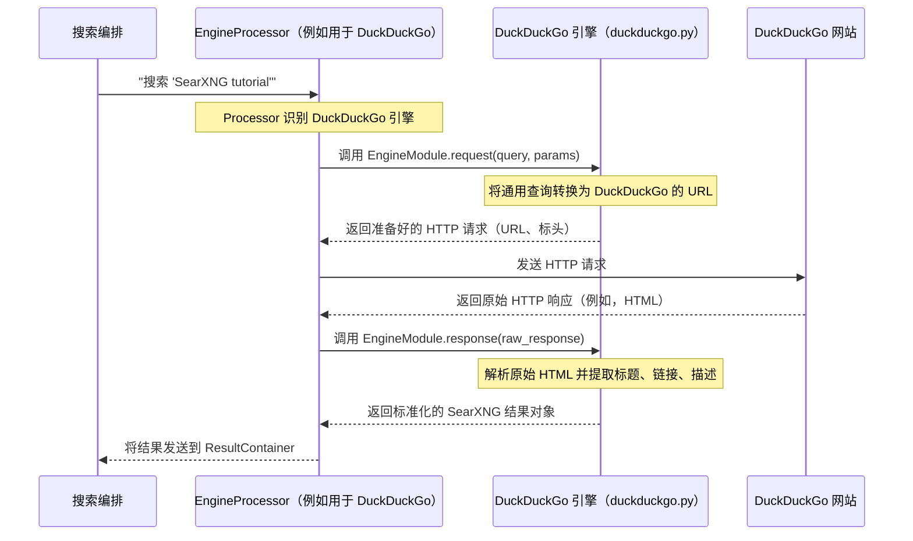

# 第 4 章：引擎

欢迎回来

在我们迄今为止的旅程中，我们遇到了**搜索编排**（第 1 章），这个聪明的"指挥"管理我们的搜索查询。我们已经看到**设置管理**（第 2 章）如何为我们的整个 SearXNG 实例提供"规则手册"，以及**用户偏好**（第 3 章）如何让我们个性化我们的体验。

现在，是时候认识我们管弦乐队中的各个"音乐家"了：**引擎**

### 引擎解决什么问题？

SearXNG 是一个元搜索引擎，这意味着它不直接搜索网络。相反，它将我们的查询发送到许多*其他*搜索提供商，如 Google、Bing、Wikipedia、YouTube、Pixabay 等等。但这里有一个挑战：

*   这些外部提供商中的每一个都有自己独特的接收搜索查询的方式。有些期望特定的 URL 格式，其他的可能需要特殊的标头或不同的参数。
*   一旦它们响应，它们的结果以各种格式出现——有些发送回原始 HTML，其他的提供结构化的 JSON 数据。
*   SearXNG 需要一种方法来理解所有这些不同的"语言"，并以标准化的方式带回结果，以便它可以为我们组合它们。

这正是**引擎**解决的问题。==SearXNG 中的引擎就像一个专门的翻译器或适配器。它确切地知道如何与特定的外部搜索提供商"对话"==。

可以这样想：
如果**搜索编排**是指挥，**引擎**就是技艺精湛的音乐家。每个音乐家专门演奏特定的乐器（与特定的搜索提供商通信），并知道如何将指挥的通用指令（我们的搜索查询）转换为他们的乐器（外部提供商的请求格式）所需的确切音符和旋律。他们还知道如何将来自他们乐器的响应解释回指挥理解的格式。

### 我们的搜索之旅：与不同提供商对话

让我们使用一个常见的例子。我们想搜索"最佳素食食谱"。当我们在 SearXNG 中输入这个时，我们可能期望来自像 DuckDuckGo 这样的通用网络搜索引擎的结果，也许还有来自 Wikipedia 的一些食谱想法。

以下是**引擎**如何发挥作用：

1.  [搜索编排（处理器）](01_search_orchestration__processor__.md)根据我们的[用户偏好](03_user_preferences_.md)和全局[设置管理](02_settings_management_.md)决定使用哪些搜索引擎。它将"DuckDuckGo"和"Wikipedia"识别为相关引擎。
2.  ==对于每个识别的引擎，它找到相应的"引擎"对象==。
3.  DuckDuckGo 引擎知道如何将"最佳素食食谱"转换为 DuckDuckGo 理解的 URL（例如，`https://duckduckgo.com/?q=best+vegetarian+recipes`）。
4.  Wikipedia 引擎知道如何将相同的查询转换为 Wikipedia 理解的 URL（例如，`https://en.wikipedia.org/wiki/Special:Search?search=best+vegetarian+recipes`）。
5.  然后，每个引擎从其外部提供商接收原始响应（例如，DuckDuckGo 的 HTML 页面，Wikipedia 的 JSON 数据）。
6.  然后，每个引擎"解析"这些原始数据，提取相关部分（标题、链接、描述、图片），并将它们转换为 SearXNG 可以轻松组合的标准化格式。

### 引擎的核心：`searx/enginelib/Engine`

从本质上讲，SearXNG 中的每个引擎都建立在一个名为 `Engine` 的抽象蓝图之上。这个蓝图定义了每个引擎*应该*能够做什么。我们可以在 `searx/enginelib/__init__.py` 中找到它。

```python
# 来自 searx/enginelib/__init__.py（简化）

class Engine(abc.ABC): # abc.ABC 意味着它是一个"抽象基类"（蓝图）
    """从 YAML 设置构建的引擎实例的类。"""

    engine_type: str # 例如，"online"、"offline"
    paging: bool     # 此引擎是否支持多个结果页面？
    max_page: int = 0 # 如果分页，支持的最后一页是什么？（0 表示无限制）
    time_range_support: bool # 我们可以按时间过滤结果吗（例如，过去一天）？
    safesearch: bool # 它是否支持过滤露骨内容？
    language_support: bool # 它可以用不同的语言搜索吗？
    categories: list[str] # 此引擎属于哪些类别？（例如，["general", "videos"]）
    name: str             # 引擎的唯一名称（例如，"duckduckgo"）
    engine: str           # Python 文件的名称（例如，"duckduckgo"）
    timeout: float        # 此引擎的特定超时

    @abc.abstractmethod # 这意味着从 Engine 继承的任何类都必须实现此方法
    def search(self, query: str, params) -> "EngineResults":
        """``offline`` 引擎的搜索方法"""

    @abc.abstractmethod
    def request(self, query: str, params) -> None:
        """构建 ``online`` 引擎请求参数的方法。"""

    @abc.abstractmethod
    def response(self, resp) -> "EngineResults":
        """解析 ``online`` 引擎响应的方法。"""
```
-   **`engine_type`**：这是一个非常重要的属性。大多数引擎是 `"online"`，这意味着它们连接到外部网站。有些是 `"offline"`，这意味着它们在本地计算结果而不进行外部网络调用（例如，简单的计算器引擎）。还有其他专门的类型。
-   **功能**：像 `paging`、`language_support`、`safesearch` 这样的属性告诉 SearXNG 此引擎能做什么。这有助于[搜索编排（处理器）](01_search_orchestration__processor__.md)决定哪些引擎可以满足用户的特定请求。
-   **`request` 和 `response`（对于在线引擎）**：这是在线引擎的两个关键方法。`request` 构建到外部提供商的出站请求（如 URL）。`response` 从提供商获取原始数据并将其解析为标准 SearXNG 格式。
-   **`search`（对于离线引擎）**：离线引擎只需要这一个方法来直接计算和返回结果。

### 搜索中引擎的生命周期

让我们追踪当我们搜索"SearXNG tutorial"时，**在线**引擎（如 DuckDuckGo）如何工作：



### 代码：引擎如何加载和定义

#### 1. 加载引擎

当 SearXNG 启动时，它需要找到并加载我们在 `settings.yml`（来自[设置管理](02_settings_management_.md)）中启用的所有引擎文件。这发生在 `searx/engines/__init__.py` 中。

```python
# 来自 searx/engines/__init__.py（简化）

# 如果在 settings.yml 中未指定，这将保存引擎属性的默认值
ENGINE_DEFAULT_ARGS: dict = {
    "engine_type": "online",
    "paging": False,
    "time_range_support": False,
    # ... 许多其他默认设置 ...
    "timeout": settings["outgoing"]["request_timeout"], # 来自全局设置的默认超时
}

engines: dict = {} # 全局字典，用于存储所有加载的引擎对象

def load_engine(engine_data: dict) -> "types.ModuleType | None":
    """从 ``engine_data``（来自 settings.yml）加载引擎。"""

    engine_name = engine_data.get('name')
    module_name = engine_data.get('engine') # 这是 Python 文件名，例如，"duckduckgo"

    # 将 Python 文件作为模块加载
    engine_module = load_module(module_name + '.py', ENGINE_DIR)

    # 应用默认属性和来自 settings.yml 的任何覆盖
    update_engine_attributes(engine_module, engine_data)

    # 加载引擎"特性"（如支持的语言/地区）
    from searx.enginelib.traits import EngineTraitsMap
    trait_map = EngineTraitsMap.from_data()
    trait_map.set_traits(engine_module)

    # 检查引擎是否处于活动状态（未禁用或不活动）
    if not is_engine_active(engine_module):
        return None

    return engine_module

def load_engines(engine_list: list[dict]):
    """在启动时调用以加载 settings['engines'] 中列出的所有引擎。"""
    engines.clear() # 清除任何旧引擎
    for engine_data in engine_list:
        # 每个 'engine_data' 是来自 settings.yml 的一个引擎的字典
        engine = load_engine(engine_data)
        if engine:
            register_engine(engine) # 将加载的引擎添加到 'engines' 全局字典
    return engines
```
此过程获取我们的 `settings.yml` 中的每个条目（如 `name: duckduckgo`，`engine: duckduckgo`）并动态加载相应的 Python 文件（例如，`searx/engines/duckduckgo.py`）。然后，它应用默认设置和我们在 `settings.yml` 中提供的任何特定设置。

#### 2. 引擎文件内部

让我们看一个*非常简化*的实际引擎文件（`searx/engines/example_online.py`）可能包含的内容示例。实际上，这些文件更复杂，处理各种解析场景和错误条件。

```python
# 简化示例：searx/engines/example_online.py
# 此文件由 'load_engine' 函数加载。

# 此特定引擎的属性
engine_type = "online"
categories = ["general"]
paging = True
language_support = True
safesearch = True
max_page = 5 # 此引擎支持最多 5 页结果

# 真正的引擎会有一个 'init' 函数来设置缓存或其他东西
# def init(engine_settings):
#    global CACHE
#    CACHE = EngineCache(engine_settings["name"])

def request(query, params):
    """
    此函数准备对外部提供商的 HTTP 请求。
    'query' 是用户的搜索文本。
    'params' 包含其他搜索参数，如页码、语言。
    """
    search_url = "https://www.example.com/search"
    # 构建特定于 example.com 的 URL
    # 'params.page' 是当前页码
    url = f"{search_url}?q={query}&page={params.page}"

    # 在真正的引擎中，我们会添加 user-agent、标头、cookies 等。
    return {"url": url, "method": "GET"} # 返回 URL 和 HTTP 方法

def response(resp):
    """
    此函数解析来自外部提供商的原始响应。
    'resp' 是原始 HTTP 响应对象（包含文本、标头等）。
    """
    results = []
    # 在真正的引擎中，我们会使用像 'lxml' 这样的解析器来提取数据
    # 从 'resp.text'（HTML 内容）。
    # 对于这个简化的例子，想象我们正在寻找简单的文本模式。

    if "Result A" in resp.text:
        results.append({
            "title": "Example Result A",
            "url": "https://www.example.com/item/a",
            "content": "Description for A."
        })
    if "Result B" in resp.text:
        results.append({
            "title": "Example Result B",
            "url": "https://www.example.com/item/b",
            "content": "Description for B."
        })

    return results # 返回标准化的 SearXNG 结果对象列表
```
正如我们所看到的，`request` 函数获取 SearXNG 的通用查询并将其转换为特定的 URL。然后，`response` 函数从该 URL 获取原始数据并以通用格式提取有意义的结果。

#### 3. 引擎缓存（`searx/enginelib/EngineCache`）

一些引擎可能需要存储临时数据（如 API 令牌或经常请求的信息）以避免向外部提供商发出冗余请求。这由 `EngineCache` 处理。

```python
# 来自 searx/enginelib/__init__.py（简化）

class EngineCache:
    """引擎的持久（SQLite）键/值缓存。"""

    def __init__(self, engine_name: str, expire: int | None = None):
        # 'engine_name' 确保每个引擎都有自己的隔离缓存
        self.table_name: str = engine_name
        self.expire: int = expire or ENGINES_CACHE.cfg.MAXHOLD_TIME

    def set(self, key: str, value: t.Any, expire: int | None = None) -> bool:
        """将值存储在缓存中，可选过期时间。"""
        return ENGINES_CACHE.set(key=key, value=value, expire=expire or self.expire, ctx=self.table_name)

    def get(self, key: str, default: t.Any = None) -> t.Any:
        """从缓存中检索值。如果未找到或过期，则返回 'default'。"""
        return ENGINES_CACHE.get(key, default=default, ctx=self.table_name)

# 在引擎的 request 函数中的使用示例：
# token = CACHE.get(key="api_token")
# if token is None:
#     token = fetch_new_token_from_api()
#     CACHE.set(key="api_token", value=token, expire=3600) # 缓存 1 小时
```
`EngineCache` 为引擎提供了一种简单的方式来临时存储和检索数据，使搜索过程更快、更高效，特别是对于不经常更改的信息。

#### 4. 引擎特性（`searx/enginelib/traits.py`）

引擎的一个关键部分是理解其"特性"或功能，特别是关于语言和地区支持。`EngineTraits` 类帮助实现这一点。

```python
# 来自 searx/enginelib/traits.py（简化）

@dataclasses.dataclass
class EngineTraits:
    """该类旨在为每个引擎实例化。"""
    regions: dict[str, str] = dataclasses.field(default_factory=dict)
    """将 SearXNG 的内部地区代码（例如，'fr-BE'）映射到引擎的代码。"""
    languages: dict[str, str] = dataclasses.field(default_factory=dict)
    """将 SearXNG 的内部语言代码（例如，'ca'）映射到引擎的代码。"""
    all_locale: str | None = None
    """引擎认为的'所有'语言或默认值。"""
    # ... 其他特性 ...

    def get_language(self, searxng_locale: str, default: t.Any = None):
        """返回*最适合* SearXNG 区域设置的引擎语言字符串。"""
        # 此方法智能地将用户选择的语言（'en-US'）
        # 转换为特定引擎理解的内容（例如，'en'、'US-EN'）。
        # 如果可用，它使用 'languages' 映射。
        # ... 查找最佳匹配语言的逻辑 ...
        pass # 实际实现更复杂

    def get_region(self, searxng_locale: str, default: t.Any = None) -> t.Any:
        """返回最适合 SearXNG 区域设置的引擎地区字符串。"""
        # 类似于 get_language，但用于地理区域。
        pass # 实际实现更复杂
```
`EngineTraits` 允许 SearXNG 智能地将用户的首选语言（例如，法语-比利时：`fr-BE`）转换为外部搜索提供商所需的特定字符串或格式（可能只是语言的 `fr` 和国家的 `BE`，或唯一的 `fr-be` 代码）。这确保搜索准确本地化。

### 结论

引擎是 SearXNG 的无名英雄，充当专门的翻译器和适配器。它们允许 SearXNG 与大量外部搜索提供商无缝通信，将通用查询转换为提供商特定的请求，并将各种响应解析为标准化格式。它们的模块化设计使添加新的搜索提供商变得容易，确保 SearXNG 仍然是一个灵活而强大的元搜索引擎。

现在我们了解了各个引擎如何产生结果，让我们==探索 SearXNG 如何收集、处理和组合这些结果到我们看到的单一、统一的搜索页面==。

[下一章：结果类型与聚合](05_result_types___aggregation_.md)

