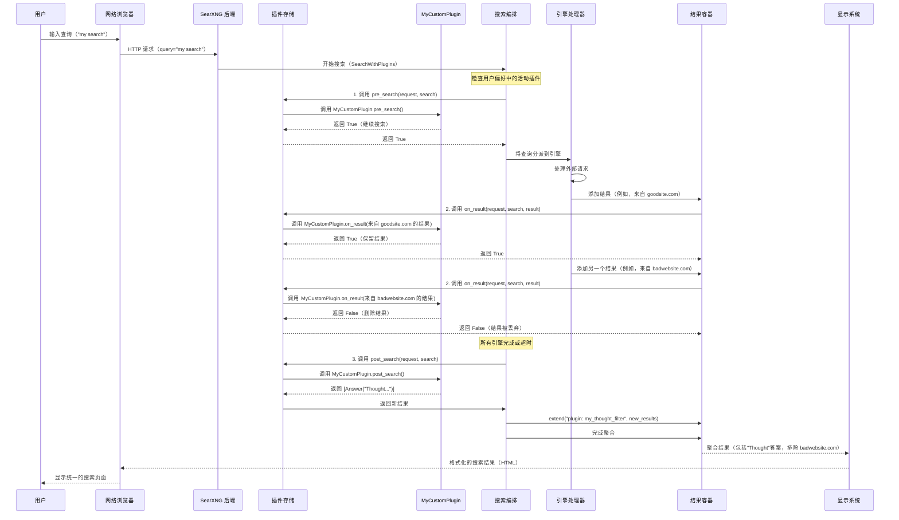

# 第 6 章：插件

欢迎回来

在我们的上一章**[结果类型与聚合](05_result_types___aggregation_.md)**中，我们了解了 SearXNG 如何巧妙地收集、分类和组合来自不同搜索引擎的所有不同结果到一个整洁、统一的页面。

现在，想象一下我们想要为我们的 SearXNG 实例添加一个*全新的功能*，或修改它处理某些搜索结果的方式，但我们不想更改 SearXNG 的核心代码。这就是**插件**发挥作用的地方

### 插件解决什么问题？

SearXNG 非常强大，但我们可能有独特的需求或创意想法，这些不是其标准功能的一部分。例如：

*   我们想在每个搜索结果页面的顶部添加自定义的"每日一思"消息。
*   我们想自动删除来自某些网站（如社交媒体网站）的搜索结果，以获得更清洁的体验。
*   我们可能想将所有 `youtube.com` 链接重写为指向隐私友好的替代方案，如 `invidious.example.com`。
*   或者我们想直接在 SearXNG 中添加一个简单的计算器。

尝试为这些功能更改 SearXNG 的核心代码会很困难，并且在我们更新 SearXNG 时容易出错。这就是**插件**解决的问题！

插件就像我们的 SearXNG 管弦乐队的"附加模块"或"特效艺术家"。它们允许我们：

*   **扩展功能**：添加全新的功能。
*   **修改行为**：更改现有功能的工作方式。
*   **无需更改核心代码**：我们的自定义更改单独存在，使更新变得容易。

它们"钩入"搜索过程的不同阶段，允许我们的自定义代码在恰当的时刻运行：在搜索之前、在每个单独的结果上，或在收集所有结果之后。这种灵活性打开了一个自定义的世界！

### 我们的自定义之旅：添加一个想法并过滤链接

让我们想象一下我们的目标是创建一个简单的插件，做两件事：

1.  在每个搜索结果页面的顶部添加一个友好的"每日一思：享受您的搜索！"消息作为即时答案。
2.  过滤掉来自 `badwebsite.com` 的任何搜索结果。

我们将学习如何使用插件实现这一点！

### 插件的关键概念

在我们构建插件之前，让我们了解核心思想。

#### 1. `Plugin` 类：我们的插件蓝图

我们创建的每个插件都将从扩展 SearXNG 的 `Plugin` 类开始。这个类提供了我们的插件与 SearXNG 交互所需的基本结构和功能。

```python
# 来自 searx/plugins/_core.py（简化）
import abc
import logging
import typing as t

# ... 其他导入 ...

class Plugin(abc.ABC): # abc.ABC 意味着它是一个"抽象基类"（蓝图）
    id: str = ""       # 我们的插件的唯一标识符
    info: "PluginInfo" # 在偏好中向用户显示的信息
    log: logging.Logger # 我们的插件消息的记录器

    def __init__(self, plg_cfg: "PluginCfg") -> None:
        super().__init__()
        # ... 初始化逻辑 ...
        if not getattr(self, "log", None):
            self.log = logging.getLogger(f"searx.plugins.{self.id}")

    # ... 钩子方法，如 pre_search、on_result、post_search ...
```
-   `id`：我们的插件的唯一名称（例如，"my_thought_filter"）。
-   `info`：一个对象（`PluginInfo`），保存详细信息，如我们的插件的名称和描述，这些显示在 SearXNG 的用户偏好菜单中。
-   `log`：一个专用记录器，帮助我们调试我们的插件。

#### 2. 插件钩子：我们的代码运行的位置

插件通过"钩入" SearXNG 搜索过程中的特定时刻来工作。这些钩子是我们可以在 `Plugin` 类中实现的特殊方法：

| 钩子方法      | 何时运行                             | 它可以做什么                                         | 返回值                                    |
| :------------ | :----------------------------------- | :--------------------------------------------------- | :---------------------------------------- |
| `pre_search`  | **在**发送任何外部搜索请求**之前**。 | 修改 `SearchQuery`，或决定停止整个搜索。             | `True` 继续搜索；`False` 停止搜索。       |
| `on_result`   | 对于来自每个引擎的**每个单独结果**。 | 修改 `Result`（例如，更改其 URL、内容）或删除它。    | `True` 保留结果；`False` 从列表中删除它。 |
| `post_search` | **在**收集所有外部搜索结果**之后**。 | 将新的 `Result` 对象（如答案、建议）添加到最终列表。 | `None` 或要添加的 `Result` 对象列表。     |

#### 3. `PluginInfo` 和 `PluginCfg`：描述和配置我们的插件

*   **`PluginInfo`**：这个数据类保存关于我们的插件的面向用户的信息。这是用户在他们的[用户偏好](03_user_preferences_.md)页面上看到的内容，如果他们想启用或禁用我们的插件。

    ```python
    # 来自 searx/plugins/_core.py（简化）
    from dataclasses import dataclass, field
    from flask_babel import gettext # 用于翻译

    @dataclass
    class PluginInfo:
        id: str
        name: str          # 插件的名称（例如，"My Custom Filter"）
        description: str   # 简短说明
        preference_section: t.Literal["general", "ui", "privacy", "query"] | None = "general"
        # ... 其他字段
    ```

*   **`PluginCfg`**：这个数据类保存我们的插件的设置，主要是它是否默认为 `active`。这些设置在我们的 SearXNG 实例的 `settings.yml` 文件（[设置管理](02_settings_management_.md)）中定义。

    ```python
    # 来自 searx/plugins/_core.py（简化）
    @dataclass
    class PluginCfg:
        active: bool = False # 此插件默认是否处于活动状态？
    ```

### 构建我们的自定义插件

让我们创建一个名为 `my_custom_plugin.py` 的插件来解决我们的用例。

#### 步骤 1：添加"每日一思"（使用 `post_search`）

我们想在所有搜索完成后添加自定义消息。`post_search` 钩子非常适合这个，因为它在*所有*引擎返回结果*之后*运行。它可以返回新的 `Result` 对象。我们将使用 `Answer` 结果类型使其突出显示。

```python
# 文件：searx/plugins/my_custom_plugin.py（第 1 部分）
from flask_babel import gettext as _ # 用于简单翻译
from searx.plugins import Plugin, PluginInfo, PluginCfg
from searx.result_types import Answer # 添加即时答案

class MyCustomPlugin(Plugin):
    id = "my_thought_filter"

    def __init__(self, plg_cfg: PluginCfg) -> None:
        super().__init__(plg_cfg)
        self.info = PluginInfo(
            id=self.id,
            name=_("My Custom Plugin"),
            description=_("Adds a daily thought and filters bad websites."),
            preference_section="general",
        )

    def post_search(self, request, search) -> list[Answer]:
        # 此钩子在所有引擎交付结果后运行。
        # 我们返回要添加到搜索结果的 Answer 对象列表。
        thought = "Thought for the day: Enjoy your search!"
        self.log.info(f"Adding thought: {thought}")
        return [Answer(answer=thought)]

    # 我们稍后将在这里添加 on_result
```
**解释：**
-   我们定义一个继承自 `Plugin` 的类 `MyCustomPlugin`。
-   我们给它一个唯一的 `id`（"my_thought_filter"）。
-   在 `__init__` 中，我们设置其 `PluginInfo`（用户的名称和描述）。
-   实现了 `post_search` 方法。它只是创建一个带有我们自定义消息的 `Answer` 对象并在列表中返回它。然后 SearXNG 将此 `Answer` 添加到 `[ResultContainer](05_result_types___aggregation_.md)` 以供显示。

#### 步骤 2：过滤掉 `badwebsite.com`（使用 `on_result`）

现在，我们想检查来自任何引擎的每个结果，如果它来自 `badwebsite.com`，则将其删除。`on_result` 钩子非常适合这个，因为它在*每个单独的结果*被添加到最终集合之前运行。

```python
# 文件：searx/plugins/my_custom_plugin.py（第 2 部分 - 添加到上面）
# ...（导入和 MyCustomPlugin 类定义保持不变）...
from urllib.parse import urlparse # 从 URL 轻松获取主机名
from searx.result_types import MainResult, LegacyResult, Result # 导入 Result 用于类型提示

class MyCustomPlugin(Plugin):
    id = "my_thought_filter"
    # ...（init 方法保持不变）...

    def on_result(self, request, search, result: Result) -> bool:
        # 此钩子对来自任何引擎的每个结果项运行。
        # 'result' 可以直接修改。
        # 返回 False 删除结果，True 保留它。

        if result.parsed_url: # 检查结果是否有 URL
            hostname = result.parsed_url.netloc # 获取域名（例如，'www.badwebsite.com'）
            if "badwebsite.com" in hostname:
                self.log.info(f"Removing result from badwebsite.com: {result.url}")
                return False # 删除此结果
        return True # 保留所有其他结果

    def post_search(self, request, search) -> list[Answer]:
        # ...（post_search 方法保持不变）...
        thought = "Thought for the day: Enjoy your search!"
        self.log.info(f"Adding thought: {thought}")
        return [Answer(answer=thought)]
```
**解释：**
-   我们将 `on_result` 方法添加到我们的 `MyCustomPlugin` 类。
-   它接收 `result` 对象（可能是 `MainResult` 或另一个 `Result` 类型）并检查其 `parsed_url` 以获取 `hostname`。
-   如果 `hostname` 包含"badwebsite.com"，它返回 `False`，告诉 SearXNG 丢弃此结果。
-   否则，它返回 `True`，允许结果继续到 [ResultContainer](05_result_types___aggregation__.md)。

#### 步骤 3：在 `settings.yml` 中启用我们的插件

为了让 SearXNG 知道我们的新插件，我们需要将其添加到 `settings.yml` 文件（[设置管理](02_settings_management_.md)）。这通常进入我们的自定义 `settings.yml`（例如，`/etc/searxng/settings.yml`）。

这里的关键是我们的插件的"完全限定名称"（FQN）：`searx.plugins.my_custom_plugin.MyCustomPlugin`。

```yaml
# 在我们的 settings.yml 中（例如，/etc/searxng/settings.yml）

plugins:
  searx.plugins.my_custom_plugin.MyCustomPlugin:
    active: true # 设置为 true 以默认启用此插件
```
**解释：**
-   `plugins`：此部分列出所有插件。
-   `searx.plugins.my_custom_plugin.MyCustomPlugin`：这是 FQN。它告诉 SearXNG 在 `searx.plugins.my_custom_plugin` Python 模块中确切地找到我们的 `MyCustomPlugin` 类的位置。
-   `active: true`：这使用我们的 `PluginCfg` 告诉 SearXNG 在启动时默认激活此插件。

添加此内容后，重启我们的 SearXNG 实例。现在，当我们执行搜索时：
*   我们将在结果顶部看到"每日一思：享受您的搜索！"。
*   来自 `badwebsite.com` 的任何结果都将被静默删除。

### 插件内部如何工作

让我们窥探幕后，了解 SearXNG 在搜索期间如何加载和使用插件。

#### 1. 启动时加载插件

当 SearXNG 首次启动时，它读取其 `settings.yml` 文件，包括 `plugins` 部分。它使用一个名为 `PluginStorage` 的组件来查找、加载和注册我们启用的所有插件。

1.  **读取 `settings.yml`**：SearXNG 的初始化过程调用 `searx.plugins` 中的 `initialize`。
2.  **填充 `PluginStorage`**：`initialize` 然后告诉 `STORAGE`（`PluginStorage` 的全局实例）`load_settings`。
3.  **导入插件类**：`PluginStorage.load_settings` 读取 FQN（如 `searx.plugins.my_custom_plugin.MyCustomPlugin`），动态导入 Python 模块，并找到我们的 `MyCustomPlugin` 类。
4.  **实例化插件**：对于每个找到的插件类，它创建一个实例（例如，`MyCustomPlugin(PluginCfg(active=true))`）。
5.  **注册插件**：这些插件实例被添加到 `PluginStorage` 的内部列表。
6.  **初始化（`Plugin.init`）**：调用每个插件的 `init` 方法。这允许插件执行一次性设置（例如，加载外部文件，检查依赖项）。如果 `init` 返回 `False`，插件将被删除，这意味着它不会处于活动状态。

```python
# 来自 searx/plugins/__init__.py（简化）
from ._core import PluginStorage, PluginCfg # 重要的类
import searx # 获取全局设置

STORAGE: PluginStorage = PluginStorage() # 所有插件的全局存储

def initialize(app):
    # 从全局 SearXNG 设置加载插件设置
    STORAGE.load_settings(searx.get_setting("plugins"))
    # 为每个加载的插件调用 init 方法
    STORAGE.init(app)

# 来自 searx/plugins/_core.py（简化）
import importlib

class PluginStorage:
    plugin_list: set[Plugin] # 存储所有活动插件实例

    def load_settings(self, cfg: dict[str, dict[str, t.Any]]):
        for fqn, plg_settings in cfg.items():
            mod_name, cls_name = fqn.rsplit('.', 1)
            mod = importlib.import_module(mod_name) # 动态导入模块
            cls = getattr(mod, cls_name, None)     # 从模块获取插件类
            plg = cls(PluginCfg(**plg_settings))   # 创建实例，传递 cfg
            self.register(plg)                     # 添加到 plugin_list

    def init(self, app: "flask.Flask") -> None:
        for plg in self.plugin_list.copy():
            if not plg.init(app): # 调用插件的 init 方法
                self.plugin_list.remove(plg) # 如果 init 返回 False，则删除
```

#### 2. 搜索期间插件执行

当用户执行搜索时，[搜索编排（处理器）](01_search_orchestration__processor__.md)（具体来说，`SearchWithPlugins` 类，它扩展了基本的 `Search` 类）编排整个过程。这个 `SearchWithPlugins` 类知道 `PluginStorage` 并在关键时刻调用适当的插件钩子。它还考虑用户的个人[用户偏好](03_user_preferences_.md)，以查看他们选择启用或禁用了哪些插件。

以下是插件如何适应搜索的简化序列：


**调用钩子的代码：**

`PluginStorage` 对象有名为 `pre_search`、`on_result` 和 `post_search` 的方法，它们遍历所有*活动*插件（用户在他们的[用户偏好](03_user_preferences_.md)中启用且在 `init` 期间未删除的插件）并在每个插件上调用相应的钩子方法。

```python
# 来自 searx/plugins/_core.py（简化）
class PluginStorage:
    # ...（如上所示的 init 和 load_settings）...

    def pre_search(self, request, search: "SearchWithPlugins") -> bool:
        ret = True
        # 遍历对此用户处于活动状态的插件
        for plugin in [p for p in self.plugin_list if p.id in search.user_plugins]:
            try:
                ret = bool(plugin.pre_search(request=request, search=search))
            except Exception: # 捕获错误以防止插件崩溃一切
                plugin.log.exception("调用 pre_search 时出现异常")
                continue
            if not ret: # 如果任何插件返回 False，停止搜索
                break
        return ret

    def on_result(self, request, search: "SearchWithPlugins", result: "Result") -> bool:
        ret = True
        # 遍历对此用户处于活动状态的插件
        for plugin in [p for p in self.plugin_list if p.id in search.user_plugins]:
            try:
                ret = bool(plugin.on_result(request=request, search=search, result=result))
            except Exception:
                plugin.log.exception("调用 on_result 时出现异常")
                continue
            if not ret: # 如果任何插件返回 False，删除此结果
                break
        return ret

    def post_search(self, request, search: "SearchWithPlugins") -> None:
        for plugin in [p for p in self.plugin_list if p.id in search.user_plugins]:
            # ...（检查关键字的逻辑）...
            try:
                results = plugin.post_search(request=request, search=search) or []
            except Exception:
                plugin.log.exception("调用 post_search 时出现异常")
                continue
            # 将插件返回的任何结果添加到 ResultContainer
            search.result_container.extend(f"plugin: {plugin.id}", results)
```
**解释：**
-   每个 `PluginStorage` 钩子方法遍历 `plugin_list`。
-   至关重要的是，它检查 `p.id in search.user_plugins`。`search.user_plugins` 是*当前用户*在他们的[用户偏好](03_user_preferences_.md)中启用的插件 ID 列表。这确保只运行用户选择的插件。
-   如果 `pre_search` 或 `on_result` 钩子返回 `False`，循环中断，搜索或结果处理立即停止该项。
-   `post_search` 从插件收集任何新结果并将它们添加到主 `ResultContainer`。

### 结论

插件是一种强大而灵活的方式来自定义和扩展 SearXNG，而无需修改其核心代码。通过理解 `Plugin` 类、其各种钩子（`pre_search`、`on_result`、`post_search`）以及它们如何通过 `settings.yml` 和[用户偏好](03_user_preferences_.md)配置，我们可以定制 SearXNG 以完美适应我们的需求。这种模块化方法确保我们的自定义功能健壮且易于与未来的 SearXNG 更新一起管理。

接下来，我们将把重点转移到管理公共 SearXNG 实例的一个重要方面：它==如何检测和限制自动机器人流量以确保公平使用和保护资源==

[下一章：机器人检测/限制器](07_bot_detection___limiter_.md)

