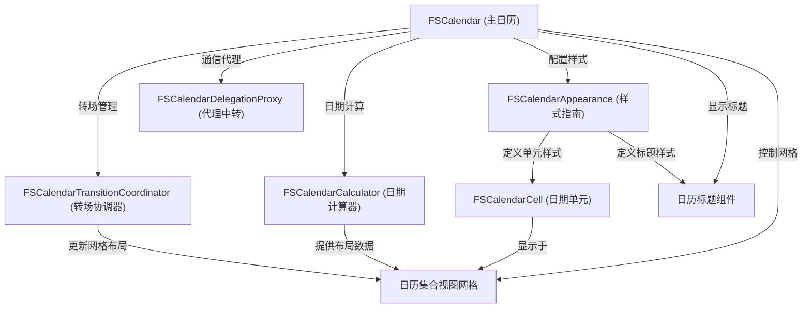

链接：[WenchaoD/FSCalendar: A fully customizable iOS calendar library, compatible with Objective-C and Swift](https://github.com/WenchaoD/FSCalendar?tab=readme-ov-file)

（ipad上已经diy用上了，邻居家的小孩很喜欢吃😋）

# docs：FSCalendar日历组件

FSCalendar是一款功能强大且高度==可定制的iOS日历库==，能够帮助开发者轻松实现**日历视图**集成

提供*灵活的网格布局*展示日期，支持**日期选择**等交互操作，并具备丰富的*样式定制*与*动画效果*，可流畅切换月/周视图模式。

## 可视化



## 章节

1. [FSCalendarCell (日期单元)](01_fscalendarcell__individual_day_box__.md)
2. [日历标题组件](02_calendar_header_views__time_labels__.md)
3. [FSCalendar (主日历)](03_fscalendar__the_main_calendar__.md)
4. [FSCalendarAppearance (样式指南)](04_fscalendarappearance__style_guide__.md)
5. [FSCalendarDelegationProxy (代理中转)](05_fscalendardelegationproxy__liaison_officer__.md)
6. [日历集合视图网格](06_calendar_collection_grid__flexible_grid__.md)
7. [FSCalendarCalculator (日期计算器)](07_fscalendarcalculator__date_alchemist__.md)
8. [FSCalendarTransitionCoordinator (转场协调器)](08_fscalendartransitioncoordinator__view_orchestrator__.md)

（文档代码之后有机会窝给它更出来（下次一定bush🕳+1）

# 目录

## 截图展示
iPhone效果  


iPad效果  


安全方向适配  


今日扩展  
iOS8/9 | iOS10  


交互式范围手势  


## 自定义支持
通过DIY示例自定义单元格样式（参见Example-Swift或Example-Objc）  

滑动选择演示  
单选模式 | 多选模式 | DIY模式  


## 用户成果展示


更多作品详见FSCalendar图库  

## 安装指南
### CocoaPods
iOS8+推荐：  
```ruby
use_frameworks!
target '项目名称' do
    pod 'FSCalendar'
end
```

iOS7+兼容：  
```ruby
target '项目名称' do
    pod 'FSCalendar'
end
```
需配合NSCalendarExtension使用  

### Carthage
iOS8+：  
`github "WenchaoD/FSCalendar"`

### SPM
添加依赖：  
`.package(url: "https://github.com/WenchaoD/FSCalendar.git", from: "2.8.4")`

### 手动集成
将FSCalendar文件夹所有文件拖入工程（支持IB设计）  
或直接运行Example-Objc/Example-Swift中的UITest Target  

## 配置方法
### Interface Builder方式
1. 添加UIView到ViewController场景  
2. 修改Custom Class为FSCalendar  
3. 关联dataSource和delegate  

4. 实现FSCalendarDataSource和FSCalendarDelegate协议  

### 代码方式
Objective-C：  
```objc
@property (weak, nonatomic) FSCalendar *calendar;
// 在loadView或viewDidLoad中
FSCalendar *calendar = [[FSCalendar alloc] initWithFrame:CGRectMake(0, 0, 320, 300)];
calendar.dataSource = self;
calendar.delegate = self;
[self.view addSubview:calendar];
self.calendar = calendar;
```

Swift：  
```swift
private weak var calendar: FSCalendar!
// 在loadView或viewDidLoad中
let calendar = FSCalendar(frame: CGRect(x: 0, y: 0, width: 320, height: 300))
calendar.dataSource = self
calendar.delegate = self
view.addSubview(calendar)
self.calendar = calendar
```
Swift3需创建Bridge Header，详见Example-Swift  

## 重要提示
FSCalendar不会自动更新frame，需实现以下方法：  

自动布局：  
```objc
- (void)calendar:(FSCalendar *)calendar boundingRectWillChange:(CGRect)bounds animated:(BOOL)animated {
    self.calendarHeightConstraint.constant = bounds.size.height;
    [self.view layoutIfNeeded];
}
```

手动布局：  
```objc
calendar.frame = (CGRect){calendar.frame.origin, bounds.size};
```

Masonry：  
```objc
[calendar mas_updateConstraints:^(MASConstraintMaker *make) {
    make.height.equalTo(@(bounds.size.height));
}];
```

SnapKit：  
```swift
calendar.snp.updateConstraints { make in
    make.height.equalTo(bounds.height)
}
```

## 基础须知
Swift3中NSDate和NSDateFormatter已重命名为Date和DateFormatter  

### 日期对象操作
创建NSDate：  
```objc
// 通过日历
self.gregorian = [NSCalendar calendarWithIdentifier:NSCalendarIdentifierGregorian];
NSDate *date = [gregorian dateWithEra:1 year:2016 month:9 day:10 hour:0 minute:0 second:0 nanosecond:0];

// 通过格式化
self.formatter = [[NSDateFormatter alloc] init];
self.formatter.dateFormat = @"yyyy-MM-dd";
NSDate *date = [self.formatter dateFromString:@"2016-09-10"];
```

日期计算：  
```objc
// 获取下个月/天
NSDate *nextMonth = [gregorian dateByAddingUnit:NSCalendarUnitMonth value:1 toDate:date options:0];
NSDate *nextDay = [gregorian dateByAddingUnit:NSCalendarUnitDay value:1 toDate:date options:0];

// 日期判断
BOOL isToday = [gregorian isDateInToday:date];
BOOL isWeekend = [gregorian isDateInWeekend:date];

// 日期比较
BOOL sameDay = [gregorian isDate:date1 inSameDayAsDate:date2];
NSComparisonResult result = [gregorian compareDate:date1 toDate:date2 toUnitGranularity:NSCalendarUnitDay];
```

