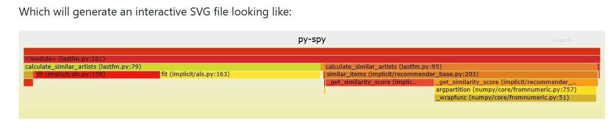
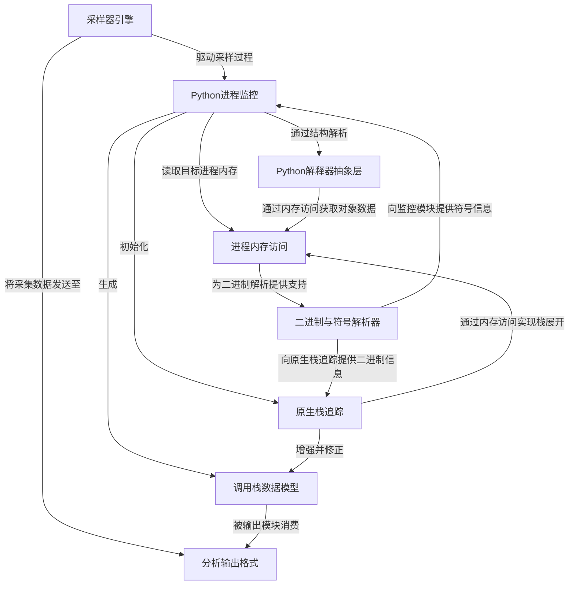

链接：[benfred/py-spy: Sampling profiler for Python programs](https://github.com/benfred/py-spy)

# docs：py-spy

`py-spy` 是一款强大的**==性能分析==工具**，能够在不干扰运行状态的前提下，洞察*正在运行的Python程序*的实际行为

通过==智能解析进程内存==来提取**Python调用栈**及*原生C/C++/Cython帧*，并将性能数据转化为**交互式火焰图**和**Speedscope JSON**等实用格式。

## 可视化

## 章节

1. [分析输出格式](01_profiling_output_formats_.md)
2. [采样器引擎](02_sampler_engine_.md)
3. [进程内存访问](03_process_memory_access_.md)
4. [二进制与符号解析器](04_binary___symbol_parser_.md)
5. [Python进程监控](05_python_process_spy_.md)
6. [Python解释器抽象层](06_python_interpreter_abstraction_.md)
7. [调用栈数据模型](07_stack_trace_data_model_.md)
8. [原生栈追踪](08_native_stack_tracing_.md)

---
