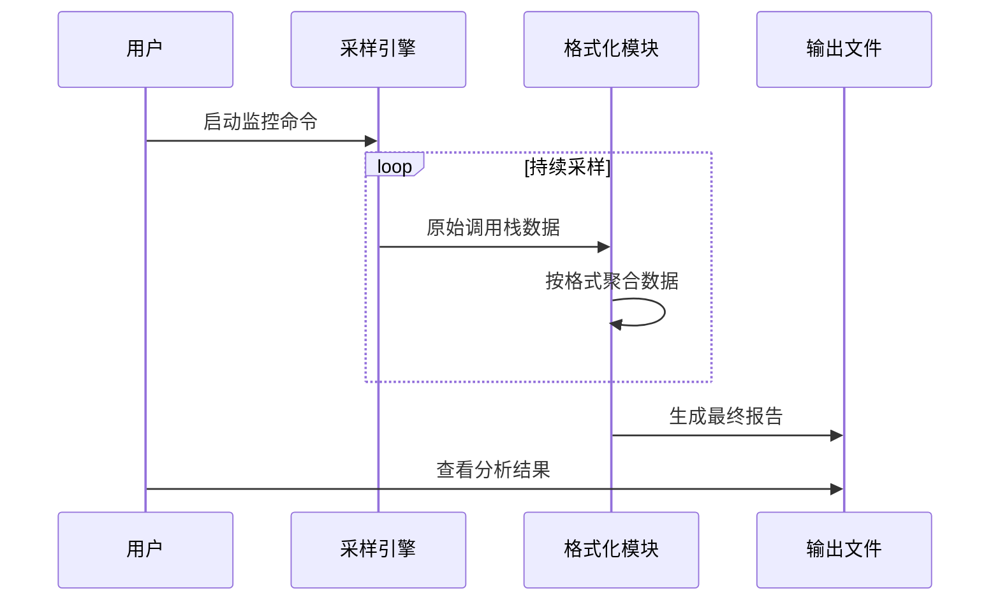

# 第1章：性能分析输出格式

## 问题背景：如何理解"Python代码为何运行缓慢"？

当我们面对运行缓慢的Python程序时，往往知其然却不知其所以然——我们知道程序的功能，却不清楚时间消耗的具体细节。是某个函数陷入瓶颈？还是在等待某些资源？`py-spy`这款工具正是为解决此类问题而生，它能以近乎零开销的方式"窥探"Python程序的运行时行为。

但数据采集只是第一步！`py-spy`获取程序行为数据后，如何有效呈现这些信息？这正是**性能分析输出格式**的价值所在。就像侦探破案需要将线索转化为不同形式的调查报告，`py-spy`提供多种数据可视化方案，每种格式都针对特定分析场景设计。本章将深入解析这些输出格式，帮助我们在性能优化时选择最佳分析视角。

## 核心功能：多维度性能数据可视化

`py-spy`提供五种主要输出格式，各具特色：

### 1. 交互式火焰图（HTML）
  
**特性**：  
- 动态可缩放的层级化函数调用视图  
- 火焰高度表示CPU耗时，宽度表示采样频率  
- 支持点击钻取查看细节  

**适用场景**：  
快速定位性能热点，识别资源消耗最高的函数调用链  

**操作示例**：  
```bash
# 监控目标进程并生成火焰图
py-spy record --output profile.html --format flamegraph --pid <PID>
```

### 2. Speedscope JSON格式
  
**特性**：  
- 支持"左重排序"、"调用树"等高级视图  
- 可与[speedscope.app](https://www.speedscope.app/)在线工具深度交互  

**适用场景**：  
需要多角度分析调用关系，特别是高频出现的顶层函数  

**操作示例**：  
```bash
py-spy record --output profile.json --format speedscope --pid <PID>
```

### 3. Chrome追踪事件JSON
  
**特性**：  
- 时间轴形式展示函数调用起止时间  
- 支持与浏览器其他事件日志关联分析  

**适用场景**：  
分析函数执行时序、延迟问题，或需要与其他系统事件关联时  

**操作示例**：  
```bash
py-spy record --output trace.json --format chrometrace --pid <PID>
```

### 4. 原始文本快照
  
**特性**：  
- 即时打印线程调用栈的纯文本信息  
- 包含文件名、行号及局部变量（可选）  

**适用场景**：  
快速诊断程序卡死状态，或只需简单调用栈检查时  

**操作示例**：  
```bash
py-spy dump --pid <PID>
```

### 5. 实时终端视图
  
**特性**：  
- 类`top`命令的实时刷新界面  
- 动态显示CPU占用率最高的函数  

**适用场景**：  
实时监控程序行为变化，观察性能波动趋势  

**操作示例**：  
```bash
py-spy top --pid <PID>
```

## 技术实现解析

所有输出格式都基于相同的底层数据——**调用栈采样**。`py-spy`通过以下流程实现数据转换：



### 关键代码结构

#### 火焰图生成（Rust实现）
```rust
// 聚合相同调用路径的采样次数
pub fn increment(&mut self, trace: &StackTrace) {
    let call_path = trace.frames.join(";");
    *self.counts.entry(call_path).or_insert(0) += 1;
}

// 生成D3.js兼容的HTML
pub fn write(&self) -> Result<()> {
    inferno::flamegraph::create_from_lines(aggregated_data)
}
```

#### Speedscope格式处理
```rust
// 为每个唯一函数建立索引
let frame_index = *self.frame_map.entry(frame).or_insert_with(|| {
    self.frames.push(frame.clone());
    self.frames.len() - 1
});

// 存储调用链索引序列
self.samples.push(vec![frame_indices]);
```

#### 实时终端视图更新
```rust
// 统计函数出现频率
fn update_stats(&mut self, trace: &StackTrace) {
    for frame in &trace.frames {
        self.stats.function_counts
            .entry(frame.function_name.clone())
            .or_default()
            .total_samples += 1;
    }
}
```

## 格式选择指南

| 格式类型     | 核心优势             | 适用阶段     | 输出示例                       |
| ------------ | -------------------- | ------------ | ------------------------------ |
| 交互式火焰图 | 直观展示热点调用路径 | 初期性能诊断 | `py-spy record -o flame.html`  |
| Speedscope   | 多维度深度分析       | 精细优化阶段 | `py-spy record -f speedscope`  |
| Chrome追踪   | 时间序列分析         | 延迟问题排查 | `py-spy record -f chrometrace` |
| 文本快照     | 即时快照             | 紧急问题诊断 | `py-spy dump`                  |
| 实时监控     | 动态观察             | 长期运行监控 | `py-spy top`                   |

## 总结与进阶

通过本章我们了解到，`py-spy`如同性能分析的"瑞士军刀"，针对不同场景提供专属解决方案。无论是快速定位性能瓶颈，还是深入分析调用关系，选择合适的输出格式能极大提升诊断效率。

但所有这些精彩的可视化结果，都依赖于`py-spy`强大的**采样引擎**。在下一章中，我们将揭开采样技术的神秘面纱，了解如何安全高效地获取Python运行时数据。

[下一章：采样引擎](02_sampler_engine_.md)

