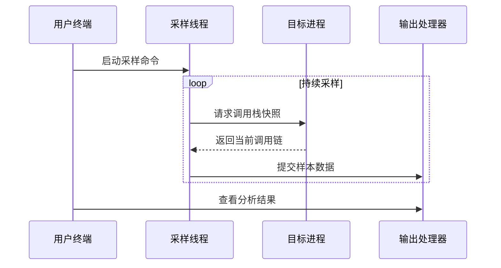

# 第2章：采样引擎

在第1章中，我们探讨了`py-spy`呈现性能数据的多种方式——从交互式火焰图到实时终端视图

但在展示这些精彩内容之前，`py-spy`首先需要==**采集**原始数据==

这就是**采样引擎**的职责所在——这个幕后英雄持续不断地收集Python程序的运行时信息。

## 问题核心：如何"观察"程序的实时行为？

想象我们正在观察一位忙碌的主厨：要了解他如何分配时间（切菜、搅拌或等待），单次观察只能获得静态快照，而持续记录才能掌握完整的工作流程。同理，要诊断"Python代码为何缓慢"，我们需要知道函数调用链及其耗时情况。`py-spy`必须能够反复窥探运行中的Python程序，获取其"调用栈"——即当前活跃的函数及其调用关系。

采样引擎正是`py-spy`中扮演"专业摄影师"角色的组件，它以==固定频率捕获程序运行快照==，构建完整的性能画像。

## 采样机制

### 什么是"样本"？
在`py-spy`的语境中，一个"样本"即程序在特定时刻的行为快照，包含以下核心元素：
- **调用栈集合**：所有活跃Python线程的调用链
- **时间戳信息**：记录采样发生的精确时刻
- **错误状态**：标记采样过程中出现的异常

### 采样引擎四大核心能力
1. **定时快照采集**  
   以可配置频率（默认100Hz）持续采集样本，避免单次采样的片面性

2. **智能节奏控制**  
   采用指数分布随机间隔，防止与程序固有周期产生同步偏差（aliasing效应）

3. **自适应重试机制**  
   对启动缓慢的Python进程，自动重试连接直至成功

4. **子进程追踪**  
   自动发现并监控派生的Python子进程，构建完整的应用拓扑视图

## 实战演示

沿用第1章的示例程序`my_slow_script.py`：
```python
import time

def function_c():
    time.sleep(0.01)  # 微任务

def function_b():
    time.sleep(0.05)  # 子任务
    function_c()

def function_a():
    time.sleep(0.1)   # 主任务
    function_b()

if __name__ == "__main__":
    for _ in range(10):
        function_a()
```

启动采样（需替换实际PID）：
```bash
# 记录模式
py-spy record --pid <PID> 

# 实时监控模式
py-spy top --pid <PID>
```

**底层工作流**：


## 技术实现

### 核心数据结构
```rust
// src/sampler.rs
pub struct Sampler {
    rx: Receiver<Sample>,          // 样本接收通道
    sampling_thread: JoinHandle<()> // 后台采样线程
}

pub struct Sample {
    pub traces: Vec<StackTrace>,  // 调用栈集合
    pub late: Option<Duration>    // 采样延迟
}
```

### 智能定时器实现
```rust
// src/timer.rs
impl Iterator for Timer {
    fn next(&mut self) -> Option<Result<Duration>> {
        let elapsed = self.start.elapsed();
        let sleep_time = self.exp.sample(&mut rand::thread_rng()); // 指数分布随机间隔
        
        if planned_time > elapsed {
            thread::sleep(planned_time - elapsed);
            Some(Ok(actual_delay))
        } else {
            Some(Err(elapsed - planned_time)) // 记录延迟情况
        }
    }
}
```

### 多进程监控方案
```rust
// 子进程发现线程
thread::spawn(move || {
    while parent_process.exists() {
        for child_pid in detect_new_children() {
            spies.entry(child_pid).or_insert_with(|| {
                PythonSpyThread::new(child_pid) // 为每个子进程创建监控实例
            });
        }
        sleep(Duration::from_millis(100));
    }
});
```

## 性能优化策略

1. **低开销设计**  
   - 采用异步通道(mpsc)传递样本数据
   - 采样线程与数据处理线程分离

2. **弹性容错机制**  
   - 对崩溃进程自动重试连接
   - 采样超时自动降级处理

3. **动态负载适应**  
   - 根据系统负载自动调整采样频率
   - 高延迟时自动丢弃陈旧样本

## 总结

采样引擎作为`py-spy`的数据采集中枢，通过精心设计的定时策略和健壮的==进程交互机制，为上层分析提供了稳定可靠的数据源==。

但一个关键问题仍未解答：采样引擎如何==安全地读取其他进程的内存数据==？这将是下一章[进程内存访问](03_process_memory_access_.md)的重点内容。

[下一章：进程内存访问](03_process_memory_access_.md)

