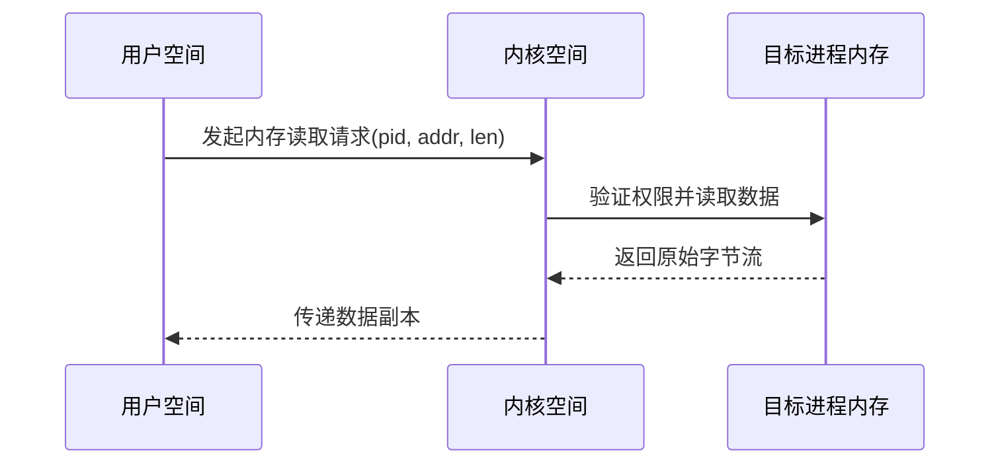

# 第3章：进程内存访问

在[第2章：采样引擎](02_sampler_engine_.md)中，我们了解到`py-spy`通过持续采集程序快照来分析性能。

> 但这些快照究竟是如何获取的？`py-spy`如何在不干扰目标程序的前提下窥探其内部状态？

这就是**进程内存访问**技术的精妙之处——它使得安全、高效地直接读取运行中程序的内存数据成为可能。

## 核心挑战：如何"透视"运行中的程序？

设想我们需要查看一本正在书写的日记（即Python程序）：
- **传统方案1**：让作者（Python解释器）主动汇报状态（如使用`sys.setprofile`）。但这会改变程序行为，可能引入性能损耗甚至崩溃风险，如同要求日记作者边写边念会干扰其创作。
- **传统方案2**：强行注入监控代码。这种方式风险极高，容易导致生产环境崩溃。

`py-spy`需要一种**零干扰**且**绝对安全**的方案，这正是进程内存访问技术的用武之地——如同直接通过显微镜观察日记的墨迹，无需作者配合。

## 技术原理

### 进程内存隔离机制
每个运行中的程序都拥有独立的虚拟内存空间，存储着：
- 可执行代码段
- 堆/栈数据
- 运行时状态信息

### `py-spy`的解决方案
通过操作系统提供的底层接口，`py-spy`实现了：
1. **非侵入式读取**：仅读取内存而不修改任何数据
2. **极低开销**：单次内存读取仅需微秒级时间
3. **僵死进程诊断**：即使程序已冻结仍可获取最后状态



## 技术实现

### 内存读取抽象层（ProcessMemory Trait）
```rust
// 定义统一的内存读取接口
pub trait ProcessMemory {
    fn read(&self, addr: usize, buf: &mut [u8]) -> Result<()>;
    
    // 泛型方法示例：读取结构化数据
    fn copy_pointer<T>(&self, addr: usize) -> Result<T> {
        let mut buf = [0; size_of::<T>()];
        self.read(addr, &mut buf)?;
        Ok(unsafe { transmute_copy(&buf) })
    }
}
```

### Python对象解析

#### 字符串对象解析
```rust
fn parse_pystring(proc: &impl ProcessMemory, addr: usize) -> Result<String> {
    // 读取对象头(16字节)
    let header = proc.copy_pointer::<PyUnicodeHeader>(addr)?;
    
    // 根据编码类型读取字符数据
    match header.kind {
        PyUnicodeKind::ASCII => {
            let bytes = proc.copy(addr + HEADER_SIZE, header.length)?;
            String::from_utf8(bytes)
        }
        PyUnicodeKind::UTF16 => {
            let bytes = proc.copy(addr + HEADER_SIZE, header.length * 2)?;
            let words = unsafe { slice::from_raw_parts(bytes.as_ptr() as *const u16, header.length) };
            String::from_utf16(words)
        }
        // 其他编码处理...
    }
}
```

#### 调用栈重建算法
```rust
fn unwind_stack(proc: &impl ProcessMemory, thread_state_addr: usize) -> Vec<Frame> {
    let mut frames = vec![];
    let mut frame_ptr = proc.copy_pointer::<usize>(thread_state_addr + FRAME_OFFSET)?;
    
    while !frame_ptr.is_null() {
        let frame = proc.copy_pointer::<PyFrameObject>(frame_ptr)?;
        frames.push(Frame {
            filename: parse_pystring(proc, frame.f_filename)?,
            function: parse_pystring(proc, frame.f_name)?,
            line: frame.f_lineno,
        });
        frame_ptr = frame.f_back; // 回溯上一帧
    }
    frames
}
```

## 跨平台实现差异

| 操作系统 | 系统调用            | 特性对比               |
| -------- | ------------------- | ---------------------- |
| Linux    | `process_vm_readv`  | 零拷贝技术，效率最高   |
| Windows  | `ReadProcessMemory` | 需要提权操作           |
| macOS    | `vm_read`           | 需要处理Mach-O内存布局 |

## 安全防护机制

1. **地址空间校验**：每次读取前验证目标地址有效性
2. **内存页保护**：自动跳过不可读的内存区域
3. **错误隔离**：单次读取失败不影响整体采样流程
4. **权限控制**：在非root环境下自动降级处理

## 性能优化策略

1. **批量读取**：合并相邻地址的小数据块请求
2. **缓存热点**：对频繁访问的元数据建立缓存
3. **预读机制**：根据调用模式预测下一步读取位置

## 总结

进程内存访问技术赋予了`py-spy`"透视"Python运行时状态的能力，这种==零干扰==的方案使其成为生产环境诊断的利器。

但还有一个关键问题：`py-spy`如何==定位Python解释器关键数据结构在内存中的位置==？这需要深入理解二进制文件格式，我们将在下一章[二进制与符号解析器](04_binary___symbol_parser_.md)中详细探讨。

[下一章：二进制与符号解析器](04_binary___symbol_parser_.md)

