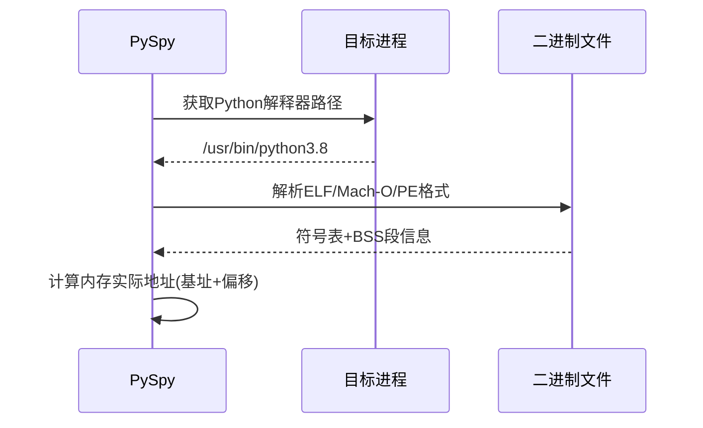

# 第4章：二进制与符号解析器

在[第3章：进程内存访问](03_process_memory_access_.md)中，我们了解到`py-spy`如同内存侦探，能够==静默读取Python进程的内存数据==。

但侦探不会盲目搜索图书馆——他们需要目录索引和**地图**来精确定位目标。这正是**二进制与符号解析器**的核心作用：作为`py-spy`内部的"图书管理员"和"制图师"，它构建了Python运行时内部结构的导航地图。

## 核心挑战：定位Python的"地标建筑"

将Python进程比作庞大城市：
- **市政厅**：`PyInterpreterState`（解释器全局状态）
- **市长办公室**：`PyThreadState`（当前线程状态）

`py-spy`虽掌握"城市交通"（内存访问能力），但缺乏关键建筑的坐标。二进制解析器通过分析Python可执行文件（或`libpython`动态库）的元数据，绘制出这些"地标"的精确位置。

## 技术实现

### 二进制文件结构解析
可执行文件包含多个关键区域：
1. **代码段**：存储机器指令
2. **数据段**：已初始化全局变量
3. **BSS段**：未初始化数据区（如`NULL`指针）
4. **符号表**：函数/变量名与其内存偏移的映射表

### 解析流程


## 关键技术

### 多平台二进制解析
```rust
// src/binary_parser.rs
pub fn parse_binary(filename: &Path, load_addr: u64) -> Result<BinaryInfo> {
    let file = File::open(filename)?;
    let buffer = unsafe { Mmap::map(&file)? };
    
    match goblin::Object::parse(&buffer)? {
        Object::Elf(elf) => parse_elf(elf, load_addr),
        Object::Mach(mach) => parse_macho(mach, load_addr),
        Object::PE(pe) => parse_pe(pe, load_addr),
        _ => Err("Unsupported binary format")
    }
}

fn parse_elf(elf: Elf, base: u64) -> Result<BinaryInfo> {
    let mut symbols = HashMap::new();
    // 遍历符号表
    for sym in elf.syms.iter().chain(elf.dynsyms.iter()) {
        if let Some(name) = elf.strtab.get(sym.st_name) {
            symbols.insert(name.to_string(), base + sym.st_value);
        }
    }
    // 定位BSS段
    let bss = elf.section_headers.iter().find(|s| s.sh_type == SHT_NOBITS);
    Ok(BinaryInfo { symbols, bss_addr: base + bss.sh_addr, .. })
}
```

### 解释器状态定位算法
```rust
// src/python_process_info.rs
pub fn locate_interpreter(&self) -> Result<usize> {
    // 优先通过符号查找
    if let Some(addr) = self.get_symbol("_PyRuntime") {
        return Ok(self.process.read_ptr(addr)?);
    }
    
    // 次选方案：扫描BSS段
    if let Some(bss) = &self.binary_info.bss_section {
        let mut addr = bss.start;
        while addr < bss.end {
            let candidate = self.process.read_ptr(addr)?;
            if is_valid_interpreter(candidate) {
                return Ok(candidate);
            }
            addr += size_of::<usize>();
        }
    }
    Err("Interpreter not found")
}
```

## 版本兼容性处理

针对不同Python版本的特殊处理：
1. **Python 3.7+**：通过`_PyRuntime`全局符号定位
2. **Python 3.3-3.6**：使用`interp_head`链表头
3. **嵌入式Python**：扫描`.PyRuntime`特殊段

## 性能优化策略

1. **惰性解析**：仅在首次需要时加载符号表
2. **缓存热点**：对核心符号地址进行缓存
3. **并行扫描**：==多线程加速BSS段搜索==

## 安全防护机制

1. **内存边界校验**：严格验证所有读取范围
2. **魔数验证**：通过特征值识别有效数据结构
3. **错误隔离**：单次解析失败不影响整体功能

## 总结

二进制与符号解析器为`py-spy`提供了关键的"导航图"，使其能够精准定位Python解释器的内部结构。

- 但知道地址只是第一步——如何解读这些内存数据结构才是真正的挑战。

在下一章[Python进程监控](05_python_process_spy_.md)中，我们将揭示`py-spy`如何解析复杂的Python对象关系网络。

[下一章：Python进程监控](05_python_process_spy_.md)

